```python
import pandas as pd
import matplotlib
import matplotlib.pyplot as plt
from matplotlib import font_manager
from copy import copy
font_name = font_manager.FontProperties(fname = 'C:/Windows/Fonts/malgun.ttf').get_name()
matplotlib.rc('font', family=font_name)
```

# 전체데이터


```python
df = pd.read_excel('C:/Users/user/Desktop/공모전/중소기업_통계데이터_활용_정책아이디어_공모전/기술통계19.xlsx')
df = df.iloc[:3800 ,:]
print(df)
```

          global_id    x1     x3   x2  SEX     AGE    YEAR  MAININCM  SEP5  SEP4  \
    0      111001.0  11.0   33.0  1.0  2.0  1976.0  2010.0     100.0   2.0   1.0   
    1      111002.0  11.0   63.0  6.0  1.0  1970.0  2000.0     100.0   3.0   0.0   
    2      111003.0  31.0   23.0  7.0  1.0  1965.0  2000.0     100.0   3.0   1.0   
    3      111004.0  32.0   27.0  2.0  1.0  1965.0  2002.0      56.0   3.0   0.0   
    4      111005.0  31.0   26.0  2.0  1.0  1952.0  2002.0      80.0   3.0   1.0   
    5      111006.0  11.0   27.0  2.0  1.0  1957.0  2003.0     100.0   3.0   0.0   
    6      111007.0  33.0   21.0  3.0  1.0  1960.0  2004.0     100.0   2.0   0.0   
    7      111008.0  11.0   62.0  2.0  1.0  1961.0  2005.0      80.0   2.0   0.0   
    8      111009.0  11.0   70.0  1.0  1.0  1977.0  2009.0     100.0   3.0   1.0   
    9      111010.0  11.0   33.0  1.0  1.0  1965.0  2003.0      90.0   2.0   0.0   
    10     111011.0  21.0   70.0  1.0  1.0  1972.0  2012.0     100.0   1.0   0.0   
    11     111012.0  11.0   33.0  3.0  1.0  1974.0  2013.0     100.0   2.0   1.0   
    12     111013.0  33.0   29.0  2.0  1.0  1973.0  2016.0      60.0   1.0   1.0   
    13     111014.0  11.0   63.0  6.0  1.0  1958.0  1995.0     100.0   3.0   1.0   
    14     111015.0  31.0   62.0  1.0  1.0  1973.0  2017.0     100.0   1.0   1.0   
    15     111016.0  11.0   73.0  1.0  1.0  1965.0  1989.0     100.0   3.0   1.0   
    16     111017.0  11.0   70.0  1.0  1.0  1972.0  2012.0     100.0   2.0   1.0   
    17     111018.0  31.0   13.0  1.0  1.0  1940.0  2015.0     100.0   2.0   1.0   
    18     111019.0  31.0   25.0  1.0  1.0  1957.0  2002.0     100.0   3.0   1.0   
    19     111020.0  31.0   18.0  2.0  1.0  1954.0  1985.0     100.0   3.0   1.0   
    20     111021.0  31.0   18.0  3.0  1.0  1948.0  1974.0     100.0   2.0   1.0   
    21     111022.0  25.0   27.0  6.0  2.0  1957.0  1989.0      90.0   3.0   0.0   
    22     111023.0  31.0   15.0  6.0  1.0  1964.0  1994.0     100.0   3.0   1.0   
    23     111024.0  33.0   32.0  7.0  1.0  1955.0  1996.0     100.0   3.0   0.0   
    24     111025.0  23.0   30.0  6.0  1.0  1965.0  1996.0      70.0   3.0   1.0   
    25     111026.0  31.0   72.0  2.0  1.0  1958.0  2001.0      70.0   3.0   1.0   
    26     111027.0  38.0   10.0  3.0  1.0  1965.0  2000.0     100.0   3.0   0.0   
    27     111028.0  31.0   73.0  1.0  1.0  1959.0  2002.0     100.0   2.0   1.0   
    28     111029.0  11.0   73.0  1.0  1.0  1965.0  2003.0     100.0   2.0   0.0   
    29     111030.0  25.0   70.0  1.0  1.0  1964.0  2004.0      80.0   2.0   0.0   
    ...         ...   ...    ...  ...  ...     ...     ...       ...   ...   ...   
    3770   114771.0  37.0   30.0  1.0  1.0  1979.0  2016.0      80.0   1.0   1.0   
    3771   114772.0  11.0   73.0  2.0  1.0  1985.0  2015.0     100.0   1.0   1.0   
    3772   114773.0  31.0   30.0  3.0  1.0  1966.0  1987.0     100.0   3.0   1.0   
    3773   114774.0  21.0  311.0  2.0  1.0  1972.0  2016.0     100.0   1.0   0.0   
    3774   114775.0  34.0   22.0  1.0  1.0  1975.0  2015.0      40.0   2.0   1.0   
    3775   114776.0  21.0   15.0  2.0  2.0  1962.0  2015.0     100.0   1.0   1.0   
    3776   114777.0  37.0  311.0  1.0  1.0  1978.0  2016.0      50.0   1.0   0.0   
    3777   114778.0  26.0   28.0  1.0  1.0  1974.0  2014.0     100.0   2.0   0.0   
    3778   114779.0  39.0   33.0  1.0  2.0  1973.0  2016.0     100.0   1.0   0.0   
    3779   114780.0  33.0   21.0  4.0  1.0  1960.0  2015.0      60.0   1.0   1.0   
    3780   114781.0  22.0   14.0  1.0  1.0  1984.0  2016.0      90.0   1.0   1.0   
    3781   114782.0  23.0   26.0  2.0  1.0  1970.0  2017.0      50.0   1.0   1.0   
    3782   114783.0  33.0   26.0  2.0  1.0  1957.0  2015.0      70.0   2.0   1.0   
    3783   114784.0  33.0   20.0  1.0  1.0  1966.0  2017.0     100.0   1.0   0.0   
    3784   114785.0  31.0   24.0  2.0  1.0  1965.0  2016.0     100.0   2.0   0.0   
    3785   114786.0  21.0   10.0  1.0  1.0  1976.0  2017.0     100.0   1.0   0.0   
    3786   114787.0  35.0   16.0  2.0  1.0  1962.0  2016.0      80.0   2.0   1.0   
    3787   114788.0  36.0  311.0  2.0  1.0  1965.0  2015.0      80.0   2.0   1.0   
    3788   114789.0  33.0   70.0  1.0  1.0  1977.0  2015.0     100.0   2.0   0.0   
    3789   114790.0  22.0   30.0  5.0  1.0  1957.0  2016.0      60.0   1.0   0.0   
    3790   114791.0  22.0   14.0  1.0  2.0  1965.0  2016.0     100.0   3.0   0.0   
    3791   114792.0  33.0   20.0  7.0  1.0  1960.0  2016.0      80.0   2.0   0.0   
    3792   114793.0  38.0   30.0  6.0  2.0  1984.0  2012.0      95.0   1.0   1.0   
    3793   114794.0  21.0   29.0  3.0  1.0  1984.0  2015.0     100.0   3.0   1.0   
    3794   114795.0  33.0   33.0  3.0  1.0  1962.0  2017.0      30.0   2.0   1.0   
    3795   114796.0  31.0   73.0  2.0  2.0  1983.0  2012.0      80.0   2.0   1.0   
    3796   114797.0  38.0  311.0  2.0  1.0  1982.0  2015.0     100.0   4.0   1.0   
    3797   114798.0  33.0   16.0  1.0  1.0  1976.0  2016.0      90.0   2.0   0.0   
    3798   114799.0  25.0   70.0  1.0  1.0  1975.0  2016.0      80.0   2.0   0.0   
    3799   114800.0  25.0   73.0  1.0  1.0  1973.0  2016.0     100.0   2.0   1.0   
    
          ...  I4Q5  I4S6  I4Q6  I4S7  I4Q7   I5  I6_1  I6_2  I7_1  I7_2  
    0     ...   3.0   0.0   3.0   0.0   3.0  1.0   9.0   NaN   3.0   NaN  
    1     ...   2.0   0.0   2.0   0.0   2.0  1.0   2.0   4.0   1.0   3.0  
    2     ...   3.0   0.0   3.0   0.0   3.0  1.0   2.0   NaN   2.0   NaN  
    3     ...   3.0   0.0   3.0   0.0   3.0  2.0   3.0   6.0   1.0   4.0  
    4     ...   3.0   0.0   3.0   0.0   3.0  1.0   9.0   8.0   1.0   4.0  
    5     ...   2.0   0.0   3.0   0.0   2.0  1.0   1.0   7.0   6.0   1.0  
    6     ...   3.0   0.0   3.0   0.0   3.0  4.0   1.0   NaN   1.0   NaN  
    7     ...   2.0   0.0   4.0   0.0   2.0  2.0   3.0   NaN   1.0   2.0  
    8     ...   2.0   0.0   2.0   0.0   2.0  1.0   1.0   6.0   2.0   NaN  
    9     ...   3.0   0.0   3.0   0.0   3.0  1.0   9.0   NaN   1.0   NaN  
    10    ...   1.0   0.0   1.0   0.0   1.0  1.0   6.0   7.0   1.0   4.0  
    11    ...   3.0   0.0   3.0   0.0   3.0  1.0   9.0   NaN   1.0   NaN  
    12    ...   1.0   0.0   1.0   0.0   1.0  1.0   3.0   4.0   1.0   3.0  
    13    ...   2.0   0.0   2.0   0.0   2.0  1.0   3.0   4.0   4.0   NaN  
    14    ...   3.0   0.0   3.0   0.0   3.0  2.0   3.0   6.0   2.0   3.0  
    15    ...   1.0   0.0   3.0   0.0   3.0  3.0   6.0   8.0   1.0   3.0  
    16    ...   3.0   0.0   3.0   0.0   3.0  1.0   1.0   3.0   1.0   3.0  
    17    ...   3.0   0.0   1.0   0.0   3.0  2.0   4.0   NaN   1.0   6.0  
    18    ...   2.0   0.0   2.0   0.0   2.0  2.0   9.0   NaN   1.0   NaN  
    19    ...   1.0   0.0   2.0   0.0   2.0  1.0   9.0   6.0   3.0   1.0  
    20    ...   1.0   0.0   2.0   0.0   2.0  1.0   6.0   9.0   3.0   4.0  
    21    ...   1.0   0.0   1.0   0.0   1.0  1.0   1.0   6.0   1.0   3.0  
    22    ...   3.0   0.0   3.0   0.0   3.0  1.0   4.0   8.0   2.0   1.0  
    23    ...   3.0   0.0   2.0   0.0   2.0  1.0   3.0   4.0   1.0   5.0  
    24    ...   3.0   0.0   3.0   0.0   3.0  3.0   3.0   2.0   1.0   4.0  
    25    ...   3.0   0.0   3.0   0.0   3.0  4.0   9.0   6.0   1.0   7.0  
    26    ...   1.0   0.0   1.0   0.0   1.0  1.0   3.0   4.0   1.0   4.0  
    27    ...   3.0   0.0   3.0   0.0   3.0  3.0   6.0   3.0   1.0   2.0  
    28    ...   1.0   0.0   3.0   0.0   3.0  1.0   8.0   6.0   1.0   3.0  
    29    ...   1.0   0.0   3.0   0.0   3.0  1.0   2.0   NaN   1.0   4.0  
    ...   ...   ...   ...   ...   ...   ...  ...   ...   ...   ...   ...  
    3770  ...   2.0   0.0   1.0   0.0   2.0  2.0   3.0   8.0   1.0   2.0  
    3771  ...   1.0   0.0   3.0   0.0   3.0  1.0   9.0   8.0   1.0   3.0  
    3772  ...   2.0   0.0   2.0   0.0   2.0  2.0   2.0   7.0   1.0   NaN  
    3773  ...   3.0   0.0   3.0   0.0   3.0  1.0   1.0   NaN   1.0   NaN  
    3774  ...   3.0   0.0   2.0   0.0   1.0  1.0   3.0   2.0   1.0   4.0  
    3775  ...   3.0   0.0   3.0   0.0   3.0  2.0   3.0   6.0   2.0   4.0  
    3776  ...   3.0   0.0   3.0   0.0   3.0  2.0   3.0   4.0   7.0   3.0  
    3777  ...   3.0   0.0   4.0   0.0   2.0  1.0   3.0   NaN   6.0   5.0  
    3778  ...   3.0   0.0   3.0   0.0   3.0  2.0   1.0   7.0   2.0   3.0  
    3779  ...   1.0   0.0   1.0   0.0   1.0  1.0   1.0   3.0   1.0   4.0  
    3780  ...   1.0   0.0   1.0   0.0   1.0  1.0   7.0   NaN   1.0   3.0  
    3781  ...   1.0   0.0   2.0   0.0   2.0  4.0   1.0   2.0   3.0   4.0  
    3782  ...   1.0   0.0   1.0   0.0   1.0  1.0   1.0   3.0   1.0   4.0  
    3783  ...   1.0   0.0   2.0   0.0   2.0  3.0   3.0   1.0   1.0   6.0  
    3784  ...   2.0   0.0   2.0   0.0   2.0  1.0   1.0   8.0   1.0   2.0  
    3785  ...   3.0   0.0   3.0   0.0   3.0  1.0   3.0   NaN   4.0   NaN  
    3786  ...   3.0   0.0   3.0   0.0   3.0  2.0   3.0   1.0   1.0   3.0  
    3787  ...   2.0   0.0   3.0   0.0   3.0  3.0   1.0   4.0   2.0   3.0  
    3788  ...   2.0   0.0   2.0   0.0   3.0  1.0   1.0   3.0   1.0   5.0  
    3789  ...   2.0   0.0   2.0   0.0   2.0  1.0   3.0   6.0   1.0   7.0  
    3790  ...   1.0   0.0   2.0   0.0   2.0  1.0   4.0   5.0   3.0   4.0  
    3791  ...   2.0   0.0   2.0   0.0   1.0  2.0   3.0   1.0   1.0   5.0  
    3792  ...   3.0   0.0   3.0   0.0   3.0  4.0   3.0   6.0   2.0   6.0  
    3793  ...   1.0   0.0   1.0   0.0   1.0  1.0   8.0   9.0   1.0   4.0  
    3794  ...   3.0   0.0   4.0   0.0   4.0  1.0   3.0   NaN   1.0   7.0  
    3795  ...   3.0   0.0   3.0   0.0   3.0  1.0   8.0   NaN   3.0   NaN  
    3796  ...   3.0   0.0   3.0   0.0   3.0  2.0   4.0   8.0   1.0   2.0  
    3797  ...   3.0   0.0   3.0   0.0   3.0  2.0   9.0   4.0   1.0   5.0  
    3798  ...   3.0   0.0   3.0   0.0   3.0  1.0   1.0   3.0   NaN   NaN  
    3799  ...   1.0   0.0   1.0   0.0   1.0  1.0   1.0   NaN   1.0   3.0  
    
    [3800 rows x 349 columns]


## 기술개발 애로요인


```python
df_error = df.iloc[:, 303:322]
print(df_error)
```

          H1_1  H1_2  H2_1  H2_2  H3_1  H3_2  H4_1  H4_2   G1  G1_1  G1_2  G8_1  \
    0      3.0   NaN   NaN   NaN   NaN   NaN   1.0   NaN  2.0   NaN   NaN   0.0   
    1      1.0   NaN   NaN   NaN   NaN   NaN   1.0   NaN  2.0   NaN   NaN   1.0   
    2      1.0   3.0   NaN   NaN   NaN   NaN   1.0   NaN  2.0   NaN   NaN   1.0   
    3      2.0   3.0   NaN   NaN   NaN   NaN   7.0   8.0  2.0   NaN   NaN   1.0   
    4      3.0   4.0   NaN   NaN   NaN   NaN   1.0   3.0  2.0   NaN   NaN   1.0   
    5      2.0   4.0   NaN   NaN   NaN   NaN   NaN   NaN  2.0   NaN   NaN   1.0   
    6      3.0   4.0   6.0   7.0   NaN   NaN   1.0   3.0  2.0   NaN   NaN   0.0   
    7      NaN   NaN   NaN   NaN   NaN   NaN   NaN   NaN  2.0   NaN   NaN   0.0   
    8      7.0   NaN   4.0   NaN   NaN   NaN   1.0   NaN  2.0   NaN   NaN   0.0   
    9      3.0   NaN   NaN   NaN   NaN   NaN   1.0   NaN  2.0   NaN   NaN   0.0   
    10     1.0   2.0   NaN   NaN   NaN   NaN   1.0   3.0  2.0   NaN   NaN   1.0   
    11     3.0   NaN   NaN   NaN   NaN   NaN   6.0   NaN  2.0   NaN   NaN   0.0   
    12     3.0   6.0   NaN   NaN   NaN   NaN   NaN   NaN  2.0   NaN   NaN   0.0   
    13     6.0   NaN   NaN   NaN   NaN   NaN   6.0   NaN  2.0   NaN   NaN   0.0   
    14     3.0   4.0   NaN   NaN   NaN   NaN   6.0   NaN  2.0   NaN   NaN   0.0   
    15     3.0   5.0   NaN   NaN   NaN   NaN   1.0   6.0  2.0   NaN   NaN   1.0   
    16     3.0   4.0   NaN   NaN   NaN   NaN   2.0   5.0  2.0   NaN   NaN   0.0   
    17     3.0   NaN   NaN   NaN   NaN   NaN   1.0   2.0  2.0   NaN   NaN   1.0   
    18     3.0   5.0   NaN   NaN   NaN   NaN   1.0   NaN  2.0   NaN   NaN   0.0   
    19     3.0   5.0   NaN   NaN   NaN   NaN   1.0   6.0  2.0   NaN   NaN   1.0   
    20     NaN   NaN   NaN   NaN   NaN   NaN   6.0   NaN  2.0   NaN   NaN   1.0   
    21     3.0   6.0   NaN   NaN   NaN   NaN   1.0   3.0  2.0   NaN   NaN   0.0   
    22     5.0   6.0   4.0   NaN   NaN   NaN   1.0   4.0  2.0   NaN   NaN   0.0   
    23     1.0   3.0   NaN   NaN   NaN   NaN   1.0   NaN  2.0   NaN   NaN   1.0   
    24     3.0   1.0   NaN   NaN   NaN   NaN   NaN   NaN  2.0   NaN   NaN   1.0   
    25     3.0   7.0   NaN   NaN   NaN   NaN   1.0   NaN  2.0   NaN   NaN   0.0   
    26     1.0   3.0   NaN   NaN   NaN   NaN   5.0   1.0  2.0   NaN   NaN   1.0   
    27     7.0   NaN   NaN   NaN   NaN   NaN   4.0   1.0  2.0   NaN   NaN   0.0   
    28     1.0   5.0   NaN   NaN   NaN   NaN   1.0   6.0  2.0   NaN   NaN   1.0   
    29     3.0   1.0   2.0   1.0   NaN   NaN   4.0   3.0  2.0   NaN   NaN   0.0   
    ...    ...   ...   ...   ...   ...   ...   ...   ...  ...   ...   ...   ...   
    3770   5.0   4.0   NaN   NaN   NaN   NaN   NaN   NaN  2.0   NaN   NaN   0.0   
    3771   3.0   5.0   NaN   NaN   NaN   NaN   1.0   6.0  2.0   NaN   NaN   1.0   
    3772   3.0   NaN   NaN   NaN   NaN   NaN   1.0   NaN  2.0   NaN   NaN   0.0   
    3773   3.0   NaN   NaN   NaN   NaN   NaN   NaN   NaN  2.0   NaN   NaN   0.0   
    3774   3.0   2.0   NaN   NaN   NaN   NaN   1.0   7.0  2.0   NaN   NaN   0.0   
    3775   1.0   5.0   NaN   NaN   NaN   NaN   2.0   3.0  2.0   NaN   NaN   1.0   
    3776   7.0   4.0   NaN   NaN   NaN   NaN   1.0   4.0  2.0   NaN   NaN   0.0   
    3777   3.0   6.0   NaN   NaN   NaN   NaN   4.0   5.0  2.0   NaN   NaN   1.0   
    3778   3.0   7.0   NaN   NaN   NaN   NaN   1.0   4.0  2.0   NaN   NaN   1.0   
    3779   1.0   3.0   3.0   NaN   NaN   NaN   1.0   3.0  2.0   NaN   NaN   1.0   
    3780   3.0   1.0   NaN   NaN   NaN   NaN   1.0   5.0  2.0   NaN   NaN   1.0   
    3781   2.0   3.0   NaN   NaN   NaN   NaN   4.0   5.0  2.0   NaN   NaN   0.0   
    3782   1.0   3.0   NaN   NaN   NaN   NaN   1.0   5.0  2.0   NaN   NaN   1.0   
    3783   3.0   NaN   2.0   NaN   NaN   NaN   9.0   NaN  2.0   NaN   NaN   0.0   
    3784   3.0   4.0   NaN   NaN   NaN   NaN   3.0   5.0  2.0   NaN   NaN   1.0   
    3785   2.0   5.0   NaN   NaN   NaN   NaN   1.0   NaN  2.0   NaN   NaN   1.0   
    3786   3.0   4.0   NaN   NaN   NaN   NaN   NaN   NaN  2.0   NaN   NaN   0.0   
    3787   2.0   3.0   NaN   NaN   NaN   NaN   4.0   5.0  2.0   NaN   NaN   1.0   
    3788   3.0   1.0   NaN   NaN   NaN   NaN   NaN   NaN  2.0   NaN   NaN   1.0   
    3789   7.0   4.0   NaN   NaN   NaN   NaN   1.0   4.0  2.0   NaN   NaN   0.0   
    3790   3.0   NaN   NaN   NaN   NaN   NaN   7.0   8.0  2.0   NaN   NaN   0.0   
    3791   3.0   4.0   6.0   5.0   NaN   NaN   1.0   2.0  2.0   NaN   NaN   1.0   
    3792   1.0   2.0   NaN   NaN   NaN   NaN   1.0   NaN  2.0   NaN   NaN   1.0   
    3793   3.0   7.0   NaN   NaN   NaN   NaN   1.0   7.0  2.0   NaN   NaN   1.0   
    3794   3.0   1.0   NaN   NaN   NaN   NaN   1.0   5.0  2.0   NaN   NaN   1.0   
    3795   3.0   NaN   NaN   NaN   NaN   NaN   1.0   4.0  2.0   NaN   NaN   0.0   
    3796   2.0   4.0   NaN   NaN   NaN   NaN   NaN   NaN  2.0   NaN   NaN   1.0   
    3797   4.0   3.0   NaN   NaN   NaN   NaN   1.0   4.0  2.0   NaN   NaN   1.0   
    3798   1.0   3.0   NaN   NaN   NaN   NaN   NaN   NaN  2.0   NaN   NaN   1.0   
    3799   4.0   3.0   2.0   NaN   NaN   NaN   1.0   NaN  2.0   NaN   NaN   1.0   
    
          G8_2  G8_3  G8_4  G8_5  G8_6  G8_7  G8_8  
    0      0.0   0.0   0.0   0.0   0.0   0.0   0.0  
    1      0.0   0.0   0.0   0.0   0.0   0.0   0.0  
    2      1.0   0.0   0.0   0.0   0.0   0.0   0.0  
    3      1.0   1.0   0.0   0.0   0.0   0.0   0.0  
    4      0.0   0.0   0.0   0.0   0.0   0.0   0.0  
    5      1.0   0.0   0.0   0.0   0.0   0.0   0.0  
    6      1.0   0.0   0.0   0.0   0.0   0.0   0.0  
    7      0.0   0.0   0.0   0.0   0.0   0.0   0.0  
    8      0.0   0.0   0.0   0.0   0.0   0.0   0.0  
    9      0.0   0.0   0.0   0.0   0.0   0.0   0.0  
    10     0.0   0.0   0.0   1.0   0.0   0.0   0.0  
    11     0.0   0.0   0.0   0.0   0.0   0.0   0.0  
    12     0.0   1.0   0.0   0.0   0.0   0.0   0.0  
    13     0.0   0.0   0.0   0.0   0.0   1.0   NaN  
    14     0.0   0.0   0.0   0.0   0.0   0.0   0.0  
    15     1.0   1.0   0.0   0.0   1.0   0.0   0.0  
    16     0.0   0.0   0.0   0.0   0.0   0.0   0.0  
    17     0.0   0.0   0.0   0.0   0.0   0.0   0.0  
    18     1.0   0.0   0.0   1.0   0.0   0.0   0.0  
    19     1.0   1.0   0.0   0.0   1.0   0.0   0.0  
    20     1.0   1.0   0.0   0.0   1.0   0.0   0.0  
    21     0.0   1.0   0.0   0.0   0.0   0.0   0.0  
    22     0.0   0.0   0.0   0.0   0.0   0.0   0.0  
    23     1.0   0.0   0.0   0.0   0.0   0.0   0.0  
    24     0.0   0.0   0.0   0.0   0.0   0.0   0.0  
    25     0.0   0.0   0.0   0.0   0.0   0.0   0.0  
    26     0.0   0.0   0.0   0.0   0.0   0.0   0.0  
    27     0.0   0.0   0.0   0.0   0.0   0.0   0.0  
    28     1.0   1.0   0.0   0.0   1.0   0.0   0.0  
    29     0.0   1.0   0.0   0.0   0.0   0.0   0.0  
    ...    ...   ...   ...   ...   ...   ...   ...  
    3770   0.0   0.0   0.0   0.0   0.0   1.0   NaN  
    3771   1.0   1.0   0.0   0.0   0.0   0.0   0.0  
    3772   0.0   1.0   0.0   1.0   0.0   0.0   0.0  
    3773   1.0   0.0   0.0   0.0   1.0   0.0   0.0  
    3774   1.0   0.0   0.0   0.0   0.0   0.0   0.0  
    3775   0.0   1.0   0.0   0.0   0.0   0.0   0.0  
    3776   0.0   0.0   0.0   0.0   1.0   0.0   0.0  
    3777   0.0   0.0   0.0   0.0   0.0   0.0   0.0  
    3778   1.0   1.0   0.0   0.0   0.0   0.0   0.0  
    3779   0.0   0.0   0.0   0.0   0.0   0.0   0.0  
    3780   0.0   0.0   0.0   0.0   0.0   0.0   0.0  
    3781   0.0   1.0   0.0   0.0   0.0   0.0   0.0  
    3782   0.0   0.0   0.0   0.0   0.0   0.0   0.0  
    3783   0.0   1.0   0.0   0.0   0.0   0.0   0.0  
    3784   1.0   0.0   0.0   0.0   0.0   0.0   0.0  
    3785   0.0   0.0   0.0   0.0   0.0   1.0   NaN  
    3786   1.0   0.0   0.0   0.0   0.0   0.0   0.0  
    3787   0.0   0.0   0.0   0.0   0.0   0.0   0.0  
    3788   1.0   0.0   0.0   0.0   0.0   0.0   0.0  
    3789   0.0   0.0   1.0   0.0   0.0   0.0   0.0  
    3790   0.0   0.0   0.0   0.0   0.0   0.0   0.0  
    3791   0.0   0.0   0.0   0.0   0.0   0.0   0.0  
    3792   0.0   0.0   1.0   0.0   0.0   0.0   0.0  
    3793   1.0   0.0   0.0   0.0   0.0   0.0   0.0  
    3794   0.0   0.0   0.0   0.0   0.0   0.0   0.0  
    3795   0.0   0.0   0.0   0.0   0.0   0.0   0.0  
    3796   1.0   0.0   0.0   0.0   0.0   0.0   0.0  
    3797   0.0   0.0   0.0   0.0   0.0   0.0   0.0  
    3798   1.0   0.0   0.0   0.0   0.0   0.0   0.0  
    3799   0.0   0.0   0.0   0.0   0.0   0.0   0.0  
    
    [3800 rows x 19 columns]


### 자체기술개발 애로요인 (1위)


```python
df_H1_1 = df_error.loc[:, 'H1_1']
my_dic = {}
for i in range(len(df_H1_1)):
    if df_H1_1[i] in my_dic.keys():
        my_dic[df_H1_1[i]] += 1
    else:
        if df_H1_1[i] in range(0,10):
            my_dic[df_H1_1[i]] = 1
for i in range(1, 10):
    if i not in my_dic.keys():
        my_dic[i] = 0
new_dic = my_dic.copy()
my_dic['1: 기술개발 인력확보 곤란 및 잦은 이직- {}'.format(new_dic[1])] = my_dic.pop(1)
my_dic['2: 연구설비, 기자재 부족- {}'.format(new_dic[2])] = my_dic.pop(2)
my_dic['3: 기술개발 자금부족- {}'.format(new_dic[3])] = my_dic.pop(3)
my_dic['4: 기술정보 부족 및 획득 어려움- {}'.format(new_dic[4])] = my_dic.pop(4)
my_dic['5: 기술개발 경험부족- {}'.format(new_dic[5])] = my_dic.pop(5)
my_dic['6: 국내 기초기술 부족- {}'.format(new_dic[6])] = my_dic.pop(6)
my_dic['7: 기술개발 기간이 지나치게 장기화- {}'.format(new_dic[7])] = my_dic.pop(7)
my_dic['8: 지식재산권 보호 어려움- {}'.format(new_dic[8])] = my_dic.pop(8)
my_dic['9: 기타- {}'.format(new_dic[9])] = my_dic.pop(9)
a = pd.DataFrame(my_dic.values(), index = my_dic.keys())
my_plot = a.plot(kind = 'barh', title="자체기술개발 애로요인 (1위)")
```


### 자체기술개발 애로요인 (2위)


```python
df_H1_1 = df_error.loc[:, 'H1_2']
my_dic = {}
for i in range(len(df_H1_1)):
    if df_H1_1[i] in my_dic.keys():
        my_dic[df_H1_1[i]] += 1
    else:
        if df_H1_1[i] in range(0,10):
            my_dic[df_H1_1[i]] = 1
for i in range(1, 10):
    if i not in my_dic.keys():
        my_dic[i] = 0
new_dic = my_dic.copy()
my_dic['1: 기술개발 인력확보 곤란 및 잦은 이직- {}'.format(new_dic[1])] = my_dic.pop(1)
my_dic['2: 연구설비, 기자재 부족- {}'.format(new_dic[2])] = my_dic.pop(2)
my_dic['3: 기술개발 자금부족- {}'.format(new_dic[3])] = my_dic.pop(3)
my_dic['4: 기술정보 부족 및 획득 어려움- {}'.format(new_dic[4])] = my_dic.pop(4)
my_dic['5: 기술개발 경험부족- {}'.format(new_dic[5])] = my_dic.pop(5)
my_dic['6: 국내 기초기술 부족- {}'.format(new_dic[6])] = my_dic.pop(6)
my_dic['7: 기술개발 기간이 지나치게 장기화- {}'.format(new_dic[7])] = my_dic.pop(7)
my_dic['8: 지식재산권 보호 어려움- {}'.format(new_dic[8])] = my_dic.pop(8)
my_dic['9: 기타- {}'.format(new_dic[9])] = my_dic.pop(9)
a = pd.DataFrame(my_dic.values(), index = my_dic.keys())
my_plot = a.plot(kind = 'barh', title="자체기술개발 애로요인 (2위)")
```


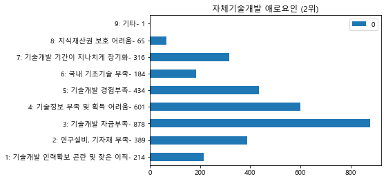


### 공동/위탁 기술개발 애로요인(1위)


```python
df_H1_1 = df_error.loc[:, 'H2_1']
my_dic = {}
for i in range(len(df_H1_1)):
    if df_H1_1[i] in my_dic.keys():
        my_dic[df_H1_1[i]] += 1
    else:
        if df_H1_1[i] in range(0,10):
            my_dic[df_H1_1[i]] = 1
for i in range(1, 10):
    if i not in my_dic.keys():
        my_dic[i] = 0
new_dic = my_dic.copy()
my_dic['1: 기술개발 기간 지나치게 장기화- {}'.format(new_dic[1])] = my_dic.pop(1)
my_dic['2: 자체개발 대비 높은 개발비용- {}'.format(new_dic[2])] = my_dic.pop(2)
my_dic['3: 기술협력 파트너와 의사소통 어려움- {}'.format(new_dic[3])] = my_dic.pop(3)
my_dic['4: 적합한 기술협력 파트너 부족- {}'.format(new_dic[4])] = my_dic.pop(4)
my_dic['5: 관련정보 부족 - {}'.format(new_dic[5])] = my_dic.pop(5)
my_dic['6: 기술정보 유출(우려)- {}'.format(new_dic[6])] = my_dic.pop(6)
my_dic['7: 지식재산권 관련 법적 분쟁 발생- {}'.format(new_dic[7])] = my_dic.pop(7)
my_dic['8: 기타- {}'.format(new_dic[8])] = my_dic.pop(8)
a = pd.DataFrame(my_dic.values(), index = my_dic.keys())
my_plot = a.plot(kind = 'barh', title="공동/위탁 기술개발 애로요인(1위)")
```


### 공동/위탁 기술개발 애로요인(2위)


```python
df_H1_1 = df_error.loc[:, 'H2_2']
my_dic = {}
for i in range(len(df_H1_1)):
    if df_H1_1[i] in my_dic.keys():
        my_dic[df_H1_1[i]] += 1
    else:
        if df_H1_1[i] in range(0,10):
            my_dic[df_H1_1[i]] = 1
for i in range(1, 10):
    if i not in my_dic.keys():
        my_dic[i] = 0
new_dic = my_dic.copy()
my_dic['1: 기술개발 기간 지나치게 장기화- {}'.format(new_dic[1])] = my_dic.pop(1)
my_dic['2: 자체개발 대비 높은 개발비용- {}'.format(new_dic[2])] = my_dic.pop(2)
my_dic['3: 기술협력 파트너와 의사소통 어려움- {}'.format(new_dic[3])] = my_dic.pop(3)
my_dic['4: 적합한 기술협력 파트너 부족- {}'.format(new_dic[4])] = my_dic.pop(4)
my_dic['5: 관련정보 부족 - {}'.format(new_dic[5])] = my_dic.pop(5)
my_dic['6: 기술정보 유출(우려)- {}'.format(new_dic[6])] = my_dic.pop(6)
my_dic['7: 지식재산권 관련 법적 분쟁 발생- {}'.format(new_dic[7])] = my_dic.pop(7)
my_dic['8: 기타- {}'.format(new_dic[8])] = my_dic.pop(8)
a = pd.DataFrame(my_dic.values(), index = my_dic.keys())
my_plot = a.plot(kind = 'barh', title="공동/위탁 기술개발 애로요인(2위)")
```


### 기술도입 애로요인1


```python
df_H1_1 = df_error.loc[:, 'H3_1']
my_dic = {}
for i in range(len(df_H1_1)):
    if df_H1_1[i] in my_dic.keys():
        my_dic[df_H1_1[i]] += 1
    else:
        if df_H1_1[i] in range(0,10):
            my_dic[df_H1_1[i]] = 1

for i in range(1, 10):
    if i not in my_dic.keys():
        my_dic[i] = 0
print(my_dic)            
new_dic = my_dic.copy()
my_dic['1: 과도한 기술도입비 부담- {}'.format(new_dic[1])] = my_dic.pop(1)
my_dic['2: 기술도입 정보 부족- {}'.format(new_dic[2])] = my_dic.pop(2)
my_dic['3: 기술도입 후 유지보수 어려움- {}'.format(new_dic[3])] = my_dic.pop(3)
my_dic['4: 도입기술의 실용성 저하- {}'.format(new_dic[4])] = my_dic.pop(4)
my_dic['5: 기술도입까지 장기간 소요- {}'.format(new_dic[5])] = my_dic.pop(5)
my_dic['6: 기술도입 절차상의 복잡함- {}'.format(new_dic[6])] = my_dic.pop(6)
my_dic['7:  도입기술에 대한 적정 가치평가의 어려움- {}'.format(new_dic[7])] = my_dic.pop(7)
my_dic['8: 기술도입 관련 법적 분쟁 발생- {}'.format(new_dic[8])] = my_dic.pop(8)
my_dic['9: 기타- {}'.format(new_dic[9])] = my_dic.pop(9)
a = pd.DataFrame(my_dic.values(), index = my_dic.keys())
my_plot = a.plot(kind = 'barh', title="기술도입 애로요인1")
```

    {1.0: 13, 2.0: 5, 7.0: 1, 6.0: 4, 3.0: 2, 4.0: 3, 5: 0, 8: 0, 9: 0}


### 기술도입 애로요인2


```python
df_H1_1 = df_error.loc[:, 'H3_2']
my_dic = {}
for i in range(len(df_H1_1)):
    if df_H1_1[i] in my_dic.keys():
        my_dic[df_H1_1[i]] += 1
    else:
        if df_H1_1[i] in range(0,10):
            my_dic[df_H1_1[i]] = 1

for i in range(1, 10):
    if i not in my_dic.keys():
        my_dic[i] = 0
print(my_dic)            
new_dic = my_dic.copy()
my_dic['1: 과도한 기술도입비 부담- {}'.format(new_dic[1])] = my_dic.pop(1)
my_dic['2: 기술도입 정보 부족- {}'.format(new_dic[2])] = my_dic.pop(2)
my_dic['3: 기술도입 후 유지보수 어려움- {}'.format(new_dic[3])] = my_dic.pop(3)
my_dic['4: 도입기술의 실용성 저하- {}'.format(new_dic[4])] = my_dic.pop(4)
my_dic['5: 기술도입까지 장기간 소요- {}'.format(new_dic[5])] = my_dic.pop(5)
my_dic['6: 기술도입 절차상의 복잡함- {}'.format(new_dic[6])] = my_dic.pop(6)
my_dic['7:  도입기술에 대한 적정 가치평가의 어려움- {}'.format(new_dic[7])] = my_dic.pop(7)
my_dic['8: 기술도입 관련 법적 분쟁 발생- {}'.format(new_dic[8])] = my_dic.pop(8)
my_dic['9: 기타- {}'.format(new_dic[9])] = my_dic.pop(9)
a = pd.DataFrame(my_dic.values(), index = my_dic.keys())
my_plot = a.plot(kind = 'barh', title="기술도입 애로요인2")
```

    {3.0: 3, 4.0: 4, 5.0: 2, 1.0: 3, 6.0: 1, 2.0: 5, 7: 0, 8: 0, 9: 0}


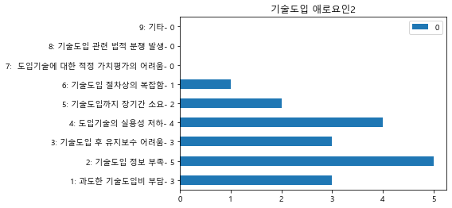


### 사업화추진 애로요인1


```python
df_H1_1 = df_error.loc[:, 'H4_1']
my_dic = {}
for i in range(len(df_H1_1)):
    if df_H1_1[i] in my_dic.keys():
        my_dic[df_H1_1[i]] += 1
    else:
        if df_H1_1[i] in range(0,11):
            my_dic[df_H1_1[i]] = 1

for i in range(1, 11):
    if i not in my_dic.keys():
        my_dic[i] = 0
print(my_dic)            
new_dic = my_dic.copy()
my_dic['1: 사업화 자금부족- {}'.format(new_dic[1])] = my_dic.pop(1)
my_dic['2: 원료, 설비 등 확보 어려움- {}'.format(new_dic[2])] = my_dic.pop(2)
my_dic['3: 개발제품의 높은 가격수준- {}'.format(new_dic[3])] = my_dic.pop(3)
my_dic['4: 제품의 완성도 미흡- {}'.format(new_dic[4])] = my_dic.pop(4)
my_dic['5: 유사제품(대체품) 출현- {}'.format(new_dic[5])] = my_dic.pop(5)
my_dic['6: 판매시장 부족(관련 수요 부족)- {}'.format(new_dic[6])] = my_dic.pop(6)
my_dic['7: 사업화를 위한 전문인력 부족- {}'.format(new_dic[7])] = my_dic.pop(7)
my_dic['8: 각종 행정규제- {}'.format(new_dic[8])] = my_dic.pop(8)
my_dic['9: 마케팅역량 부족- {}'.format(new_dic[9])] = my_dic.pop(9)
my_dic['10: 기타- {}'.format(new_dic[10])] = my_dic.pop(10)
a = pd.DataFrame(my_dic.values(), index = my_dic.keys())
my_plot = a.plot(kind = 'barh', title="사업화추진 애로요인1")
```

    {1.0: 1472, 7.0: 128, 6.0: 94, 2.0: 179, 5.0: 265, 4.0: 382, 9.0: 13, 3.0: 279, 8.0: 18, 10: 0}


### 사업화추진 애로요인2


```python
df_H1_1 = df_error.loc[:, 'H4_2']
my_dic = {}
for i in range(len(df_H1_1)):
    if df_H1_1[i] in my_dic.keys():
        my_dic[df_H1_1[i]] += 1
    else:
        if df_H1_1[i] in range(0,11):
            my_dic[df_H1_1[i]] = 1

for i in range(1, 11):
    if i not in my_dic.keys():
        my_dic[i] = 0
print(my_dic)            
new_dic = my_dic.copy()
my_dic['1: 사업화 자금부족- {}'.format(new_dic[1])] = my_dic.pop(1)
my_dic['2: 원료, 설비 등 확보 어려움- {}'.format(new_dic[2])] = my_dic.pop(2)
my_dic['3: 개발제품의 높은 가격수준- {}'.format(new_dic[3])] = my_dic.pop(3)
my_dic['4: 제품의 완성도 미흡- {}'.format(new_dic[4])] = my_dic.pop(4)
my_dic['5: 유사제품(대체품) 출현- {}'.format(new_dic[5])] = my_dic.pop(5)
my_dic['6: 판매시장 부족(관련 수요 부족)- {}'.format(new_dic[6])] = my_dic.pop(6)
my_dic['7: 사업화를 위한 전문인력 부족- {}'.format(new_dic[7])] = my_dic.pop(7)
my_dic['8: 각종 행정규제- {}'.format(new_dic[8])] = my_dic.pop(8)
my_dic['9: 마케팅역량 부족- {}'.format(new_dic[9])] = my_dic.pop(9)
my_dic['10: 기타- {}'.format(new_dic[10])] = my_dic.pop(10)
a = pd.DataFrame(my_dic.values(), index = my_dic.keys())
my_plot = a.plot(kind = 'barh', title="사업화추진 애로요인2")
```

    {8.0: 93, 3.0: 332, 6.0: 311, 5.0: 507, 2.0: 168, 4.0: 344, 1.0: 81, 7.0: 230, 9.0: 100, 10.0: 1}


### 기술유출 경험


```python
df_H1_1 = df_error.loc[:, 'G1']
my_dic = {}
for i in range(len(df_H1_1)):
    if df_H1_1[i] in my_dic.keys():
        my_dic[df_H1_1[i]] += 1
    else:
        if df_H1_1[i] in range(0,3):
            my_dic[df_H1_1[i]] = 1

for i in range(1, 3):
    if i not in my_dic.keys():
        my_dic[i] = 0
print(my_dic)            
new_dic = my_dic.copy()
my_dic['1: 있음- {}'.format(new_dic[1])] = my_dic.pop(1)
my_dic['2: 없음- {}'.format(new_dic[2])] = my_dic.pop(2)

a = pd.DataFrame(my_dic.values(), index = my_dic.keys())
my_plot = a.plot(kind = 'barh', title="기술유출 경험")
```

    {2.0: 3753, 1.0: 47}


### G1 == 1 일때만 응답

### 유출시기 최근1년(2018)


```python
df_H1_1 = df_error.loc[:, 'G1_1']
my_dic = {}
for i in range(len(df_H1_1)):
    if df_H1_1[i] in my_dic.keys():
        my_dic[df_H1_1[i]] += 1
    else:
        if df_H1_1[i] in range(0,3):
            my_dic[df_H1_1[i]] = 1

for i in range(0,2):
    if i not in my_dic.keys():
        my_dic[i] = 0
print(my_dic)            
new_dic = my_dic.copy()
my_dic['0: 해당없음- {}'.format(new_dic[0])] = my_dic.pop(0)
my_dic['1: 있음- {}'.format(new_dic[1])] = my_dic.pop(1)

a = pd.DataFrame(my_dic.values(), index = my_dic.keys())
my_plot = a.plot(kind = 'barh', title="유출시기 최근1년(2018)")
```

    {0.0: 22, 1.0: 25}


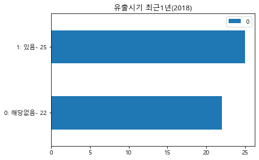


### 유출시기 과거2년(2016~2017)


```python
df_H1_1 = df_error.loc[:, 'G1_2']
my_dic = {}
for i in range(len(df_H1_1)):
    if df_H1_1[i] in my_dic.keys():
        my_dic[df_H1_1[i]] += 1
    else:
        if df_H1_1[i] in range(0,3):
            my_dic[df_H1_1[i]] = 1

for i in range(0,2):
    if i not in my_dic.keys():
        my_dic[i] = 0
print(my_dic)            
new_dic = my_dic.copy()
my_dic['0: 해당없음- {}'.format(new_dic[0])] = my_dic.pop(0)
my_dic['1: 있음- {}'.format(new_dic[1])] = my_dic.pop(1)

a = pd.DataFrame(my_dic.values(), index = my_dic.keys())
my_plot = a.plot(kind = 'barh', title="유출시기 과거2년(2016~2017)")
```

    {1.0: 26, 0.0: 21}


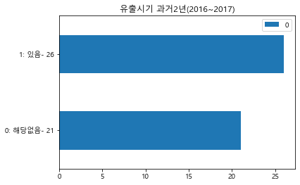


### (기술보호 보안관리 애로사항)예산부족


```python
df_H1_1 = df_error.loc[:, 'G8_1']
my_dic = {}
for i in range(len(df_H1_1)):
    if df_H1_1[i] in my_dic.keys():
        my_dic[df_H1_1[i]] += 1
    else:
        if df_H1_1[i] in range(0,3):
            my_dic[df_H1_1[i]] = 1

for i in range(0,2):
    if i not in my_dic.keys():
        my_dic[i] = 0
print(my_dic)            
new_dic = my_dic.copy()
my_dic['0: 해당없음- {}'.format(new_dic[0])] = my_dic.pop(0)
my_dic['1: 있음- {}'.format(new_dic[1])] = my_dic.pop(1)

a = pd.DataFrame(my_dic.values(), index = my_dic.keys())
my_plot = a.plot(kind = 'barh', title="(기술보호 보안관리 애로사항)예산부족")
```

    {0.0: 1782, 1.0: 2018}


### (기술보호 보안관리 애로사항)보안전담인력부족


```python
df_H1_1 = df_error.loc[:, 'G8_2']
my_dic = {}
for i in range(len(df_H1_1)):
    if df_H1_1[i] in my_dic.keys():
        my_dic[df_H1_1[i]] += 1
    else:
        if df_H1_1[i] in range(0,3):
            my_dic[df_H1_1[i]] = 1

for i in range(0,2):
    if i not in my_dic.keys():
        my_dic[i] = 0
print(my_dic)            
new_dic = my_dic.copy()
my_dic['0: 해당없음- {}'.format(new_dic[0])] = my_dic.pop(0)
my_dic['1: 있음- {}'.format(new_dic[1])] = my_dic.pop(1)

a = pd.DataFrame(my_dic.values(), index = my_dic.keys())
my_plot = a.plot(kind = 'barh', title=" (기술보호 보안관리 애로사항)보안전담인력부족")
```

    {0.0: 2439, 1.0: 1361}


### (기술보호 보안관리 애로사항)보안시설부족


```python
df_H1_1 = df_error.loc[:, 'G8_3']
my_dic = {}
for i in range(len(df_H1_1)):
    if df_H1_1[i] in my_dic.keys():
        my_dic[df_H1_1[i]] += 1
    else:
        if df_H1_1[i] in range(0,3):
            my_dic[df_H1_1[i]] = 1

for i in range(0,2):
    if i not in my_dic.keys():
        my_dic[i] = 0
print(my_dic)            
new_dic = my_dic.copy()
my_dic['0: 해당없음- {}'.format(new_dic[0])] = my_dic.pop(0)
my_dic['1: 있음- {}'.format(new_dic[1])] = my_dic.pop(1)

a = pd.DataFrame(my_dic.values(), index = my_dic.keys())
my_plot = a.plot(kind = 'barh', title=" (기술보호 보안관리 애로사항)보안시설부족")
```

    {0.0: 2734, 1.0: 1066}


### (기술보호 보안관리 애로사항)기술인력 이직


```python
df_H1_1 = df_error.loc[:, 'G8_4']
my_dic = {}
for i in range(len(df_H1_1)):
    if df_H1_1[i] in my_dic.keys():
        my_dic[df_H1_1[i]] += 1
    else:
        if df_H1_1[i] in range(0,3):
            my_dic[df_H1_1[i]] = 1

for i in range(0,2):
    if i not in my_dic.keys():
        my_dic[i] = 0
print(my_dic)            
new_dic = my_dic.copy()
my_dic['0: 해당없음- {}'.format(new_dic[0])] = my_dic.pop(0)
my_dic['1: 있음- {}'.format(new_dic[1])] = my_dic.pop(1)

a = pd.DataFrame(my_dic.values(), index = my_dic.keys())
my_plot = a.plot(kind = 'barh', title=" (기술보호 보안관리 애로사항)기술인력 이직")
```

    {0.0: 3429, 1.0: 371}


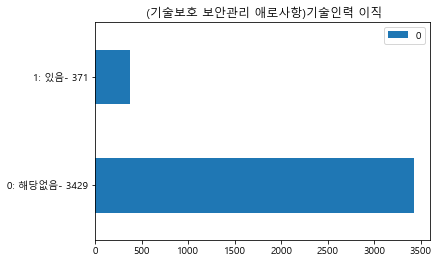


### (기술보호 보안관리 애로사항)법적,제도적 장치 미흡


```python
df_H1_1 = df_error.loc[:, 'G8_5']
my_dic = {}
for i in range(len(df_H1_1)):
    if df_H1_1[i] in my_dic.keys():
        my_dic[df_H1_1[i]] += 1
    else:
        if df_H1_1[i] in range(0,3):
            my_dic[df_H1_1[i]] = 1

for i in range(0,2):
    if i not in my_dic.keys():
        my_dic[i] = 0
print(my_dic)            
new_dic = my_dic.copy()
my_dic['0: 해당없음- {}'.format(new_dic[0])] = my_dic.pop(0)
my_dic['1: 있음- {}'.format(new_dic[1])] = my_dic.pop(1)

a = pd.DataFrame(my_dic.values(), index = my_dic.keys())
my_plot = a.plot(kind = 'barh', title=" (기술보호 보안관리 애로사항)법적,제도적 장치 미흡")
```

    {0.0: 3362, 1.0: 438}


### (기술보호 보안관리 애로사항)전문지식 부족


```python
df_H1_1 = df_error.loc[:, 'G8_6']
my_dic = {}
for i in range(len(df_H1_1)):
    if df_H1_1[i] in my_dic.keys():
        my_dic[df_H1_1[i]] += 1
    else:
        if df_H1_1[i] in range(0,3):
            my_dic[df_H1_1[i]] = 1

for i in range(0,2):
    if i not in my_dic.keys():
        my_dic[i] = 0
print(my_dic)            
new_dic = my_dic.copy()
my_dic['0: 해당없음- {}'.format(new_dic[0])] = my_dic.pop(0)
my_dic['1: 있음- {}'.format(new_dic[1])] = my_dic.pop(1)

a = pd.DataFrame(my_dic.values(), index = my_dic.keys())
my_plot = a.plot(kind = 'barh', title=" (기술보호 보안관리 애로사항)전문지식 부족")
```

    {0.0: 3474, 1.0: 326}


### (기술보호 보안관리 애로사항)경영진 인식 부족


```python
df_H1_1 = df_error.loc[:, 'G8_7']
my_dic = {}
for i in range(len(df_H1_1)):
    if df_H1_1[i] in my_dic.keys():
        my_dic[df_H1_1[i]] += 1
    else:
        if df_H1_1[i] in range(0,3):
            my_dic[df_H1_1[i]] = 1

for i in range(0,2):
    if i not in my_dic.keys():
        my_dic[i] = 0
print(my_dic)            
new_dic = my_dic.copy()
my_dic['0: 해당없음- {}'.format(new_dic[0])] = my_dic.pop(0)
my_dic['1: 있음- {}'.format(new_dic[1])] = my_dic.pop(1)

a = pd.DataFrame(my_dic.values(), index = my_dic.keys())
my_plot = a.plot(kind = 'barh', title=" (기술보호 보안관리 애로사항)경영진 인식 부족")
```

    {0.0: 3591, 1.0: 209}


### (기술보호 보안관리 애로사항)기타


```python
df_H1_1 = df_error.loc[:, 'G8_8']
my_dic = {}
for i in range(len(df_H1_1)):
    if df_H1_1[i] in my_dic.keys():
        my_dic[df_H1_1[i]] += 1
    else:
        if df_H1_1[i] in range(0,3):
            my_dic[df_H1_1[i]] = 1

for i in range(0,2):
    if i not in my_dic.keys():
        my_dic[i] = 0
print(my_dic)            
new_dic = my_dic.copy()
my_dic['0: 해당없음- {}'.format(new_dic[0])] = my_dic.pop(0)
my_dic['1: 있음- {}'.format(new_dic[1])] = my_dic.pop(1)

a = pd.DataFrame(my_dic.values(), index = my_dic.keys())
my_plot = a.plot(kind = 'barh', title=" (기술보호 보안관리 애로사항)기타")
```

    {0.0: 3588, 1.0: 3}


## 기술개발 지원제도 평가


```python
df_system = df.iloc[:, 322:]
print(df_system)
```

          I1_1  I1_2  I2S1  I2S2  I2S3  I2S4  I2S5   I3  I4S1  I4Q1  ...  I4Q5  \
    0      NaN   NaN   NaN   NaN   NaN   NaN   NaN  3.0   0.0   3.0  ...   3.0   
    1      NaN   NaN   NaN   NaN   NaN   NaN   NaN  2.0   0.0   1.0  ...   2.0   
    2      NaN   NaN   NaN   NaN   NaN   NaN   NaN  4.0   0.0   3.0  ...   3.0   
    3      NaN   NaN   NaN   NaN   NaN   NaN   NaN  3.0   0.0   2.0  ...   3.0   
    4      NaN   NaN   NaN   NaN   NaN   NaN   NaN  1.0   0.0   1.0  ...   3.0   
    5      NaN   NaN   NaN   NaN   NaN   NaN   NaN  3.0   0.0   1.0  ...   2.0   
    6      7.0   NaN   1.0   1.0   1.0   1.0   2.0  1.0   1.0   3.0  ...   3.0   
    7      NaN   NaN   NaN   NaN   NaN   NaN   NaN  3.0   0.0   3.0  ...   2.0   
    8      NaN   NaN   NaN   NaN   NaN   NaN   NaN  4.0   0.0   1.0  ...   2.0   
    9      NaN   NaN   NaN   NaN   NaN   NaN   NaN  3.0   0.0   3.0  ...   3.0   
    10     NaN   NaN   NaN   NaN   NaN   NaN   NaN  1.0   0.0   1.0  ...   1.0   
    11     NaN   NaN   NaN   NaN   NaN   NaN   NaN  3.0   0.0   3.0  ...   3.0   
    12     NaN   NaN   NaN   NaN   NaN   NaN   NaN  2.0   0.0   1.0  ...   1.0   
    13     NaN   NaN   NaN   NaN   NaN   NaN   NaN  2.0   0.0   1.0  ...   2.0   
    14     NaN   NaN   NaN   NaN   NaN   NaN   NaN  2.0   0.0   3.0  ...   3.0   
    15     NaN   NaN   NaN   NaN   NaN   NaN   NaN  3.0   0.0   3.0  ...   1.0   
    16     NaN   NaN   NaN   NaN   NaN   NaN   NaN  2.0   0.0   2.0  ...   3.0   
    17     4.0   5.0   3.0   3.0   3.0   3.0   2.0  2.0   0.0   3.0  ...   3.0   
    18     NaN   NaN   NaN   NaN   NaN   NaN   NaN  3.0   0.0   2.0  ...   2.0   
    19     NaN   NaN   NaN   NaN   NaN   NaN   NaN  4.0   0.0   1.0  ...   1.0   
    20     NaN   NaN   NaN   NaN   NaN   NaN   NaN  4.0   0.0   1.0  ...   1.0   
    21     1.0   NaN   2.0   1.0   1.0   2.0   2.0  3.0   0.0   1.0  ...   1.0   
    22     NaN   NaN   NaN   NaN   NaN   NaN   NaN  2.0   0.0   3.0  ...   3.0   
    23     NaN   NaN   NaN   NaN   NaN   NaN   NaN  1.0   0.0   1.0  ...   3.0   
    24     NaN   NaN   NaN   NaN   NaN   NaN   NaN  3.0   0.0   2.0  ...   3.0   
    25     NaN   NaN   NaN   NaN   NaN   NaN   NaN  2.0   0.0   3.0  ...   3.0   
    26     NaN   NaN   NaN   NaN   NaN   NaN   NaN  2.0   0.0   1.0  ...   1.0   
    27     NaN   NaN   NaN   NaN   NaN   NaN   NaN  3.0   0.0   3.0  ...   3.0   
    28     1.0   NaN   3.0   3.0   3.0   4.0   4.0  3.0   0.0   1.0  ...   1.0   
    29     8.0   6.0   4.0   3.0   3.0   3.0   3.0  4.0   0.0   3.0  ...   1.0   
    ...    ...   ...   ...   ...   ...   ...   ...  ...   ...   ...  ...   ...   
    3770   NaN   NaN   NaN   NaN   NaN   NaN   NaN  1.0   0.0   1.0  ...   2.0   
    3771   NaN   NaN   NaN   NaN   NaN   NaN   NaN  3.0   0.0   3.0  ...   1.0   
    3772   NaN   NaN   NaN   NaN   NaN   NaN   NaN  2.0   0.0   2.0  ...   2.0   
    3773   NaN   NaN   NaN   NaN   NaN   NaN   NaN  2.0   0.0   3.0  ...   3.0   
    3774   NaN   NaN   NaN   NaN   NaN   NaN   NaN  1.0   0.0   1.0  ...   3.0   
    3775   NaN   NaN   NaN   NaN   NaN   NaN   NaN  3.0   0.0   1.0  ...   3.0   
    3776   NaN   NaN   NaN   NaN   NaN   NaN   NaN  2.0   0.0   1.0  ...   3.0   
    3777   8.0   7.0   1.0   1.0   1.0   1.0   2.0  2.0   0.0   3.0  ...   3.0   
    3778   4.0   5.0   2.0   2.0   3.0   3.0   3.0  2.0   0.0   1.0  ...   3.0   
    3779   NaN   NaN   NaN   NaN   NaN   NaN   NaN  1.0   0.0   1.0  ...   1.0   
    3780   NaN   NaN   NaN   NaN   NaN   NaN   NaN  4.0   0.0   1.0  ...   1.0   
    3781   NaN   NaN   NaN   NaN   NaN   NaN   NaN  1.0   0.0   2.0  ...   1.0   
    3782   NaN   NaN   NaN   NaN   NaN   NaN   NaN  1.0   0.0   1.0  ...   1.0   
    3783   7.0   NaN   2.0   3.0   3.0   3.0   3.0  4.0   0.0   2.0  ...   1.0   
    3784   NaN   NaN   NaN   NaN   NaN   NaN   NaN  4.0   0.0   2.0  ...   2.0   
    3785   NaN   NaN   NaN   NaN   NaN   NaN   NaN  2.0   0.0   3.0  ...   3.0   
    3786   NaN   NaN   NaN   NaN   NaN   NaN   NaN  2.0   0.0   3.0  ...   3.0   
    3787   NaN   NaN   NaN   NaN   NaN   NaN   NaN  3.0   0.0   3.0  ...   2.0   
    3788   1.0   NaN   2.0   2.0   2.0   2.0   2.0  3.0   1.0   2.0  ...   2.0   
    3789   NaN   NaN   NaN   NaN   NaN   NaN   NaN  1.0   0.0   1.0  ...   2.0   
    3790   NaN   NaN   NaN   NaN   NaN   NaN   NaN  4.0   0.0   2.0  ...   1.0   
    3791   4.0   6.0   3.0   3.0   3.0   3.0   3.0  1.0   0.0   2.0  ...   2.0   
    3792   NaN   NaN   NaN   NaN   NaN   NaN   NaN  2.0   0.0   1.0  ...   3.0   
    3793   6.0   NaN   3.0   2.0   4.0   2.0   3.0  2.0   1.0   1.0  ...   1.0   
    3794   NaN   NaN   NaN   NaN   NaN   NaN   NaN  2.0   0.0   3.0  ...   3.0   
    3795   NaN   NaN   NaN   NaN   NaN   NaN   NaN  1.0   0.0   3.0  ...   3.0   
    3796   NaN   NaN   NaN   NaN   NaN   NaN   NaN  2.0   0.0   1.0  ...   3.0   
    3797   NaN   NaN   NaN   NaN   NaN   NaN   NaN  3.0   0.0   2.0  ...   3.0   
    3798   1.0   NaN   2.0   3.0   3.0   2.0   3.0  1.0   1.0   1.0  ...   3.0   
    3799   5.0   NaN   2.0   2.0   2.0   3.0   2.0  2.0   0.0   1.0  ...   1.0   
    
          I4S6  I4Q6  I4S7  I4Q7   I5  I6_1  I6_2  I7_1  I7_2  
    0      0.0   3.0   0.0   3.0  1.0   9.0   NaN   3.0   NaN  
    1      0.0   2.0   0.0   2.0  1.0   2.0   4.0   1.0   3.0  
    2      0.0   3.0   0.0   3.0  1.0   2.0   NaN   2.0   NaN  
    3      0.0   3.0   0.0   3.0  2.0   3.0   6.0   1.0   4.0  
    4      0.0   3.0   0.0   3.0  1.0   9.0   8.0   1.0   4.0  
    5      0.0   3.0   0.0   2.0  1.0   1.0   7.0   6.0   1.0  
    6      0.0   3.0   0.0   3.0  4.0   1.0   NaN   1.0   NaN  
    7      0.0   4.0   0.0   2.0  2.0   3.0   NaN   1.0   2.0  
    8      0.0   2.0   0.0   2.0  1.0   1.0   6.0   2.0   NaN  
    9      0.0   3.0   0.0   3.0  1.0   9.0   NaN   1.0   NaN  
    10     0.0   1.0   0.0   1.0  1.0   6.0   7.0   1.0   4.0  
    11     0.0   3.0   0.0   3.0  1.0   9.0   NaN   1.0   NaN  
    12     0.0   1.0   0.0   1.0  1.0   3.0   4.0   1.0   3.0  
    13     0.0   2.0   0.0   2.0  1.0   3.0   4.0   4.0   NaN  
    14     0.0   3.0   0.0   3.0  2.0   3.0   6.0   2.0   3.0  
    15     0.0   3.0   0.0   3.0  3.0   6.0   8.0   1.0   3.0  
    16     0.0   3.0   0.0   3.0  1.0   1.0   3.0   1.0   3.0  
    17     0.0   1.0   0.0   3.0  2.0   4.0   NaN   1.0   6.0  
    18     0.0   2.0   0.0   2.0  2.0   9.0   NaN   1.0   NaN  
    19     0.0   2.0   0.0   2.0  1.0   9.0   6.0   3.0   1.0  
    20     0.0   2.0   0.0   2.0  1.0   6.0   9.0   3.0   4.0  
    21     0.0   1.0   0.0   1.0  1.0   1.0   6.0   1.0   3.0  
    22     0.0   3.0   0.0   3.0  1.0   4.0   8.0   2.0   1.0  
    23     0.0   2.0   0.0   2.0  1.0   3.0   4.0   1.0   5.0  
    24     0.0   3.0   0.0   3.0  3.0   3.0   2.0   1.0   4.0  
    25     0.0   3.0   0.0   3.0  4.0   9.0   6.0   1.0   7.0  
    26     0.0   1.0   0.0   1.0  1.0   3.0   4.0   1.0   4.0  
    27     0.0   3.0   0.0   3.0  3.0   6.0   3.0   1.0   2.0  
    28     0.0   3.0   0.0   3.0  1.0   8.0   6.0   1.0   3.0  
    29     0.0   3.0   0.0   3.0  1.0   2.0   NaN   1.0   4.0  
    ...    ...   ...   ...   ...  ...   ...   ...   ...   ...  
    3770   0.0   1.0   0.0   2.0  2.0   3.0   8.0   1.0   2.0  
    3771   0.0   3.0   0.0   3.0  1.0   9.0   8.0   1.0   3.0  
    3772   0.0   2.0   0.0   2.0  2.0   2.0   7.0   1.0   NaN  
    3773   0.0   3.0   0.0   3.0  1.0   1.0   NaN   1.0   NaN  
    3774   0.0   2.0   0.0   1.0  1.0   3.0   2.0   1.0   4.0  
    3775   0.0   3.0   0.0   3.0  2.0   3.0   6.0   2.0   4.0  
    3776   0.0   3.0   0.0   3.0  2.0   3.0   4.0   7.0   3.0  
    3777   0.0   4.0   0.0   2.0  1.0   3.0   NaN   6.0   5.0  
    3778   0.0   3.0   0.0   3.0  2.0   1.0   7.0   2.0   3.0  
    3779   0.0   1.0   0.0   1.0  1.0   1.0   3.0   1.0   4.0  
    3780   0.0   1.0   0.0   1.0  1.0   7.0   NaN   1.0   3.0  
    3781   0.0   2.0   0.0   2.0  4.0   1.0   2.0   3.0   4.0  
    3782   0.0   1.0   0.0   1.0  1.0   1.0   3.0   1.0   4.0  
    3783   0.0   2.0   0.0   2.0  3.0   3.0   1.0   1.0   6.0  
    3784   0.0   2.0   0.0   2.0  1.0   1.0   8.0   1.0   2.0  
    3785   0.0   3.0   0.0   3.0  1.0   3.0   NaN   4.0   NaN  
    3786   0.0   3.0   0.0   3.0  2.0   3.0   1.0   1.0   3.0  
    3787   0.0   3.0   0.0   3.0  3.0   1.0   4.0   2.0   3.0  
    3788   0.0   2.0   0.0   3.0  1.0   1.0   3.0   1.0   5.0  
    3789   0.0   2.0   0.0   2.0  1.0   3.0   6.0   1.0   7.0  
    3790   0.0   2.0   0.0   2.0  1.0   4.0   5.0   3.0   4.0  
    3791   0.0   2.0   0.0   1.0  2.0   3.0   1.0   1.0   5.0  
    3792   0.0   3.0   0.0   3.0  4.0   3.0   6.0   2.0   6.0  
    3793   0.0   1.0   0.0   1.0  1.0   8.0   9.0   1.0   4.0  
    3794   0.0   4.0   0.0   4.0  1.0   3.0   NaN   1.0   7.0  
    3795   0.0   3.0   0.0   3.0  1.0   8.0   NaN   3.0   NaN  
    3796   0.0   3.0   0.0   3.0  2.0   4.0   8.0   1.0   2.0  
    3797   0.0   3.0   0.0   3.0  2.0   9.0   4.0   1.0   5.0  
    3798   0.0   3.0   0.0   3.0  1.0   1.0   3.0   NaN   NaN  
    3799   0.0   1.0   0.0   1.0  1.0   1.0   NaN   1.0   3.0  
    
    [3800 rows x 27 columns]


### 1년간 정부지원제도 활용시 불편사항1


```python
df_H1_1 = df_system.loc[:, 'I1_1']
my_dic = {}
for i in range(len(df_H1_1)):
    if df_H1_1[i] in my_dic.keys():
        my_dic[df_H1_1[i]] += 1
    else:
        if df_H1_1[i] in range(0,11):
            my_dic[df_H1_1[i]] = 1

for i in range(1, 10):
    if i not in my_dic.keys():
        my_dic[i] = 0
print(my_dic)            
new_dic = my_dic.copy()
my_dic['1: 불편한점 없음- {}'.format(new_dic[1])] = my_dic.pop(1)
my_dic['2: 지원기관이 분산되어 이용이 복잡함- {}'.format(new_dic[2])] = my_dic.pop(2)
my_dic['3: 정부 기술개발 지원제도에 대한 정보 부족- {}'.format(new_dic[3])] = my_dic.pop(3)
my_dic['4: 지원 신청시 복잡한 제출서류 요구- {}'.format(new_dic[4])] = my_dic.pop(4)
my_dic['5: 까다로운 지원대상 선정/심사절차- {}'.format(new_dic[5])] = my_dic.pop(5)
my_dic['6: 사업기간동안의 불필요한 생정처리- {}'.format(new_dic[6])] = my_dic.pop(6)
my_dic['7: 과도한 사후 성과관리- {}'.format(new_dic[7])] = my_dic.pop(7)
my_dic['8: 부실한 지원혜택 및 내용- {}'.format(new_dic[8])] = my_dic.pop(8)
my_dic['9: 기타- {}'.format(new_dic[9])] = my_dic.pop(9)
a = pd.DataFrame(my_dic.values(), index = my_dic.keys())
my_plot = a.plot(kind = 'barh', title="1년간 정부지원제도 활용시 불편사항1")
```

    {7.0: 42, 4.0: 175, 1.0: 280, 8.0: 45, 3.0: 67, 5.0: 67, 6.0: 102, 2.0: 86, 9.0: 3}


### 1년간 정부지원제도 활용시 불편사항2


```python
df_H1_1 = df_system.loc[:, 'I1_2']
my_dic = {}
for i in range(len(df_H1_1)):
    if df_H1_1[i] in my_dic.keys():
        my_dic[df_H1_1[i]] += 1
    else:
        if df_H1_1[i] in range(0,11):
            my_dic[df_H1_1[i]] = 1

for i in range(1, 10):
    if i not in my_dic.keys():
        my_dic[i] = 0
print(my_dic)            
new_dic = my_dic.copy()
my_dic['1: 불편한점 없음- {}'.format(new_dic[1])] = my_dic.pop(1)
my_dic['2: 지원기관이 분산되어 이용이 복잡함- {}'.format(new_dic[2])] = my_dic.pop(2)
my_dic['3: 정부 기술개발 지원제도에 대한 정보 부족- {}'.format(new_dic[3])] = my_dic.pop(3)
my_dic['4: 지원 신청시 복잡한 제출서류 요구- {}'.format(new_dic[4])] = my_dic.pop(4)
my_dic['5: 까다로운 지원대상 선정/심사절차- {}'.format(new_dic[5])] = my_dic.pop(5)
my_dic['6: 사업기간동안의 불필요한 생정처리- {}'.format(new_dic[6])] = my_dic.pop(6)
my_dic['7: 과도한 사후 성과관리- {}'.format(new_dic[7])] = my_dic.pop(7)
my_dic['8: 부실한 지원혜택 및 내용- {}'.format(new_dic[8])] = my_dic.pop(8)
my_dic['9: 기타- {}'.format(new_dic[9])] = my_dic.pop(9)
a = pd.DataFrame(my_dic.values(), index = my_dic.keys())
my_plot = a.plot(kind = 'barh', title="1년간 정부지원제도 활용시 불편사항2")
```

    {5.0: 104, 6.0: 88, 7.0: 102, 8.0: 56, 1.0: 4, 2.0: 20, 3.0: 26, 9.0: 2, 4.0: 68}


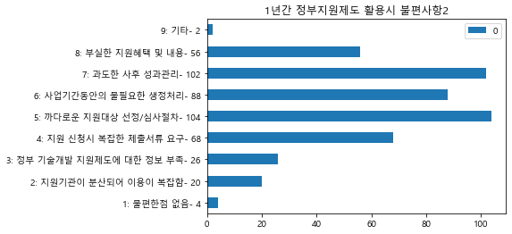


### (정부지원제도 만족도)지원절차의 편의성 부문


```python
df_H1_1 = df_system.loc[:, 'I2S1']
my_dic = {}
for i in range(len(df_H1_1)):
    if df_H1_1[i] in my_dic.keys():
        my_dic[df_H1_1[i]] += 1
    else:
        if df_H1_1[i] in range(0,11):
            my_dic[df_H1_1[i]] = 1

for i in range(1, 6):
    if i not in my_dic.keys():
        my_dic[i] = 0
print(my_dic)            
new_dic = my_dic.copy()
my_dic['1: 매우 만족- {}'.format(new_dic[1])] = my_dic.pop(1)
my_dic['2: 다소 만족- {}'.format(new_dic[2])] = my_dic.pop(2)
my_dic['3: 보통- {}'.format(new_dic[3])] = my_dic.pop(3)
my_dic['4: 다소 불만족- {}'.format(new_dic[4])] = my_dic.pop(4)
my_dic['5: 매우 불만족- {}'.format(new_dic[5])] = my_dic.pop(5)

a = pd.DataFrame(my_dic.values(), index = my_dic.keys())
my_plot = a.plot(kind = 'barh', title="(정부지원제도 만족도)지원절차의 편의성 부문")
```

    {1.0: 118, 3.0: 260, 2.0: 388, 4.0: 95, 5.0: 6}


### (정부지원제도 만족도)지원절차의 투명성 부문


```python
df_H1_1 = df_system.loc[:, 'I2S2']
my_dic = {}
for i in range(len(df_H1_1)):
    if df_H1_1[i] in my_dic.keys():
        my_dic[df_H1_1[i]] += 1
    else:
        if df_H1_1[i] in range(0,11):
            my_dic[df_H1_1[i]] = 1

for i in range(1, 6):
    if i not in my_dic.keys():
        my_dic[i] = 0
print(my_dic)            
new_dic = my_dic.copy()
my_dic['1: 매우 만족- {}'.format(new_dic[1])] = my_dic.pop(1)
my_dic['2: 다소 만족- {}'.format(new_dic[2])] = my_dic.pop(2)
my_dic['3: 보통- {}'.format(new_dic[3])] = my_dic.pop(3)
my_dic['4: 다소 불만족- {}'.format(new_dic[4])] = my_dic.pop(4)
my_dic['5: 매우 불만족- {}'.format(new_dic[5])] = my_dic.pop(5)

a = pd.DataFrame(my_dic.values(), index = my_dic.keys())
my_plot = a.plot(kind = 'barh', title="(정부지원제도 만족도)지원절차의 투명성 부문")
```

    {1.0: 139, 3.0: 283, 2.0: 416, 4.0: 27, 5.0: 2}


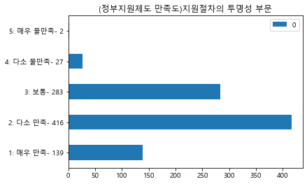


### (정부지원제도 만족도)지원절차의 신속성 부문


```python
df_H1_1 = df_system.loc[:, 'I2S3']
my_dic = {}
for i in range(len(df_H1_1)):
    if df_H1_1[i] in my_dic.keys():
        my_dic[df_H1_1[i]] += 1
    else:
        if df_H1_1[i] in range(0,11):
            my_dic[df_H1_1[i]] = 1

for i in range(1, 6):
    if i not in my_dic.keys():
        my_dic[i] = 0
print(my_dic)            
new_dic = my_dic.copy()
my_dic['1: 매우 만족- {}'.format(new_dic[1])] = my_dic.pop(1)
my_dic['2: 다소 만족- {}'.format(new_dic[2])] = my_dic.pop(2)
my_dic['3: 보통- {}'.format(new_dic[3])] = my_dic.pop(3)
my_dic['4: 다소 불만족- {}'.format(new_dic[4])] = my_dic.pop(4)
my_dic['5: 매우 불만족- {}'.format(new_dic[5])] = my_dic.pop(5)

a = pd.DataFrame(my_dic.values(), index = my_dic.keys())
my_plot = a.plot(kind = 'barh', title="(정부지원제도 만족도)지원절차의 신속성 부문")
```

    {1.0: 118, 3.0: 325, 4.0: 63, 2.0: 356, 5.0: 5}


### (정부지원제도 만족도)지원절차의 충분석 부문


```python
df_H1_1 = df_system.loc[:, 'I2S4']
my_dic = {}
for i in range(len(df_H1_1)):
    if df_H1_1[i] in my_dic.keys():
        my_dic[df_H1_1[i]] += 1
    else:
        if df_H1_1[i] in range(0,11):
            my_dic[df_H1_1[i]] = 1

for i in range(1, 6):
    if i not in my_dic.keys():
        my_dic[i] = 0
print(my_dic)            
new_dic = my_dic.copy()
my_dic['1: 매우 만족- {}'.format(new_dic[1])] = my_dic.pop(1)
my_dic['2: 다소 만족- {}'.format(new_dic[2])] = my_dic.pop(2)
my_dic['3: 보통- {}'.format(new_dic[3])] = my_dic.pop(3)
my_dic['4: 다소 불만족- {}'.format(new_dic[4])] = my_dic.pop(4)
my_dic['5: 매우 불만족- {}'.format(new_dic[5])] = my_dic.pop(5)

a = pd.DataFrame(my_dic.values(), index = my_dic.keys())
my_plot = a.plot(kind = 'barh', title="(정부지원제도 만족도)지원절차의 충분석 부문")
```

    {1.0: 84, 3.0: 335, 2.0: 365, 4.0: 75, 5.0: 8}


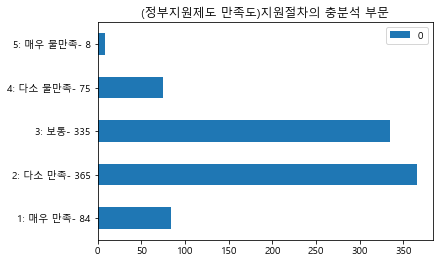


### (정부지원제도 만족도)지원절차의 적정성 부문


```python
df_H1_1 = df_system.loc[:, 'I2S5']
my_dic = {}
for i in range(len(df_H1_1)):
    if df_H1_1[i] in my_dic.keys():
        my_dic[df_H1_1[i]] += 1
    else:
        if df_H1_1[i] in range(0,11):
            my_dic[df_H1_1[i]] = 1

for i in range(1, 6):
    if i not in my_dic.keys():
        my_dic[i] = 0
print(my_dic)            
new_dic = my_dic.copy()
my_dic['1: 매우 만족- {}'.format(new_dic[1])] = my_dic.pop(1)
my_dic['2: 다소 만족- {}'.format(new_dic[2])] = my_dic.pop(2)
my_dic['3: 보통- {}'.format(new_dic[3])] = my_dic.pop(3)
my_dic['4: 다소 불만족- {}'.format(new_dic[4])] = my_dic.pop(4)
my_dic['5: 매우 불만족- {}'.format(new_dic[5])] = my_dic.pop(5)

a = pd.DataFrame(my_dic.values(), index = my_dic.keys())
my_plot = a.plot(kind = 'barh', title="(정부지원제도 만족도)지원절차의 적정성 부문")
```

    {2.0: 333, 4.0: 101, 3.0: 357, 5.0: 19, 1.0: 57}


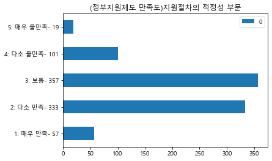


### 정부 정책지원이 가장 필요한 기술개발 단계


```python
df_H1_1 = df_system.loc[:, 'I3']
my_dic = {}
for i in range(len(df_H1_1)):
    if df_H1_1[i] in my_dic.keys():
        my_dic[df_H1_1[i]] += 1
    else:
        if df_H1_1[i] in range(0,11):
            my_dic[df_H1_1[i]] = 1

for i in range(1, 5):
    if i not in my_dic.keys():
        my_dic[i] = 0
print(my_dic)            
new_dic = my_dic.copy()
my_dic['1: 개발기획 단계- {}'.format(new_dic[1])] = my_dic.pop(1)
my_dic['2: 개발진행 단계- {}'.format(new_dic[2])] = my_dic.pop(2)
my_dic['3: 사업화 단계- {}'.format(new_dic[3])] = my_dic.pop(3)
my_dic['4: 판로개척 단계- {}'.format(new_dic[4])] = my_dic.pop(4)

a = pd.DataFrame(my_dic.values(), index = my_dic.keys())
my_plot = a.plot(kind = 'barh', title="정부 정책지원이 가장 필요한 기술개발 단계")
```

    {3.0: 970, 2.0: 1331, 4.0: 369, 1.0: 1130}


### 기획단계 기술개발 자금지원 활용경험


```python
df_H1_1 = df_system.loc[:, 'I4S1']
my_dic = {}
for i in range(len(df_H1_1)):
    if df_H1_1[i] in my_dic.keys():
        my_dic[df_H1_1[i]] += 1
    else:
        if df_H1_1[i] in range(0,3):
            my_dic[df_H1_1[i]] = 1

for i in range(0,2):
    if i not in my_dic.keys():
        my_dic[i] = 0
print(my_dic)            
new_dic = my_dic.copy()
my_dic['0: 없음- {}'.format(new_dic[0])] = my_dic.pop(0)
my_dic['1: 있음- {}'.format(new_dic[1])] = my_dic.pop(1)

a = pd.DataFrame(my_dic.values(), index = my_dic.keys())
my_plot = a.plot(kind = 'barh', title="기획단계 기술개발 자금지원 활용경험")
```

    {0.0: 3467, 1.0: 333}


### 기획단계 기술개발 자금지원 필요성


```python
df_H1_1 = df_system.loc[:, 'I4Q1']
my_dic = {}
for i in range(len(df_H1_1)):
    if df_H1_1[i] in my_dic.keys():
        my_dic[df_H1_1[i]] += 1
    else:
        if df_H1_1[i] in range(0,11):
            my_dic[df_H1_1[i]] = 1

for i in range(1, 6):
    if i not in my_dic.keys():
        my_dic[i] = 0
print(my_dic)            
new_dic = my_dic.copy()
my_dic['1: 매우 필요함- {}'.format(new_dic[1])] = my_dic.pop(1)
my_dic['2: 약간 필요함- {}'.format(new_dic[2])] = my_dic.pop(2)
my_dic['3: 보통- {}'.format(new_dic[3])] = my_dic.pop(3)
my_dic['4: 별로 필요하지 않음- {}'.format(new_dic[4])] = my_dic.pop(4)
my_dic['5: 전혀 필요하지 않음- {}'.format(new_dic[4])] = my_dic.pop(5)

a = pd.DataFrame(my_dic.values(), index = my_dic.keys())
my_plot = a.plot(kind = 'barh', title="기획단계 기술개발 자금지원 필요성")
```

    {3.0: 1092, 1.0: 1857, 2.0: 806, 4.0: 41, 5.0: 4}


### 개발단계 기술개발 자금지원 활용경험


```python
df_H1_1 = df_system.loc[:, 'I4S2']
my_dic = {}
for i in range(len(df_H1_1)):
    if df_H1_1[i] in my_dic.keys():
        my_dic[df_H1_1[i]] += 1
    else:
        if df_H1_1[i] in range(0,3):
            my_dic[df_H1_1[i]] = 1

for i in range(0,2):
    if i not in my_dic.keys():
        my_dic[i] = 0
print(my_dic)            
new_dic = my_dic.copy()
my_dic['0: 없음- {}'.format(new_dic[0])] = my_dic.pop(0)
my_dic['1: 있음- {}'.format(new_dic[1])] = my_dic.pop(1)

a = pd.DataFrame(my_dic.values(), index = my_dic.keys())
my_plot = a.plot(kind = 'barh', title="기획단계 기술개발 자금지원 활용경험")
```

    {0.0: 3564, 1.0: 236}


### 개발단계 기술개발 자금지원 필요성


```python
df_H1_1 = df_system.loc[:, 'I4Q2']
my_dic = {}
for i in range(len(df_H1_1)):
    if df_H1_1[i] in my_dic.keys():
        my_dic[df_H1_1[i]] += 1
    else:
        if df_H1_1[i] in range(0,11):
            my_dic[df_H1_1[i]] = 1

for i in range(1, 6):
    if i not in my_dic.keys():
        my_dic[i] = 0
print(my_dic)            
new_dic = my_dic.copy()
my_dic['1: 매우 필요함- {}'.format(new_dic[1])] = my_dic.pop(1)
my_dic['2: 약간 필요함- {}'.format(new_dic[2])] = my_dic.pop(2)
my_dic['3: 보통- {}'.format(new_dic[3])] = my_dic.pop(3)
my_dic['4: 별로 필요하지 않음- {}'.format(new_dic[4])] = my_dic.pop(4)
my_dic['5: 전혀 필요하지 않음- {}'.format(new_dic[4])] = my_dic.pop(5)

a = pd.DataFrame(my_dic.values(), index = my_dic.keys())
my_plot = a.plot(kind = 'barh', title="개발단계 기술개발 자금지원 필요성")
```

    {3.0: 970, 1.0: 1835, 2.0: 961, 4.0: 30, 5.0: 4}


### 사업화단계 기술개발 자금지원 활용경험


```python
df_H1_1 = df_system.loc[:, 'I4S3']
my_dic = {}
for i in range(len(df_H1_1)):
    if df_H1_1[i] in my_dic.keys():
        my_dic[df_H1_1[i]] += 1
    else:
        if df_H1_1[i] in range(0,3):
            my_dic[df_H1_1[i]] = 1

for i in range(0,2):
    if i not in my_dic.keys():
        my_dic[i] = 0
print(my_dic)            
new_dic = my_dic.copy()
my_dic['0: 없음- {}'.format(new_dic[0])] = my_dic.pop(0)
my_dic['1: 있음- {}'.format(new_dic[1])] = my_dic.pop(1)

a = pd.DataFrame(my_dic.values(), index = my_dic.keys())
my_plot = a.plot(kind = 'barh', title="사업화단계 기술개발 자금지원 활용경험")
```

    {0.0: 3713, 1.0: 87}


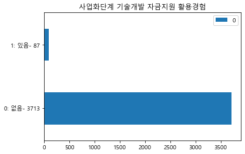


### 사업화단계 기술개발 자금지원 필요성


```python
df_H1_1 = df_system.loc[:, 'I4Q3']
my_dic = {}
for i in range(len(df_H1_1)):
    if df_H1_1[i] in my_dic.keys():
        my_dic[df_H1_1[i]] += 1
    else:
        if df_H1_1[i] in range(0,11):
            my_dic[df_H1_1[i]] = 1

for i in range(1, 6):
    if i not in my_dic.keys():
        my_dic[i] = 0
print(my_dic)            
new_dic = my_dic.copy()
my_dic['1: 매우 필요함- {}'.format(new_dic[1])] = my_dic.pop(1)
my_dic['2: 약간 필요함- {}'.format(new_dic[2])] = my_dic.pop(2)
my_dic['3: 보통- {}'.format(new_dic[3])] = my_dic.pop(3)
my_dic['4: 별로 필요하지 않음- {}'.format(new_dic[4])] = my_dic.pop(4)
my_dic['5: 전혀 필요하지 않음- {}'.format(new_dic[4])] = my_dic.pop(5)

a = pd.DataFrame(my_dic.values(), index = my_dic.keys())
my_plot = a.plot(kind = 'barh', title="사업화단계 기술개발 자금지원 필요성")
```

    {1.0: 1646, 3.0: 949, 2.0: 1151, 4.0: 50, 5.0: 4}


### 기술개발 세제지원 활용경험


```python
df_H1_1 = df_system.loc[:, 'I4S4']
my_dic = {}
for i in range(len(df_H1_1)):
    if df_H1_1[i] in my_dic.keys():
        my_dic[df_H1_1[i]] += 1
    else:
        if df_H1_1[i] in range(0,3):
            my_dic[df_H1_1[i]] = 1

for i in range(0,2):
    if i not in my_dic.keys():
        my_dic[i] = 0
print(my_dic)            
new_dic = my_dic.copy()
my_dic['0: 없음- {}'.format(new_dic[0])] = my_dic.pop(0)
my_dic['1: 있음- {}'.format(new_dic[1])] = my_dic.pop(1)

a = pd.DataFrame(my_dic.values(), index = my_dic.keys())
my_plot = a.plot(kind = 'barh', title="기술개발 세제지원 활용경험")
```

    {0: 2766, 1: 1034}


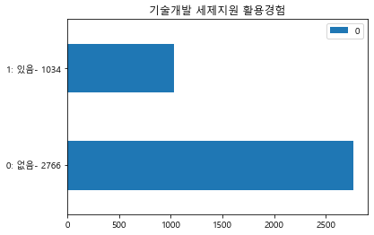


### 기술개발 세제지원 필요성


```python
df_H1_1 = df_system.loc[:, 'I4Q4']
my_dic = {}
for i in range(len(df_H1_1)):
    if df_H1_1[i] in my_dic.keys():
        my_dic[df_H1_1[i]] += 1
    else:
        if df_H1_1[i] in range(0,11):
            my_dic[df_H1_1[i]] = 1

for i in range(1, 6):
    if i not in my_dic.keys():
        my_dic[i] = 0
print(my_dic)            
new_dic = my_dic.copy()
my_dic['1: 매우 필요함- {}'.format(new_dic[1])] = my_dic.pop(1)
my_dic['2: 약간 필요함- {}'.format(new_dic[2])] = my_dic.pop(2)
my_dic['3: 보통- {}'.format(new_dic[3])] = my_dic.pop(3)
my_dic['4: 별로 필요하지 않음- {}'.format(new_dic[4])] = my_dic.pop(4)
my_dic['5: 전혀 필요하지 않음- {}'.format(new_dic[4])] = my_dic.pop(5)

a = pd.DataFrame(my_dic.values(), index = my_dic.keys())
my_plot = a.plot(kind = 'barh', title="기술개발 세제지원 필요성")
```

    {3.0: 1465, 2.0: 926, 1.0: 1338, 4.0: 66, 5.0: 5}


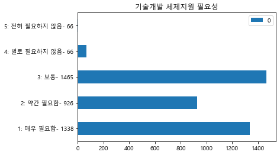


### 기술개발 판로지원 활용경험


```python
df_H1_1 = df_system.loc[:, 'I4S5']
my_dic = {}
for i in range(len(df_H1_1)):
    if df_H1_1[i] in my_dic.keys():
        my_dic[df_H1_1[i]] += 1
    else:
        if df_H1_1[i] in range(0,3):
            my_dic[df_H1_1[i]] = 1

for i in range(0,2):
    if i not in my_dic.keys():
        my_dic[i] = 0
print(my_dic)            
new_dic = my_dic.copy()
my_dic['0: 없음- {}'.format(new_dic[0])] = my_dic.pop(0)
my_dic['1: 있음- {}'.format(new_dic[1])] = my_dic.pop(1)

a = pd.DataFrame(my_dic.values(), index = my_dic.keys())
my_plot = a.plot(kind = 'barh', title="기술개발 판로지원 활용경험")
```

    {0.0: 3724, 1.0: 76}


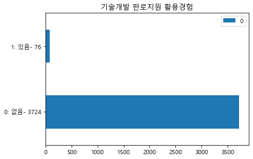


### 기술개발 판로지원 필요성


```python
df_H1_1 = df_system.loc[:, 'I4Q5']
my_dic = {}
for i in range(len(df_H1_1)):
    if df_H1_1[i] in my_dic.keys():
        my_dic[df_H1_1[i]] += 1
    else:
        if df_H1_1[i] in range(0,11):
            my_dic[df_H1_1[i]] = 1

for i in range(1, 6):
    if i not in my_dic.keys():
        my_dic[i] = 0
print(my_dic)            
new_dic = my_dic.copy()
my_dic['1: 매우 필요함- {}'.format(new_dic[1])] = my_dic.pop(1)
my_dic['2: 약간 필요함- {}'.format(new_dic[2])] = my_dic.pop(2)
my_dic['3: 보통- {}'.format(new_dic[3])] = my_dic.pop(3)
my_dic['4: 별로 필요하지 않음- {}'.format(new_dic[4])] = my_dic.pop(4)
my_dic['5: 전혀 필요하지 않음- {}'.format(new_dic[4])] = my_dic.pop(5)

a = pd.DataFrame(my_dic.values(), index = my_dic.keys())
my_plot = a.plot(kind = 'barh', title="### 기술개발 판로지원 필요성")
```

    {3.0: 1616, 2.0: 1111, 1.0: 987, 4.0: 83, 5.0: 3}


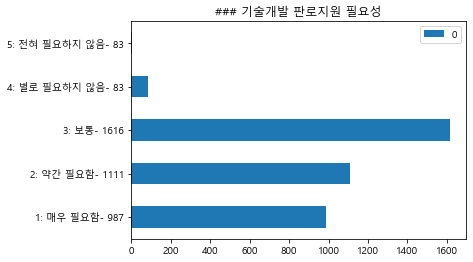


### 기술개발 인력지원 활용경험


```python
df_H1_1 = df_system.loc[:, 'I4S6']
my_dic = {}
for i in range(len(df_H1_1)):
    if df_H1_1[i] in my_dic.keys():
        my_dic[df_H1_1[i]] += 1
    else:
        if df_H1_1[i] in range(0,3):
            my_dic[df_H1_1[i]] = 1

for i in range(0,2):
    if i not in my_dic.keys():
        my_dic[i] = 0
print(my_dic)            
new_dic = my_dic.copy()
my_dic['0: 없음- {}'.format(new_dic[0])] = my_dic.pop(0)
my_dic['1: 있음- {}'.format(new_dic[1])] = my_dic.pop(1)

a = pd.DataFrame(my_dic.values(), index = my_dic.keys())
my_plot = a.plot(kind = 'barh', title="기술개발 인력지원 활용경험")
```

    {0.0: 3721, 1.0: 79}


### 기술개발 인력지원 필요성


```python
df_H1_1 = df_system.loc[:, 'I4Q6']
my_dic = {}
for i in range(len(df_H1_1)):
    if df_H1_1[i] in my_dic.keys():
        my_dic[df_H1_1[i]] += 1
    else:
        if df_H1_1[i] in range(0,11):
            my_dic[df_H1_1[i]] = 1

for i in range(1, 6):
    if i not in my_dic.keys():
        my_dic[i] = 0
print(my_dic)            
new_dic = my_dic.copy()
my_dic['1: 매우 필요함- {}'.format(new_dic[1])] = my_dic.pop(1)
my_dic['2: 약간 필요함- {}'.format(new_dic[2])] = my_dic.pop(2)
my_dic['3: 보통- {}'.format(new_dic[3])] = my_dic.pop(3)
my_dic['4: 별로 필요하지 않음- {}'.format(new_dic[4])] = my_dic.pop(4)
my_dic['5: 전혀 필요하지 않음- {}'.format(new_dic[4])] = my_dic.pop(5)

a = pd.DataFrame(my_dic.values(), index = my_dic.keys())
my_plot = a.plot(kind = 'barh', title="기술개발 인력지원 필요성")
```

    {3.0: 1863, 2.0: 1143, 4.0: 99, 1.0: 685, 5.0: 10}


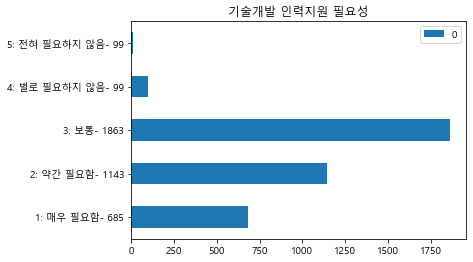


### 기술개발 정보지원 활용경험


```python
df_H1_1 = df_system.loc[:, 'I4S7']
my_dic = {}
for i in range(len(df_H1_1)):
    if df_H1_1[i] in my_dic.keys():
        my_dic[df_H1_1[i]] += 1
    else:
        if df_H1_1[i] in range(0,3):
            my_dic[df_H1_1[i]] = 1

for i in range(0,2):
    if i not in my_dic.keys():
        my_dic[i] = 0
print(my_dic)            
new_dic = my_dic.copy()
my_dic['0: 없음- {}'.format(new_dic[0])] = my_dic.pop(0)
my_dic['1: 있음- {}'.format(new_dic[1])] = my_dic.pop(1)

a = pd.DataFrame(my_dic.values(), index = my_dic.keys())
my_plot = a.plot(kind = 'barh', title="기술개발 정보지원 활용경험")
```

    {0.0: 3752, 1.0: 48}


### 기술개발 정보지원 필요성


```python
df_H1_1 = df_system.loc[:, 'I4Q7']
my_dic = {}
for i in range(len(df_H1_1)):
    if df_H1_1[i] in my_dic.keys():
        my_dic[df_H1_1[i]] += 1
    else:
        if df_H1_1[i] in range(0,11):
            my_dic[df_H1_1[i]] = 1

for i in range(1, 6):
    if i not in my_dic.keys():
        my_dic[i] = 0
print(my_dic)            
new_dic = my_dic.copy()
my_dic['1: 매우 필요함- {}'.format(new_dic[1])] = my_dic.pop(1)
my_dic['2: 약간 필요함- {}'.format(new_dic[2])] = my_dic.pop(2)
my_dic['3: 보통- {}'.format(new_dic[3])] = my_dic.pop(3)
my_dic['4: 별로 필요하지 않음- {}'.format(new_dic[4])] = my_dic.pop(4)
my_dic['5: 전혀 필요하지 않음- {}'.format(new_dic[4])] = my_dic.pop(5)

a = pd.DataFrame(my_dic.values(), index = my_dic.keys())
my_plot = a.plot(kind = 'barh', title="기술개발 정보지원 필요성")
```

    {3.0: 1929, 2.0: 1110, 1.0: 665, 5.0: 13, 4.0: 83}


### 선호하는 정부의 기술개발 지원형태


```python
df_H1_1 = df_system.loc[:, 'I5']
my_dic = {}
for i in range(len(df_H1_1)):
    if df_H1_1[i] in my_dic.keys():
        my_dic[df_H1_1[i]] += 1
    else:
        if df_H1_1[i] in range(0,11):
            my_dic[df_H1_1[i]] = 1

for i in range(1, 5):
    if i not in my_dic.keys():
        my_dic[i] = 0
print(my_dic)            
new_dic = my_dic.copy()
my_dic['1: 중소기업 단독개발 지원- {}'.format(new_dic[1])] = my_dic.pop(1)
my_dic['2: 중소기업-연구기관 공동개발 지원- {}'.format(new_dic[2])] = my_dic.pop(2)
my_dic['3: 중소기업-대학 공동개발 지원- {}'.format(new_dic[3])] = my_dic.pop(3)
my_dic['4: 중소기업-대학-연구기관 공동개발 지원- {}'.format(new_dic[4])] = my_dic.pop(4)

a = pd.DataFrame(my_dic.values(), index = my_dic.keys())
my_plot = a.plot(kind = 'barh', title="선호하는 정부의 기술개발 지원형태")
```

    {1.0: 1968, 2.0: 1218, 4.0: 367, 3.0: 247}


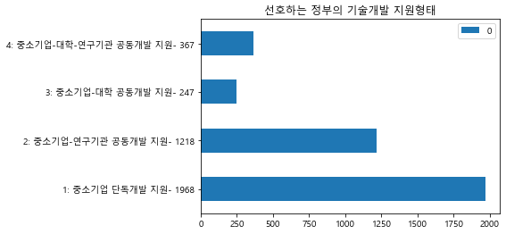


### 향후 정부에서 중점추진해야 할 기술인력 지원정책1


```python
df_H1_1 = df_system.loc[:, 'I6_1']
my_dic = {}
for i in range(len(df_H1_1)):
    if df_H1_1[i] in my_dic.keys():
        my_dic[df_H1_1[i]] += 1
    else:
        if df_H1_1[i] in range(0,11):
            my_dic[df_H1_1[i]] = 1

for i in range(1, 11):
    if i not in my_dic.keys():
        my_dic[i] = 0
print(my_dic)            
new_dic = my_dic.copy()
my_dic['1: 석박사 미취업자 등 고급기술인력 지원- {}'.format(new_dic[1])] = my_dic.pop(1)
my_dic['2: 병역특례 전문연구요원 배정 확대- {}'.format(new_dic[2])] = my_dic.pop(2)
my_dic['3: 관련대학의 이공계인력 인턴근무 지원- {}'.format(new_dic[3])] = my_dic.pop(3)
my_dic['4: 전문분야에 특화된 실업계 특성화고 육성 지원- {}'.format(new_dic[4])] = my_dic.pop(4)
my_dic['5: 외국 전문기술인력의 도입 지원- {}'.format(new_dic[5])] = my_dic.pop(5)
my_dic['6: 대학, 연구소 등 전문인력의 기술자문 지원- {}'.format(new_dic[6])] = my_dic.pop(6)
my_dic['7: 대학, 연구소, 대기업 등 퇴직 고급기술인력 지원- {}'.format(new_dic[7])] = my_dic.pop(7)
my_dic['8: 전문 기술인력 양성 후 중소기업파견 지원- {}'.format(new_dic[8])] = my_dic.pop(8)
my_dic['9: 중소기업현장 기술인력에 대한 교육, 훈련 지원- {}'.format(new_dic[9])] = my_dic.pop(9)
my_dic['10: 기타- {}'.format(new_dic[10])] = my_dic.pop(10)
a = pd.DataFrame(my_dic.values(), index = my_dic.keys())
my_plot = a.plot(kind = 'barh', title="향후 정부에서 중점추진해야 할 기술인력 지원정책1")
```

    {9.0: 274, 2.0: 370, 3.0: 947, 1.0: 725, 6.0: 233, 4.0: 724, 8.0: 277, 7.0: 151, 5.0: 76, 10.0: 2}


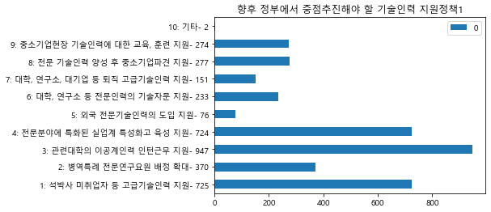


### 향후 정부에서 중점추진해야 할 기술인력 지원정책2


```python
df_H1_1 = df_system.loc[:, 'I6_2']
my_dic = {}
for i in range(len(df_H1_1)):
    if df_H1_1[i] in my_dic.keys():
        my_dic[df_H1_1[i]] += 1
    else:
        if df_H1_1[i] in range(0,11):
            my_dic[df_H1_1[i]] = 1

for i in range(1, 11):
    if i not in my_dic.keys():
        my_dic[i] = 0
print(my_dic)            
new_dic = my_dic.copy()
my_dic['1: 석박사 미취업자 등 고급기술인력 지원- {}'.format(new_dic[1])] = my_dic.pop(1)
my_dic['2: 병역특례 전문연구요원 배정 확대- {}'.format(new_dic[2])] = my_dic.pop(2)
my_dic['3: 관련대학의 이공계인력 인턴근무 지원- {}'.format(new_dic[3])] = my_dic.pop(3)
my_dic['4: 전문분야에 특화된 실업계 특성화고 육성 지원- {}'.format(new_dic[4])] = my_dic.pop(4)
my_dic['5: 외국 전문기술인력의 도입 지원- {}'.format(new_dic[5])] = my_dic.pop(5)
my_dic['6: 대학, 연구소 등 전문인력의 기술자문 지원- {}'.format(new_dic[6])] = my_dic.pop(6)
my_dic['7: 대학, 연구소, 대기업 등 퇴직 고급기술인력 지원- {}'.format(new_dic[7])] = my_dic.pop(7)
my_dic['8: 전문 기술인력 양성 후 중소기업파견 지원- {}'.format(new_dic[8])] = my_dic.pop(8)
my_dic['9: 중소기업현장 기술인력에 대한 교육, 훈련 지원- {}'.format(new_dic[9])] = my_dic.pop(9)
my_dic['10: 기타- {}'.format(new_dic[10])] = my_dic.pop(10)
a = pd.DataFrame(my_dic.values(), index = my_dic.keys())
my_plot = a.plot(kind = 'barh', title="향후 정부에서 중점추진해야 할 기술인력 지원정책2")
```

    {4.0: 487, 6.0: 405, 8.0: 758, 7.0: 132, 3.0: 438, 9.0: 443, 2.0: 289, 1.0: 138, 5.0: 98, 10.0: 1}


### 개발기술 사업화를 위해 가장 필요한 지원책1


```python
df_H1_1 = df_system.loc[:, 'I7_1']
my_dic = {}
for i in range(len(df_H1_1)):
    if df_H1_1[i] in my_dic.keys():
        my_dic[df_H1_1[i]] += 1
    else:
        if df_H1_1[i] in range(0,11):
            my_dic[df_H1_1[i]] = 1

for i in range(1, 9):
    if i not in my_dic.keys():
        my_dic[i] = 0
print(my_dic)            
new_dic = my_dic.copy()
my_dic['1: 기술평가에 기반한 사업화 자금지원- {}'.format(new_dic[1])] = my_dic.pop(1)
my_dic['2: 신기술 제품의 우선구매 지원- {}'.format(new_dic[2])] = my_dic.pop(2)
my_dic['3: 시장분석, 사업성 조사 등 컨설팅 지원- {}'.format(new_dic[3])] = my_dic.pop(3)
my_dic['4: 생산, 양산에 필요한 전문인력 지원- {}'.format(new_dic[4])] = my_dic.pop(4)
my_dic['5: 마케팅 전문인력 양성 지원- {}'.format(new_dic[5])] = my_dic.pop(5)
my_dic['6: 상설전시 및 해외시장개척 지원- {}'.format(new_dic[6])] = my_dic.pop(6)
my_dic['7: 국내외 표준 규격, 기술인증 지원- {}'.format(new_dic[7])] = my_dic.pop(7)
my_dic['8: 기타- {}'.format(new_dic[8])] = my_dic.pop(8)

a = pd.DataFrame(my_dic.values(), index = my_dic.keys())
my_plot = a.plot(kind = 'barh', title="개발기술 사업화를 위해 가장 필요한 지원책1")
```

    {3.0: 343, 1.0: 2278, 2.0: 671, 6.0: 32, 4.0: 288, 5.0: 99, 7.0: 77, 8.0: 1}


### 개발기술 사업화를 위해 가장 필요한 지원책2


```python
df_H1_1 = df_system.loc[:, 'I7_2']
my_dic = {}
for i in range(len(df_H1_1)):
    if df_H1_1[i] in my_dic.keys():
        my_dic[df_H1_1[i]] += 1
    else:
        if df_H1_1[i] in range(0,11):
            my_dic[df_H1_1[i]] = 1

for i in range(1, 9):
    if i not in my_dic.keys():
        my_dic[i] = 0
print(my_dic)            
new_dic = my_dic.copy()
my_dic['1: 기술평가에 기반한 사업화 자금지원- {}'.format(new_dic[1])] = my_dic.pop(1)
my_dic['2: 신기술 제품의 우선구매 지원- {}'.format(new_dic[2])] = my_dic.pop(2)
my_dic['3: 시장분석, 사업성 조사 등 컨설팅 지원- {}'.format(new_dic[3])] = my_dic.pop(3)
my_dic['4: 생산, 양산에 필요한 전문인력 지원- {}'.format(new_dic[4])] = my_dic.pop(4)
my_dic['5: 마케팅 전문인력 양성 지원- {}'.format(new_dic[5])] = my_dic.pop(5)
my_dic['6: 상설전시 및 해외시장개척 지원- {}'.format(new_dic[6])] = my_dic.pop(6)
my_dic['7: 국내외 표준 규격, 기술인증 지원- {}'.format(new_dic[7])] = my_dic.pop(7)
my_dic['8: 기타- {}'.format(new_dic[8])] = my_dic.pop(8)

a = pd.DataFrame(my_dic.values(), index = my_dic.keys())
my_plot = a.plot(kind = 'barh', title="개발기술 사업화를 위해 가장 필요한 지원책2")
```

    {3.0: 733, 4.0: 965, 1.0: 212, 2.0: 407, 6.0: 188, 5.0: 422, 7.0: 297, 8: 0}


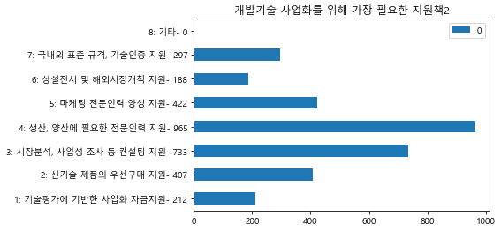


```python

```
