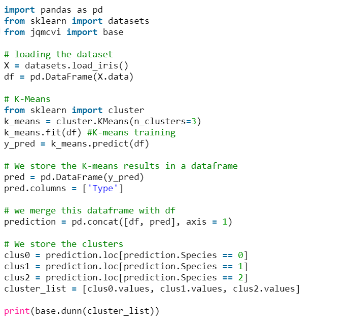

# 0419_conference

## 규민

> Clustering의 두가지 방법
>
> - Compactness
>   - K-Means
> - Connectivity
>   - Spectral Clustering

### Clustering_Models

#### K-means

- Cons
  - 클러스터의 개수 `K`를 입력 파라미터 지정
  - 이상값 (`Outlier`)에 민감
  - 구형이 아닌 클러스터 찾는데 적합치 않다.

#### Spectral Clustering

- `PCA`를 통한 차원축소
- 그 후 , `K-means` 알고리즘으로 군집화 진행
- Pros
  - 데이터 분포에 대한 강한 가정을 하지 않는다.
  - 구현이 쉽고 좋은결과가 나옴
  - 적당한 양의 데이터에 대해 합리적인 컴퓨팅 연산
- Cons
  - 클러스터 개수 `k` 지정해줘야함
  - 결국 마지막에 K-means -> 매번 같은 결과 보장 안해준다
  - 데이터가 큰 경우 상당한 계산량 요구

### Idea

```
Spectral Clustering(스펙트럼 군집화)가 우리 Data 개수에 딱 일듯!
여러 기법을 돌리고 어떠한 기준으로 잘 나누어졌다를 판단할지 유의하자
```


----------------------

## 인영

> DBSCAN Clustering
>
> Mean-shift Clustering

### Clustering_Models

#### DBSCAN

- 기준점 부터의 거리 `epsilon` 값 인자사용
- 반경 내에 있는 점의 수 `minPts` 인자 사용

- Pros
  - 일정 밀도 이상을 가진 데이터를 기준으로 군집 형성
    - 노이즈 처리에 강하다
  - `클러스터의 수를 정하지 않아도 된다.`
  - `기하학적인 모형을 갖는 데이터 잘 군집화`
- Cons
  - 두 인자에 영향을 많이 받는다
  - 속도가 느리다 (많은 연산을 수행)
    - 고차원 데이터로 갈수록 연산량 급증

#### Mean-Shift

- 현재 자신의 주변에서 가장 데이터가 밀집된 방향으로 이동
  - 현재 위치의 반경에 들어오는 데이터들의 무게중심 좌표로 현위치 이동
  - 이 과정을 위치변화가 거의 없을 때까지, 즉 수렴할 때까지 반복
  - 중심점의 개수가 군집의 개수(K)가 되는것
- Pros
  - `클러스터개수 K 지정 필요없다`
- Cons
  - 반지름의 크기정하는 것이 쉽지 않다
    - 이것에 따라 결과 많이 달라진다


--------

## 동석

> - 변수 문항 축소
> - GMM
> - Hierarchical Aggolomerative Clustering (합체군집화)

### 변수문항축소

- dongsuk파일 참조

### Clustering_Models

#### GMM (Gaussian Miture Model)

- `데이터가 K개의 정규분포로 부터 생성되었다고 가정`
- 이 후 K-means와 같은 방식으로 군집화
- Pros
  - GMM은 확률로 나누기 때문에 Soft Clustering
- Cons
  - 정규화 가정이 ㅇㅆ어야한
  - 연산 오래걸림

#### HIerarchical Agglomerative (합체군집화)

- N개의 군집을 생성
- 유사한 군집의 쌍을 하나의 군집으로 합쳐가며 줄여나감
- Cons
  - N>5000이면 시간이 오래걸린다


---------

## ★팀아이디어★

- 더미변수 처리 유의하자
  - 연속형값 1, 2, 3, 4, 5가 아닌 범주형 자료로 하기위 해 `string` 형태로 변수 받아주자
- 나눠서 뭘 할것인가?
  - 나눈 후 Scoring을 통한 기업선별
  - 변수는 18개 군집 전부 다 따로
    - `PCA` 통한 주요변수 추출
    - ex) `Y` = `PC1` * `X1` + `PC2` * `X2` + ...

- 성능평가 지표?
  - 군집평가 - `3개로!`
    - 실루엣계수 - 클수록 좋다
  - 모델평가
    - dunn index - 클수록 좋다
    - v measure : 동질성 + 완전성

#### 해야할것

- 오늘 밤까지 데이터 전처리 코드구축
- 수요일까지 각자 맡은 모델 Clustering 진행
- 토요일에 군집 선별 및 군집화 작업 종료.

#### 참고사이트 및 문서

- 군집분석 개념

  - https://brunch.co.kr/@gimmesilver/40

- 군집 모델평가

  - https://woolulu.tistory.com/50
  - http://blog.naver.com/PostView.nhn?blogId=ssdyka&logNo=221283224907&redirect=Dlog&widgetTypeCall=true&directAccess=false
  - 성능비교(코드잇어서 보면좋음)
    - https://blog.naver.com/a_aaaaaa/221154717813
  - 실루엣계수 / Dunn index 개념
    - [https://ratsgo.github.io/machine%20learning/2017/04/16/clustering/](https://ratsgo.github.io/machine learning/2017/04/16/clustering/)
  - 
  - 동질성
    - https://scikit-learn.org/stable/modules/generated/sklearn.metrics.homogeneity_score.html
  - completeness
    - https://scikit-learn.org/stable/modules/generated/sklearn.metrics.v_measure_score.html#sklearn.metrics.v_measure_score

  