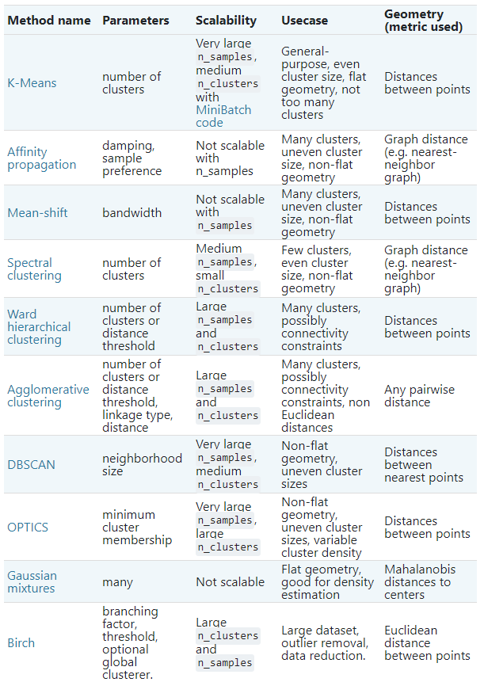
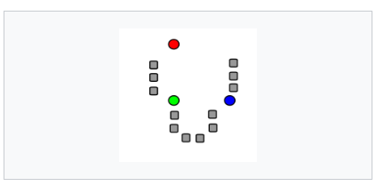
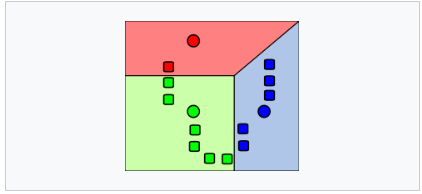
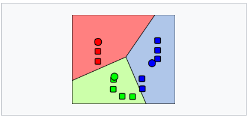
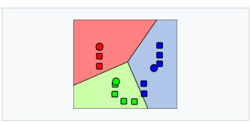
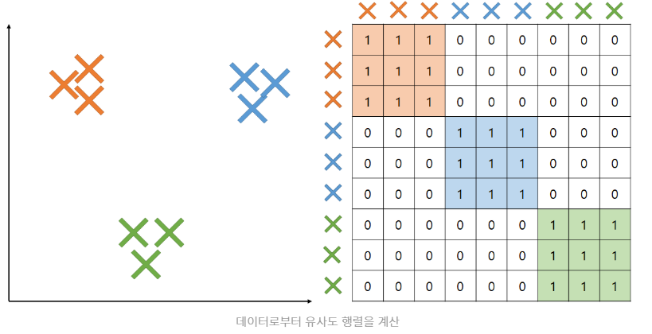
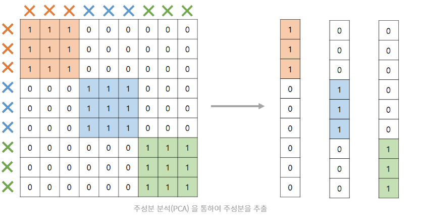
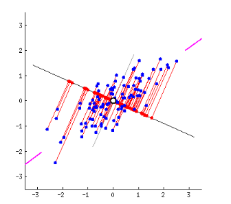
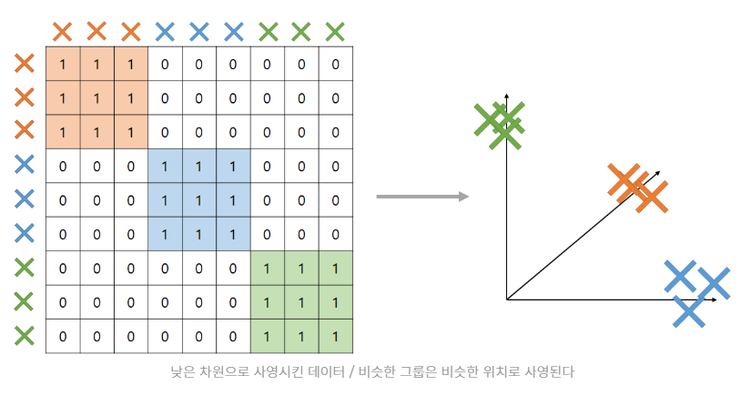
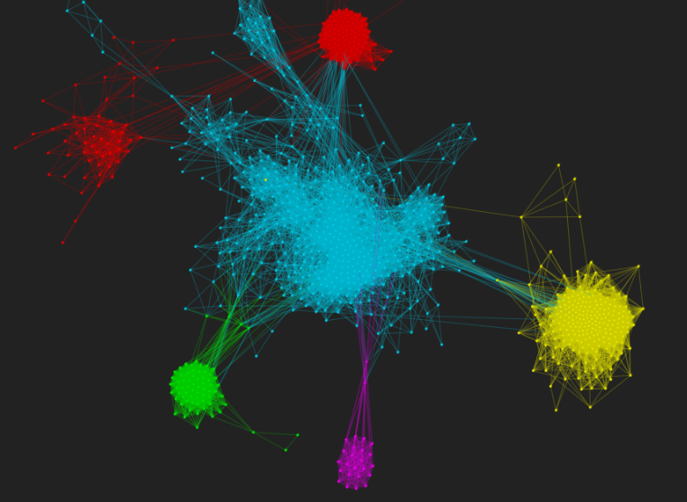

# 0419_규민

# Clustering_methods

> scikit-learn 공식문서 참고할것
>
> - https://scikit-learn.org/stable/modules/clustering.
>
> 클러스터링에는 넓게 두가지 접근법이 있다.
>
> 1. Compactness
>    - 서로 가까이 있는 대상끼리 묶고, 그 그룹의 중심으로 비슷한 대상끼리 밀집되어 분포하도록 하는 방식
>    - 주로 두 대상간의 거리로 유사도 측정
>    - k-means
> 2. Connectivity
>    - 서로 연결되어 있거나 바로 옆에 있는 대상이 같은 그룹으로 묶임
>    - 두 대상이 거리상 매우 가깝더라도 연결되어 있지 않다면 같은 그룹으로 묶이지 않음
>    - Spectral clustering (스펙트럼 군집화) 



## K-means

> 주어진 데이터를 K개의 클러스터로 묶는 알고리즘
>
> 각 클러스터와 거리 차이의 분산을 최소화화는 방식으로 동작

### 알고리즘

####    *표준알고리즘

- 입력값: K: 클러스터 수, D: n개의 데이터를 포함하는 집합
- 초기 k"평균값"(아래의 경우 k=3)은 데이터 중에 무작위 추출


1. 

2. k 각 데이터는 가장 가까이 있는 평균값을 기준으로 묶임

   분할된 영역은 `보로노이 다이어그램`으로 표시됨

   

3. K개 클러스터 `중심점`을 기준으로 평균값 재조정

   

4. 위의 작업을 반복하면 점들이 소속된 집단을 바꾸지 않거나, `무게중심` 이 변하지 않는 상태로 수렴

   


####   *무작위 분할 

- 처음에 데이터를 임의의 클러스터에 배당한 후 각 클러스터에 배당된 점들의 평균값을 초기 평균 으로 설정해서 시작한다.
- `데이터 순서에 대해 독립적이다`
- `초기 클러스터의 무게중심 들이 데이터 집합의 중심에 가깝게 위치 하는 경향` -> 선호되는 이유

### 한계점

- 클러스터 개수 K 값을 입력 파라미터로 지정해주어야 한다.
- 알고리즘의 에러 수렴이 전역 최소가 아닌 지역 최솟값으로 수렴할 가능성이 있다.
- 이상값(outlier)에 민감하다.
- 구형이 아닌 클러스터를 찾는데 적절치 않다.


## Spectral clustering (스펙트럼군집화 알고리즘)

> - 데이터의 유사성 매트릭스의 스펙트럼(고유값)을 사용하여 차원축소를 해, 더 적은 차원으로 클러스터링 하는것
>
> - K-means는 거리에 관심이 있는반면, 스펙트럼은 연결에 관심이 있다.
>
> - 알고리즘 참조
>   - https://brunch.co.kr/@mathpresso/11

### 알고리즘

#### 1. Compute a similarity graph

> 거리를 계산하여 유사도 행렬을 구한다.



>  주성분분석(PCA)을 통해 주성분 추출



>  주성분 분석 수행




#### 2. Project the data onto a lower-dimensional space & Create cluster

> 낮은 차원의 각 점으로 변환
>
> 그 후 K-means와 같은 알고리즘을 이용하여 클러스터 생성



#### 3. 결과물




### 장단점

#### Pros

- 데이터의 분포에 대한 강한 가정을 하지 않는다
- 구현이 쉽고 좋은 결과 나온다
- 몇 천개 수준의 Sparse(부족한)한 데이터에 대해 충분히 합리적인 속도로 계산할 수 있다.

#### Cons

- 마지막 단계에서 K-means와 같은 clustering 알고리즘 사용하는데, 항상 같은 결과를 보장하지 않는다
- 큰 데이터는 상당한 계산량 요구
- 몇 개의 그룹으로 쪼개어 지느냐에 따라 결과가 달라질 수 있다.
- 클러스터의 개수 지정해줘야한다.


## 아이디어 & 의문

```
I) 스펙트럼군집화 알고리즘은 `많지않은데이터`에서  좋을거 같다 

   -> 우리데이터에 써보자!

Q) 랜덤변수 설정으로 최적의 K값 찾을 수 있다면 좋을것 같다.
   -> 근데 최적의 K를 무었을 기준으로 찾지? 그래프를 눈으로 볼 수 없는데? 

q) 6가지 기법 돌려보고 어떤 기준으로 모델 선정할까?
```

