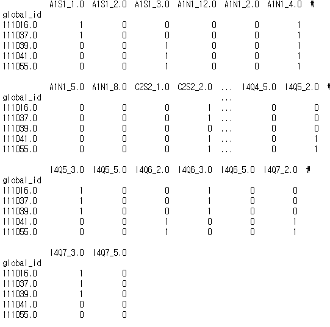
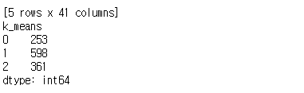
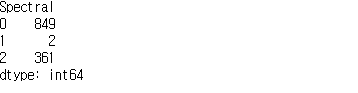
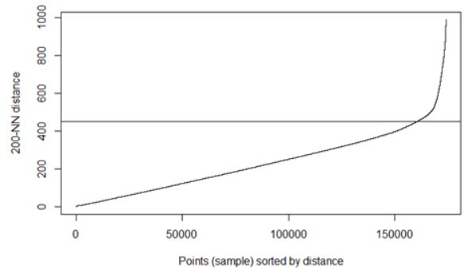
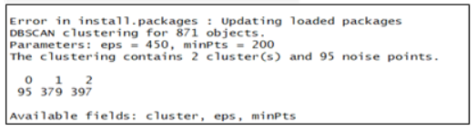
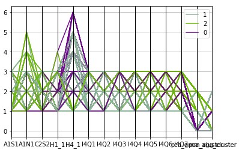
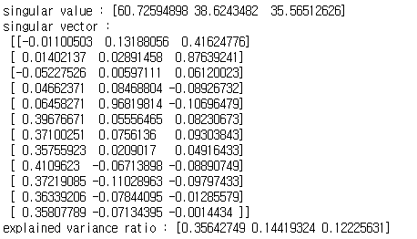
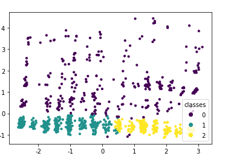
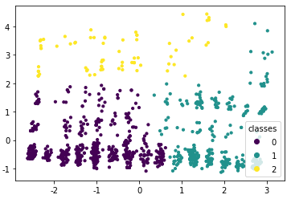
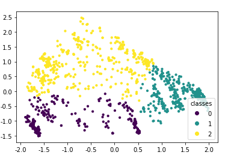

# 0423_conference

## 규민

> `numpy` , `pandas`, `sklearn.cluster`  packgaes
>
> Data preprocessing
>
> K-Means Clustering
>
> Spectral Clustering

### Data preprocessing

- `기술 통계자료`와 `실태조사 자료` 의 중복 데이터 추출

  - 서비스업: 195
  - 일반업: 183
  - 제조업종: 834 이 합쳐진 `train 데이터` 생성

- 필요 `Cloumn` 추출

  - ```python
    index_list = ['A1S1', 'A1N1', 'C2S2', 'H1_1', 'H4_1', 'I4Q1', 'I4Q2',  'I4Q3', 'I4Q4', 'I4Q5', 'I4Q6', 'I4Q7']
    ```

- 결측치(`NA`) 처리

  - 해당 `Index`의 최빈값(`freq`) 대체

- 더비변수화

  - 응답데이터가 1, 2, 3, 4, 5 형식의 범주형데이터 이므로 더미변수 생성
  - 각 변수별 더비변수 생성
    - `Column`: `13` -->> `40` 개로 증가

- 완성된 DataSet

  - 

### K-means

>  더미변수를 사용한 k-means 클러스터링 결과

- 

### Spectral Clustering

> 더미변수를 사용한 spectral 클러스터링 결과

- 

- 전체 결과를 반영한 `clusrer_result.csv` 파일 생성
  - `Statistical_Data_Idea_Contest\0423\kyumin`

### Idea

```txt
# 응답을 int로 하는것과 string으로 한것 같은 결과 나옴	- 즉, 형태는 상관없다 (더미변수처리하면 더욱)
# PCA와 더미변수 유무를 고려한 4가지군집(모델별) 실행필요
# K-Means > Spectral 의 성능을 보였다.
```


----------------------

## 인영

> DBSCAN Clustering
>
> Mean-shift Clustering

### DBSCAN

- 적절한 파라미터 값 찾기
  - `k`= `200`으로 지정 하면 적절한 `eps` 값 `450` 추정 가능
  - 
- DBSCAN 결과
  - 
  - `군집 2개 형성(noise 95개)`
- parameter에 따른 위의 군집화과정 여러번 진행
  - 최적의 군집화 결과 및 noise 감소를 찾기 위함

### Mean-Shift

- `진행중`

### Idea

```
# DBSCAN(eps=550,minPts=250) 일 때가 우리가 원하는 방향으로 나오는 결과인 것 같다
# 하지만, 군집이 3개 형성되는 이상적인 결과는 나오지 않음
# 아래와 같은 선택지가 있을 것으로 생각됨
	(1) 군집을 2개로 잡는다
	(2) 3개로 형성되는 다른 군집 방법을 선택
	(3) dbscan을 활용하여 군집 3개가 나올 때까지 계속 돌			려보기
```


--------

## 동석

> - GMM
> - Hierarchical Aggolomerative Clustering (합체군집화)

### Data preprocessing

- 기술통계19 `global_id` 와 실태조사_업종 (서비스, 일반, 제조)의 `global_id`의 교집합 만을 추출

- 필요 변수 추출

  - ```python
    features = ['A1S1','A1N1','C2S2','H1_1','H4_1','I4Q1','I4Q2','I4Q3','I4Q4','I4Q5','I4Q6','I4Q7']
    ```

- 결측치 최빈값 대체

- 변수 라벨링

### GMM

- 

#### PCA

- PCA의 제일 적합한 차원수 선택
  - 
  - 시각화를 위한 `n_compoments=2` 선택 (2차원)
- 결과
  - 

#### Dummy + PCA 

- 

### 

### AGG + PCA

- 

### 

#### Dummy + PCA + AGG

- 

---------

## ★팀아이디어★

- PCA와 Dummny 고려한 다양한 군집화 진행 후 최적 군집화 찾자
- 결국 시각적으로 보려면 2차원 밖에 안되니 다양한 모델링 후 `실루엣 계수`/ `Dunn index`/ `동질성`/ `completeness` 확인해야함

### 해야할것

- 규민

  - 각 모델별 `PCA (o,x)` + `Dummy (o,x)` 4가지 모형 만들기 -> 총 8개
    - `K-means`, `K-means+PCA`, `K-means+ Dummny`, `K-means + PCA + DUMMY`  4가지 군집
    - `Spectral`, `Spectral+PCA`, `Spectral+ Dummny`, `Spectral + PCA + DUMMY`  4가지 군집
  - K-MEANS, SPECTRAL 모델 평가하기 (직관 + 계수)

- 동석

  - 각 모델별 `PCA (o,x)` + `Dummy (o,x)` 4가지 모형 만들기 -> 총 8개
    - `GMM`, `GMM+PCA`, `GMM +Dummny`, `GMM + PCA + DUMMY`  4가지 군집
    - `AGG`, `AGG+PCA`, `AGG+Dummny`, `AGG + PCA + DUMMY`  4가지 군집
  - GMM, AGG 모델 평가하기 (직관 + 계수)

- 인영

  - 최빈값 처리한 데이터 생성
  - 각 모델별 `PCA (o,x)` + `Dummy (o,x)` 4가지 모형 만들기 -> 총 8개
    - `DBSCAN`, `DBSCAN+PCA`, `DBSCAN+ Dummny`, `DBSCAN + PCA + DUMMY`  4가지 군집
    - `Mean-shift`, `Meanshift+PCA`, `Meanshift+ Dummny`, `Meanshift + PCA + DUMMY`  4가지 군집
  - DBSCAN, Meanshift 모델 평가하기 (직관 + 계수)
  - 주석 포함한 markdown 파일 팀원공유해주기

  

#### 참고사이트 및 문서

- 군집분석 개념

  - https://brunch.co.kr/@gimmesilver/40

- 군집 모델평가

  - https://woolulu.tistory.com/50
  - http://blog.naver.com/PostView.nhn?blogId=ssdyka&logNo=221283224907&redirect=Dlog&widgetTypeCall=true&directAccess=false
  - 성능비교(코드잇어서 보면좋음)
    - https://blog.naver.com/a_aaaaaa/221154717813
  - 실루엣계수 / Dunn index 개념
    - [https://ratsgo.github.io/machine%20learning/2017/04/16/clustering/
  - 동질성
    - https://scikit-learn.org/stable/modules/generated/sklearn.metrics.homogeneity_score.html
  - completeness
    - https://scikit-learn.org/stable/modules/generated/sklearn.metrics.v_measure_score.html#sklearn.metrics.v_measure_score
  
