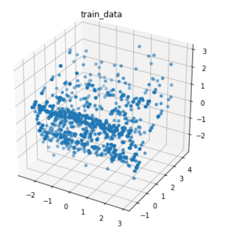
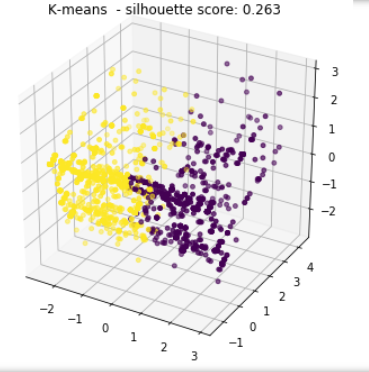
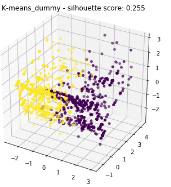
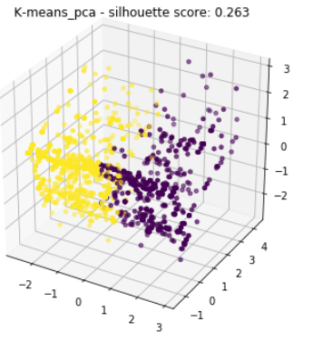
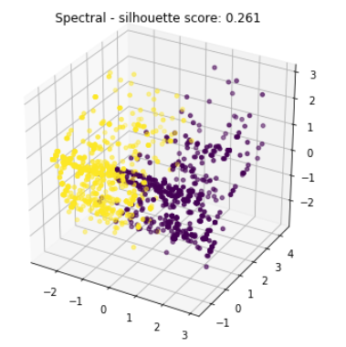
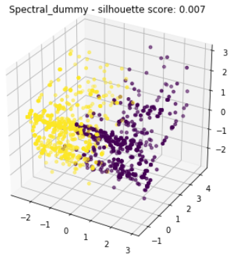
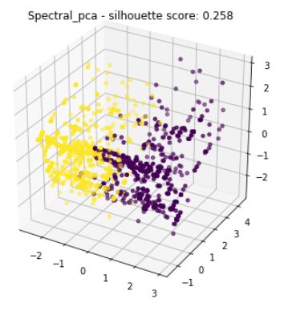
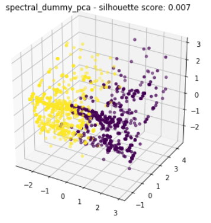
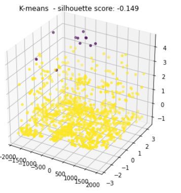
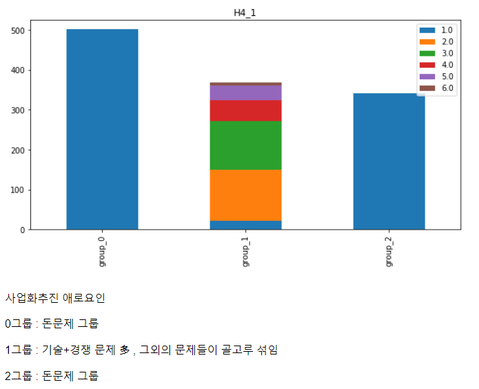

# 0427_conference

## 규민

> 모델별 `PCA (o,x)` + `Dummy (o,x)` 총 8가지 군집화
>
> - `K-means`, `K-means+PCA`, `K-means+ Dummny`, `K-means + PCA + DUMMY`  
> - `Spectral`, `Spectral+PCA`, `Spectral+ Dummny`, `Spectral + PCA + DUMMY`  
>
> - `Silhouette_score`을 통한 최적모델 선별

### Clustering result

- PCA를 통한 데이터 3차원 축소

  ##### 데이터 분포

  

#### *Kmeans

#####  1. k-means



##### 2. +dummy



##### 3. +PCA



##### 4. +dummy+PCA


#### *Sepctral

##### 1. Spectral



##### 2. +dummy



##### 3. +PCA



##### 4. +dummy+pca




### Idea

```txt
# Spectral PCA가 가장 적절한것 같다!
# 각자의 코드 통합해서 다시 결과 봐야하지 않을까?
```


----------------------

## 인영

> 모델별 `PCA (o,x)` + `Dummy (o,x)` 총 8개가지 모형
>
> - `DBSCAN`, `DBSCAN+PCA`, `DBSCAN+ Dummny`, `DBSCAN + PCA + DUMMY`  
> - `Mean-shift`, `Meanshift+PCA`, `Meanshift+ Dummny`, `Meanshift + PCA + DUMMY`  
>
> - `Silhouette_score`을 통한 최적모델 선별

### DBSCAN 결과

> 아래 플롯 title 중 k-means가 아닌 dmscan임을 인지하자
>
> (text만 k-means로 나온것 결과는 DBscan이 맞음!)



### Idea

```
# DBscan을 우리 공모전의 데이터 형태에서 쓰는게 맞는가 의문이 든다.
```


--------

## 동석

> - Cluster별 Feature 중요도 차트화
>
> - `GMM`, `GMM+PCA`, `GMM +Dummny`, `GMM + PCA + DUMMY`  4가지 군집
> - `AGG`, `AGG+PCA`, `AGG+Dummny`, `AGG + PCA + DUMMY`  4가지 군집
>
> - `Silhouette_score`을 통한 최적모델 선별

### Feature importance

> 각 군집별(3개) feature 중요도 시각화

- 아래의 형태로 `0427/클러스터링 분석`  파일에 차트 생성. 




### Idea

```txt
#0번 그룹: 애로요인에서는 '돈'을 선택했지만, 지원을 원하는 부분에서는 1번 응답(있으면 좋고 없어도 괜찮음)의 비율이 높음 --> 기업자체 능력이 있는 그룹이라고 생각할 수 있지 않을까?
#1번 그룹 : 애로요인, 지원부분에서 중간급을 차지하는 그룹
#2번 그룹 : 애로요인에서 돈, 지원 부분에서도 가장 필요성을 어필하는 그룹

#그룹별 지원을 원하는 부분이 뭔지는 잘 알 수 없으나, 0->1->2 그룹 순으로 지원이 필요함을 알 수 있음
---------------------------------------------
전체적으로 봤을 때 모든 그룹은 시장확대&개선에 중점을 둠
#0번 그룹: 애로요인에서 돈, 지원 부분을 거의 필요로 하지 않는 그룹
#1번 그룹: 애로요인에서 돈, 지원부분을 가장 필요로 하는 그룹
#2번 그룹 : 애로요인에서 돈, 지원 부분을 별로 필요로 하지 않는 그룹

#그룹별 지원 우선 순위 1->2->0 , 1번에게 우선 지원, 2번 에게는 애로요인에서 보인 응답을 보고 맞춤 지원, 0번은 다른 지원 방식을 선택.
-------------------------------------------
#0번 그룹: 애로요인에서 돈, 지원 부분에서도 가장 필요성을 어필하는 그룹
#1번 그룹 : 애로요인에서 돈, 지원 부분에서는 별로 필요함을 못 느끼는 그룹
#2번 그룹 : 애로요인에서 돈, 지원 부분 응답은 0번 0번 그룹과 1번 그룹의 중간

그룹별 지원 우선 순위 0->2->1 , 0번에게 우선 지원(자금 지원), 2번 에게는 애로요인에서 보인 응답을 보고 맞춤 지원(기술적인 부분을 더 지원), 1번은 소액 지원 이런 식으로 생각해보면 좋을 듯
```


---------

## ★팀아이디어★

- 

### 해야할것

- 규민

  > `**코드 통합**` 
  >
  > 같은 조건에서의 실루엣 개수 측정

- 동석

  > 통합한 자료 18개 군집으로 나누기

- 인영

  > 예측모델 방법 찾아오기 (차주 준비)

  

#### 참고사이트 및 문서

- `**Scikit learn 공식문서**`
  - https://scikit-learn.org/stable/user_guide.html

- 군집분석 개념

  - https://brunch.co.kr/@gimmesilver/40

- 군집 모델평가

  - https://woolulu.tistory.com/50
  - http://blog.naver.com/PostView.nhn?blogId=ssdyka&logNo=221283224907&redirect=Dlog&widgetTypeCall=true&directAccess=false
  - 성능비교(코드잇어서 보면좋음)
    - https://blog.naver.com/a_aaaaaa/221154717813
  - 실루엣계수 / Dunn index 개념
    - [https://ratsgo.github.io/machine%20learning/2017/04/16/clustering/
  
