```python
import pandas as pd
import numpy as np
from pandas import DataFrame, Series
from matplotlib import pyplot as plt
```


```python
train = pd.read_csv('total.csv')
```


```python
train.columns
```


    Index(['A1S1', 'A1N1', 'C2S2', 'H1_1', 'H4_1', 'I4Q1', 'I4Q2', 'I4Q3', 'I4Q4',
           'I4Q5', 'I4Q6', 'I4Q7', 'pca_gmm_cluster', 'pca_agg_cluster',
           'gmm_cluster', 'ac_cluster', 'dummy_pca_gmm', 'dummy_pca_agg'],
          dtype='object')


# PCA+GMM 


```python
def bar_chart(feature):
    group_0 = train[train['pca_gmm_cluster']==0][feature].value_counts()
    group_1 = train[train['pca_gmm_cluster']==1][feature].value_counts()
    group_2 = train[train['pca_gmm_cluster']==2][feature].value_counts()
    df = pd.DataFrame([group_0,group_1,group_2])
    df.index = ['group_0','group_1','group_2']
    df.plot(kind='bar',stacked=True, figsize=(10,5), title = feature)
```


```python
features = ['A1S1','A1N1','C2S2','H1_1','H4_1','I4Q1','I4Q2','I4Q3','I4Q4','I4Q5','I4Q6','I4Q7']
```


```python
for i in features:
    bar_chart(i)
```


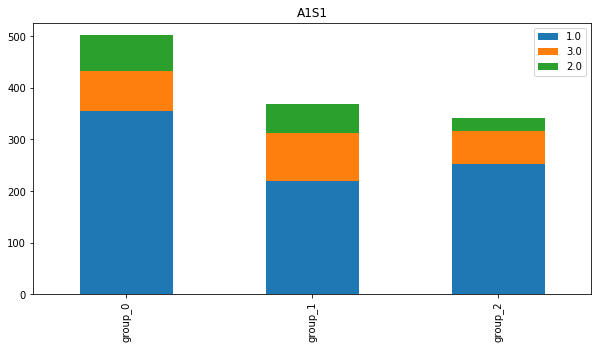


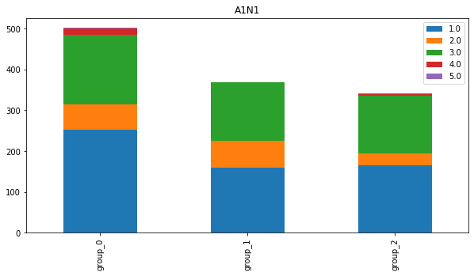


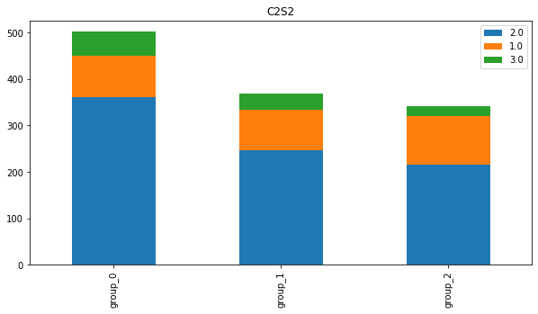


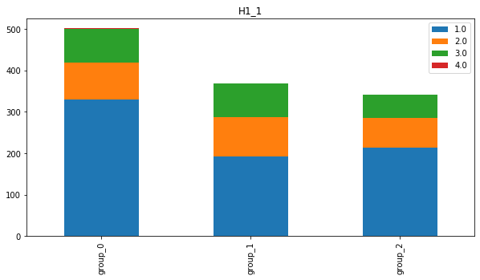


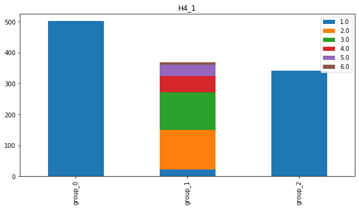


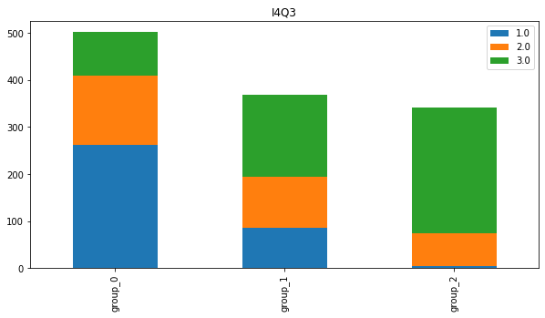


```python
bar_chart('H4_1')
```


사업화추진 애로요인

0그룹 : 돈문제 그룹

1그룹 : 기술+경쟁 문제 多 , 그외의 문제들이 골고루 섞임

2그룹 : 돈문제 그룹


```python
bar_chart('I4Q1')
```


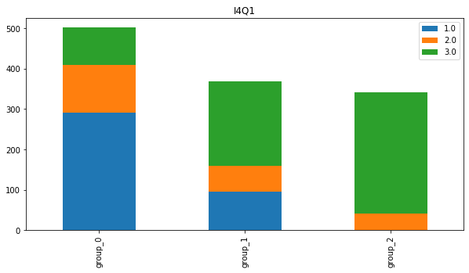


기획단계 자금지원 필요성 (1.있으면 좋고 없어도 soso, 2. 보통 , 3. 필요함)

0그룹 : 1번 응답이 가장 많고, 2,3 번 순으로 나타남

1그룹 : 3번 응답이 가장많고, 1,2번 순으로 나타남

2그룹 : 3번 응답이 가장많음

** I4Q2, I4Q3 그래프도 위와 거의 동일


```python
bar_chart('I4Q4')
```


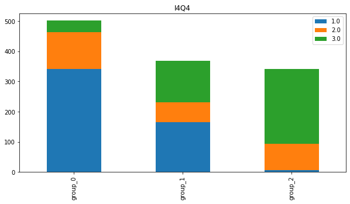


기술개발 세제 지원 (1.있으면 좋고 없어도 soso, 2. 보통 , 3. 필요함)

0그룹 : 1번 응답이 가장 많고, 2,3 번 순으로 나타남

1그룹 : 1번과 3번 응답이 비슷하고, 2번 순

2그룹 : 3번 응답이 가장많음


```python
bar_chart('I4Q5')
```


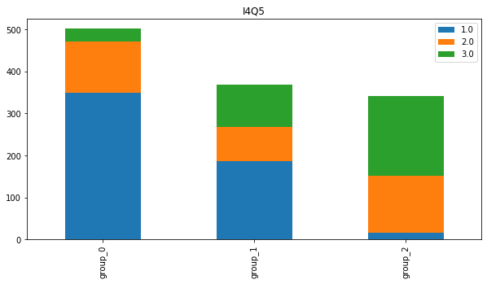


기술개발 판로 지원 (1.있으면 좋고 없어도 soso, 2. 보통 , 3. 필요함)

0그룹 : 1번 응답이 가장 많고, 2,3번 순으로 나타남

1그룹 : 1번 응답이 가장 많고, 3,2번 순으로 나타남

2그룹 : 3번 응답이 가장많음


```python
bar_chart('I4Q6')
```


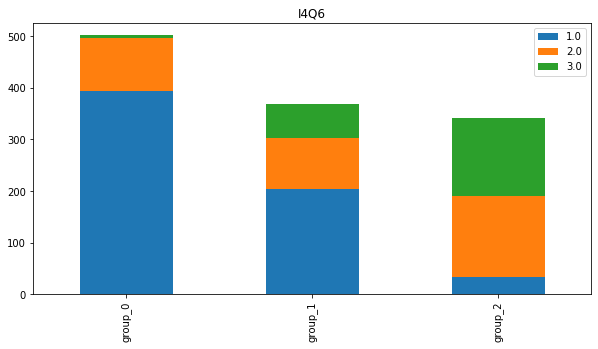


기술개발 인력 지원 (1.있으면 좋고 없어도 soso, 2. 보통 , 3. 필요함)

0그룹 : 1번 응답이 가장 많고, 2번 순으로 나타남, 3번 거의 없음

1그룹 : 1번 응답이 가장 많고, 2, 3번 순으로 나타남

2그룹 : 3번, 2번 응답이 비슷함


```python
bar_chart('I4Q7')
```


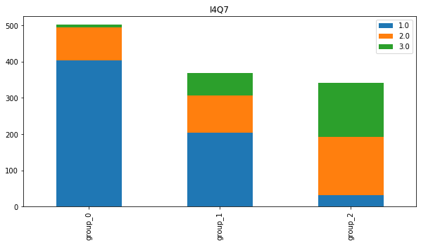


기술개발 정보 지원 (1.있으면 좋고 없어도 soso, 2. 보통 , 3. 필요함)

0그룹 : 1번 응답이 가장 많고, 2번 순으로 나타남, 3번 거의 없음

1그룹 : 1번 응답이 가장 많고, 2, 3번 순으로 나타남

2그룹 : 3번, 2번 응답이 비슷함

전체적으로 봤을 때 

0번 그룹: 애로요인에서는 '돈'을 선택했지만, 지원을 원하는 부분에서는 1번 응답(있으면 좋고 없어도 괜찮음)의 비율이 높음 --> 기업자체 능력이 있는 그룹이라고 생각할 수 있지 않을까?

1번 그룹 : 애로요인, 지원부분에서 중간급을 차지하는 그룹

2번 그룹 : 애로요인에서 돈, 지원 부분에서도 가장 필요성을 어필하는 그룹

* 그룹별 지원을 원하는 부분이 뭔지는 잘 알 수 없으나, 0->1->2 그룹 순으로 지원이 필요함을 알 수 있음

# PCA+AGG


```python
def bar_chart(feature):
    group_0 = train[train['pca_agg_cluster']==0][feature].value_counts()
    group_1 = train[train['pca_agg_cluster']==1][feature].value_counts()
    group_2 = train[train['pca_agg_cluster']==2][feature].value_counts()
    df = pd.DataFrame([group_0,group_1,group_2])
    df.index = ['group_0','group_1','group_2']
    df.plot(kind='bar',stacked=True, figsize=(10,5), title = feature)
```


```python
features = ['A1S1','A1N1','C2S2','H1_1','H4_1','I4Q1','I4Q2','I4Q3','I4Q4','I4Q5','I4Q6','I4Q7']
```


```python
for i in features:
    bar_chart(i)
```


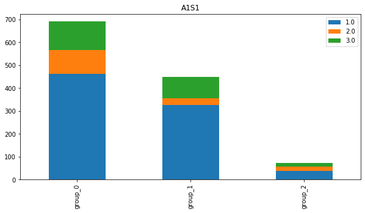


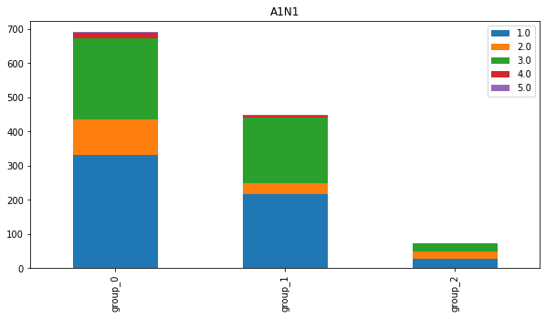


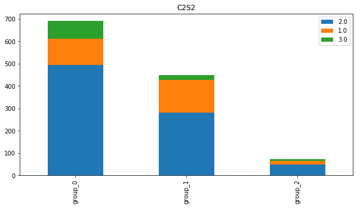


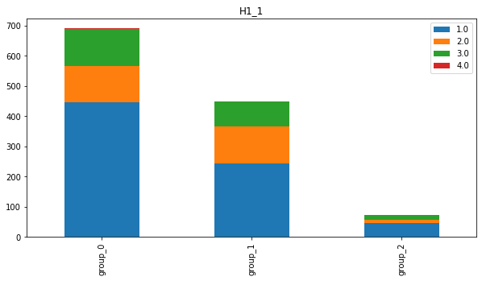


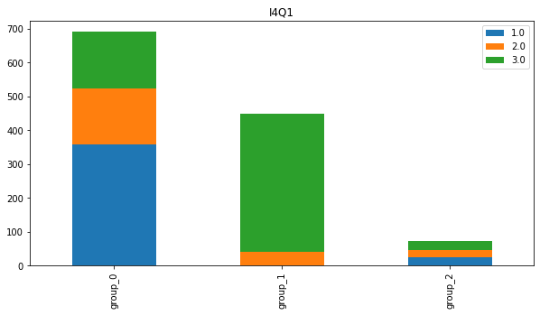


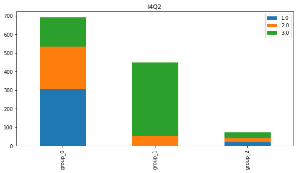


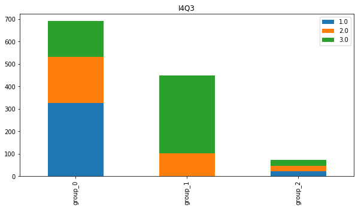


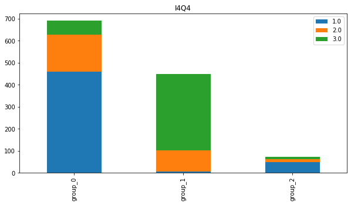


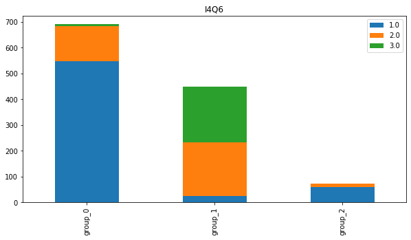


```python
bar_chart('H4_1')
```


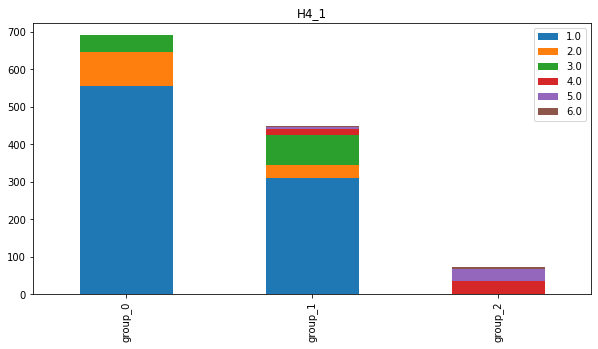


사업화추진 애로요인

0그룹 : 돈문제가 가장 많고, 기술 -> 경쟁 순 

1그룹 : 돈문제가 가장 많고, 경쟁 -> 기술 순 

2그룹 : 원료문제, 인력문제 비슷하고, 기타 순


```python
bar_chart('I4Q1')
```


기획단계 자금지원 필요성 (1.있으면 좋고 없어도 soso, 2. 보통 , 3. 필요함)

0그룹 : 1번 응답이 가장 많고, 2,3 번 비슷

1그룹 : 3번 응답이 가장많고, 2번 응답 순

2그룹 : 균일하게 분포되어 있음

** I4Q2, I4Q3 그래프도 위와 거의 동일


```python
bar_chart('I4Q4')
```


기술개발 세제 지원 (1.있으면 좋고 없어도 soso, 2. 보통 , 3. 필요함)

0그룹 : 1번 응답이 가장 많고, 2,3 번 순으로 나타남

1그룹 : 3번 응답이 가장 많고, 2번 순

2그룹 : 1번 응답이 가장많음


```python
bar_chart('I4Q5')
```


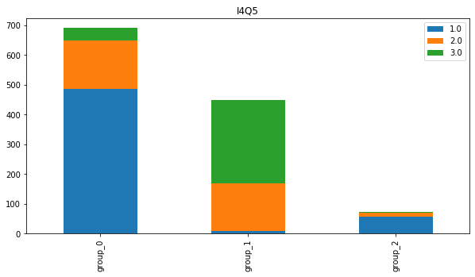


기술개발 판로 지원 (1.있으면 좋고 없어도 soso, 2. 보통 , 3. 필요함)

0그룹 : 1번 응답이 가장 많고, 2,3번 순으로 나타남

1그룹 : 3번 응답이 가장 많고, 2,1번 순으로 나타남

2그룹 : 1번 응답이 가장많음


```python
bar_chart('I4Q6')
```


기술개발 인력 지원 (1.있으면 좋고 없어도 soso, 2. 보통 , 3. 필요함)

0그룹 : 1번 응답이 가장 많고, 2번 순으로 나타남, 3번 거의 없음

1그룹 : 2번, 3번 응답 비슷하고, 1번 순

2그룹 : 1번 응답이 가장 많음


```python
bar_chart('I4Q7')
```


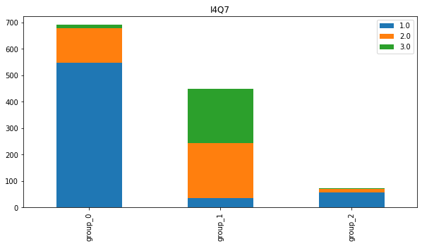


기술개발 정보 지원 (1.있으면 좋고 없어도 soso, 2. 보통 , 3. 필요함)

0그룹 : 1번 응답이 가장 많고, 2번 순으로 나타남, 3번 거의 없음

1그룹 : 2번, 3번 응답 비슷하고, 1번 순

2그룹 : 1번 응답이 가장 많음

전체적으로 봤을 때 

0번 그룹: 애로요인에서는 '돈'을 선택했지만, 지원을 원하는 부분에서는 1번 응답(있으면 좋고 없어도 괜찮음)의 비율이 높음 --> 기업자체 능력이 있는 그룹이라고 생각할 수 있지 않을까?

1번 그룹 : 애로요인에서 돈, 지원 부분에서도 가장 필요성을 어필하는 그룹

2번 그룹 : 애로요인에서 0번 그룹과 1번 그룹에서 볼 수 없는 기타 부분을 많이 차지하고, 지원 부분 응답은 0번 그룹과 비슷한 양상을 보임

* 그룹별 지원 우선 순위 1->2->0 , 1번에게 우선 지원, 2번 에게는 애로요인에서 보인 응답을 보고 맞춤 지원, 0번은 소액 지원 이런 식으로 생각해보면 좋을 듯

# GMM


```python
def bar_chart(feature):
    group_0 = train[train['gmm_cluster']==0][feature].value_counts()
    group_1 = train[train['gmm_cluster']==1][feature].value_counts()
    group_2 = train[train['gmm_cluster']==2][feature].value_counts()
    df = pd.DataFrame([group_0,group_1,group_2])
    df.index = ['group_0','group_1','group_2']
    df.plot(kind='bar',stacked=True, figsize=(10,5), title = feature)
```


```python
features = ['A1S1','A1N1','C2S2','H1_1','H4_1','I4Q1','I4Q2','I4Q3','I4Q4','I4Q5','I4Q6','I4Q7']
```


```python
for i in features:
    bar_chart(i)
```


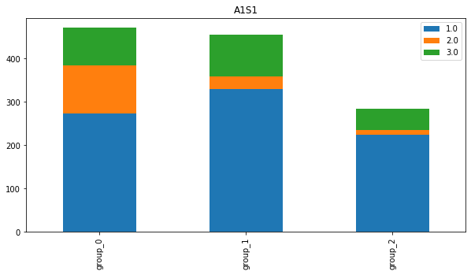


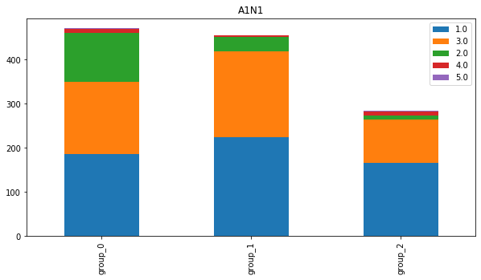


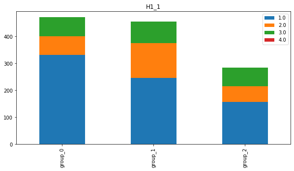


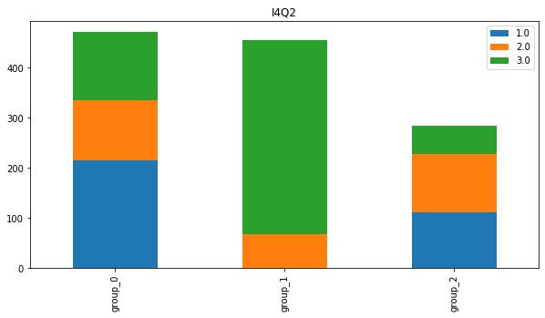


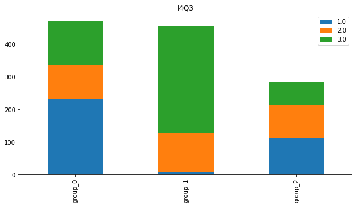


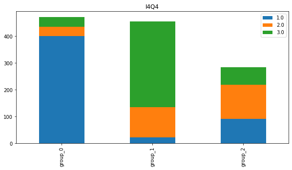


```python
bar_chart('A1N1')
```


기술개발목적 (1.시장확대형, 2.다양성확대형, 3.개선형, 4. 인력형, 5.기타)

0그룹 : 1번 응답, 2번 응답 비슷, 3번 응답 순

1그룹 : 1번 응답, 2번 응답 비슷 

2그룹 : 1번 응답, 2번 응답 순


```python
bar_chart('C2S2')
```


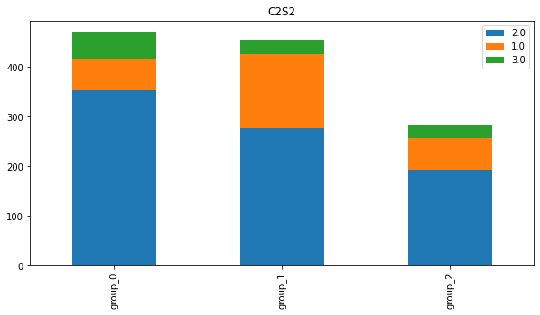


향후 1년간 중점 투자계획 (1.제품개발, 2.기존개선, 3.신공정개발)

0그룹 : 1번 응답이 많고, 2번, 3번 응답 비슷

1그룹 : 1번 응답이 많고, 2번, 3번 순 

2그룹 : 1번 응답이 많고, 2번, 3번 순 


```python
bar_chart('H4_1')
```


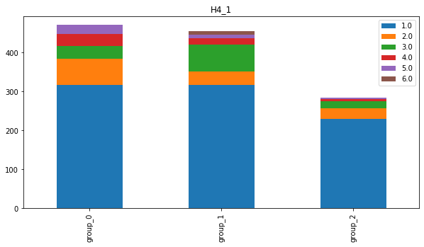


사업화추진 애로요인

0그룹 : 돈문제가 가장 많고, 기술 -> 경쟁=원료=인력 

1그룹 : 돈문제가 가장 많고, 경쟁 -> 기술 -> 원료=인력 

2그룹 : 돈문제가 가장 많고, 기술 -> 경쟁 -> 원료 -> 인력


```python
bar_chart('I4Q1')
```


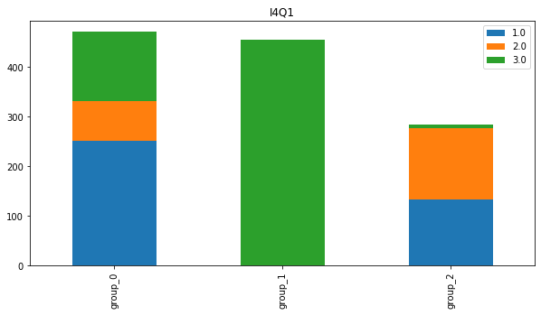


기획단계 자금지원 필요성 (1.있으면 좋고 없어도 soso, 2. 보통 , 3. 필요함)

0그룹 : 1번 응답이 가장 많고, 3 -> 2

1그룹 : 3번 응답이 대부분

2그룹 : 1,2 비슷 3번 거의 없음

** I4Q2, I4Q3 그래프도 위와 거의 동일


```python
bar_chart('I4Q2')
```


개발단계 자금지원 필요성 (1.있으면 좋고 없어도 soso, 2. 보통 , 3. 필요함)

0그룹 : 1번 응답이 가장 많고, 3 -> 2

1그룹 : 3번 응답이 대부분 -> 2번 응답

2그룹 : 1,2 비슷 -> 3번 응답

** I4Q3 그래프도 위와 거의 동일


```python
bar_chart('I4Q4')
```


기술개발 세제 지원 (1.있으면 좋고 없어도 soso, 2. 보통 , 3. 필요함)

0그룹 : 1번 응답이 가장 많고, 2,3 번 순으로 나타남

1그룹 : 3번 응답이 가장 많고, 2번 순

2그룹 : 2번 응답 -> 1번 -> 3번 순


```python
bar_chart('I4Q5')
```


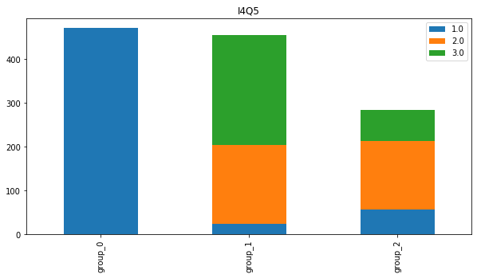


기술개발 판로 지원 (1.있으면 좋고 없어도 soso, 2. 보통 , 3. 필요함)

0그룹 : 1번 응답이 가장 많음

1그룹 : 3번 응답이 가장 많고, 2,1번 순으로 나타남

2그룹 : 2번 응답이 가장 많고, 3 -> 1번 순


```python
bar_chart('I4Q6')
```


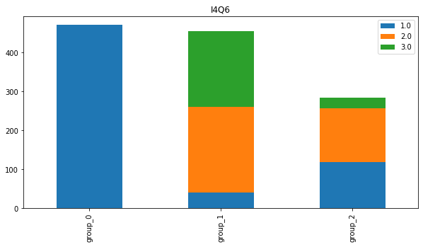


기술개발 인력 지원 (1.있으면 좋고 없어도 soso, 2. 보통 , 3. 필요함)

0그룹 : 1번 응답이 가장 많음

1그룹 : 2번 응답과 3번 응답이 비슷, 1번 순

2그룹 : 2번 응답이 가장많고, 1번 순


```python
bar_chart('I4Q7')
```


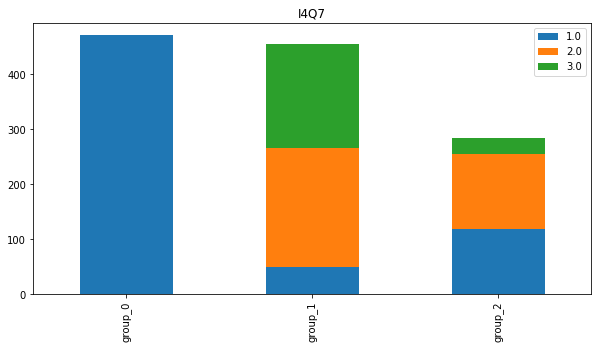


기술개발 정보 지원 (1.있으면 좋고 없어도 soso, 2. 보통 , 3. 필요함)

0그룹 : 1번 응답이 가장 많음

1그룹 : 2번이 가장 많고, 3번 -> 1번순

2그룹 : 2번이 가장 많고, 1번 -> 3번순

전체적으로 봤을 때 

0번 그룹: 애로요인에서는 '돈'을 선택했지만, 지원을 원하는 부분에서는 1번 응답(있으면 좋고 없어도 괜찮음)의 비율이 높음 --> 기업자체 능력이 있는 그룹이라고 생각할 수 있지 않을까?

1번 그룹 : 애로요인에서 돈, 지원 부분에서도 가장 필요성을 어필하는 그룹

2번 그룹 : 애로요인에서 돈, 지원 부분 응답은 0번 그룹과 비슷한 양상을 보임 (보통의 비율이 더 높음)

* 그룹별 지원 우선 순위 1->2->0 , 1번에게 우선 지원, 2번 에게는 애로요인에서 보인 응답을 보고 맞춤 지원, 0번은 소액 지원 이런 식으로 생각해보면 좋을 듯

# Dummy  PCA GMM


```python
def bar_chart(feature):
    group_0 = train[train['dummy_pca_gmm']==0][feature].value_counts()
    group_1 = train[train['dummy_pca_gmm']==1][feature].value_counts()
    group_2 = train[train['dummy_pca_gmm']==2][feature].value_counts()
    df = pd.DataFrame([group_0,group_1,group_2])
    df.index = ['group_0','group_1','group_2']
    df.plot(kind='bar',stacked=True, figsize=(10,5), title = feature)
```


```python
features = ['A1S1','A1N1','C2S2','H1_1','H4_1','I4Q1','I4Q2','I4Q3','I4Q4','I4Q5','I4Q6','I4Q7']
```


```python
for i in features:
    bar_chart(i)
```


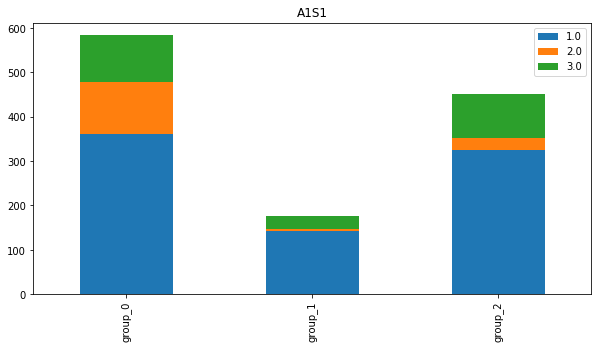


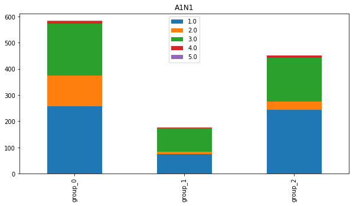


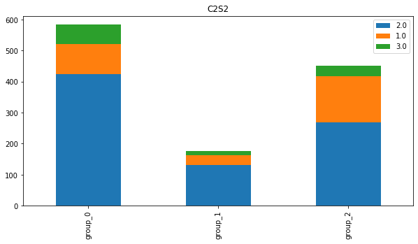


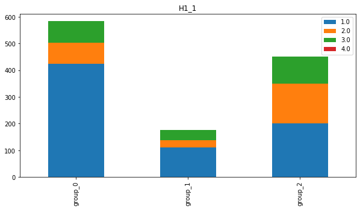


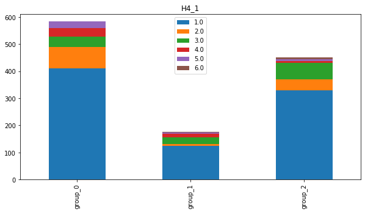


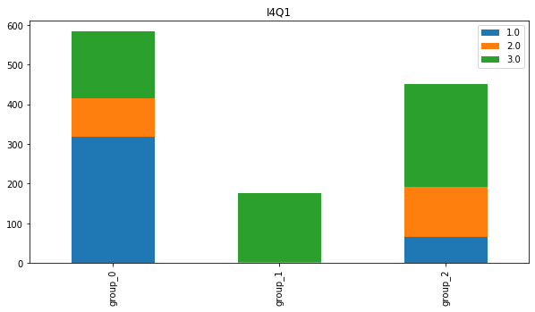


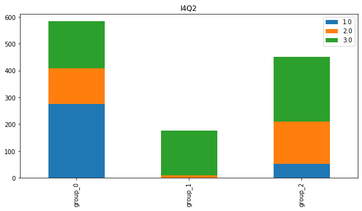


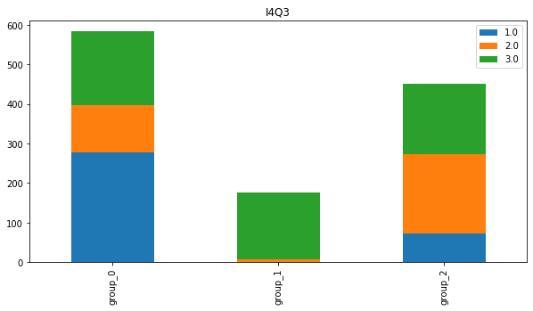


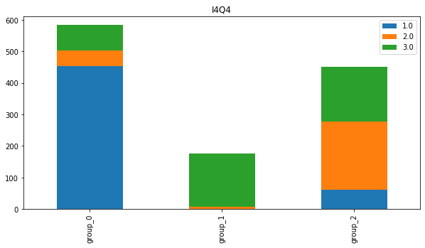


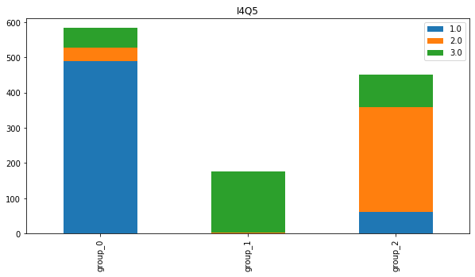


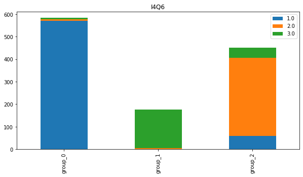


전체적으로 봤을 때 모든 그룹은 시장확대&개선에 중점을 둠

0번 그룹: 애로요인에서 돈, 지원 부분을 거의 필요로 하지 않는 그룹

1번 그룹: 애로요인에서 돈, 지원부분을 가장 필요로 하는 그룹

2번 그룹 : 애로요인에서 돈, 지원 부분을 별로 필요로 하지 않는 그룹

* 그룹별 지원 우선 순위 1->2->0 , 1번에게 우선 지원, 2번 에게는 애로요인에서 보인 응답을 보고 맞춤 지원, 0번은 다른 지원 방식을 선택.

# Dummy + PCA + AGG


```python
def bar_chart(feature):
    group_0 = train[train['dummy_pca_agg']==0][feature].value_counts()
    group_1 = train[train['dummy_pca_agg']==1][feature].value_counts()
    group_2 = train[train['dummy_pca_agg']==2][feature].value_counts()
    df = pd.DataFrame([group_0,group_1,group_2])
    df.index = ['group_0','group_1','group_2']
    df.plot(kind='bar',stacked=True, figsize=(10,5), title = feature)
```


```python
features = ['A1S1','A1N1','C2S2','H1_1','H4_1','I4Q1','I4Q2','I4Q3','I4Q4','I4Q5','I4Q6','I4Q7']
```


```python
for i in features:
    bar_chart(i)
```


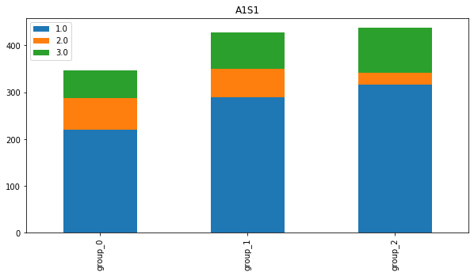


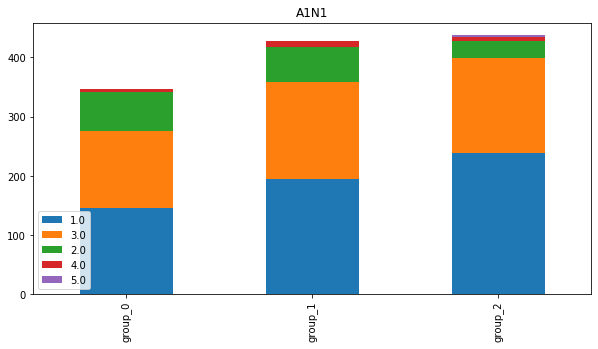


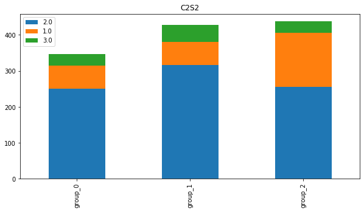


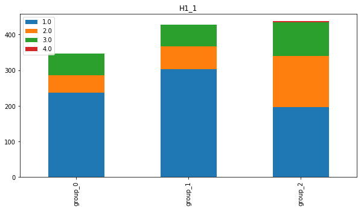


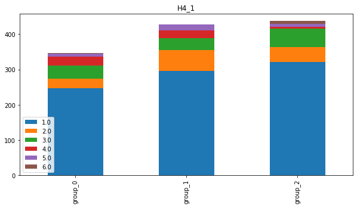


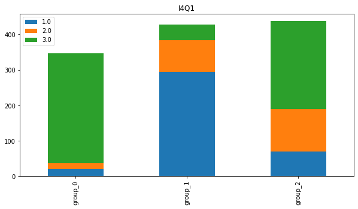


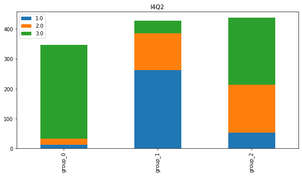


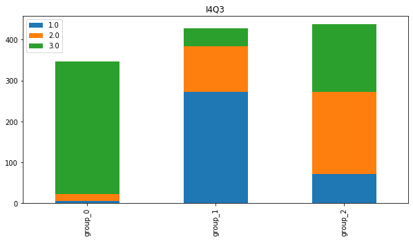


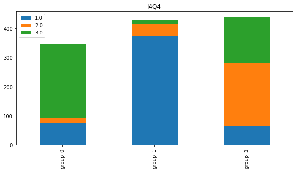


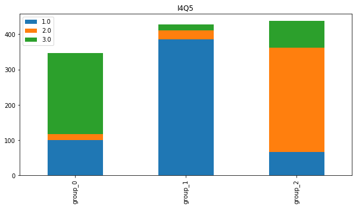


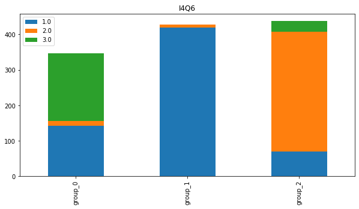


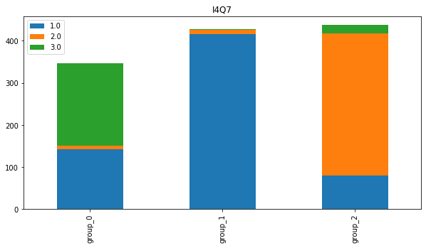


```python
bar_chart('H1_1')
```


자체기술개발 애로요인 (1.돈문제, 2.기술부족, 3.인력부족)

0그룹 : 1번 응답 가장 많고, 3번 -> 2번 순

1그룹 : 1번 응답 가장 많고, 3번=2번

2그룹 : 1번 응답 = 2번, 3번 순 (돈* 기술)

전체적으로 봤을 때 

0번 그룹: 애로요인에서 돈, 지원 부분에서도 가장 필요성을 어필하는 그룹

1번 그룹 : 애로요인에서 돈, 지원 부분에서는 별로 필요함을 못 느끼는 그룹

2번 그룹 : 애로요인에서 돈, 지원 부분 응답은 0번 0번 그룹과 1번 그룹의 중간

* 그룹별 지원 우선 순위 0->2->1 , 0번에게 우선 지원(자금 지원), 2번 에게는 애로요인에서 보인 응답을 보고 맞춤 지원(기술적인 부분을 더 지원), 1번은 소액 지원 이런 식으로 생각해보면 좋을 듯
