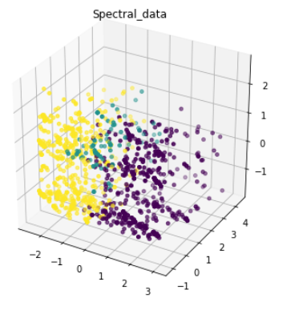
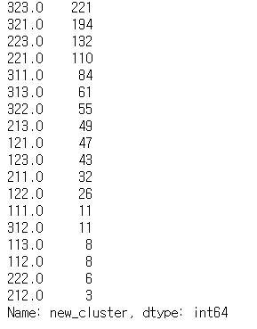

# 0430_conference

## 규민

> **코드통합**
>
> 가장 높은 실루엣 지수 보이는 클러스터 모델 선별

### 코드통합

- 코드 통합을 위한 `data`, `function`, `model`, `n_cluster`, `pca`등 은 `0430/kyumin/코드통합참고문서.md` 에 명시

- `Spectral + dummy` 모델선정

- 결과 시각화

  

### Idea

```txt
#Spectral+dummy 군집이 가장 좋은 효과를 보이는 이유
 1.Spectral은 PCA가 기본으로 설정됨.
 2.범주형 자료인만큼 더미의 효과 보인다.
```


----------------------

## 인영

> 예측 모델 사전조사

- 로지스틱 회귀모형

### Idea

```
#0 or 1로 나뉠 로지스틱 회귀모형 추천
```


--------

## 동석

> 최종 군집화 : 18가지

- `군집화` + `사업영역` + `기업성장도` 를 통한 18개 모델 추출

- 최종 결과 기업 분포

  

### Idea

```

```


---------

## ★팀아이디어★

### 해야할것

- 규민

  - 코드 통합

- 동석

  - 군집별 특성 알아오기
  
- 인영

  - 기업지원 후 성장도를 알수 있는 지표 찾아오기
  
  

- #### 참고사이트 및 문서

  - `**Scikit learn 공식문서**`
    - https://scikit-learn.org/stable/user_guide.html

  - 군집 모델평가

    - https://woolulu.tistory.com/50
    - http://blog.naver.com/PostView.nhn?blogId=ssdyka&logNo=221283224907&redirect=Dlog&widgetTypeCall=true&directAccess=false
    - 성능비교(코드잇어서 보면좋음)
      - https://blog.naver.com/a_aaaaaa/221154717813
    - 실루엣계수 / Dunn index 개념
      - [https://ratsgo.github.io/machine%20learning/2017/04/16/clustering/
