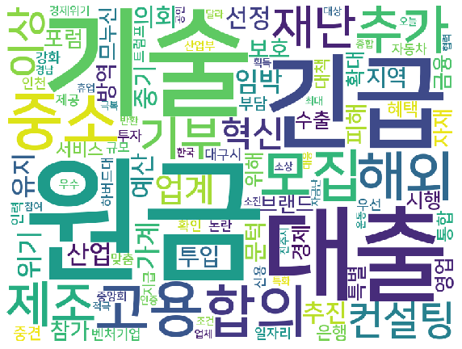

# 0506

## **팀 회의**

데이티의 다양성을 위해 실태조사를 이용한 예측 모델링?

> 선정, 문턱, 원금, 가계, 무분별, 자금난, 위기, 재난, 제조, 자영업, 피해 , 부담, 임박, 경제위기, 위기, 조건, 긴급, 부담, 휴업, 자체휴업, 일자리 , 정부, 기업, 지원 , 중소기업, 정부지원, 기술, 유지, 인력, 예산 , 대출, 고용, 은행

### 참고문서

> - Machine Learning-Based Financial Statement Analysis
>   - https://papers.ssrn.com/sol3/papers.cfm?abstract_id=3520684
> - 재무변수와 주가를 결합한 상호저축은행의 부실예측모형
>   - https://papers.ssrn.com/sol3/papers.cfm?abstract_id=3019704