```python
import pandas as pd
import numpy as np
from pandas import DataFrame, Series
from matplotlib import pyplot as plt
```


```python
train = pd.read_csv('기술통계19_1.csv')
```


```python
train=train.dropna(how='all',axis=1)
```


```python
n=[]
for col in train.columns:
    n.append(col)

n
```


    ['global_id',
     'A1S1',
     'A1S2',
     'A1N1',
     'A1N2',
     'A2S1',
     'A2S2',
     'A4S1',
     'A4S2',
     'A4S3',
     'C1S0',
     'C1S1',
     'C1S2',
     'C1S3',
     'C1S4',
     'C1S5',
     'C1S6',
     'C1S7',
     'C1S8',
     'C1S9',
     'C1S10',
     'C1S11',
     'C1S12',
     'A3S1',
     'A3Q1',
     'A3S2',
     'A3Q2',
     'A3S3',
     'A3Q3',
     'A3S4',
     'A3Q4',
     'A3S4N',
     'A3Q4N',
     'A3S5',
     'A3Q5',
     'A3S6',
     'A6Q6',
     'A3P1',
     'A3P2',
     'A3P3',
     'A3P4',
     'A3P5',
     'A3P6',
     'A3P7',
     'CN1',
     'CN2',
     'CN3',
     'C2S1',
     'C2S2',
     'PEOAM',
     'PEOAF',
     'PEOAT',
     'PEOBM',
     'PEOBF',
     'PEOBT',
     'PEOCM',
     'PEOCF',
     'PEOCT',
     'PEOTM',
     'PEOTF',
     'PEOTOT',
     'B2S1M',
     'B2S1F',
     'B2S1T',
     'B2S2M',
     'B2S2F',
     'B2S2T',
     'B2S3M',
     'B2S3F',
     'B2S3',
     'B3S1M',
     'B3S1F',
     'B3S1',
     'B3S2M',
     'B3S2F',
     'B3S2',
     'B3S3M',
     'B3S3F',
     'B3S3',
     'B3S4M',
     'B3S4F',
     'B3S4',
     'B3S5M',
     'B3S5F',
     'B3S5',
     'B3S6M',
     'B3S6F',
     'B3S6',
     'B4N1M',
     'B4N1F',
     'B4N1',
     'B4N2M',
     'B4N2F',
     'B4N2',
     'B4N3M',
     'B4N3F',
     'B4N3',
     'B4N4M',
     'B4N4F',
     'B4N4',
     'B4N5M',
     'B4N5F',
     'B4N5',
     'B4N6M',
     'B4N6F',
     'B4N6',
     'B4S81M',
     'B4S81F',
     'B4S81T',
     'B4S83M',
     'B4S83F',
     'B4S83T',
     'B4S85M',
     'B4S85F',
     'B4S85T',
     'B4S87M',
     'B4S87F',
     'B4S87T',
     'B4S89M',
     'B4S89F',
     'B4S89',
     'B5N1',
     'B5N2',
     'B5N3',
     'B5N4',
     'B5N5',
     'B5N6',
     'B4S82',
     'B4S84',
     'B4S86',
     'B4S88A',
     'B4S88B',
     'B4S90',
     'B6N1',
     'B6N2',
     'B6N3',
     'B6N4',
     'B6N5',
     'B6N6',
     'B1',
     'B5',
     'B9N1',
     'B9N2',
     'B9N3',
     'B9N4',
     'B9N5',
     'B9N6']


```python
train['A1S1'].value_counts()
```


    1    2348
    3     398
    4     370
    5     356
    2     224
    6     100
    7       4
    Name: A1S1, dtype: int64


```python
def bar_chart(feature):
    df_1 = train[feature].value_counts()
    df = pd.DataFrame(df_1)
    df.plot(kind='barh', stacked=True, figsize=(10,5), title = feature)
```


```python
# 기술개발 활동 및 투자현황
list = [ 'A1S1',
 'A1S2',
 'A1N1',
 'A1N2',
 'A2S1',
 'A2S2',
 'A4S1',
 'A4S2',
 'A4S3',
 'A3S1',
 'A3Q1',
 'A3S2',
 'A3Q2',
 'A3S3',
 'A3Q3',
 'A3S4',
 'A3Q4',
 'A3S4N',
 'A3Q4N',
 'A3S5',
 'A3Q5',
 'A3S6',
 'A6Q6',
 'A3P1',
 'A3P2',
 'A3P3',
 'A3P4',
 'A3P5',
 'A3P6',
 'A3P7',
 'CN1',
 'C2S1',
 'C2S2',
 'B1',
 'B5',
 'B9N1',
 'B9N2',
 'B9N3',
 'B9N4',
 'B9N5',
 'B9N6'
]
```


```python
for i in list:
    bar_chart(i)
```


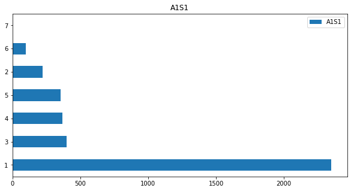


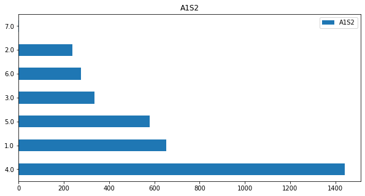


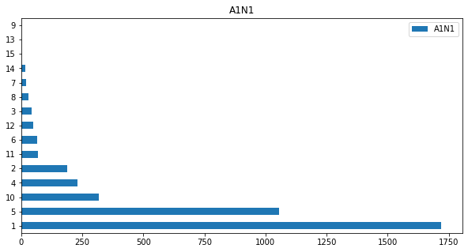


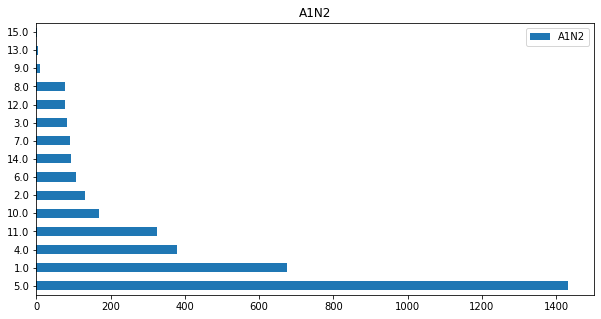


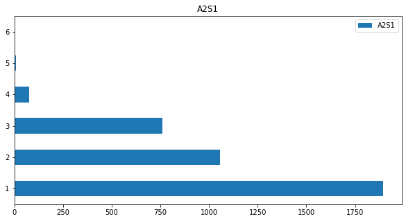


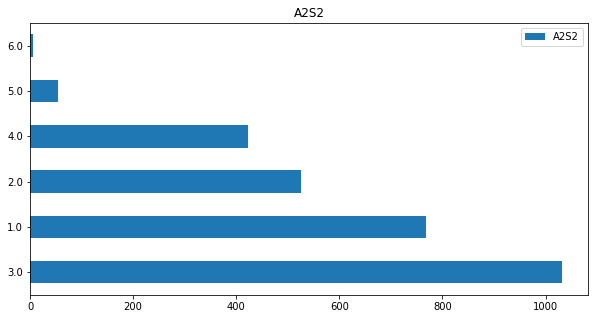


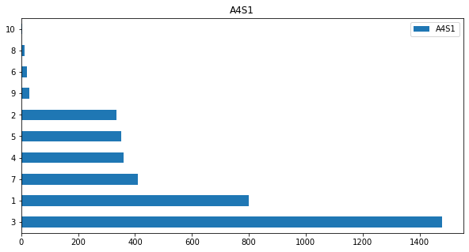


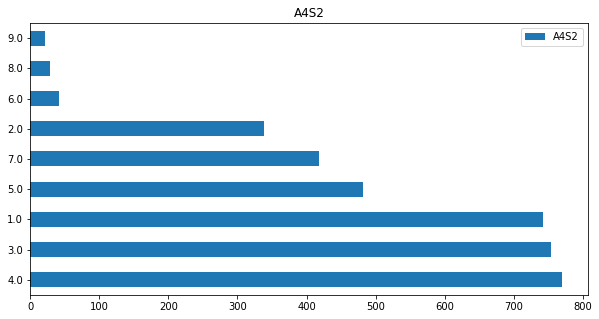


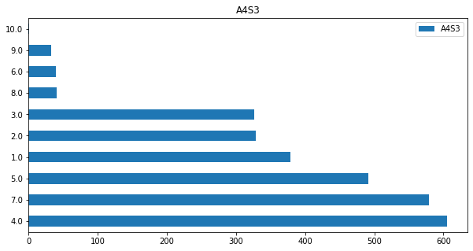


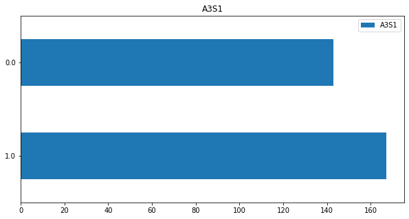


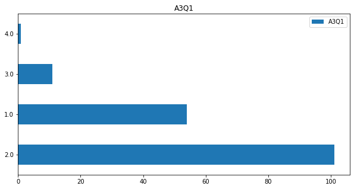


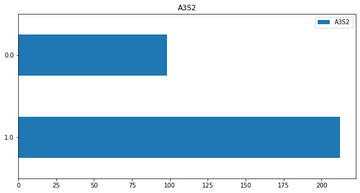


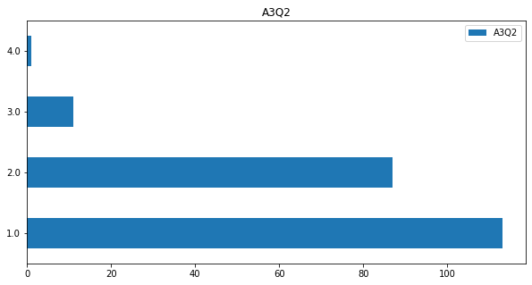


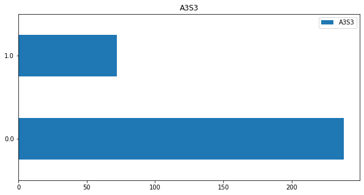


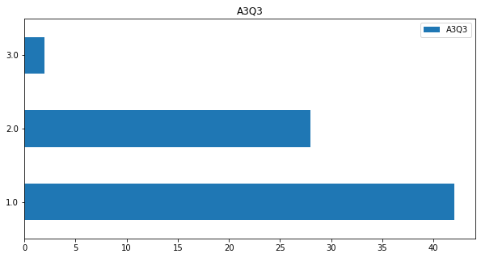


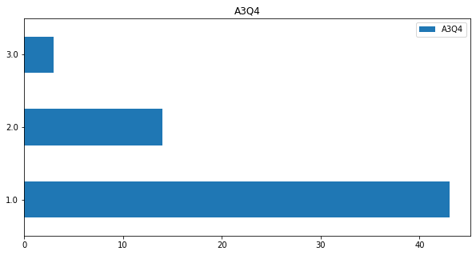


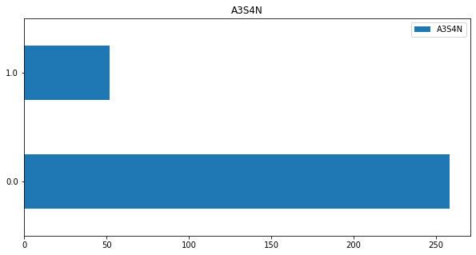


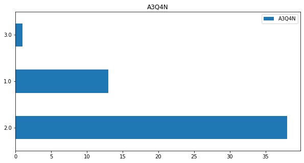


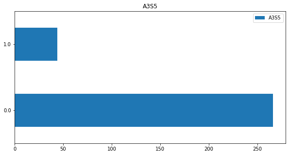


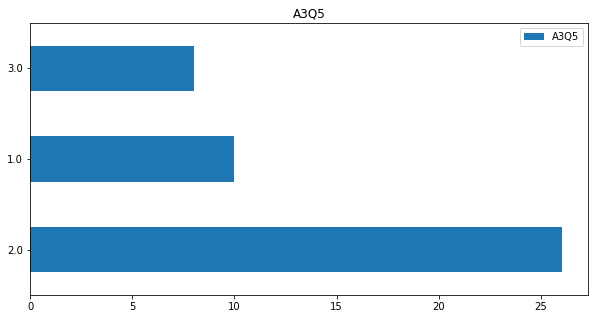


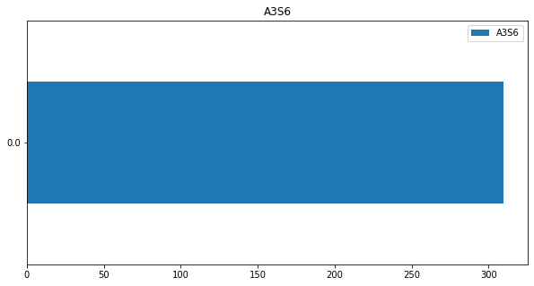


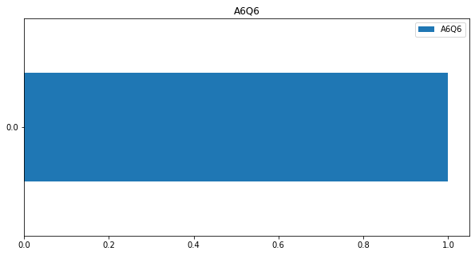


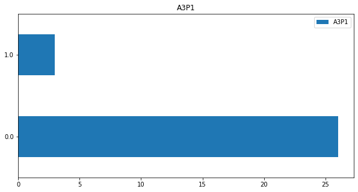


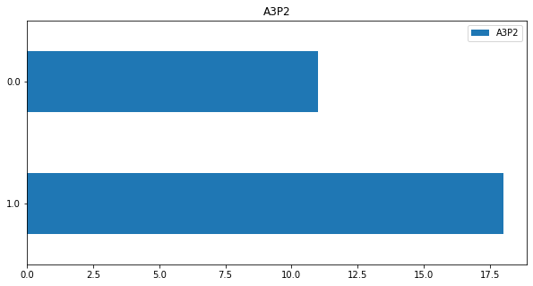


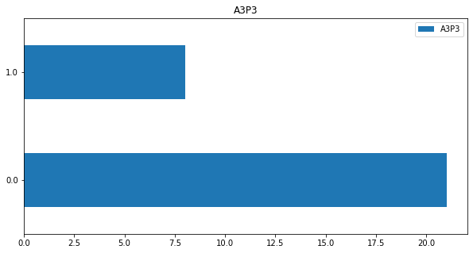


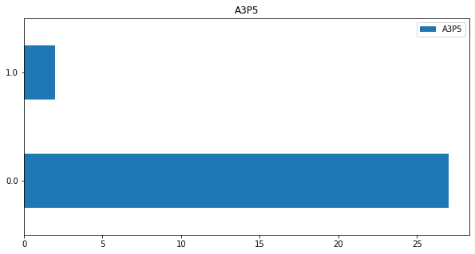


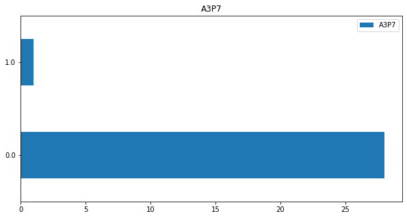


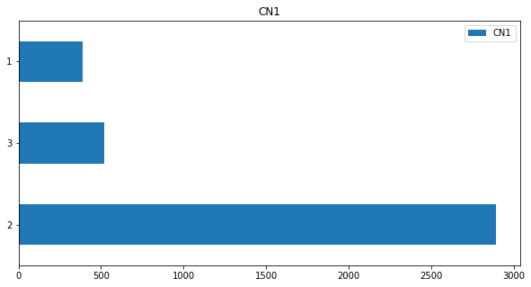


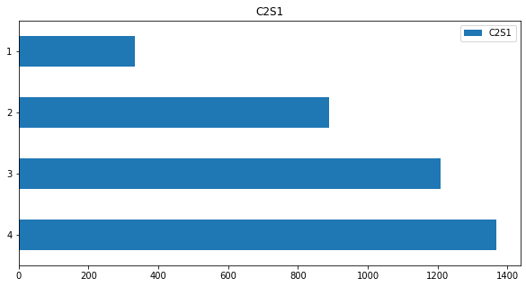


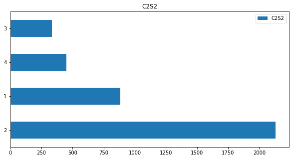


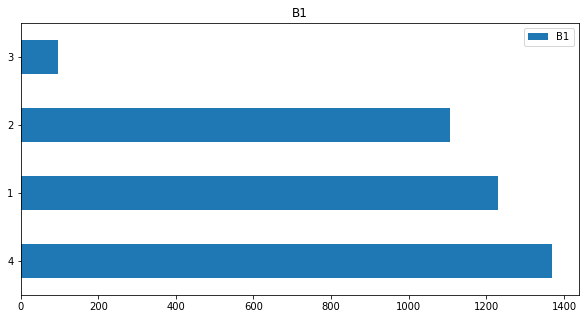


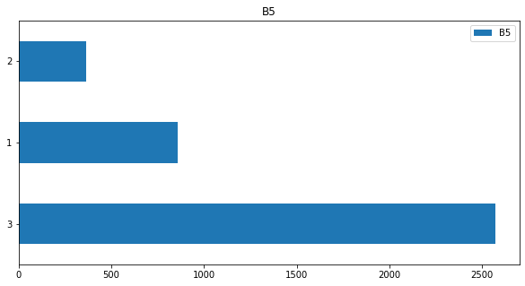


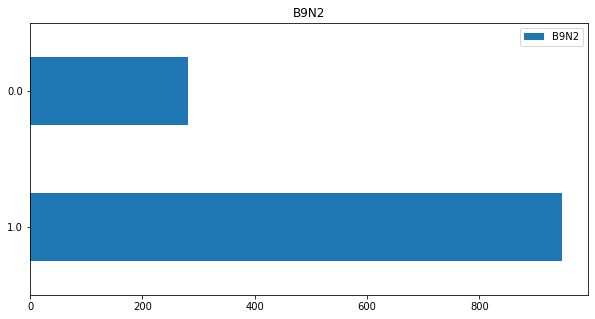


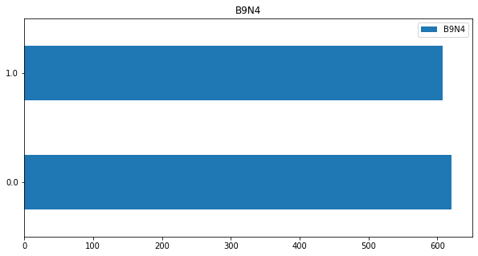


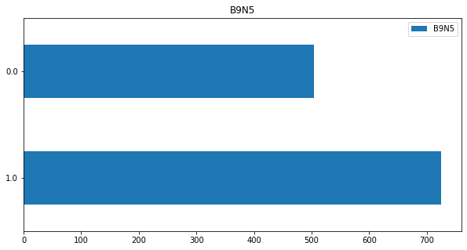


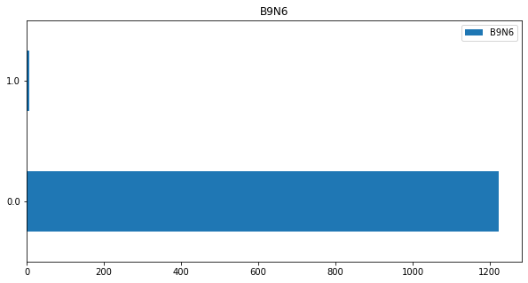


```python

```


```python

```
