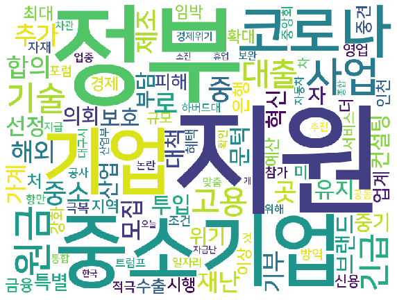

# 중소기업 정부지원 크롤링

- 출처: https://search.naver.com/search.naver?where=news&sm=tab_jum&query=%EC%A4%91%EC%86%8C%EA%B8%B0%EC%97%85+%EC%A0%95%EB%B6%80%EC%A7%80%EC%9B%90

## 크롤링 전 확인

- naver.com/robots.txt -> 이상 무

- 저작권 확인하기


```python
import pandas as pd
# request를 통해 웹사이트의 정보와 내용을 불러온다
import requests
# request로 가져온 웹사이트의 html 태그를 파싱
from bs4 import BeautifulSoup as bs
import random
import time
#대량 데이터 처리시 진행 상황 표시
from tqdm import tqdm, trange
#정규표현식
import re
```


```python
titles = []
articles = []
def crawler(cluster_rank, start):
    try:

        base_url = f'https://search.naver.com/search.naver?&where=news&query=%EC%A4%91%EC%86%8C%EA%B8%B0%EC%97%85%20%EC%A0%95%EB%B6%80%EC%A7%80%EC%9B%90&sm=tab_pge&sort=0&photo=0&field=0&reporter_article=&pd=0&ds=&de=&docid=&nso=so:r,p:all,a:all&mynews=0&cluster_rank={cluster_rank}&start={start}&refresh_start=0'
        response = requests.get(base_url)

        if response.status_code == 200:
            soup = bs(response.text, 'html.parser')
            title = soup.find_all(class_ = '_sp_each_title')
            for i in title:
                titles.append(i.attrs['title'])
                
                new_url = i.attrs['href']
                print(new_url)
                response = requests.get(new_url)
                if response.status_code == 200:
                    soup = bs(response.text, 'html.parser')
                    article = soup.find_all(class_= 'viewBox')
                    articles.append(article)
                    
        
    except:
        return articles
```


```python
print(crawler(35,1))
```

    http://www.segye.com/content/html/2020/05/06/20200506508626.html?OutUrl=naver
    [[<article class="viewBox" itemprop="articleBody">
    <p>중소기업중앙회 회장단과 이사, 지역회장단이 신종 코로나바이러스 감염증(코로나19) 확산으로 어려움을 겪는 취약계층을 돕고 정부 재정 부담을 완화하기 위해 정부 긴급재난지원금 자발적 기부에 동참한다.</p>
    <p> </p>
    <p>김기문 중기중앙회장은 6일 서울 여의도 중소기업중앙회에서 ‘제32회 중소기업주간’ 기자간담회를 열고 “중소기업이 어려울 때마다 정부와 국민의 지원이 있었고, 이젠 중소기업이 화답할 차례”라며 이 같이 밝혔다. 김 회장은 “기부금은 고용보험기금에 적립돼 고용불안 해소와 일자리안정을 위한 재원으로 사용된다”며 “조금이나마 상황이 나은 기업을 시작으로 기부 운동을 전국적으로 확대하겠다”고 말했다.</p>
    <figure class="image">
    
    <figcaption style="text-align:left;word-break: break-all; word-wrap: break-word;width:500px;">
                  김기문 중소기업중앙회장. 중기중앙회 제공 
                </figcaption>
    </figure>
    <p>중기중앙회는 이날 ‘중소기업의 더 밝은 내일 대한민국의 행복한 미래’라는 주제로 11~15일 열리는 ‘제32회 중소기업주간’ 계획도 밝혔다. 올해 중소기업주간은 코로나19 상황을 고려해 대규모 인원 밀집 행사를 최소화하고, 중소기업 위기 극복을 위해 준비된 40개 행사만 진행할 예정이다.</p>
    <p> </p>
    <p>첫 행사는 11일 서울 여의도 중기중앙회 회관 1층에서 열리는 ‘중소기업 납품단가조정위원회’ 출범식이다. 이는 지난해 12월 당·정·청이 중기중앙회에 납품단가 조정협의권을 부여한 데 따른 것으로, 중기중앙회는 이 자리에서 납품단가 조정을 위한 민간 자율조정기구를 발족한다. 이어 12일에는 ‘민생경제회복을 위한 중소기업계 캠페인 추진’ 발대식이 열리고, 13일에는 ‘중소기업협동조합, 중소기업 간 연결의 힘으로’ 포럼에서 중소기업협동조합의 중소기업자 지위 인정 방안이 발표된다.</p>
    <p> </p>
    <p>이우중 기자 lol@segye.com</p>
    <p>[ⓒ 세계일보 &amp; Segye.com, 무단전재 및 재배포 금지]</p>
    </article>]]
    http://news.heraldcorp.com/view.php?ud=20200506000132
    [[<article class="viewBox" itemprop="articleBody">
    <p>중소기업중앙회 회장단과 이사, 지역회장단이 신종 코로나바이러스 감염증(코로나19) 확산으로 어려움을 겪는 취약계층을 돕고 정부 재정 부담을 완화하기 위해 정부 긴급재난지원금 자발적 기부에 동참한다.</p>
    <p> </p>
    <p>김기문 중기중앙회장은 6일 서울 여의도 중소기업중앙회에서 ‘제32회 중소기업주간’ 기자간담회를 열고 “중소기업이 어려울 때마다 정부와 국민의 지원이 있었고, 이젠 중소기업이 화답할 차례”라며 이 같이 밝혔다. 김 회장은 “기부금은 고용보험기금에 적립돼 고용불안 해소와 일자리안정을 위한 재원으로 사용된다”며 “조금이나마 상황이 나은 기업을 시작으로 기부 운동을 전국적으로 확대하겠다”고 말했다.</p>
    <figure class="image">
    
    <figcaption style="text-align:left;word-break: break-all; word-wrap: break-word;width:500px;">
                  김기문 중소기업중앙회장. 중기중앙회 제공 
                </figcaption>
    </figure>
    <p>중기중앙회는 이날 ‘중소기업의 더 밝은 내일 대한민국의 행복한 미래’라는 주제로 11~15일 열리는 ‘제32회 중소기업주간’ 계획도 밝혔다. 올해 중소기업주간은 코로나19 상황을 고려해 대규모 인원 밀집 행사를 최소화하고, 중소기업 위기 극복을 위해 준비된 40개 행사만 진행할 예정이다.</p>
    <p> </p>
    <p>첫 행사는 11일 서울 여의도 중기중앙회 회관 1층에서 열리는 ‘중소기업 납품단가조정위원회’ 출범식이다. 이는 지난해 12월 당·정·청이 중기중앙회에 납품단가 조정협의권을 부여한 데 따른 것으로, 중기중앙회는 이 자리에서 납품단가 조정을 위한 민간 자율조정기구를 발족한다. 이어 12일에는 ‘민생경제회복을 위한 중소기업계 캠페인 추진’ 발대식이 열리고, 13일에는 ‘중소기업협동조합, 중소기업 간 연결의 힘으로’ 포럼에서 중소기업협동조합의 중소기업자 지위 인정 방안이 발표된다.</p>
    <p> </p>
    <p>이우중 기자 lol@segye.com</p>
    <p>[ⓒ 세계일보 &amp; Segye.com, 무단전재 및 재배포 금지]</p>
    </article>], []]
    http://news.mt.co.kr/mtview.php?no=2020050609323315175
    [[<article class="viewBox" itemprop="articleBody">
    <p>중소기업중앙회 회장단과 이사, 지역회장단이 신종 코로나바이러스 감염증(코로나19) 확산으로 어려움을 겪는 취약계층을 돕고 정부 재정 부담을 완화하기 위해 정부 긴급재난지원금 자발적 기부에 동참한다.</p>
    <p> </p>
    <p>김기문 중기중앙회장은 6일 서울 여의도 중소기업중앙회에서 ‘제32회 중소기업주간’ 기자간담회를 열고 “중소기업이 어려울 때마다 정부와 국민의 지원이 있었고, 이젠 중소기업이 화답할 차례”라며 이 같이 밝혔다. 김 회장은 “기부금은 고용보험기금에 적립돼 고용불안 해소와 일자리안정을 위한 재원으로 사용된다”며 “조금이나마 상황이 나은 기업을 시작으로 기부 운동을 전국적으로 확대하겠다”고 말했다.</p>
    <figure class="image">
    
    <figcaption style="text-align:left;word-break: break-all; word-wrap: break-word;width:500px;">
                  김기문 중소기업중앙회장. 중기중앙회 제공 
                </figcaption>
    </figure>
    <p>중기중앙회는 이날 ‘중소기업의 더 밝은 내일 대한민국의 행복한 미래’라는 주제로 11~15일 열리는 ‘제32회 중소기업주간’ 계획도 밝혔다. 올해 중소기업주간은 코로나19 상황을 고려해 대규모 인원 밀집 행사를 최소화하고, 중소기업 위기 극복을 위해 준비된 40개 행사만 진행할 예정이다.</p>
    <p> </p>
    <p>첫 행사는 11일 서울 여의도 중기중앙회 회관 1층에서 열리는 ‘중소기업 납품단가조정위원회’ 출범식이다. 이는 지난해 12월 당·정·청이 중기중앙회에 납품단가 조정협의권을 부여한 데 따른 것으로, 중기중앙회는 이 자리에서 납품단가 조정을 위한 민간 자율조정기구를 발족한다. 이어 12일에는 ‘민생경제회복을 위한 중소기업계 캠페인 추진’ 발대식이 열리고, 13일에는 ‘중소기업협동조합, 중소기업 간 연결의 힘으로’ 포럼에서 중소기업협동조합의 중소기업자 지위 인정 방안이 발표된다.</p>
    <p> </p>
    <p>이우중 기자 lol@segye.com</p>
    <p>[ⓒ 세계일보 &amp; Segye.com, 무단전재 및 재배포 금지]</p>
    </article>], [], []]
    http://www.newsfreezone.co.kr/news/articleView.html?idxno=232273
    [[<article class="viewBox" itemprop="articleBody">
    <p>중소기업중앙회 회장단과 이사, 지역회장단이 신종 코로나바이러스 감염증(코로나19) 확산으로 어려움을 겪는 취약계층을 돕고 정부 재정 부담을 완화하기 위해 정부 긴급재난지원금 자발적 기부에 동참한다.</p>
    <p> </p>
    <p>김기문 중기중앙회장은 6일 서울 여의도 중소기업중앙회에서 ‘제32회 중소기업주간’ 기자간담회를 열고 “중소기업이 어려울 때마다 정부와 국민의 지원이 있었고, 이젠 중소기업이 화답할 차례”라며 이 같이 밝혔다. 김 회장은 “기부금은 고용보험기금에 적립돼 고용불안 해소와 일자리안정을 위한 재원으로 사용된다”며 “조금이나마 상황이 나은 기업을 시작으로 기부 운동을 전국적으로 확대하겠다”고 말했다.</p>
    <figure class="image">
    
    <figcaption style="text-align:left;word-break: break-all; word-wrap: break-word;width:500px;">
                  김기문 중소기업중앙회장. 중기중앙회 제공 
                </figcaption>
    </figure>
    <p>중기중앙회는 이날 ‘중소기업의 더 밝은 내일 대한민국의 행복한 미래’라는 주제로 11~15일 열리는 ‘제32회 중소기업주간’ 계획도 밝혔다. 올해 중소기업주간은 코로나19 상황을 고려해 대규모 인원 밀집 행사를 최소화하고, 중소기업 위기 극복을 위해 준비된 40개 행사만 진행할 예정이다.</p>
    <p> </p>
    <p>첫 행사는 11일 서울 여의도 중기중앙회 회관 1층에서 열리는 ‘중소기업 납품단가조정위원회’ 출범식이다. 이는 지난해 12월 당·정·청이 중기중앙회에 납품단가 조정협의권을 부여한 데 따른 것으로, 중기중앙회는 이 자리에서 납품단가 조정을 위한 민간 자율조정기구를 발족한다. 이어 12일에는 ‘민생경제회복을 위한 중소기업계 캠페인 추진’ 발대식이 열리고, 13일에는 ‘중소기업협동조합, 중소기업 간 연결의 힘으로’ 포럼에서 중소기업협동조합의 중소기업자 지위 인정 방안이 발표된다.</p>
    <p> </p>
    <p>이우중 기자 lol@segye.com</p>
    <p>[ⓒ 세계일보 &amp; Segye.com, 무단전재 및 재배포 금지]</p>
    </article>], [], [], []]
    http://news.kbs.co.kr/news/view.do?ncd=4439807&ref=A
    [[<article class="viewBox" itemprop="articleBody">
    <p>중소기업중앙회 회장단과 이사, 지역회장단이 신종 코로나바이러스 감염증(코로나19) 확산으로 어려움을 겪는 취약계층을 돕고 정부 재정 부담을 완화하기 위해 정부 긴급재난지원금 자발적 기부에 동참한다.</p>
    <p> </p>
    <p>김기문 중기중앙회장은 6일 서울 여의도 중소기업중앙회에서 ‘제32회 중소기업주간’ 기자간담회를 열고 “중소기업이 어려울 때마다 정부와 국민의 지원이 있었고, 이젠 중소기업이 화답할 차례”라며 이 같이 밝혔다. 김 회장은 “기부금은 고용보험기금에 적립돼 고용불안 해소와 일자리안정을 위한 재원으로 사용된다”며 “조금이나마 상황이 나은 기업을 시작으로 기부 운동을 전국적으로 확대하겠다”고 말했다.</p>
    <figure class="image">
    
    <figcaption style="text-align:left;word-break: break-all; word-wrap: break-word;width:500px;">
                  김기문 중소기업중앙회장. 중기중앙회 제공 
                </figcaption>
    </figure>
    <p>중기중앙회는 이날 ‘중소기업의 더 밝은 내일 대한민국의 행복한 미래’라는 주제로 11~15일 열리는 ‘제32회 중소기업주간’ 계획도 밝혔다. 올해 중소기업주간은 코로나19 상황을 고려해 대규모 인원 밀집 행사를 최소화하고, 중소기업 위기 극복을 위해 준비된 40개 행사만 진행할 예정이다.</p>
    <p> </p>
    <p>첫 행사는 11일 서울 여의도 중기중앙회 회관 1층에서 열리는 ‘중소기업 납품단가조정위원회’ 출범식이다. 이는 지난해 12월 당·정·청이 중기중앙회에 납품단가 조정협의권을 부여한 데 따른 것으로, 중기중앙회는 이 자리에서 납품단가 조정을 위한 민간 자율조정기구를 발족한다. 이어 12일에는 ‘민생경제회복을 위한 중소기업계 캠페인 추진’ 발대식이 열리고, 13일에는 ‘중소기업협동조합, 중소기업 간 연결의 힘으로’ 포럼에서 중소기업협동조합의 중소기업자 지위 인정 방안이 발표된다.</p>
    <p> </p>
    <p>이우중 기자 lol@segye.com</p>
    <p>[ⓒ 세계일보 &amp; Segye.com, 무단전재 및 재배포 금지]</p>
    </article>], [], [], [], []]
    https://www.sedaily.com/NewsView/1Z2MT8TE95
    [[<article class="viewBox" itemprop="articleBody">
    <p>중소기업중앙회 회장단과 이사, 지역회장단이 신종 코로나바이러스 감염증(코로나19) 확산으로 어려움을 겪는 취약계층을 돕고 정부 재정 부담을 완화하기 위해 정부 긴급재난지원금 자발적 기부에 동참한다.</p>
    <p> </p>
    <p>김기문 중기중앙회장은 6일 서울 여의도 중소기업중앙회에서 ‘제32회 중소기업주간’ 기자간담회를 열고 “중소기업이 어려울 때마다 정부와 국민의 지원이 있었고, 이젠 중소기업이 화답할 차례”라며 이 같이 밝혔다. 김 회장은 “기부금은 고용보험기금에 적립돼 고용불안 해소와 일자리안정을 위한 재원으로 사용된다”며 “조금이나마 상황이 나은 기업을 시작으로 기부 운동을 전국적으로 확대하겠다”고 말했다.</p>
    <figure class="image">
    
    <figcaption style="text-align:left;word-break: break-all; word-wrap: break-word;width:500px;">
                  김기문 중소기업중앙회장. 중기중앙회 제공 
                </figcaption>
    </figure>
    <p>중기중앙회는 이날 ‘중소기업의 더 밝은 내일 대한민국의 행복한 미래’라는 주제로 11~15일 열리는 ‘제32회 중소기업주간’ 계획도 밝혔다. 올해 중소기업주간은 코로나19 상황을 고려해 대규모 인원 밀집 행사를 최소화하고, 중소기업 위기 극복을 위해 준비된 40개 행사만 진행할 예정이다.</p>
    <p> </p>
    <p>첫 행사는 11일 서울 여의도 중기중앙회 회관 1층에서 열리는 ‘중소기업 납품단가조정위원회’ 출범식이다. 이는 지난해 12월 당·정·청이 중기중앙회에 납품단가 조정협의권을 부여한 데 따른 것으로, 중기중앙회는 이 자리에서 납품단가 조정을 위한 민간 자율조정기구를 발족한다. 이어 12일에는 ‘민생경제회복을 위한 중소기업계 캠페인 추진’ 발대식이 열리고, 13일에는 ‘중소기업협동조합, 중소기업 간 연결의 힘으로’ 포럼에서 중소기업협동조합의 중소기업자 지위 인정 방안이 발표된다.</p>
    <p> </p>
    <p>이우중 기자 lol@segye.com</p>
    <p>[ⓒ 세계일보 &amp; Segye.com, 무단전재 및 재배포 금지]</p>
    </article>], [], [], [], [], []]
    https://www.hankyung.com/economy/article/2020050564211
    [[<article class="viewBox" itemprop="articleBody">
    <p>중소기업중앙회 회장단과 이사, 지역회장단이 신종 코로나바이러스 감염증(코로나19) 확산으로 어려움을 겪는 취약계층을 돕고 정부 재정 부담을 완화하기 위해 정부 긴급재난지원금 자발적 기부에 동참한다.</p>
    <p> </p>
    <p>김기문 중기중앙회장은 6일 서울 여의도 중소기업중앙회에서 ‘제32회 중소기업주간’ 기자간담회를 열고 “중소기업이 어려울 때마다 정부와 국민의 지원이 있었고, 이젠 중소기업이 화답할 차례”라며 이 같이 밝혔다. 김 회장은 “기부금은 고용보험기금에 적립돼 고용불안 해소와 일자리안정을 위한 재원으로 사용된다”며 “조금이나마 상황이 나은 기업을 시작으로 기부 운동을 전국적으로 확대하겠다”고 말했다.</p>
    <figure class="image">
    
    <figcaption style="text-align:left;word-break: break-all; word-wrap: break-word;width:500px;">
                  김기문 중소기업중앙회장. 중기중앙회 제공 
                </figcaption>
    </figure>
    <p>중기중앙회는 이날 ‘중소기업의 더 밝은 내일 대한민국의 행복한 미래’라는 주제로 11~15일 열리는 ‘제32회 중소기업주간’ 계획도 밝혔다. 올해 중소기업주간은 코로나19 상황을 고려해 대규모 인원 밀집 행사를 최소화하고, 중소기업 위기 극복을 위해 준비된 40개 행사만 진행할 예정이다.</p>
    <p> </p>
    <p>첫 행사는 11일 서울 여의도 중기중앙회 회관 1층에서 열리는 ‘중소기업 납품단가조정위원회’ 출범식이다. 이는 지난해 12월 당·정·청이 중기중앙회에 납품단가 조정협의권을 부여한 데 따른 것으로, 중기중앙회는 이 자리에서 납품단가 조정을 위한 민간 자율조정기구를 발족한다. 이어 12일에는 ‘민생경제회복을 위한 중소기업계 캠페인 추진’ 발대식이 열리고, 13일에는 ‘중소기업협동조합, 중소기업 간 연결의 힘으로’ 포럼에서 중소기업협동조합의 중소기업자 지위 인정 방안이 발표된다.</p>
    <p> </p>
    <p>이우중 기자 lol@segye.com</p>
    <p>[ⓒ 세계일보 &amp; Segye.com, 무단전재 및 재배포 금지]</p>
    </article>], [], [], [], [], [], []]
    http://news.mk.co.kr/newsRead.php?no=459433&year=2020
    [[<article class="viewBox" itemprop="articleBody">
    <p>중소기업중앙회 회장단과 이사, 지역회장단이 신종 코로나바이러스 감염증(코로나19) 확산으로 어려움을 겪는 취약계층을 돕고 정부 재정 부담을 완화하기 위해 정부 긴급재난지원금 자발적 기부에 동참한다.</p>
    <p> </p>
    <p>김기문 중기중앙회장은 6일 서울 여의도 중소기업중앙회에서 ‘제32회 중소기업주간’ 기자간담회를 열고 “중소기업이 어려울 때마다 정부와 국민의 지원이 있었고, 이젠 중소기업이 화답할 차례”라며 이 같이 밝혔다. 김 회장은 “기부금은 고용보험기금에 적립돼 고용불안 해소와 일자리안정을 위한 재원으로 사용된다”며 “조금이나마 상황이 나은 기업을 시작으로 기부 운동을 전국적으로 확대하겠다”고 말했다.</p>
    <figure class="image">
    
    <figcaption style="text-align:left;word-break: break-all; word-wrap: break-word;width:500px;">
                  김기문 중소기업중앙회장. 중기중앙회 제공 
                </figcaption>
    </figure>
    <p>중기중앙회는 이날 ‘중소기업의 더 밝은 내일 대한민국의 행복한 미래’라는 주제로 11~15일 열리는 ‘제32회 중소기업주간’ 계획도 밝혔다. 올해 중소기업주간은 코로나19 상황을 고려해 대규모 인원 밀집 행사를 최소화하고, 중소기업 위기 극복을 위해 준비된 40개 행사만 진행할 예정이다.</p>
    <p> </p>
    <p>첫 행사는 11일 서울 여의도 중기중앙회 회관 1층에서 열리는 ‘중소기업 납품단가조정위원회’ 출범식이다. 이는 지난해 12월 당·정·청이 중기중앙회에 납품단가 조정협의권을 부여한 데 따른 것으로, 중기중앙회는 이 자리에서 납품단가 조정을 위한 민간 자율조정기구를 발족한다. 이어 12일에는 ‘민생경제회복을 위한 중소기업계 캠페인 추진’ 발대식이 열리고, 13일에는 ‘중소기업협동조합, 중소기업 간 연결의 힘으로’ 포럼에서 중소기업협동조합의 중소기업자 지위 인정 방안이 발표된다.</p>
    <p> </p>
    <p>이우중 기자 lol@segye.com</p>
    <p>[ⓒ 세계일보 &amp; Segye.com, 무단전재 및 재배포 금지]</p>
    </article>], [], [], [], [], [], [], []]
    http://www.fnnews.com/news/202005051800498892
    [[<article class="viewBox" itemprop="articleBody">
    <p>중소기업중앙회 회장단과 이사, 지역회장단이 신종 코로나바이러스 감염증(코로나19) 확산으로 어려움을 겪는 취약계층을 돕고 정부 재정 부담을 완화하기 위해 정부 긴급재난지원금 자발적 기부에 동참한다.</p>
    <p> </p>
    <p>김기문 중기중앙회장은 6일 서울 여의도 중소기업중앙회에서 ‘제32회 중소기업주간’ 기자간담회를 열고 “중소기업이 어려울 때마다 정부와 국민의 지원이 있었고, 이젠 중소기업이 화답할 차례”라며 이 같이 밝혔다. 김 회장은 “기부금은 고용보험기금에 적립돼 고용불안 해소와 일자리안정을 위한 재원으로 사용된다”며 “조금이나마 상황이 나은 기업을 시작으로 기부 운동을 전국적으로 확대하겠다”고 말했다.</p>
    <figure class="image">
    
    <figcaption style="text-align:left;word-break: break-all; word-wrap: break-word;width:500px;">
                  김기문 중소기업중앙회장. 중기중앙회 제공 
                </figcaption>
    </figure>
    <p>중기중앙회는 이날 ‘중소기업의 더 밝은 내일 대한민국의 행복한 미래’라는 주제로 11~15일 열리는 ‘제32회 중소기업주간’ 계획도 밝혔다. 올해 중소기업주간은 코로나19 상황을 고려해 대규모 인원 밀집 행사를 최소화하고, 중소기업 위기 극복을 위해 준비된 40개 행사만 진행할 예정이다.</p>
    <p> </p>
    <p>첫 행사는 11일 서울 여의도 중기중앙회 회관 1층에서 열리는 ‘중소기업 납품단가조정위원회’ 출범식이다. 이는 지난해 12월 당·정·청이 중기중앙회에 납품단가 조정협의권을 부여한 데 따른 것으로, 중기중앙회는 이 자리에서 납품단가 조정을 위한 민간 자율조정기구를 발족한다. 이어 12일에는 ‘민생경제회복을 위한 중소기업계 캠페인 추진’ 발대식이 열리고, 13일에는 ‘중소기업협동조합, 중소기업 간 연결의 힘으로’ 포럼에서 중소기업협동조합의 중소기업자 지위 인정 방안이 발표된다.</p>
    <p> </p>
    <p>이우중 기자 lol@segye.com</p>
    <p>[ⓒ 세계일보 &amp; Segye.com, 무단전재 및 재배포 금지]</p>
    </article>], [], [], [], [], [], [], []]
    


```python
from bs4 import BeautifulSoup
import requests
from konlpy.tag import Twitter
from collections import Counter
from wordcloud import WordCloud
import matplotlib.pyplot as plt
 
search_word = "중소기업 정부지원"  # 검색어 지정
title_list = []
 
def get_titles(start_num, end_num):
    #start_num ~ end_num까지 크롤링
    while 1:
        if start_num > end_num:
            break
        print(start_num)
 
        url = 'https://search.naver.com/search.naver?where=news&sm=tab_jum&query={}&start={}'.format(search_word,start_num)
        req = requests.get(url)
 
        # 정상적인 request 확인
        if req.ok:
            html = req.text
            soup = BeautifulSoup(html, 'html.parser')
 
            # 뉴스제목 뽑아오기
            titles = soup.select(
                'ul.type01 > li > dl > dt > a'
            )
 
            # list에 넣어준다
            for title in titles:
                title_list.append(title['title'])
        start_num += 10
    print(title_list)
 
def make_wordcloud(word_count):
    twitter = Twitter()
 
    sentences_tag = []
    #형태소 분석하여 리스트에 넣기
    for sentence in title_list:
        morph = twitter.pos(sentence)
        sentences_tag.append(morph)
        print(morph)
        print('-' * 30)
 
    print(sentences_tag)
    print('\n' * 3)
 
    noun_adj_list = []
    #명사와 형용사만 구분하여 이스트에 넣기
    for sentence1 in sentences_tag:
        for word, tag in sentence1:
            if tag in ['Noun', 'Adjective']:
                noun_adj_list.append(word)
 
    #형태소별 count
    counts = Counter(noun_adj_list)
    tags = counts.most_common(word_count)
    print(tags)
 
    #wordCloud생성
    #한글꺠지는 문제 해결하기위해 font_path 지정
    wc = WordCloud(font_path='C:/Users/user/Documents/R/win-library/3.6/crosstalk/lib/bootstrap/fonts/NanumSquareB.ttf', background_color='white', width=800, height=600)
    print(dict(tags))
    cloud = wc.generate_from_frequencies(dict(tags))
    plt.figure(figsize=(10, 8))
    plt.axis('off')
    plt.imshow(cloud)
    plt.show()
 
if __name__ == '__main__':
    #1~200번게시글 까지 크롤링
    get_titles(1,200)
 
    #단어 30개까지 wordcloud로 출력
    make_wordcloud(100)

```

    1
    11
    21
    31
    41
    51
    61
    71
    81
    91
    101
    111
    121
    131
    141
    151
    161
    171
    181
    191
    ['중소기업중앙회, 긴급재난지원금 자발적 기부운동에 동참', '중소기업계, 긴급재난지원금 기부 동참', '방산기업 60개사에 컨설팅 비용 최대 3000만원 지원', '중견련, 중견기업 사업 전환 지원..컨설팅 참여기업 모집', '방사청, 중소기업에 최대 3000만 원 지원... 약 60개 기업 선정', '한국중소벤처포럼, 2020 코로나19 방역기자재 전시회 참가 기업 모집', '정부지원단, 6~7일 코로나19 치료제·백신 개발기업 심층 상담 진행', '정부지원금 소진…자력 구제 움직임 활발', '코로나 계기로 ‘벤처’ 주목도 높이는 정부…“적극 지원하겠다”', "정부 지원에 가려진 '부실대출' 뇌관", "정부 지원에 가려진 '부실대출' 뇌관", '수성구 1인창조기업지원센터, 최우수 S등급 쾌거', '중소기업 "정부 지원조건 까다롭고 대상 너무 적다"', "펄케어 냉온 초음파 갈바닉, 정부 지원 '브랜드K' 선정", '[단독] 정부사업인 척…中企 4500곳 등친 `먹튀 복지몰`', "기업 지원나선 한은 '도그마' 골머리", '한국중소벤처포럼, 2020 코로나19 방역기자재 전시회 참가 기업 모집', '한스코리아 ‘쿡시쌀국수’, 정부 지원 ‘브랜드 K’ 선정', '박영선 장관 "K바이오·브랜드K 활용해 유망 R&D 기업 적극 뒷받침"(종합)', '수출기업 셋 중 둘이 "코로나19로 사업차질"…산업硏 "2분기 더 암울"', "코로나 이전부터 건전성 악화했는데...銀 기업지원 '골머리'", "'고용유지' 중소기업에 휴업수당 90% 지원…오늘 시행", "대구 수성구 1인창조기업지원센터, 중기부 2019년 사업평가 '최우수'", 'AC(코로나 이후)…소상공인ㆍ중소기업 생존 전략은?', '\'자금난\' 수출 중소기업, "필요자금 반도 못 구해" 78%', '중소기업 "경비 축소·사업 구조조정만으로 버티고 있습니다"', '대기오염물질 배출 줄이는 보일러 장치 설치비, 정부가 90% 지원', '중기부, 해외규격인증 획득지원사업 2차 참여기업 모집', '[코로나19] 커들로 "정부 지원 효과적, 3차 중기 대출 필요"', '[코로나19 지원금 두고 이전투구] 기업들 “우리부터 살려라” 아우성', "코로나19에 막힌 하늘길… 치솟는 물류비에 경기도 내 수출 중소기업들 '속앓이", '하버드·쉐이크쉑 이어 대형호텔도 美정부 지원금 반환', "진주시, 경남 첫 '중소기업 고용유지 자부담' 절반 지원", '내가 받을 코로나 지원 궁금하다면, 오늘부터 ‘정부24’에서 한눈에', '중소벤처기업부의 창업지원사업 총 예산은 총 7,326억 원!', "오락가락 '기준' 없는 정부지원금...'공짜' 문화 위험천만", '[생생경제] "나에게 맞는 코로나 지원제도 어디서 찾을까" 정부24로!', '미 의회, 360조원 중소기업 추가지원 예산 합의 임박(종합)', "중소기업 '포용금융' 동반자…지역경제 활성화 기여", '[전문인칼럼] 코로나19 극복 위한 정부 수출입기업 지원', '뒤늦은 대응 제주 정부 재난지원금 지역화폐 지원 소외', '새만금중소기업진흥원, 산업단지 위기 극복 지원 올인', '“코로나 사태 겪으며 중앙정부 발상 뛰어넘는 지자체들 나와”', "제조기업 혁신기술 지원 '스케일업 기술사업화' 내년부터 시행", '정부, 청년긴급일자리 만들고 특수고용노동자 지원 확대', '마치 자체 예산 주는 것처럼… 대구시, 정부지원금 명칭 바꿔', '인천항만공사, 중소기업 기술보호 강화 나선다', 'IPA, 중소기업 기술보호 강화에 나선다', "올해 '존경받는 중소기업인' 찾는다", '코로나19에 휘청이는 중소 해외건설기업… “정부 지원책 확대 해야”', "'해고 대신 휴업' 중소기업 고용유지지원금, 90%까지 늘린다", '경사노위 "산재 국비지원 확대해 중소기업 우선 투자"', '므누신 "코로나19 지원 대출 200만불 이상 받는 기업 회계감사"', '전주시, 특별지원금 500억원 조성...지역중소기업과 소상공인 대상', '美정부 지원금 놓고 충돌한 트럼프-하버드대…"반납해야" VS "학생 지원"', '중소기업 고용유지지원금 75→90% 시행령 통과…5월 지급', "중소벤처포럼, '코로나19 방역기자재' 전시 참가社 모집", "진주시, '경남·진주형 정부 긴급 재난지원금' 전액 모든 가구에 지급", '[김호준의 中企탐구] 인공지능으로 도약하는 日 중소기업', '김포대, ‘대학연계 중소기업 인력양성사업’ 7년 연속 선정', '제조기업 혁신위해 2천억원 투입, R&D·기술사업화 지원', '중기부, 코로나피해 기업 우선지원..해외인증획득 사업 2차 모집', '美, 중소기업 위해 365조 더 쏟아붓는다…므누신 "합의 임박"', '"중소기업 해외출장 어려움 해결해 드립니다"', "대구시, '신중년 사업'으로 일자리와 지역 기업 동시 지원", "코로나 위기에 기업·자영업·가계대출 '역대급 증가'", '코로나19로 발묶인 해외건설현장…기업·정부 대응 과제는', '중소기업 지원 ‘급여보호 프로그램(PPP)’ VA 9.8%, MD 8.7% 승인', '자동차 업계 “정부 유동성 지원 없으면 코로나19로 붕괴"', '기업 99% "환경 규제만 말고 에코경영 지원정책 병행해야"', '무역업계, 정부에 ‘코로나19 피해 지원 긴급 건의서’ 제출', "(중기 '포스트코로나' 대비 시급)중기 10곳 중 4곳 자금난 우려…“정부, 과감한 선제적 금융지원 나서야”", '<재난지원금 논란>코로나 피해기업 稅징수 유예… 긴급 수의계약도 허용', "코로나19 정부지원사업 '한 눈에'…맞춤형 서비스 제공", '미국 코로나 긴급대출금, 최소 13개 기업 반환하기로', '[Live 중소기업] 클릭 한번으로 스마트산단 공유플랫폼 Smart K-Factory 협력업체 찾고 판로까지 OK', '은행, 중소기업·가계신용대출 문턱 낮춘다…정부 금융지원 여파', "10곳 중 2곳만 'U턴'…불러도 돌아오지 않는 기업들", 'WISET, 경력단절 여성·미취업자 채용기업에 인건비 지원', '"특별지원업종 지정되면 어떤 혜택이?"…정부지원 문턱 확 낮아져', '"특별지원업종 지정되면 어떤 혜택이?"…정부지원 문턱 확 낮아져', '코로나19 정부 지원혜택, ‘정부24’에서 확인하세요', '프리랜서·자영업 93만명에 최대 150만원 지원… 정부, 10조원 규모 고용대책 내놔', "중소벤처기업부, '착한 선결제 대국민 캠페인' 순항중", '중소기업 연구개발 능력 하락하고 있다', '정부의 통큰 지원, 중소·중견기업 2조규모 R&D 부담 던다', '중소기업 85% “코로나 경제위기 1년 이상 지속될 것”', '美대기업들, 중소기업 정부 지원금 ‘꿀꺽’ 논란', '트럼프 "코로나19 정부 지원금 받지마라" 압박에 하버드대 \'백기\'', '무협 "정부지원 조건에 미달하는 기업 많아…보완대책 마련해야"', '[기업이 살아야 경제가 산다⑤] "정부와 재계, 진심으로 손잡아야"', '제조기업 사업화 컨설팅, R&D 통합 지원 추진', '[위기의 면세점] 정부 지원서 `소외`…사업권 포기 속출', "중소기업중앙회, '2020 KBIZ 신임이사장 세미나' 개최", '<글로벌 포커스>“정부지원 더 받아달라” 쇄도… 워싱턴 로비업계 ‘코로나 호황’', '정부, 코로나19 위축 中企 수출 집중지원 나서', '430조원 규모 美 중소기업 긴급대출 2주 만에 소진', '車산업협회 "코로나19로 세계 자동차 공장 70% 멈춰···정부 지원 절실"', "중소기업 공동브랜드 '브랜드 K' 선정 품평회, 중기부 공동주관", '[차관동정] 손명수 차관, “항공사 고용안정·자구노력을 전제로 정부 지원 강화”', '"재난기본소득 등 각종 코로나19 정부 지원 궁금하시죠...정부24에 한눈에"', '美정부 지원금 놓고 충돌한 트럼프-하버드대…"반납해야" VS "학생 지원"', '중소기업 고용유지지원금 75→90% 시행령 통과…5월 지급', "중소벤처포럼, '코로나19 방역기자재' 전시 참가社 모집", '인천항만공사, 중소기업 기술보호 강화 나서', '산업부, 2021년부터 제조기업 R&D·기술사업화 지원에 2000억원 투입', '미 의회, 360조원 중소기업 추가지원 예산 합의 임박', '`중소기업 휴업수당 90%까지 지원` 오늘부터 시행', "진주시, '경남·진주형 정부 긴급 재난지원금' 전액 모든 가구에 지급", '[김호준의 中企탐구] 인공지능으로 도약하는 日 중소기업', '[김호준의 中企탐구] 인공지능으로 도약하는 日 중소기업', '김포대, ‘대학연계 중소기업 인력양성사업’ 7년 연속 선정', '제조기업 혁신위해 2천억원 투입, R&D·기술사업화 지원', '코로나에 떠는 중소기업들, 85%는 “경제위기 1년 이상 갈 것”', '중기부, 코로나피해 기업 우선지원..해외인증획득 사업 2차 모집', '美, 중소기업 위해 365조 더 쏟아붓는다…므누신 "합의 임박"', '"중소기업 해외출장 어려움 해결해 드립니다"', "'코로나19' 극복 위한 지원, '정부24'에서 확인하세요!", "대구시, '신중년 사업'으로 일자리와 지역 기업 동시 지원", '미 정부-의회, 360조원 중소기업 추가지원 예산안 조만간 합의할 듯', "대구시, '신중년 사업'으로 일자리와 지역 기업 동시 지원", '미 정부-의회, 360조원 중소기업 추가지원 예산안 조만간 합의할 듯', "각종 코로나19 정부 지원 궁금하면 '정부24'로", "코로나 위기에 기업·자영업·가계대출 '역대급 증가'", '코로나19로 발묶인 해외건설현장…기업·정부 대응 과제는', '중소기업 지원 ‘급여보호 프로그램(PPP)’ VA 9.8%, MD 8.7% 승인', '자동차 업계 “정부 유동성 지원 없으면 코로나19로 붕괴"', '제조기업 혁신기술 사업화 컨설팅․R&D 통합 지원 추진', '기업 99% "환경 규제만 말고 에코경영 지원정책 병행해야"', '인천항만공사, 중소기업 기술보호 적극 나선다', '인천항만공사, 중소기업 기술보호 적극 나선다', '무역업계, 정부에 ‘코로나19 피해 지원 긴급 건의서’ 제출', "(중기 '포스트코로나' 대비 시급)중기 10곳 중 4곳 자금난 우려…“정부, 과감한 선제적 금융지원 나서야”", '정부, 중소기업 해외출장 어려움 해결…베트남행 전세기 뜬다', '<재난지원금 논란>코로나 피해기업 稅징수 유예… 긴급 수의계약도 허용', '산업부, 제조기업 R&D·기술사업화 지원에 2000억원 투입', '[생생경제] "나에게 맞는 코로나 지원제도 어디서 찾을까" 정부24로!', '중소기업 85% "코로나19 여파 경제위기 1년 이상 지속" 예상', "코로나19 정부지원사업 '한 눈에'…맞춤형 서비스 제공", '미국 코로나 긴급대출금, 최소 13개 기업 반환하기로', '"美, 중소기업 추가 지원 3천억 달러 법안 곧 합의"', "'정부24'에서 코로나19 관련 정부 지원 맞춤형서비스 제공", '[Live 중소기업] 클릭 한번으로 스마트산단 공유플랫폼 Smart K-Factory 협력업체 찾고 판로까지 OK', '은행, 중소기업·가계신용대출 문턱 낮춘다…정부 금융지원 여파', "10곳 중 2곳만 'U턴'…불러도 돌아오지 않는 기업들", "중소기업 잘 키워 성과 나누는 '존경받는 기업인' 찾습니다", 'WISET, 경력단절 여성·미취업자 채용기업에 인건비 지원', '"특별지원업종 지정되면 어떤 혜택이?"…정부지원 문턱 확 낮아져', '코로나19 정부 지원혜택, ‘정부24’에서 확인하세요', '프리랜서·자영업 93만명에 최대 150만원 지원… 정부, 10조원 규모 고용대책 내놔', '은행들 2분기에 중소기업 대출 문턱 낮춘다', '프리랜서·자영업 93만명에 최대 150만원 지원… 정부, 10조원 규모 고용대책 내놔', "중소벤처기업부, '착한 선결제 대국민 캠페인' 순항중", '중소기업 연구개발 능력 하락하고 있다', '정부의 통큰 지원, 중소·중견기업 2조규모 R&D 부담 던다', '산업부, 우수 제조기업에 R&D·기술 지원…내년부터 2천억원 투입', '중소기업 85% “코로나 경제위기 1년 이상 지속될 것”', '美대기업들, 중소기업 정부 지원금 ‘꿀꺽’ 논란', '트럼프 "코로나19 정부 지원금 받지마라" 압박에 하버드대 \'백기\'', '무협 "정부지원 조건에 미달하는 기업 많아…보완대책 마련해야"', '무협 "정부지원 조건에 미달하는 기업 많아…보완대책 마련해야"', '[기업이 살아야 경제가 산다⑤] "정부와 재계, 진심으로 손잡아야"', '은행, 중소기업 가계신용 대출 문턱 낮아진다', '제조기업 사업화 컨설팅, R&D 통합 지원 추진', '[위기의 면세점] 정부 지원서 `소외`…사업권 포기 속출', "중소기업중앙회, '2020 KBIZ 신임이사장 세미나' 개최", '<글로벌 포커스>“정부지원 더 받아달라” 쇄도… 워싱턴 로비업계 ‘코로나 호황’', '정부, 코로나19 위축 中企 수출 집중지원 나서', '코로나19 관련 정부 지원 서비스 정보 ‘정부24’서 한 번에 확인하세요', '430조원 규모 美 중소기업 긴급대출 2주 만에 소진', '車산업협회 "코로나19로 세계 자동차 공장 70% 멈춰···정부 지원 절실"', "중소기업 공동브랜드 '브랜드 K' 선정 품평회, 중기부 공동주관", '[차관동정] 손명수 차관, “항공사 고용안정·자구노력을 전제로 정부 지원 강화”', '"車부품사 절반, 정부 지원 못받아…보완책 절실"', "연방의회, 360조원 중소기업 추가지원 예산 합의 '임박'", '"미 정부·의회, 코로나19 추가지원 590조원 예산안 합의"', "타이거컴퍼니-한국HR, '중소기업 조직문화 혁신' 위한 파트너십 체결", '중소기업중앙회 ‘2020 KBIZ 신임이사장 세미나’ 개최', '고용 유지한 기업 지원 확대, 면세점업 등 특별고용지원 업종 추가 검토', '文대통령 "기업 줄도산 막겠다"…긴급구호자금 100조 투입', '文대통령 "기업 줄도산 막겠다"…긴급구호자금 100조 투입', '은행, 중소기업·가계신용대출 심사 2분기 완화 예정', '김정욱 대구경북중소기업회장 인터뷰', "우수기술 중소기업 2천억 투자 '혁신기업' 키운다", '캐피탈사, 정부 유동성 지원에도 ‘돈맥경화’…돌파구 있을까?', '[경상시론]울산 중소기업이여 기술 경쟁력을 갖춰라', '산업부, 제조기업 혁신기술 사업화 컨설팅·R&D 통합 지원 추진', '정부, 공용 차량 조기 구입·공항 사용료 감면 연장…주력 산업 지원 대책 발표', '중소기업도 재택근무 확산…2월말부터 1만6천명 지원금 신청', '정부, 중기 R&D 비용 부담 2조 덜어준다…"연구인력 인건비 지원"', '美 598조원대 추가 부양책 하원 통과…중소기업·병원 지원(종합)', '대전·세종중기청, 코로나19 대비 중소기업 R&D 부담금 완화 특별지원', '인천시, 지방정부 최초 물류로봇 특화 육성 나서', '"줄도산 위기인데 정부 지원 제외…우린 버림받았다" 섬유산업의 탄식', "행안부, 코로나19 극복 '정부24' 맞춤형 정부지원 서비스", '은행, 중소기업·가계신용대출 심사 완화 전망', '정부 지원 사각지대…버려진 중견기업', '美 정부 "에너지 기업 지분 매입 고려" [글로벌 이슈5]', "정부 계속 돈 푼다는데…기업은 '돈가뭄' 비명", '정부, 고용유지지원금 확대....90%까지 부담키로']
    [('중소기업', 'Noun'), ('중앙회', 'Noun'), (',', 'Punctuation'), ('긴급', 'Noun'), ('재난', 'Noun'), ('지', 'Josa'), ('원금', 'Noun'), ('자발', 'Noun'), ('적', 'Suffix'), ('기부', 'Noun'), ('운동', 'Noun'), ('에', 'Josa'), ('동참', 'Noun')]
    ------------------------------
    [('중소기업', 'Noun'), ('계', 'Suffix'), (',', 'Punctuation'), ('긴급', 'Noun'), ('재난', 'Noun'), ('지', 'Josa'), ('원금', 'Noun'), ('기부', 'Noun'), ('동참', 'Noun')]
    ------------------------------
    [('방산', 'Noun'), ('기업', 'Noun'), ('60', 'Number'), ('개사', 'Noun'), ('에', 'Josa'), ('컨설팅', 'Noun'), ('비용', 'Noun'), ('최대', 'Noun'), ('3000만원', 'Number'), ('지원', 'Noun')]
    ------------------------------
    [('중견', 'Noun'), ('련', 'Noun'), (',', 'Punctuation'), ('중견', 'Noun'), ('기업', 'Noun'), ('사업', 'Noun'), ('전환', 'Noun'), ('지원', 'Noun'), ('..', 'Punctuation'), ('컨설팅', 'Noun'), ('참여', 'Noun'), ('기업', 'Noun'), ('모집', 'Noun')]
    ------------------------------
    [('방사청', 'Noun'), (',', 'Punctuation'), ('중소기업', 'Noun'), ('에', 'Josa'), ('최대', 'Noun'), ('3000만', 'Number'), ('원', 'Noun'), ('지원', 'Noun'), ('...', 'Punctuation'), ('약', 'Noun'), ('60', 'Number'), ('개', 'Noun'), ('기업', 'Noun'), ('선정', 'Noun')]
    ------------------------------
    [('한국', 'Noun'), ('중소', 'Noun'), ('벤', 'Verb'), ('처', 'Noun'), ('포럼', 'Noun'), (',', 'Punctuation'), ('2020', 'Number'), ('코로나', 'Noun'), ('19', 'Number'), ('방역', 'Noun'), ('기', 'Modifier'), ('자재', 'Noun'), ('전시회', 'Noun'), ('참가', 'Noun'), ('기업', 'Noun'), ('모집', 'Noun')]
    ------------------------------
    [('정부', 'Noun'), ('지', 'Josa'), ('원단', 'Noun'), (',', 'Punctuation'), ('6~7일', 'Number'), ('코로나', 'Noun'), ('19', 'Number'), ('치료', 'Noun'), ('제', 'Noun'), ('·', 'Punctuation'), ('백신', 'Noun'), ('개발', 'Noun'), ('기업', 'Noun'), ('심층', 'Noun'), ('상담', 'Noun'), ('진행', 'Noun')]
    ------------------------------
    [('정부', 'Noun'), ('지', 'Josa'), ('원금', 'Noun'), ('소진', 'Noun'), ('…', 'Punctuation'), ('자력', 'Noun'), ('구제', 'Noun'), ('움직임', 'Noun'), ('활발', 'Noun')]
    ------------------------------
    [('코로나', 'Noun'), ('계기', 'Noun'), ('로', 'Josa'), ('‘', 'Foreign'), ('벤', 'Verb'), ('처', 'Noun'), ('’', 'Punctuation'), ('주목', 'Noun'), ('도', 'Josa'), ('높이는', 'Verb'), ('정부', 'Noun'), ('…', 'Punctuation'), ('“', 'Foreign'), ('적극', 'Noun'), ('지원', 'Noun'), ('하겠다', 'Verb'), ('”', 'Foreign')]
    ------------------------------
    [('정부', 'Noun'), ('지원', 'Noun'), ('에', 'Josa'), ('가려진', 'Noun'), ("'", 'Punctuation'), ('부실', 'Noun'), ('대출', 'Noun'), ("'", 'Punctuation'), ('뇌관', 'Noun')]
    ------------------------------
    [('정부', 'Noun'), ('지원', 'Noun'), ('에', 'Josa'), ('가려진', 'Noun'), ("'", 'Punctuation'), ('부실', 'Noun'), ('대출', 'Noun'), ("'", 'Punctuation'), ('뇌관', 'Noun')]
    ------------------------------
    [('수성구', 'Noun'), ('1', 'Number'), ('인', 'Noun'), ('창조', 'Noun'), ('기업', 'Noun'), ('지원', 'Noun'), ('센터', 'Noun'), (',', 'Punctuation'), ('최우수', 'Noun'), ('S', 'Alpha'), ('등급', 'Noun'), ('쾌거', 'Noun')]
    ------------------------------
    [('중소기업', 'Noun'), ('"', 'Punctuation'), ('정부', 'Noun'), ('지원', 'Noun'), ('조건', 'Noun'), ('까다롭고', 'Adjective'), ('대상', 'Noun'), ('너무', 'Adverb'), ('적다', 'Verb'), ('"', 'Punctuation')]
    ------------------------------
    [('펄', 'Noun'), ('케어', 'Noun'), ('냉온', 'Noun'), ('초음파', 'Noun'), ('갈바', 'Noun'), ('닉', 'Noun'), (',', 'Punctuation'), ('정부', 'Noun'), ('지원', 'Noun'), ("'", 'Punctuation'), ('브랜드', 'Noun'), ('K', 'Alpha'), ("'", 'Punctuation'), ('선정', 'Noun')]
    ------------------------------
    [('[', 'Punctuation'), ('단독', 'Noun'), (']', 'Punctuation'), ('정부', 'Noun'), ('사업인', 'Noun'), ('척', 'Noun'), ('…', 'Punctuation'), ('中企', 'Foreign'), ('4500', 'Number'), ('곳', 'Noun'), ('등친', 'Noun'), ('`', 'Punctuation'), ('먹튀', 'Noun'), ('복지', 'Noun'), ('몰', 'Verb'), ('`', 'Punctuation')]
    ------------------------------
    [('기업', 'Noun'), ('지원', 'Noun'), ('나선', 'Noun'), ('한', 'Determiner'), ('은', 'Noun'), ("'", 'Punctuation'), ('도그마', 'Noun'), ("'", 'Punctuation'), ('골', 'Noun'), ('머리', 'Noun')]
    ------------------------------
    [('한국', 'Noun'), ('중소', 'Noun'), ('벤', 'Verb'), ('처', 'Noun'), ('포럼', 'Noun'), (',', 'Punctuation'), ('2020', 'Number'), ('코로나', 'Noun'), ('19', 'Number'), ('방역', 'Noun'), ('기', 'Modifier'), ('자재', 'Noun'), ('전시회', 'Noun'), ('참가', 'Noun'), ('기업', 'Noun'), ('모집', 'Noun')]
    ------------------------------
    [('한', 'Determiner'), ('스코리아', 'Noun'), ('‘', 'Foreign'), ('쿡', 'Noun'), ('시', 'Modifier'), ('쌀국수', 'Noun'), ('’,', 'Punctuation'), ('정부', 'Noun'), ('지원', 'Noun'), ('‘', 'Foreign'), ('브랜드', 'Noun'), ('K', 'Alpha'), ('’', 'Punctuation'), ('선정', 'Noun')]
    ------------------------------
    [('박영선', 'Noun'), ('장관', 'Noun'), ('"', 'Punctuation'), ('K', 'Alpha'), ('바이오', 'Noun'), ('·', 'Punctuation'), ('브랜드', 'Noun'), ('K', 'Alpha'), ('활용', 'Noun'), ('해', 'Verb'), ('유망', 'Noun'), ('R', 'Alpha'), ('&', 'Punctuation'), ('D', 'Alpha'), ('기업', 'Noun'), ('적극', 'Noun'), ('뒷받침', 'Noun'), ('"(', 'Punctuation'), ('종합', 'Noun'), (')', 'Punctuation')]
    ------------------------------
    [('수출', 'Noun'), ('기업', 'Noun'), ('셋', 'Noun'), ('중', 'Noun'), ('둘', 'Noun'), ('이', 'Josa'), ('"', 'Punctuation'), ('코로나', 'Noun'), ('19', 'Number'), ('로', 'Noun'), ('사업', 'Noun'), ('차질', 'Noun'), ('"…', 'Punctuation'), ('산업', 'Noun'), ('硏', 'Foreign'), ('"', 'Punctuation'), ('2분', 'Number'), ('기', 'Foreign'), ('더', 'Noun'), ('암', 'Modifier'), ('울', 'Noun'), ('"', 'Punctuation')]
    ------------------------------
    [('코로나', 'Noun'), ('이전', 'Noun'), ('부터', 'Josa'), ('건전성', 'Noun'), ('악화', 'Noun'), ('했는데', 'Verb'), ('...', 'Punctuation'), ('銀', 'Foreign'), ('기업', 'Noun'), ('지원', 'Noun'), ("'", 'Punctuation'), ('골', 'Noun'), ('머리', 'Noun'), ("'", 'Punctuation')]
    ------------------------------
    [("'", 'Punctuation'), ('고용', 'Noun'), ('유지', 'Noun'), ("'", 'Punctuation'), ('중소기업', 'Noun'), ('에', 'Josa'), ('휴업', 'Noun'), ('수당', 'Noun'), ('90%', 'Number'), ('지원', 'Noun'), ('…', 'Punctuation'), ('오늘', 'Noun'), ('시행', 'Noun')]
    ------------------------------
    [('대구', 'Noun'), ('수성구', 'Noun'), ('1', 'Number'), ('인', 'Noun'), ('창조', 'Noun'), ('기업', 'Noun'), ('지원', 'Noun'), ('센터', 'Noun'), (',', 'Punctuation'), ('중', 'Noun'), ('기부', 'Noun'), ('2019년', 'Number'), ('사업', 'Noun'), ('평가', 'Noun'), ("'", 'Punctuation'), ('최우수', 'Noun'), ("'", 'Punctuation')]
    ------------------------------
    [('AC', 'Alpha'), ('(', 'Punctuation'), ('코로나', 'Noun'), ('이후', 'Noun'), (')…', 'Punctuation'), ('소상', 'Noun'), ('공인', 'Noun'), ('ㆍ', 'Foreign'), ('중소기업', 'Noun'), ('생존', 'Noun'), ('전략', 'Noun'), ('은', 'Josa'), ('?', 'Punctuation')]
    ------------------------------
    [("'", 'Punctuation'), ('자금난', 'Noun'), ("'", 'Punctuation'), ('수출', 'Noun'), ('중소기업', 'Noun'), (',', 'Punctuation'), ('"', 'Punctuation'), ('필요', 'Noun'), ('자금', 'Noun'), ('반도', 'Noun'), ('못', 'Noun'), ('구해', 'Noun'), ('"', 'Punctuation'), ('78%', 'Number')]
    ------------------------------
    [('중소기업', 'Noun'), ('"', 'Punctuation'), ('경비', 'Noun'), ('축소', 'Noun'), ('·', 'Punctuation'), ('사업', 'Noun'), ('구조조정', 'Noun'), ('만으로', 'Josa'), ('버티고', 'Noun'), ('있습니다', 'Adjective'), ('"', 'Punctuation')]
    ------------------------------
    [('대기오염', 'Noun'), ('물질', 'Noun'), ('배출', 'Noun'), ('줄이는', 'Verb'), ('보일러', 'Noun'), ('장치', 'Noun'), ('설치', 'Noun'), ('비', 'Noun'), (',', 'Punctuation'), ('정부', 'Noun'), ('가', 'Josa'), ('90%', 'Number'), ('지원', 'Noun')]
    ------------------------------
    [('중', 'Noun'), ('기부', 'Noun'), (',', 'Punctuation'), ('해외', 'Noun'), ('규격', 'Noun'), ('인증', 'Noun'), ('획득', 'Noun'), ('지원', 'Noun'), ('사업', 'Noun'), ('2', 'Number'), ('차', 'Noun'), ('참여', 'Noun'), ('기업', 'Noun'), ('모집', 'Noun')]
    ------------------------------
    [('[', 'Punctuation'), ('코로나', 'Noun'), ('19', 'Number'), (']', 'Punctuation'), ('커', 'Verb'), ('들로', 'Verb'), ('"', 'Punctuation'), ('정부', 'Noun'), ('지원', 'Noun'), ('효과', 'Noun'), ('적', 'Suffix'), (',', 'Punctuation'), ('3', 'Number'), ('차', 'Noun'), ('중기', 'Noun'), ('대출', 'Noun'), ('필요', 'Noun'), ('"', 'Punctuation')]
    ------------------------------
    [('[', 'Punctuation'), ('코로나', 'Noun'), ('19', 'Number'), ('지', 'Modifier'), ('원금', 'Noun'), ('두고', 'Verb'), ('이전', 'Noun'), ('투구', 'Noun'), (']', 'Punctuation'), ('기업', 'Noun'), ('들', 'Suffix'), ('“', 'Foreign'), ('우리', 'Noun'), ('부터', 'Josa'), ('살려라', 'Verb'), ('”', 'Foreign'), ('아우성', 'Noun')]
    ------------------------------
    [('코로나', 'Noun'), ('19', 'Number'), ('에', 'Josa'), ('막힌', 'Verb'), ('하늘', 'Noun'), ('길', 'Noun'), ('…', 'Punctuation'), ('치솟는', 'Verb'), ('물류', 'Noun'), ('비', 'Noun'), ('에', 'Josa'), ('경기도', 'Noun'), ('내', 'Noun'), ('수출', 'Noun'), ('중소기업', 'Noun'), ('들', 'Suffix'), ("'", 'Punctuation'), ('속', 'Modifier'), ('앓이', 'Noun')]
    ------------------------------
    [('하버드', 'Noun'), ('·', 'Punctuation'), ('쉐이크', 'Noun'), ('쉑', 'Noun'), ('이어', 'Verb'), ('대형', 'Noun'), ('호텔', 'Noun'), ('도', 'Josa'), ('美', 'Foreign'), ('정부', 'Noun'), ('지', 'Modifier'), ('원금', 'Noun'), ('반환', 'Noun')]
    ------------------------------
    [('진주시', 'Noun'), (',', 'Punctuation'), ('경남', 'Noun'), ('첫', 'Noun'), ("'", 'Punctuation'), ('중소기업', 'Noun'), ('고용', 'Noun'), ('유지', 'Noun'), ('자', 'Noun'), ('부담', 'Noun'), ("'", 'Punctuation'), ('절반', 'Noun'), ('지원', 'Noun')]
    ------------------------------
    [('내', 'Noun'), ('가', 'Josa'), ('받을', 'Verb'), ('코로나', 'Noun'), ('지원', 'Noun'), ('궁금하다면', 'Adjective'), (',', 'Punctuation'), ('오늘', 'Noun'), ('부터', 'Josa'), ('‘', 'Foreign'), ('정부', 'Noun'), ('24', 'Number'), ('’', 'Punctuation'), ('에서', 'Josa'), ('한눈', 'Noun'), ('에', 'Josa')]
    ------------------------------
    [('중소', 'Noun'), ('벤처기업', 'Noun'), ('부의', 'Noun'), ('창업', 'Noun'), ('지원', 'Noun'), ('사업', 'Noun'), ('총', 'Noun'), ('예산', 'Noun'), ('은', 'Josa'), ('총', 'Noun'), ('7,326억', 'Number'), ('원', 'Noun'), ('!', 'Punctuation')]
    ------------------------------
    [('오락가락', 'Noun'), ("'", 'Punctuation'), ('기준', 'Noun'), ("'", 'Punctuation'), ('없는', 'Adjective'), ('정부', 'Noun'), ('지', 'Josa'), ('원금', 'Noun'), ("...'", 'Punctuation'), ('공짜', 'Noun'), ("'", 'Punctuation'), ('문화', 'Noun'), ('위험천만', 'Noun')]
    ------------------------------
    [('[', 'Punctuation'), ('생생', 'Noun'), ('경제', 'Noun'), (']', 'Punctuation'), ('"', 'Punctuation'), ('나', 'Noun'), ('에게', 'Josa'), ('맞는', 'Verb'), ('코로나', 'Noun'), ('지원', 'Noun'), ('제도', 'Noun'), ('어디서', 'Adverb'), ('찾을까', 'Verb'), ('"', 'Punctuation'), ('정부', 'Noun'), ('24', 'Number'), ('로', 'Noun'), ('!', 'Punctuation')]
    ------------------------------
    [('미', 'Adjective'), ('의회', 'Noun'), (',', 'Punctuation'), ('360조원', 'Number'), ('중소기업', 'Noun'), ('추가', 'Noun'), ('지원', 'Noun'), ('예산', 'Noun'), ('합의', 'Noun'), ('임박', 'Noun'), ('(', 'Punctuation'), ('종합', 'Noun'), (')', 'Punctuation')]
    ------------------------------
    [('중소기업', 'Noun'), ("'", 'Punctuation'), ('포용', 'Noun'), ('금융', 'Noun'), ("'", 'Punctuation'), ('동반', 'Noun'), ('자', 'Suffix'), ('…', 'Punctuation'), ('지역', 'Noun'), ('경제', 'Noun'), ('활성화', 'Noun'), ('기여', 'Noun')]
    ------------------------------
    [('[', 'Punctuation'), ('전문', 'Noun'), ('인', 'Josa'), ('칼럼', 'Noun'), (']', 'Punctuation'), ('코로나', 'Noun'), ('19', 'Number'), ('극복', 'Noun'), ('위', 'Noun'), ('한', 'Josa'), ('정부', 'Noun'), ('수출입', 'Noun'), ('기업', 'Noun'), ('지원', 'Noun')]
    ------------------------------
    [('뒤늦은', 'Adjective'), ('대응', 'Noun'), ('제주', 'Noun'), ('정부', 'Noun'), ('재난', 'Noun'), ('지', 'Josa'), ('원금', 'Noun'), ('지역화폐', 'Noun'), ('지원', 'Noun'), ('소외', 'Noun')]
    ------------------------------
    [('새만금', 'Noun'), ('중소기업', 'Noun'), ('진흥', 'Noun'), ('원', 'Suffix'), (',', 'Punctuation'), ('산업', 'Noun'), ('단지', 'Noun'), ('위기', 'Noun'), ('극복', 'Noun'), ('지원', 'Noun'), ('올인', 'Noun')]
    ------------------------------
    [('“', 'Foreign'), ('코로나', 'Noun'), ('사태', 'Noun'), ('겪으며', 'Verb'), ('중앙정부', 'Noun'), ('발상', 'Noun'), ('뛰어넘는', 'Verb'), ('지자체', 'Noun'), ('들', 'Suffix'), ('나와', 'Verb'), ('”', 'Foreign')]
    ------------------------------
    [('제조', 'Noun'), ('기업', 'Noun'), ('혁신', 'Noun'), ('기술', 'Noun'), ('지원', 'Noun'), ("'", 'Punctuation'), ('스케일', 'Noun'), ('업', 'Noun'), ('기술', 'Noun'), ('사업', 'Noun'), ('화', 'Suffix'), ("'", 'Punctuation'), ('내년', 'Noun'), ('부터', 'Josa'), ('시행', 'Noun')]
    ------------------------------
    [('정부', 'Noun'), (',', 'Punctuation'), ('청년', 'Noun'), ('긴급', 'Noun'), ('일자리', 'Noun'), ('만들고', 'Verb'), ('특수', 'Noun'), ('고용', 'Noun'), ('노동자', 'Noun'), ('지원', 'Noun'), ('확대', 'Noun')]
    ------------------------------
    [('마치', 'Noun'), ('자체', 'Noun'), ('예산', 'Noun'), ('주는', 'Verb'), ('것', 'Noun'), ('처럼', 'Josa'), ('…', 'Punctuation'), ('대구시', 'Noun'), (',', 'Punctuation'), ('정부', 'Noun'), ('지', 'Josa'), ('원금', 'Noun'), ('명칭', 'Noun'), ('바꿔', 'Verb')]
    ------------------------------
    [('인천', 'Noun'), ('항만', 'Noun'), ('공사', 'Noun'), (',', 'Punctuation'), ('중소기업', 'Noun'), ('기술', 'Noun'), ('보호', 'Noun'), ('강화', 'Noun'), ('나선다', 'Verb')]
    ------------------------------
    [('IPA', 'Alpha'), (',', 'Punctuation'), ('중소기업', 'Noun'), ('기술', 'Noun'), ('보호', 'Noun'), ('강화', 'Noun'), ('에', 'Josa'), ('나선다', 'Verb')]
    ------------------------------
    [('올해', 'Noun'), ("'", 'Punctuation'), ('존경', 'Noun'), ('받는', 'Verb'), ('중소기업', 'Noun'), ('인', 'Josa'), ("'", 'Punctuation'), ('찾는다', 'Verb')]
    ------------------------------
    [('코로나', 'Noun'), ('19', 'Number'), ('에', 'Josa'), ('휘청이는', 'Verb'), ('중소', 'Noun'), ('해외', 'Noun'), ('건설', 'Noun'), ('기업', 'Noun'), ('…', 'Punctuation'), ('“', 'Foreign'), ('정부', 'Noun'), ('지원', 'Noun'), ('책', 'Noun'), ('확대', 'Noun'), ('해야', 'Verb'), ('”', 'Foreign')]
    ------------------------------
    [("'", 'Punctuation'), ('해고', 'Noun'), ('대신', 'Noun'), ('휴업', 'Noun'), ("'", 'Punctuation'), ('중소기업', 'Noun'), ('고용', 'Noun'), ('유지', 'Noun'), ('지', 'Josa'), ('원금', 'Noun'), (',', 'Punctuation'), ('90%', 'Number'), ('까지', 'Josa'), ('늘린다', 'Verb')]
    ------------------------------
    [('경', 'Modifier'), ('사', 'Modifier'), ('노위', 'Noun'), ('"', 'Punctuation'), ('산재', 'Noun'), ('국비', 'Noun'), ('지원', 'Noun'), ('확대', 'Noun'), ('해', 'Verb'), ('중소기업', 'Noun'), ('우선', 'Noun'), ('투자', 'Noun'), ('"', 'Punctuation')]
    ------------------------------
    [('므누신', 'Noun'), ('"', 'Punctuation'), ('코로나', 'Noun'), ('19', 'Number'), ('지원', 'Noun'), ('대출', 'Noun'), ('200만', 'Number'), ('불', 'Foreign'), ('이상', 'Noun'), ('받는', 'Verb'), ('기업', 'Noun'), ('회계감사', 'Noun'), ('"', 'Punctuation')]
    ------------------------------
    [('전주시', 'Noun'), (',', 'Punctuation'), ('특별', 'Noun'), ('지', 'Josa'), ('원금', 'Noun'), ('500억원', 'Number'), ('조성', 'Noun'), ('...', 'Punctuation'), ('지역', 'Noun'), ('중소기업', 'Noun'), ('과', 'Josa'), ('소상', 'Noun'), ('공인', 'Noun'), ('대상', 'Noun')]
    ------------------------------
    [('美', 'Foreign'), ('정부', 'Noun'), ('지', 'Modifier'), ('원금', 'Noun'), ('놓고', 'Verb'), ('충돌', 'Noun'), ('한', 'Josa'), ('트럼프', 'Noun'), ('-', 'Punctuation'), ('하버드대', 'Noun'), ('…"', 'Punctuation'), ('반납', 'Noun'), ('해야', 'Verb'), ('"', 'Punctuation'), ('VS', 'Alpha'), ('"', 'Punctuation'), ('학생', 'Noun'), ('지원', 'Noun'), ('"', 'Punctuation')]
    ------------------------------
    [('중소기업', 'Noun'), ('고용', 'Noun'), ('유지', 'Noun'), ('지', 'Josa'), ('원금', 'Noun'), ('75', 'Number'), ('→', 'Foreign'), ('90%', 'Number'), ('시행', 'Noun'), ('령', 'Noun'), ('통과', 'Noun'), ('…', 'Punctuation'), ('5월', 'Number'), ('지급', 'Noun')]
    ------------------------------
    [('중소', 'Noun'), ('벤', 'Verb'), ('처', 'Noun'), ('포럼', 'Noun'), (',', 'Punctuation'), ("'", 'Punctuation'), ('코로나', 'Noun'), ('19', 'Number'), ('방역', 'Noun'), ('기', 'Modifier'), ('자재', 'Noun'), ("'", 'Punctuation'), ('전시', 'Noun'), ('참가', 'Noun'), ('社', 'Foreign'), ('모집', 'Noun')]
    ------------------------------
    [('진주시', 'Noun'), (',', 'Punctuation'), ("'", 'Punctuation'), ('경남', 'Noun'), ('·', 'Punctuation'), ('진주', 'Noun'), ('형', 'Suffix'), ('정부', 'Noun'), ('긴급', 'Noun'), ('재난', 'Noun'), ('지', 'Josa'), ('원금', 'Noun'), ("'", 'Punctuation'), ('전액', 'Noun'), ('모든', 'Noun'), ('가구', 'Noun'), ('에', 'Josa'), ('지급', 'Noun')]
    ------------------------------
    [('[', 'Punctuation'), ('김호준', 'Noun'), ('의', 'Josa'), ('中企', 'Foreign'), ('탐구', 'Noun'), (']', 'Punctuation'), ('인공', 'Noun'), ('지능', 'Noun'), ('으로', 'Josa'), ('도약', 'Noun'), ('하는', 'Verb'), ('日', 'Foreign'), ('중소기업', 'Noun')]
    ------------------------------
    [('김포대', 'Noun'), (',', 'Punctuation'), ('‘', 'Foreign'), ('대학', 'Noun'), ('연', 'Modifier'), ('계', 'Noun'), ('중소기업', 'Noun'), ('인력', 'Noun'), ('양성', 'Noun'), ('사업', 'Noun'), ('’', 'Punctuation'), ('7년', 'Number'), ('연속', 'Noun'), ('선정', 'Noun')]
    ------------------------------
    [('제조', 'Noun'), ('기업', 'Noun'), ('혁신', 'Noun'), ('위해', 'Noun'), ('2천억원', 'Number'), ('투입', 'Noun'), (',', 'Punctuation'), ('R', 'Alpha'), ('&', 'Punctuation'), ('D', 'Alpha'), ('·', 'Punctuation'), ('기술', 'Noun'), ('사업', 'Noun'), ('화', 'Suffix'), ('지원', 'Noun')]
    ------------------------------
    [('중', 'Noun'), ('기부', 'Noun'), (',', 'Punctuation'), ('코로나', 'Noun'), ('피해', 'Noun'), ('기업', 'Noun'), ('우선', 'Noun'), ('지원', 'Noun'), ('..', 'Punctuation'), ('해외', 'Noun'), ('인증', 'Noun'), ('획득', 'Noun'), ('사업', 'Noun'), ('2', 'Number'), ('차', 'Noun'), ('모집', 'Noun')]
    ------------------------------
    [('美', 'Foreign'), (',', 'Punctuation'), ('중소기업', 'Noun'), ('위해', 'Noun'), ('365조', 'Number'), ('더', 'Noun'), ('쏟아', 'Verb'), ('붓는다', 'Verb'), ('…', 'Punctuation'), ('므누신', 'Noun'), ('"', 'Punctuation'), ('합의', 'Noun'), ('임박', 'Noun'), ('"', 'Punctuation')]
    ------------------------------
    [('"', 'Punctuation'), ('중소기업', 'Noun'), ('해외', 'Noun'), ('출장', 'Noun'), ('어려움', 'Noun'), ('해결', 'Noun'), ('해', 'Verb'), ('드립니다', 'Verb'), ('"', 'Punctuation')]
    ------------------------------
    [('대구시', 'Noun'), (',', 'Punctuation'), ("'", 'Punctuation'), ('신', 'Modifier'), ('중년', 'Noun'), ('사업', 'Noun'), ("'", 'Punctuation'), ('으로', 'Josa'), ('일자리', 'Noun'), ('와', 'Josa'), ('지역', 'Noun'), ('기업', 'Noun'), ('동시', 'Noun'), ('지원', 'Noun')]
    ------------------------------
    [('코로나', 'Noun'), ('위기', 'Noun'), ('에', 'Josa'), ('기업', 'Noun'), ('·', 'Punctuation'), ('자', 'Noun'), ('영업', 'Noun'), ('·', 'Punctuation'), ('가계', 'Noun'), ('대출', 'Noun'), ("'", 'Punctuation'), ('역대', 'Noun'), ('급', 'Suffix'), ('증가', 'Noun'), ("'", 'Punctuation')]
    ------------------------------
    [('코로나', 'Noun'), ('19', 'Number'), ('로', 'Noun'), ('발', 'Noun'), ('묶인', 'Noun'), ('해외', 'Noun'), ('건설', 'Noun'), ('현장', 'Noun'), ('…', 'Punctuation'), ('기업', 'Noun'), ('·', 'Punctuation'), ('정부', 'Noun'), ('대응', 'Noun'), ('과제', 'Noun'), ('는', 'Josa')]
    ------------------------------
    [('중소기업', 'Noun'), ('지원', 'Noun'), ('‘', 'Foreign'), ('급여', 'Noun'), ('보호', 'Noun'), ('프로그램', 'Noun'), ('(', 'Punctuation'), ('PPP', 'Alpha'), (')’', 'Punctuation'), ('VA', 'Alpha'), ('9.8%', 'Number'), (',', 'Foreign'), ('MD', 'Alpha'), ('8.7%', 'Number'), ('승인', 'Noun')]
    ------------------------------
    [('자동차', 'Noun'), ('업계', 'Noun'), ('“', 'Foreign'), ('정부', 'Noun'), ('유동성', 'Noun'), ('지원', 'Noun'), ('없으면', 'Adjective'), ('코로나', 'Noun'), ('19', 'Number'), ('로', 'Noun'), ('붕괴', 'Noun'), ('"', 'Punctuation')]
    ------------------------------
    [('기업', 'Noun'), ('99%', 'Number'), ('"', 'Punctuation'), ('환경', 'Noun'), ('규제', 'Noun'), ('만', 'Josa'), ('말고', 'Josa'), ('에코', 'Noun'), ('경영', 'Noun'), ('지원', 'Noun'), ('정책', 'Noun'), ('병행', 'Noun'), ('해야', 'Verb'), ('"', 'Punctuation')]
    ------------------------------
    [('무역', 'Noun'), ('업계', 'Noun'), (',', 'Punctuation'), ('정부', 'Noun'), ('에', 'Josa'), ('‘', 'Foreign'), ('코로나', 'Noun'), ('19', 'Number'), ('피해', 'Noun'), ('지원', 'Noun'), ('긴급', 'Noun'), ('건의', 'Noun'), ('서', 'Josa'), ('’', 'Punctuation'), ('제출', 'Noun')]
    ------------------------------
    [('(', 'Punctuation'), ('중기', 'Noun'), ("'", 'Punctuation'), ('포스트', 'Noun'), ('코로나', 'Noun'), ("'", 'Punctuation'), ('대비', 'Noun'), ('시급', 'Noun'), (')', 'Punctuation'), ('중기', 'Noun'), ('10', 'Number'), ('곳', 'Noun'), ('중', 'Noun'), ('4', 'Number'), ('곳', 'Noun'), ('자금난', 'Noun'), ('우려', 'Noun'), ('…', 'Punctuation'), ('“', 'Foreign'), ('정부', 'Noun'), (',', 'Punctuation'), ('과감', 'Noun'), ('한', 'Josa'), ('선제', 'Noun'), ('적', 'Suffix'), ('금융', 'Noun'), ('지원', 'Noun'), ('나서야', 'Verb'), ('”', 'Foreign')]
    ------------------------------
    [('<', 'Punctuation'), ('재난', 'Noun'), ('지', 'Josa'), ('원금', 'Noun'), ('논란', 'Noun'), ('>', 'Punctuation'), ('코로나', 'Noun'), ('피해', 'Noun'), ('기업', 'Noun'), ('稅', 'Foreign'), ('징수', 'Noun'), ('유예', 'Noun'), ('…', 'Punctuation'), ('긴급', 'Noun'), ('수의계약', 'Noun'), ('도', 'Josa'), ('허용', 'Noun')]
    ------------------------------
    [('코로나', 'Noun'), ('19', 'Number'), ('정부', 'Noun'), ('지원', 'Noun'), ('사업', 'Noun'), ("'", 'Punctuation'), ('한', 'Verb'), ('눈', 'Noun'), ('에', 'Josa'), ("'…", 'Punctuation'), ('맞춤', 'Noun'), ('형', 'Suffix'), ('서비스', 'Noun'), ('제공', 'Noun')]
    ------------------------------
    [('미국', 'Noun'), ('코로나', 'Noun'), ('긴급', 'Noun'), ('대', 'Modifier'), ('출금', 'Noun'), (',', 'Punctuation'), ('최소', 'Noun'), ('13', 'Number'), ('개', 'Noun'), ('기업', 'Noun'), ('반환', 'Noun'), ('하기로', 'Verb')]
    ------------------------------
    [('[', 'Punctuation'), ('Live', 'Alpha'), ('중소기업', 'Noun'), (']', 'Punctuation'), ('클릭', 'Noun'), ('한번', 'Noun'), ('으로', 'Josa'), ('스마트', 'Noun'), ('산단', 'Verb'), ('공유', 'Noun'), ('플랫폼', 'Noun'), ('Smart', 'Alpha'), ('K', 'Alpha'), ('-', 'Punctuation'), ('Factory', 'Alpha'), ('협력', 'Noun'), ('업체', 'Noun'), ('찾고', 'Verb'), ('판로', 'Noun'), ('까지', 'Josa'), ('OK', 'Alpha')]
    ------------------------------
    [('은행', 'Noun'), (',', 'Punctuation'), ('중소기업', 'Noun'), ('·', 'Punctuation'), ('가계', 'Noun'), ('신용', 'Noun'), ('대출', 'Noun'), ('문턱', 'Noun'), ('낮춘다', 'Verb'), ('…', 'Punctuation'), ('정부', 'Noun'), ('금융', 'Noun'), ('지원', 'Noun'), ('여파', 'Noun')]
    ------------------------------
    [('10', 'Number'), ('곳', 'Noun'), ('중', 'Noun'), ('2', 'Number'), ('곳', 'Noun'), ('만', 'Josa'), ("'", 'Punctuation'), ('U', 'Alpha'), ('턴', 'Noun'), ("'…", 'Punctuation'), ('불러도', 'Verb'), ('돌아오지', 'Verb'), ('않는', 'Verb'), ('기업', 'Noun'), ('들', 'Suffix')]
    ------------------------------
    [('WISET', 'Alpha'), (',', 'Punctuation'), ('경력', 'Noun'), ('단절', 'Noun'), ('여성', 'Noun'), ('·', 'Punctuation'), ('미취', 'Noun'), ('업자', 'Noun'), ('채용', 'Noun'), ('기업', 'Noun'), ('에', 'Josa'), ('인건비', 'Noun'), ('지원', 'Noun')]
    ------------------------------
    [('"', 'Punctuation'), ('특별', 'Noun'), ('지원', 'Noun'), ('업종', 'Noun'), ('지정', 'Noun'), ('되면', 'Verb'), ('어떤', 'Adjective'), ('혜택', 'Noun'), ('이', 'Josa'), ('?"…', 'Punctuation'), ('정부', 'Noun'), ('지원', 'Noun'), ('문턱', 'Noun'), ('확', 'Noun'), ('낮아져', 'Verb')]
    ------------------------------
    [('"', 'Punctuation'), ('특별', 'Noun'), ('지원', 'Noun'), ('업종', 'Noun'), ('지정', 'Noun'), ('되면', 'Verb'), ('어떤', 'Adjective'), ('혜택', 'Noun'), ('이', 'Josa'), ('?"…', 'Punctuation'), ('정부', 'Noun'), ('지원', 'Noun'), ('문턱', 'Noun'), ('확', 'Noun'), ('낮아져', 'Verb')]
    ------------------------------
    [('코로나', 'Noun'), ('19', 'Number'), ('정부', 'Noun'), ('지원', 'Noun'), ('혜택', 'Noun'), (',', 'Punctuation'), ('‘', 'Foreign'), ('정부', 'Noun'), ('24', 'Number'), ('’', 'Punctuation'), ('에서', 'Josa'), ('확인', 'Noun'), ('하세요', 'Verb')]
    ------------------------------
    [('프리랜서', 'Noun'), ('·', 'Punctuation'), ('자', 'Noun'), ('영업', 'Noun'), ('93만', 'Number'), ('명에', 'Foreign'), ('최대', 'Noun'), ('150만원', 'Number'), ('지원', 'Noun'), ('…', 'Punctuation'), ('정부', 'Noun'), (',', 'Punctuation'), ('10조원', 'Number'), ('규모', 'Noun'), ('고용', 'Noun'), ('대책', 'Noun'), ('내놔', 'Verb')]
    ------------------------------
    [('중소', 'Noun'), ('벤처기업', 'Noun'), ('부', 'Noun'), (',', 'Punctuation'), ("'", 'Punctuation'), ('착한', 'Adjective'), ('선', 'Noun'), ('결제', 'Noun'), ('대국민', 'Noun'), ('캠페인', 'Noun'), ("'", 'Punctuation'), ('순항', 'Noun'), ('중', 'Suffix')]
    ------------------------------
    [('중소기업', 'Noun'), ('연구개발', 'Noun'), ('능력', 'Noun'), ('하락', 'Noun'), ('하고', 'Josa'), ('있다', 'Adjective')]
    ------------------------------
    [('정부', 'Noun'), ('의', 'Josa'), ('통큰', 'Noun'), ('지원', 'Noun'), (',', 'Punctuation'), ('중소', 'Noun'), ('·', 'Punctuation'), ('중견', 'Noun'), ('기업', 'Noun'), ('2조', 'Number'), ('규모', 'Foreign'), ('R', 'Alpha'), ('&', 'Punctuation'), ('D', 'Alpha'), ('부담', 'Noun'), ('던다', 'Adjective')]
    ------------------------------
    [('중소기업', 'Noun'), ('85%', 'Number'), ('“', 'Foreign'), ('코로나', 'Noun'), ('경제위기', 'Noun'), ('1년', 'Number'), ('이상', 'Noun'), ('지속', 'Noun'), ('될', 'Verb'), ('것', 'Noun'), ('”', 'Foreign')]
    ------------------------------
    [('美', 'Foreign'), ('대기업', 'Noun'), ('들', 'Suffix'), (',', 'Punctuation'), ('중소기업', 'Noun'), ('정부', 'Noun'), ('지', 'Modifier'), ('원금', 'Noun'), ('‘', 'Foreign'), ('꿀꺽', 'Noun'), ('’', 'Punctuation'), ('논란', 'Noun')]
    ------------------------------
    [('트럼프', 'Noun'), ('"', 'Punctuation'), ('코로나', 'Noun'), ('19', 'Number'), ('정부', 'Noun'), ('지', 'Modifier'), ('원금', 'Noun'), ('받지마라', 'Verb'), ('"', 'Punctuation'), ('압박', 'Noun'), ('에', 'Josa'), ('하버드대', 'Noun'), ("'", 'Punctuation'), ('백기', 'Noun'), ("'", 'Punctuation')]
    ------------------------------
    [('무협', 'Noun'), ('"', 'Punctuation'), ('정부', 'Noun'), ('지원', 'Noun'), ('조건', 'Noun'), ('에', 'Josa'), ('미달', 'Noun'), ('하는', 'Verb'), ('기업', 'Noun'), ('많아', 'Adjective'), ('…', 'Punctuation'), ('보완', 'Noun'), ('대책', 'Noun'), ('마련', 'Noun'), ('해야', 'Verb'), ('"', 'Punctuation')]
    ------------------------------
    [('[', 'Punctuation'), ('기업', 'Noun'), ('이', 'Josa'), ('살아야', 'Verb'), ('경제', 'Noun'), ('가', 'Josa'), ('산다', 'Noun'), ('⑤', 'Foreign'), (']', 'Punctuation'), ('"', 'Punctuation'), ('정부', 'Noun'), ('와', 'Josa'), ('재계', 'Noun'), (',', 'Punctuation'), ('진심', 'Noun'), ('으로', 'Josa'), ('손잡아야', 'Verb'), ('"', 'Punctuation')]
    ------------------------------
    [('제조', 'Noun'), ('기업', 'Noun'), ('사업', 'Noun'), ('화', 'Suffix'), ('컨설팅', 'Noun'), (',', 'Punctuation'), ('R', 'Alpha'), ('&', 'Punctuation'), ('D', 'Alpha'), ('통합', 'Noun'), ('지원', 'Noun'), ('추진', 'Noun')]
    ------------------------------
    [('[', 'Punctuation'), ('위기', 'Noun'), ('의', 'Josa'), ('면세점', 'Noun'), (']', 'Punctuation'), ('정부', 'Noun'), ('지원', 'Noun'), ('서', 'Josa'), ('`', 'Punctuation'), ('소외', 'Noun'), ('`…', 'Punctuation'), ('사업', 'Noun'), ('권', 'Suffix'), ('포기', 'Noun'), ('속출', 'Noun')]
    ------------------------------
    [('중소기업', 'Noun'), ('중앙회', 'Noun'), (',', 'Punctuation'), ("'", 'Punctuation'), ('2020', 'Number'), ('KBIZ', 'Alpha'), ('신임', 'Noun'), ('이사장', 'Noun'), ('세미나', 'Noun'), ("'", 'Punctuation'), ('개최', 'Noun')]
    ------------------------------
    [('<', 'Punctuation'), ('글로벌', 'Noun'), ('포커스', 'Noun'), ('>', 'Punctuation'), ('“', 'Foreign'), ('정부', 'Noun'), ('지원', 'Noun'), ('더', 'Noun'), ('받아', 'Verb'), ('달라', 'Noun'), ('”', 'Foreign'), ('쇄도', 'Noun'), ('…', 'Punctuation'), ('워싱턴', 'Noun'), ('로비', 'Noun'), ('업계', 'Noun'), ('‘', 'Foreign'), ('코로나', 'Noun'), ('호황', 'Noun'), ('’', 'Punctuation')]
    ------------------------------
    [('정부', 'Noun'), (',', 'Punctuation'), ('코로나', 'Noun'), ('19', 'Number'), ('위축', 'Noun'), ('中企', 'Foreign'), ('수출', 'Noun'), ('집중', 'Noun'), ('지원', 'Noun'), ('나서', 'Verb')]
    ------------------------------
    [('430조원', 'Number'), ('규모', 'Noun'), ('美', 'Foreign'), ('중소기업', 'Noun'), ('긴급', 'Noun'), ('대출', 'Noun'), ('2', 'Number'), ('주', 'Noun'), ('만에', 'Josa'), ('소진', 'Noun')]
    ------------------------------
    [('車', 'Foreign'), ('산업', 'Noun'), ('협회', 'Noun'), ('"', 'Punctuation'), ('코로나', 'Noun'), ('19', 'Number'), ('로', 'Noun'), ('세계', 'Noun'), ('자동차', 'Noun'), ('공장', 'Noun'), ('70%', 'Number'), ('멈춰', 'Verb'), ('···', 'Punctuation'), ('정부', 'Noun'), ('지원', 'Noun'), ('절실', 'Noun'), ('"', 'Punctuation')]
    ------------------------------
    [('중소기업', 'Noun'), ('공동', 'Noun'), ('브랜드', 'Noun'), ("'", 'Punctuation'), ('브랜드', 'Noun'), ('K', 'Alpha'), ("'", 'Punctuation'), ('선정', 'Noun'), ('품평', 'Noun'), ('회', 'Noun'), (',', 'Punctuation'), ('중', 'Noun'), ('기부', 'Noun'), ('공동', 'Noun'), ('주관', 'Noun')]
    ------------------------------
    [('[', 'Punctuation'), ('차관', 'Noun'), ('동정', 'Noun'), (']', 'Punctuation'), ('손', 'Noun'), ('명수', 'Noun'), ('차관', 'Noun'), (',', 'Punctuation'), ('“', 'Foreign'), ('항공사', 'Noun'), ('고용', 'Noun'), ('안정', 'Noun'), ('·', 'Punctuation'), ('자구', 'Noun'), ('노력', 'Noun'), ('을', 'Josa'), ('전제', 'Noun'), ('로', 'Josa'), ('정부', 'Noun'), ('지원', 'Noun'), ('강화', 'Noun'), ('”', 'Foreign')]
    ------------------------------
    [('"', 'Punctuation'), ('재난', 'Noun'), ('기본소득', 'Noun'), ('등', 'Noun'), ('각종', 'Noun'), ('코로나', 'Noun'), ('19', 'Number'), ('정부', 'Noun'), ('지원', 'Noun'), ('궁금하시죠', 'Adjective'), ('...', 'Punctuation'), ('정부', 'Noun'), ('24', 'Number'), ('에', 'Josa'), ('한눈', 'Noun'), ('에', 'Josa'), ('"', 'Punctuation')]
    ------------------------------
    [('美', 'Foreign'), ('정부', 'Noun'), ('지', 'Modifier'), ('원금', 'Noun'), ('놓고', 'Verb'), ('충돌', 'Noun'), ('한', 'Josa'), ('트럼프', 'Noun'), ('-', 'Punctuation'), ('하버드대', 'Noun'), ('…"', 'Punctuation'), ('반납', 'Noun'), ('해야', 'Verb'), ('"', 'Punctuation'), ('VS', 'Alpha'), ('"', 'Punctuation'), ('학생', 'Noun'), ('지원', 'Noun'), ('"', 'Punctuation')]
    ------------------------------
    [('중소기업', 'Noun'), ('고용', 'Noun'), ('유지', 'Noun'), ('지', 'Josa'), ('원금', 'Noun'), ('75', 'Number'), ('→', 'Foreign'), ('90%', 'Number'), ('시행', 'Noun'), ('령', 'Noun'), ('통과', 'Noun'), ('…', 'Punctuation'), ('5월', 'Number'), ('지급', 'Noun')]
    ------------------------------
    [('중소', 'Noun'), ('벤', 'Verb'), ('처', 'Noun'), ('포럼', 'Noun'), (',', 'Punctuation'), ("'", 'Punctuation'), ('코로나', 'Noun'), ('19', 'Number'), ('방역', 'Noun'), ('기', 'Modifier'), ('자재', 'Noun'), ("'", 'Punctuation'), ('전시', 'Noun'), ('참가', 'Noun'), ('社', 'Foreign'), ('모집', 'Noun')]
    ------------------------------
    [('인천', 'Noun'), ('항만', 'Noun'), ('공사', 'Noun'), (',', 'Punctuation'), ('중소기업', 'Noun'), ('기술', 'Noun'), ('보호', 'Noun'), ('강화', 'Noun'), ('나서', 'Verb')]
    ------------------------------
    [('산업부', 'Noun'), (',', 'Punctuation'), ('2021년', 'Number'), ('부터', 'Foreign'), ('제조', 'Noun'), ('기업', 'Noun'), ('R', 'Alpha'), ('&', 'Punctuation'), ('D', 'Alpha'), ('·', 'Punctuation'), ('기술', 'Noun'), ('사업', 'Noun'), ('화', 'Suffix'), ('지원', 'Noun'), ('에', 'Josa'), ('2000억원', 'Number'), ('투입', 'Noun')]
    ------------------------------
    [('미', 'Adjective'), ('의회', 'Noun'), (',', 'Punctuation'), ('360조원', 'Number'), ('중소기업', 'Noun'), ('추가', 'Noun'), ('지원', 'Noun'), ('예산', 'Noun'), ('합의', 'Noun'), ('임박', 'Noun')]
    ------------------------------
    [('`', 'Punctuation'), ('중소기업', 'Noun'), ('휴업', 'Noun'), ('수당', 'Noun'), ('90%', 'Number'), ('까지', 'Josa'), ('지원', 'Noun'), ('`', 'Punctuation'), ('오늘', 'Noun'), ('부터', 'Josa'), ('시행', 'Noun')]
    ------------------------------
    [('진주시', 'Noun'), (',', 'Punctuation'), ("'", 'Punctuation'), ('경남', 'Noun'), ('·', 'Punctuation'), ('진주', 'Noun'), ('형', 'Suffix'), ('정부', 'Noun'), ('긴급', 'Noun'), ('재난', 'Noun'), ('지', 'Josa'), ('원금', 'Noun'), ("'", 'Punctuation'), ('전액', 'Noun'), ('모든', 'Noun'), ('가구', 'Noun'), ('에', 'Josa'), ('지급', 'Noun')]
    ------------------------------
    [('[', 'Punctuation'), ('김호준', 'Noun'), ('의', 'Josa'), ('中企', 'Foreign'), ('탐구', 'Noun'), (']', 'Punctuation'), ('인공', 'Noun'), ('지능', 'Noun'), ('으로', 'Josa'), ('도약', 'Noun'), ('하는', 'Verb'), ('日', 'Foreign'), ('중소기업', 'Noun')]
    ------------------------------
    [('[', 'Punctuation'), ('김호준', 'Noun'), ('의', 'Josa'), ('中企', 'Foreign'), ('탐구', 'Noun'), (']', 'Punctuation'), ('인공', 'Noun'), ('지능', 'Noun'), ('으로', 'Josa'), ('도약', 'Noun'), ('하는', 'Verb'), ('日', 'Foreign'), ('중소기업', 'Noun')]
    ------------------------------
    [('김포대', 'Noun'), (',', 'Punctuation'), ('‘', 'Foreign'), ('대학', 'Noun'), ('연', 'Modifier'), ('계', 'Noun'), ('중소기업', 'Noun'), ('인력', 'Noun'), ('양성', 'Noun'), ('사업', 'Noun'), ('’', 'Punctuation'), ('7년', 'Number'), ('연속', 'Noun'), ('선정', 'Noun')]
    ------------------------------
    [('제조', 'Noun'), ('기업', 'Noun'), ('혁신', 'Noun'), ('위해', 'Noun'), ('2천억원', 'Number'), ('투입', 'Noun'), (',', 'Punctuation'), ('R', 'Alpha'), ('&', 'Punctuation'), ('D', 'Alpha'), ('·', 'Punctuation'), ('기술', 'Noun'), ('사업', 'Noun'), ('화', 'Suffix'), ('지원', 'Noun')]
    ------------------------------
    [('코로나', 'Noun'), ('에', 'Josa'), ('떠는', 'Verb'), ('중소기업', 'Noun'), ('들', 'Suffix'), (',', 'Punctuation'), ('85%', 'Number'), ('는', 'Verb'), ('“', 'Foreign'), ('경제위기', 'Noun'), ('1년', 'Number'), ('이상', 'Noun'), ('갈', 'Verb'), ('것', 'Noun'), ('”', 'Foreign')]
    ------------------------------
    [('중', 'Noun'), ('기부', 'Noun'), (',', 'Punctuation'), ('코로나', 'Noun'), ('피해', 'Noun'), ('기업', 'Noun'), ('우선', 'Noun'), ('지원', 'Noun'), ('..', 'Punctuation'), ('해외', 'Noun'), ('인증', 'Noun'), ('획득', 'Noun'), ('사업', 'Noun'), ('2', 'Number'), ('차', 'Noun'), ('모집', 'Noun')]
    ------------------------------
    [('美', 'Foreign'), (',', 'Punctuation'), ('중소기업', 'Noun'), ('위해', 'Noun'), ('365조', 'Number'), ('더', 'Noun'), ('쏟아', 'Verb'), ('붓는다', 'Verb'), ('…', 'Punctuation'), ('므누신', 'Noun'), ('"', 'Punctuation'), ('합의', 'Noun'), ('임박', 'Noun'), ('"', 'Punctuation')]
    ------------------------------
    [('"', 'Punctuation'), ('중소기업', 'Noun'), ('해외', 'Noun'), ('출장', 'Noun'), ('어려움', 'Noun'), ('해결', 'Noun'), ('해', 'Verb'), ('드립니다', 'Verb'), ('"', 'Punctuation')]
    ------------------------------
    [("'", 'Punctuation'), ('코로나', 'Noun'), ('19', 'Number'), ("'", 'Punctuation'), ('극복', 'Noun'), ('위', 'Noun'), ('한', 'Josa'), ('지원', 'Noun'), (',', 'Punctuation'), ("'", 'Punctuation'), ('정부', 'Noun'), ('24', 'Number'), ("'", 'Punctuation'), ('에서', 'Josa'), ('확인', 'Noun'), ('하세요', 'Verb'), ('!', 'Punctuation')]
    ------------------------------
    [('대구시', 'Noun'), (',', 'Punctuation'), ("'", 'Punctuation'), ('신', 'Modifier'), ('중년', 'Noun'), ('사업', 'Noun'), ("'", 'Punctuation'), ('으로', 'Josa'), ('일자리', 'Noun'), ('와', 'Josa'), ('지역', 'Noun'), ('기업', 'Noun'), ('동시', 'Noun'), ('지원', 'Noun')]
    ------------------------------
    [('미', 'Adjective'), ('정부', 'Noun'), ('-', 'Punctuation'), ('의회', 'Noun'), (',', 'Punctuation'), ('360조원', 'Number'), ('중소기업', 'Noun'), ('추가', 'Noun'), ('지원', 'Noun'), ('예산안', 'Noun'), ('조만간', 'Noun'), ('합의', 'Noun'), ('할', 'Verb'), ('듯', 'Noun')]
    ------------------------------
    [('대구시', 'Noun'), (',', 'Punctuation'), ("'", 'Punctuation'), ('신', 'Modifier'), ('중년', 'Noun'), ('사업', 'Noun'), ("'", 'Punctuation'), ('으로', 'Josa'), ('일자리', 'Noun'), ('와', 'Josa'), ('지역', 'Noun'), ('기업', 'Noun'), ('동시', 'Noun'), ('지원', 'Noun')]
    ------------------------------
    [('미', 'Adjective'), ('정부', 'Noun'), ('-', 'Punctuation'), ('의회', 'Noun'), (',', 'Punctuation'), ('360조원', 'Number'), ('중소기업', 'Noun'), ('추가', 'Noun'), ('지원', 'Noun'), ('예산안', 'Noun'), ('조만간', 'Noun'), ('합의', 'Noun'), ('할', 'Verb'), ('듯', 'Noun')]
    ------------------------------
    [('각종', 'Noun'), ('코로나', 'Noun'), ('19', 'Number'), ('정부', 'Noun'), ('지원', 'Noun'), ('궁금하면', 'Adjective'), ("'", 'Punctuation'), ('정부', 'Noun'), ('24', 'Number'), ("'", 'Punctuation'), ('로', 'Noun')]
    ------------------------------
    [('코로나', 'Noun'), ('위기', 'Noun'), ('에', 'Josa'), ('기업', 'Noun'), ('·', 'Punctuation'), ('자', 'Noun'), ('영업', 'Noun'), ('·', 'Punctuation'), ('가계', 'Noun'), ('대출', 'Noun'), ("'", 'Punctuation'), ('역대', 'Noun'), ('급', 'Suffix'), ('증가', 'Noun'), ("'", 'Punctuation')]
    ------------------------------
    [('코로나', 'Noun'), ('19', 'Number'), ('로', 'Noun'), ('발', 'Noun'), ('묶인', 'Noun'), ('해외', 'Noun'), ('건설', 'Noun'), ('현장', 'Noun'), ('…', 'Punctuation'), ('기업', 'Noun'), ('·', 'Punctuation'), ('정부', 'Noun'), ('대응', 'Noun'), ('과제', 'Noun'), ('는', 'Josa')]
    ------------------------------
    [('중소기업', 'Noun'), ('지원', 'Noun'), ('‘', 'Foreign'), ('급여', 'Noun'), ('보호', 'Noun'), ('프로그램', 'Noun'), ('(', 'Punctuation'), ('PPP', 'Alpha'), (')’', 'Punctuation'), ('VA', 'Alpha'), ('9.8%', 'Number'), (',', 'Foreign'), ('MD', 'Alpha'), ('8.7%', 'Number'), ('승인', 'Noun')]
    ------------------------------
    [('자동차', 'Noun'), ('업계', 'Noun'), ('“', 'Foreign'), ('정부', 'Noun'), ('유동성', 'Noun'), ('지원', 'Noun'), ('없으면', 'Adjective'), ('코로나', 'Noun'), ('19', 'Number'), ('로', 'Noun'), ('붕괴', 'Noun'), ('"', 'Punctuation')]
    ------------------------------
    [('제조', 'Noun'), ('기업', 'Noun'), ('혁신', 'Noun'), ('기술', 'Noun'), ('사업', 'Noun'), ('화', 'Suffix'), ('컨설팅', 'Noun'), ('․', 'Foreign'), ('R', 'Alpha'), ('&', 'Punctuation'), ('D', 'Alpha'), ('통합', 'Noun'), ('지원', 'Noun'), ('추진', 'Noun')]
    ------------------------------
    [('기업', 'Noun'), ('99%', 'Number'), ('"', 'Punctuation'), ('환경', 'Noun'), ('규제', 'Noun'), ('만', 'Josa'), ('말고', 'Josa'), ('에코', 'Noun'), ('경영', 'Noun'), ('지원', 'Noun'), ('정책', 'Noun'), ('병행', 'Noun'), ('해야', 'Verb'), ('"', 'Punctuation')]
    ------------------------------
    [('인천', 'Noun'), ('항만', 'Noun'), ('공사', 'Noun'), (',', 'Punctuation'), ('중소기업', 'Noun'), ('기술', 'Noun'), ('보호', 'Noun'), ('적극', 'Noun'), ('나선다', 'Verb')]
    ------------------------------
    [('인천', 'Noun'), ('항만', 'Noun'), ('공사', 'Noun'), (',', 'Punctuation'), ('중소기업', 'Noun'), ('기술', 'Noun'), ('보호', 'Noun'), ('적극', 'Noun'), ('나선다', 'Verb')]
    ------------------------------
    [('무역', 'Noun'), ('업계', 'Noun'), (',', 'Punctuation'), ('정부', 'Noun'), ('에', 'Josa'), ('‘', 'Foreign'), ('코로나', 'Noun'), ('19', 'Number'), ('피해', 'Noun'), ('지원', 'Noun'), ('긴급', 'Noun'), ('건의', 'Noun'), ('서', 'Josa'), ('’', 'Punctuation'), ('제출', 'Noun')]
    ------------------------------
    [('(', 'Punctuation'), ('중기', 'Noun'), ("'", 'Punctuation'), ('포스트', 'Noun'), ('코로나', 'Noun'), ("'", 'Punctuation'), ('대비', 'Noun'), ('시급', 'Noun'), (')', 'Punctuation'), ('중기', 'Noun'), ('10', 'Number'), ('곳', 'Noun'), ('중', 'Noun'), ('4', 'Number'), ('곳', 'Noun'), ('자금난', 'Noun'), ('우려', 'Noun'), ('…', 'Punctuation'), ('“', 'Foreign'), ('정부', 'Noun'), (',', 'Punctuation'), ('과감', 'Noun'), ('한', 'Josa'), ('선제', 'Noun'), ('적', 'Suffix'), ('금융', 'Noun'), ('지원', 'Noun'), ('나서야', 'Verb'), ('”', 'Foreign')]
    ------------------------------
    [('정부', 'Noun'), (',', 'Punctuation'), ('중소기업', 'Noun'), ('해외', 'Noun'), ('출장', 'Noun'), ('어려움', 'Noun'), ('해결', 'Noun'), ('…', 'Punctuation'), ('베트남', 'Noun'), ('행', 'Noun'), ('전세기', 'Noun'), ('뜬다', 'Verb')]
    ------------------------------
    [('<', 'Punctuation'), ('재난', 'Noun'), ('지', 'Josa'), ('원금', 'Noun'), ('논란', 'Noun'), ('>', 'Punctuation'), ('코로나', 'Noun'), ('피해', 'Noun'), ('기업', 'Noun'), ('稅', 'Foreign'), ('징수', 'Noun'), ('유예', 'Noun'), ('…', 'Punctuation'), ('긴급', 'Noun'), ('수의계약', 'Noun'), ('도', 'Josa'), ('허용', 'Noun')]
    ------------------------------
    [('산업부', 'Noun'), (',', 'Punctuation'), ('제조', 'Noun'), ('기업', 'Noun'), ('R', 'Alpha'), ('&', 'Punctuation'), ('D', 'Alpha'), ('·', 'Punctuation'), ('기술', 'Noun'), ('사업', 'Noun'), ('화', 'Suffix'), ('지원', 'Noun'), ('에', 'Josa'), ('2000억원', 'Number'), ('투입', 'Noun')]
    ------------------------------
    [('[', 'Punctuation'), ('생생', 'Noun'), ('경제', 'Noun'), (']', 'Punctuation'), ('"', 'Punctuation'), ('나', 'Noun'), ('에게', 'Josa'), ('맞는', 'Verb'), ('코로나', 'Noun'), ('지원', 'Noun'), ('제도', 'Noun'), ('어디서', 'Adverb'), ('찾을까', 'Verb'), ('"', 'Punctuation'), ('정부', 'Noun'), ('24', 'Number'), ('로', 'Noun'), ('!', 'Punctuation')]
    ------------------------------
    [('중소기업', 'Noun'), ('85%', 'Number'), ('"', 'Punctuation'), ('코로나', 'Noun'), ('19', 'Number'), ('여파', 'Noun'), ('경제위기', 'Noun'), ('1년', 'Number'), ('이상', 'Noun'), ('지속', 'Noun'), ('"', 'Punctuation'), ('예상', 'Noun')]
    ------------------------------
    [('코로나', 'Noun'), ('19', 'Number'), ('정부', 'Noun'), ('지원', 'Noun'), ('사업', 'Noun'), ("'", 'Punctuation'), ('한', 'Verb'), ('눈', 'Noun'), ('에', 'Josa'), ("'…", 'Punctuation'), ('맞춤', 'Noun'), ('형', 'Suffix'), ('서비스', 'Noun'), ('제공', 'Noun')]
    ------------------------------
    [('미국', 'Noun'), ('코로나', 'Noun'), ('긴급', 'Noun'), ('대', 'Modifier'), ('출금', 'Noun'), (',', 'Punctuation'), ('최소', 'Noun'), ('13', 'Number'), ('개', 'Noun'), ('기업', 'Noun'), ('반환', 'Noun'), ('하기로', 'Verb')]
    ------------------------------
    [('"', 'Punctuation'), ('美', 'Foreign'), (',', 'Punctuation'), ('중소기업', 'Noun'), ('추가', 'Noun'), ('지원', 'Noun'), ('3천억', 'Number'), ('달러', 'Noun'), ('법안', 'Noun'), ('곧', 'Noun'), ('합의', 'Noun'), ('"', 'Punctuation')]
    ------------------------------
    [("'", 'Punctuation'), ('정부', 'Noun'), ('24', 'Number'), ("'", 'Punctuation'), ('에서', 'Josa'), ('코로나', 'Noun'), ('19', 'Number'), ('관련', 'Noun'), ('정부', 'Noun'), ('지원', 'Noun'), ('맞춤', 'Noun'), ('형', 'Suffix'), ('서비스', 'Noun'), ('제공', 'Noun')]
    ------------------------------
    [('[', 'Punctuation'), ('Live', 'Alpha'), ('중소기업', 'Noun'), (']', 'Punctuation'), ('클릭', 'Noun'), ('한번', 'Noun'), ('으로', 'Josa'), ('스마트', 'Noun'), ('산단', 'Verb'), ('공유', 'Noun'), ('플랫폼', 'Noun'), ('Smart', 'Alpha'), ('K', 'Alpha'), ('-', 'Punctuation'), ('Factory', 'Alpha'), ('협력', 'Noun'), ('업체', 'Noun'), ('찾고', 'Verb'), ('판로', 'Noun'), ('까지', 'Josa'), ('OK', 'Alpha')]
    ------------------------------
    [('은행', 'Noun'), (',', 'Punctuation'), ('중소기업', 'Noun'), ('·', 'Punctuation'), ('가계', 'Noun'), ('신용', 'Noun'), ('대출', 'Noun'), ('문턱', 'Noun'), ('낮춘다', 'Verb'), ('…', 'Punctuation'), ('정부', 'Noun'), ('금융', 'Noun'), ('지원', 'Noun'), ('여파', 'Noun')]
    ------------------------------
    [('10', 'Number'), ('곳', 'Noun'), ('중', 'Noun'), ('2', 'Number'), ('곳', 'Noun'), ('만', 'Josa'), ("'", 'Punctuation'), ('U', 'Alpha'), ('턴', 'Noun'), ("'…", 'Punctuation'), ('불러도', 'Verb'), ('돌아오지', 'Verb'), ('않는', 'Verb'), ('기업', 'Noun'), ('들', 'Suffix')]
    ------------------------------
    [('중소기업', 'Noun'), ('잘', 'Verb'), ('키워', 'Verb'), ('성과', 'Noun'), ('나누는', 'Verb'), ("'", 'Punctuation'), ('존경', 'Noun'), ('받는', 'Verb'), ('기업인', 'Noun'), ("'", 'Punctuation'), ('찾습니다', 'Verb')]
    ------------------------------
    [('WISET', 'Alpha'), (',', 'Punctuation'), ('경력', 'Noun'), ('단절', 'Noun'), ('여성', 'Noun'), ('·', 'Punctuation'), ('미취', 'Noun'), ('업자', 'Noun'), ('채용', 'Noun'), ('기업', 'Noun'), ('에', 'Josa'), ('인건비', 'Noun'), ('지원', 'Noun')]
    ------------------------------
    [('"', 'Punctuation'), ('특별', 'Noun'), ('지원', 'Noun'), ('업종', 'Noun'), ('지정', 'Noun'), ('되면', 'Verb'), ('어떤', 'Adjective'), ('혜택', 'Noun'), ('이', 'Josa'), ('?"…', 'Punctuation'), ('정부', 'Noun'), ('지원', 'Noun'), ('문턱', 'Noun'), ('확', 'Noun'), ('낮아져', 'Verb')]
    ------------------------------
    [('코로나', 'Noun'), ('19', 'Number'), ('정부', 'Noun'), ('지원', 'Noun'), ('혜택', 'Noun'), (',', 'Punctuation'), ('‘', 'Foreign'), ('정부', 'Noun'), ('24', 'Number'), ('’', 'Punctuation'), ('에서', 'Josa'), ('확인', 'Noun'), ('하세요', 'Verb')]
    ------------------------------
    [('프리랜서', 'Noun'), ('·', 'Punctuation'), ('자', 'Noun'), ('영업', 'Noun'), ('93만', 'Number'), ('명에', 'Foreign'), ('최대', 'Noun'), ('150만원', 'Number'), ('지원', 'Noun'), ('…', 'Punctuation'), ('정부', 'Noun'), (',', 'Punctuation'), ('10조원', 'Number'), ('규모', 'Noun'), ('고용', 'Noun'), ('대책', 'Noun'), ('내놔', 'Verb')]
    ------------------------------
    [('은행', 'Noun'), ('들', 'Suffix'), ('2분', 'Number'), ('기에', 'Foreign'), ('중소기업', 'Noun'), ('대출', 'Noun'), ('문턱', 'Noun'), ('낮춘다', 'Verb')]
    ------------------------------
    [('프리랜서', 'Noun'), ('·', 'Punctuation'), ('자', 'Noun'), ('영업', 'Noun'), ('93만', 'Number'), ('명에', 'Foreign'), ('최대', 'Noun'), ('150만원', 'Number'), ('지원', 'Noun'), ('…', 'Punctuation'), ('정부', 'Noun'), (',', 'Punctuation'), ('10조원', 'Number'), ('규모', 'Noun'), ('고용', 'Noun'), ('대책', 'Noun'), ('내놔', 'Verb')]
    ------------------------------
    [('중소', 'Noun'), ('벤처기업', 'Noun'), ('부', 'Noun'), (',', 'Punctuation'), ("'", 'Punctuation'), ('착한', 'Adjective'), ('선', 'Noun'), ('결제', 'Noun'), ('대국민', 'Noun'), ('캠페인', 'Noun'), ("'", 'Punctuation'), ('순항', 'Noun'), ('중', 'Suffix')]
    ------------------------------
    [('중소기업', 'Noun'), ('연구개발', 'Noun'), ('능력', 'Noun'), ('하락', 'Noun'), ('하고', 'Josa'), ('있다', 'Adjective')]
    ------------------------------
    [('정부', 'Noun'), ('의', 'Josa'), ('통큰', 'Noun'), ('지원', 'Noun'), (',', 'Punctuation'), ('중소', 'Noun'), ('·', 'Punctuation'), ('중견', 'Noun'), ('기업', 'Noun'), ('2조', 'Number'), ('규모', 'Foreign'), ('R', 'Alpha'), ('&', 'Punctuation'), ('D', 'Alpha'), ('부담', 'Noun'), ('던다', 'Adjective')]
    ------------------------------
    [('산업부', 'Noun'), (',', 'Punctuation'), ('우수', 'Noun'), ('제', 'Modifier'), ('조', 'Modifier'), ('기업', 'Noun'), ('에', 'Josa'), ('R', 'Alpha'), ('&', 'Punctuation'), ('D', 'Alpha'), ('·', 'Punctuation'), ('기술', 'Noun'), ('지원', 'Noun'), ('…', 'Punctuation'), ('내년', 'Noun'), ('부터', 'Josa'), ('2천억원', 'Number'), ('투입', 'Noun')]
    ------------------------------
    [('중소기업', 'Noun'), ('85%', 'Number'), ('“', 'Foreign'), ('코로나', 'Noun'), ('경제위기', 'Noun'), ('1년', 'Number'), ('이상', 'Noun'), ('지속', 'Noun'), ('될', 'Verb'), ('것', 'Noun'), ('”', 'Foreign')]
    ------------------------------
    [('美', 'Foreign'), ('대기업', 'Noun'), ('들', 'Suffix'), (',', 'Punctuation'), ('중소기업', 'Noun'), ('정부', 'Noun'), ('지', 'Modifier'), ('원금', 'Noun'), ('‘', 'Foreign'), ('꿀꺽', 'Noun'), ('’', 'Punctuation'), ('논란', 'Noun')]
    ------------------------------
    [('트럼프', 'Noun'), ('"', 'Punctuation'), ('코로나', 'Noun'), ('19', 'Number'), ('정부', 'Noun'), ('지', 'Modifier'), ('원금', 'Noun'), ('받지마라', 'Verb'), ('"', 'Punctuation'), ('압박', 'Noun'), ('에', 'Josa'), ('하버드대', 'Noun'), ("'", 'Punctuation'), ('백기', 'Noun'), ("'", 'Punctuation')]
    ------------------------------
    [('무협', 'Noun'), ('"', 'Punctuation'), ('정부', 'Noun'), ('지원', 'Noun'), ('조건', 'Noun'), ('에', 'Josa'), ('미달', 'Noun'), ('하는', 'Verb'), ('기업', 'Noun'), ('많아', 'Adjective'), ('…', 'Punctuation'), ('보완', 'Noun'), ('대책', 'Noun'), ('마련', 'Noun'), ('해야', 'Verb'), ('"', 'Punctuation')]
    ------------------------------
    [('무협', 'Noun'), ('"', 'Punctuation'), ('정부', 'Noun'), ('지원', 'Noun'), ('조건', 'Noun'), ('에', 'Josa'), ('미달', 'Noun'), ('하는', 'Verb'), ('기업', 'Noun'), ('많아', 'Adjective'), ('…', 'Punctuation'), ('보완', 'Noun'), ('대책', 'Noun'), ('마련', 'Noun'), ('해야', 'Verb'), ('"', 'Punctuation')]
    ------------------------------
    [('[', 'Punctuation'), ('기업', 'Noun'), ('이', 'Josa'), ('살아야', 'Verb'), ('경제', 'Noun'), ('가', 'Josa'), ('산다', 'Noun'), ('⑤', 'Foreign'), (']', 'Punctuation'), ('"', 'Punctuation'), ('정부', 'Noun'), ('와', 'Josa'), ('재계', 'Noun'), (',', 'Punctuation'), ('진심', 'Noun'), ('으로', 'Josa'), ('손잡아야', 'Verb'), ('"', 'Punctuation')]
    ------------------------------
    [('은행', 'Noun'), (',', 'Punctuation'), ('중소기업', 'Noun'), ('가계', 'Noun'), ('신용', 'Noun'), ('대출', 'Noun'), ('문턱', 'Noun'), ('낮아진다', 'Verb')]
    ------------------------------
    [('제조', 'Noun'), ('기업', 'Noun'), ('사업', 'Noun'), ('화', 'Suffix'), ('컨설팅', 'Noun'), (',', 'Punctuation'), ('R', 'Alpha'), ('&', 'Punctuation'), ('D', 'Alpha'), ('통합', 'Noun'), ('지원', 'Noun'), ('추진', 'Noun')]
    ------------------------------
    [('[', 'Punctuation'), ('위기', 'Noun'), ('의', 'Josa'), ('면세점', 'Noun'), (']', 'Punctuation'), ('정부', 'Noun'), ('지원', 'Noun'), ('서', 'Josa'), ('`', 'Punctuation'), ('소외', 'Noun'), ('`…', 'Punctuation'), ('사업', 'Noun'), ('권', 'Suffix'), ('포기', 'Noun'), ('속출', 'Noun')]
    ------------------------------
    [('중소기업', 'Noun'), ('중앙회', 'Noun'), (',', 'Punctuation'), ("'", 'Punctuation'), ('2020', 'Number'), ('KBIZ', 'Alpha'), ('신임', 'Noun'), ('이사장', 'Noun'), ('세미나', 'Noun'), ("'", 'Punctuation'), ('개최', 'Noun')]
    ------------------------------
    [('<', 'Punctuation'), ('글로벌', 'Noun'), ('포커스', 'Noun'), ('>', 'Punctuation'), ('“', 'Foreign'), ('정부', 'Noun'), ('지원', 'Noun'), ('더', 'Noun'), ('받아', 'Verb'), ('달라', 'Noun'), ('”', 'Foreign'), ('쇄도', 'Noun'), ('…', 'Punctuation'), ('워싱턴', 'Noun'), ('로비', 'Noun'), ('업계', 'Noun'), ('‘', 'Foreign'), ('코로나', 'Noun'), ('호황', 'Noun'), ('’', 'Punctuation')]
    ------------------------------
    [('정부', 'Noun'), (',', 'Punctuation'), ('코로나', 'Noun'), ('19', 'Number'), ('위축', 'Noun'), ('中企', 'Foreign'), ('수출', 'Noun'), ('집중', 'Noun'), ('지원', 'Noun'), ('나서', 'Verb')]
    ------------------------------
    [('코로나', 'Noun'), ('19', 'Number'), ('관련', 'Noun'), ('정부', 'Noun'), ('지원', 'Noun'), ('서비스', 'Noun'), ('정보', 'Noun'), ('‘', 'Foreign'), ('정부', 'Noun'), ('24', 'Number'), ('’', 'Punctuation'), ('서', 'Verb'), ('한', 'Verb'), ('번', 'Noun'), ('에', 'Josa'), ('확인', 'Noun'), ('하세요', 'Verb')]
    ------------------------------
    [('430조원', 'Number'), ('규모', 'Noun'), ('美', 'Foreign'), ('중소기업', 'Noun'), ('긴급', 'Noun'), ('대출', 'Noun'), ('2', 'Number'), ('주', 'Noun'), ('만에', 'Josa'), ('소진', 'Noun')]
    ------------------------------
    [('車', 'Foreign'), ('산업', 'Noun'), ('협회', 'Noun'), ('"', 'Punctuation'), ('코로나', 'Noun'), ('19', 'Number'), ('로', 'Noun'), ('세계', 'Noun'), ('자동차', 'Noun'), ('공장', 'Noun'), ('70%', 'Number'), ('멈춰', 'Verb'), ('···', 'Punctuation'), ('정부', 'Noun'), ('지원', 'Noun'), ('절실', 'Noun'), ('"', 'Punctuation')]
    ------------------------------
    [('중소기업', 'Noun'), ('공동', 'Noun'), ('브랜드', 'Noun'), ("'", 'Punctuation'), ('브랜드', 'Noun'), ('K', 'Alpha'), ("'", 'Punctuation'), ('선정', 'Noun'), ('품평', 'Noun'), ('회', 'Noun'), (',', 'Punctuation'), ('중', 'Noun'), ('기부', 'Noun'), ('공동', 'Noun'), ('주관', 'Noun')]
    ------------------------------
    [('[', 'Punctuation'), ('차관', 'Noun'), ('동정', 'Noun'), (']', 'Punctuation'), ('손', 'Noun'), ('명수', 'Noun'), ('차관', 'Noun'), (',', 'Punctuation'), ('“', 'Foreign'), ('항공사', 'Noun'), ('고용', 'Noun'), ('안정', 'Noun'), ('·', 'Punctuation'), ('자구', 'Noun'), ('노력', 'Noun'), ('을', 'Josa'), ('전제', 'Noun'), ('로', 'Josa'), ('정부', 'Noun'), ('지원', 'Noun'), ('강화', 'Noun'), ('”', 'Foreign')]
    ------------------------------
    [('"', 'Punctuation'), ('車', 'Foreign'), ('부품', 'Noun'), ('사', 'Noun'), ('절반', 'Noun'), (',', 'Punctuation'), ('정부', 'Noun'), ('지원', 'Noun'), ('못', 'VerbPrefix'), ('받아', 'Verb'), ('…', 'Punctuation'), ('보완', 'Noun'), ('책', 'Noun'), ('절실', 'Noun'), ('"', 'Punctuation')]
    ------------------------------
    [('연방', 'Noun'), ('의회', 'Noun'), (',', 'Punctuation'), ('360조원', 'Number'), ('중소기업', 'Noun'), ('추가', 'Noun'), ('지원', 'Noun'), ('예산', 'Noun'), ('합의', 'Noun'), ("'", 'Punctuation'), ('임박', 'Noun'), ("'", 'Punctuation')]
    ------------------------------
    [('"', 'Punctuation'), ('미', 'Adjective'), ('정부', 'Noun'), ('·', 'Punctuation'), ('의회', 'Noun'), (',', 'Punctuation'), ('코로나', 'Noun'), ('19', 'Number'), ('추가', 'Noun'), ('지원', 'Noun'), ('590조원', 'Number'), ('예산안', 'Noun'), ('합의', 'Noun'), ('"', 'Punctuation')]
    ------------------------------
    [('타이거', 'Noun'), ('컴퍼니', 'Noun'), ('-', 'Punctuation'), ('한국', 'Noun'), ('HR', 'Alpha'), (',', 'Punctuation'), ("'", 'Punctuation'), ('중소기업', 'Noun'), ('조직', 'Noun'), ('문화', 'Noun'), ('혁신', 'Noun'), ("'", 'Punctuation'), ('위', 'Noun'), ('한', 'Josa'), ('파트너', 'Noun'), ('십', 'Suffix'), ('체결', 'Noun')]
    ------------------------------
    [('중소기업', 'Noun'), ('중앙회', 'Noun'), ('‘', 'Foreign'), ('2020', 'Number'), ('KBIZ', 'Alpha'), ('신임', 'Noun'), ('이사장', 'Noun'), ('세미나', 'Noun'), ('’', 'Punctuation'), ('개최', 'Noun')]
    ------------------------------
    [('고용', 'Noun'), ('유지', 'Noun'), ('한', 'Josa'), ('기업', 'Noun'), ('지원', 'Noun'), ('확대', 'Noun'), (',', 'Punctuation'), ('면세점', 'Noun'), ('업', 'Noun'), ('등', 'Noun'), ('특별', 'Noun'), ('고용', 'Noun'), ('지원', 'Noun'), ('업종', 'Noun'), ('추가', 'Noun'), ('검토', 'Noun')]
    ------------------------------
    [('文', 'Foreign'), ('대통령', 'Noun'), ('"', 'Punctuation'), ('기업', 'Noun'), ('줄', 'Noun'), ('도산', 'Noun'), ('막겠다', 'Verb'), ('"…', 'Punctuation'), ('긴급', 'Noun'), ('구호', 'Noun'), ('자금', 'Noun'), ('100조', 'Number'), ('투입', 'Noun')]
    ------------------------------
    [('文', 'Foreign'), ('대통령', 'Noun'), ('"', 'Punctuation'), ('기업', 'Noun'), ('줄', 'Noun'), ('도산', 'Noun'), ('막겠다', 'Verb'), ('"…', 'Punctuation'), ('긴급', 'Noun'), ('구호', 'Noun'), ('자금', 'Noun'), ('100조', 'Number'), ('투입', 'Noun')]
    ------------------------------
    [('은행', 'Noun'), (',', 'Punctuation'), ('중소기업', 'Noun'), ('·', 'Punctuation'), ('가계', 'Noun'), ('신용', 'Noun'), ('대출', 'Noun'), ('심사', 'Noun'), ('2분', 'Number'), ('기', 'Foreign'), ('완화', 'Noun'), ('예정', 'Noun')]
    ------------------------------
    [('김정욱', 'Noun'), ('대구', 'Noun'), ('경북', 'Noun'), ('중소기업', 'Noun'), ('회장', 'Noun'), ('인터뷰', 'Noun')]
    ------------------------------
    [('우수', 'Noun'), ('기술', 'Noun'), ('중소기업', 'Noun'), ('2천억', 'Number'), ('투자', 'Noun'), ("'", 'Punctuation'), ('혁신', 'Noun'), ('기업', 'Noun'), ("'", 'Punctuation'), ('키운다', 'Verb')]
    ------------------------------
    [('캐피탈', 'Noun'), ('사', 'Noun'), (',', 'Punctuation'), ('정부', 'Noun'), ('유동성', 'Noun'), ('지원', 'Noun'), ('에도', 'Josa'), ('‘', 'Foreign'), ('돈맥', 'Noun'), ('경화', 'Noun'), ('’…', 'Punctuation'), ('돌파구', 'Noun'), ('있을까', 'Adjective'), ('?', 'Punctuation')]
    ------------------------------
    [('[', 'Punctuation'), ('경상', 'Noun'), ('시론', 'Noun'), (']', 'Punctuation'), ('울산', 'Noun'), ('중소기업', 'Noun'), ('이여', 'Josa'), ('기술', 'Noun'), ('경쟁력', 'Noun'), ('을', 'Josa'), ('갖춰라', 'Verb')]
    ------------------------------
    [('산업부', 'Noun'), (',', 'Punctuation'), ('제조', 'Noun'), ('기업', 'Noun'), ('혁신', 'Noun'), ('기술', 'Noun'), ('사업', 'Noun'), ('화', 'Suffix'), ('컨설팅', 'Noun'), ('·', 'Punctuation'), ('R', 'Alpha'), ('&', 'Punctuation'), ('D', 'Alpha'), ('통합', 'Noun'), ('지원', 'Noun'), ('추진', 'Noun')]
    ------------------------------
    [('정부', 'Noun'), (',', 'Punctuation'), ('공용', 'Noun'), ('차량', 'Noun'), ('조기', 'Noun'), ('구입', 'Noun'), ('·', 'Punctuation'), ('공항', 'Noun'), ('사용', 'Noun'), ('료', 'Noun'), ('감면', 'Verb'), ('연장', 'Noun'), ('…', 'Punctuation'), ('주력', 'Noun'), ('산업', 'Noun'), ('지원', 'Noun'), ('대책', 'Noun'), ('발표', 'Noun')]
    ------------------------------
    [('중소기업', 'Noun'), ('도', 'Josa'), ('재택근무', 'Noun'), ('확산', 'Noun'), ('…', 'Punctuation'), ('2월', 'Number'), ('말부터', 'Foreign'), ('1만', 'Number'), ('6천', 'Number'), ('명', 'Foreign'), ('지', 'Modifier'), ('원금', 'Noun'), ('신청', 'Noun')]
    ------------------------------
    [('정부', 'Noun'), (',', 'Punctuation'), ('중기', 'Noun'), ('R', 'Alpha'), ('&', 'Punctuation'), ('D', 'Alpha'), ('비용', 'Noun'), ('부담', 'Noun'), ('2조', 'Number'), ('덜어', 'Verb'), ('준다', 'Verb'), ('…"', 'Punctuation'), ('연구', 'Noun'), ('인력', 'Noun'), ('인건비', 'Noun'), ('지원', 'Noun'), ('"', 'Punctuation')]
    ------------------------------
    [('美', 'Foreign'), ('598조원', 'Number'), ('대', 'Foreign'), ('추가', 'Noun'), ('부양책', 'Noun'), ('하원', 'Noun'), ('통과', 'Noun'), ('…', 'Punctuation'), ('중소기업', 'Noun'), ('·', 'Punctuation'), ('병원', 'Noun'), ('지원', 'Noun'), ('(', 'Punctuation'), ('종합', 'Noun'), (')', 'Punctuation')]
    ------------------------------
    [('대전', 'Noun'), ('·', 'Punctuation'), ('세종', 'Noun'), ('중기청', 'Noun'), (',', 'Punctuation'), ('코로나', 'Noun'), ('19', 'Number'), ('대비', 'Noun'), ('중소기업', 'Noun'), ('R', 'Alpha'), ('&', 'Punctuation'), ('D', 'Alpha'), ('부담', 'Noun'), ('금', 'Noun'), ('완화', 'Noun'), ('특별', 'Noun'), ('지원', 'Noun')]
    ------------------------------
    [('인천', 'Noun'), ('시', 'Noun'), (',', 'Punctuation'), ('지방정부', 'Noun'), ('최초', 'Noun'), ('물류', 'Noun'), ('로봇', 'Noun'), ('특화', 'Noun'), ('육성', 'Noun'), ('나서', 'Verb')]
    ------------------------------
    [('"', 'Punctuation'), ('줄', 'Noun'), ('도산', 'Noun'), ('위기', 'Noun'), ('인데', 'Josa'), ('정부', 'Noun'), ('지원', 'Noun'), ('제외', 'Noun'), ('…', 'Punctuation'), ('우린', 'Noun'), ('버림', 'Verb'), ('받았다', 'Verb'), ('"', 'Punctuation'), ('섬유', 'Noun'), ('산업', 'Noun'), ('의', 'Josa'), ('탄식', 'Noun')]
    ------------------------------
    [('행안부', 'Noun'), (',', 'Punctuation'), ('코로나', 'Noun'), ('19', 'Number'), ('극복', 'Noun'), ("'", 'Punctuation'), ('정부', 'Noun'), ('24', 'Number'), ("'", 'Punctuation'), ('맞춤', 'Noun'), ('형', 'Suffix'), ('정부', 'Noun'), ('지원', 'Noun'), ('서비스', 'Noun')]
    ------------------------------
    [('은행', 'Noun'), (',', 'Punctuation'), ('중소기업', 'Noun'), ('·', 'Punctuation'), ('가계', 'Noun'), ('신용', 'Noun'), ('대출', 'Noun'), ('심사', 'Noun'), ('완화', 'Noun'), ('전망', 'Noun')]
    ------------------------------
    [('정부', 'Noun'), ('지원', 'Noun'), ('사각', 'Noun'), ('지대', 'Noun'), ('…', 'Punctuation'), ('버려진', 'Noun'), ('중견', 'Noun'), ('기업', 'Noun')]
    ------------------------------
    [('美', 'Foreign'), ('정부', 'Noun'), ('"', 'Punctuation'), ('에너지', 'Noun'), ('기업', 'Noun'), ('지', 'Modifier'), ('분', 'Noun'), ('매입', 'Noun'), ('고려', 'Noun'), ('"', 'Punctuation'), ('[', 'Punctuation'), ('글로벌', 'Noun'), ('이슈', 'Noun'), ('5', 'Number'), (']', 'Punctuation')]
    ------------------------------
    [('정부', 'Noun'), ('계속', 'Noun'), ('돈', 'Noun'), ('푼다는데', 'Verb'), ('…', 'Punctuation'), ('기업', 'Noun'), ('은', 'Josa'), ("'", 'Punctuation'), ('돈', 'Noun'), ('가뭄', 'Noun'), ("'", 'Punctuation'), ('비명', 'Noun')]
    ------------------------------
    [('정부', 'Noun'), (',', 'Punctuation'), ('고용', 'Noun'), ('유지', 'Noun'), ('지', 'Josa'), ('원금', 'Noun'), ('확대', 'Noun'), ('....', 'Punctuation'), ('90%', 'Number'), ('까지', 'Josa'), ('부담', 'Noun'), ('키로', 'Suffix')]
    ------------------------------
    [[('중소기업', 'Noun'), ('중앙회', 'Noun'), (',', 'Punctuation'), ('긴급', 'Noun'), ('재난', 'Noun'), ('지', 'Josa'), ('원금', 'Noun'), ('자발', 'Noun'), ('적', 'Suffix'), ('기부', 'Noun'), ('운동', 'Noun'), ('에', 'Josa'), ('동참', 'Noun')], [('중소기업', 'Noun'), ('계', 'Suffix'), (',', 'Punctuation'), ('긴급', 'Noun'), ('재난', 'Noun'), ('지', 'Josa'), ('원금', 'Noun'), ('기부', 'Noun'), ('동참', 'Noun')], [('방산', 'Noun'), ('기업', 'Noun'), ('60', 'Number'), ('개사', 'Noun'), ('에', 'Josa'), ('컨설팅', 'Noun'), ('비용', 'Noun'), ('최대', 'Noun'), ('3000만원', 'Number'), ('지원', 'Noun')], [('중견', 'Noun'), ('련', 'Noun'), (',', 'Punctuation'), ('중견', 'Noun'), ('기업', 'Noun'), ('사업', 'Noun'), ('전환', 'Noun'), ('지원', 'Noun'), ('..', 'Punctuation'), ('컨설팅', 'Noun'), ('참여', 'Noun'), ('기업', 'Noun'), ('모집', 'Noun')], [('방사청', 'Noun'), (',', 'Punctuation'), ('중소기업', 'Noun'), ('에', 'Josa'), ('최대', 'Noun'), ('3000만', 'Number'), ('원', 'Noun'), ('지원', 'Noun'), ('...', 'Punctuation'), ('약', 'Noun'), ('60', 'Number'), ('개', 'Noun'), ('기업', 'Noun'), ('선정', 'Noun')], [('한국', 'Noun'), ('중소', 'Noun'), ('벤', 'Verb'), ('처', 'Noun'), ('포럼', 'Noun'), (',', 'Punctuation'), ('2020', 'Number'), ('코로나', 'Noun'), ('19', 'Number'), ('방역', 'Noun'), ('기', 'Modifier'), ('자재', 'Noun'), ('전시회', 'Noun'), ('참가', 'Noun'), ('기업', 'Noun'), ('모집', 'Noun')], [('정부', 'Noun'), ('지', 'Josa'), ('원단', 'Noun'), (',', 'Punctuation'), ('6~7일', 'Number'), ('코로나', 'Noun'), ('19', 'Number'), ('치료', 'Noun'), ('제', 'Noun'), ('·', 'Punctuation'), ('백신', 'Noun'), ('개발', 'Noun'), ('기업', 'Noun'), ('심층', 'Noun'), ('상담', 'Noun'), ('진행', 'Noun')], [('정부', 'Noun'), ('지', 'Josa'), ('원금', 'Noun'), ('소진', 'Noun'), ('…', 'Punctuation'), ('자력', 'Noun'), ('구제', 'Noun'), ('움직임', 'Noun'), ('활발', 'Noun')], [('코로나', 'Noun'), ('계기', 'Noun'), ('로', 'Josa'), ('‘', 'Foreign'), ('벤', 'Verb'), ('처', 'Noun'), ('’', 'Punctuation'), ('주목', 'Noun'), ('도', 'Josa'), ('높이는', 'Verb'), ('정부', 'Noun'), ('…', 'Punctuation'), ('“', 'Foreign'), ('적극', 'Noun'), ('지원', 'Noun'), ('하겠다', 'Verb'), ('”', 'Foreign')], [('정부', 'Noun'), ('지원', 'Noun'), ('에', 'Josa'), ('가려진', 'Noun'), ("'", 'Punctuation'), ('부실', 'Noun'), ('대출', 'Noun'), ("'", 'Punctuation'), ('뇌관', 'Noun')], [('정부', 'Noun'), ('지원', 'Noun'), ('에', 'Josa'), ('가려진', 'Noun'), ("'", 'Punctuation'), ('부실', 'Noun'), ('대출', 'Noun'), ("'", 'Punctuation'), ('뇌관', 'Noun')], [('수성구', 'Noun'), ('1', 'Number'), ('인', 'Noun'), ('창조', 'Noun'), ('기업', 'Noun'), ('지원', 'Noun'), ('센터', 'Noun'), (',', 'Punctuation'), ('최우수', 'Noun'), ('S', 'Alpha'), ('등급', 'Noun'), ('쾌거', 'Noun')], [('중소기업', 'Noun'), ('"', 'Punctuation'), ('정부', 'Noun'), ('지원', 'Noun'), ('조건', 'Noun'), ('까다롭고', 'Adjective'), ('대상', 'Noun'), ('너무', 'Adverb'), ('적다', 'Verb'), ('"', 'Punctuation')], [('펄', 'Noun'), ('케어', 'Noun'), ('냉온', 'Noun'), ('초음파', 'Noun'), ('갈바', 'Noun'), ('닉', 'Noun'), (',', 'Punctuation'), ('정부', 'Noun'), ('지원', 'Noun'), ("'", 'Punctuation'), ('브랜드', 'Noun'), ('K', 'Alpha'), ("'", 'Punctuation'), ('선정', 'Noun')], [('[', 'Punctuation'), ('단독', 'Noun'), (']', 'Punctuation'), ('정부', 'Noun'), ('사업인', 'Noun'), ('척', 'Noun'), ('…', 'Punctuation'), ('中企', 'Foreign'), ('4500', 'Number'), ('곳', 'Noun'), ('등친', 'Noun'), ('`', 'Punctuation'), ('먹튀', 'Noun'), ('복지', 'Noun'), ('몰', 'Verb'), ('`', 'Punctuation')], [('기업', 'Noun'), ('지원', 'Noun'), ('나선', 'Noun'), ('한', 'Determiner'), ('은', 'Noun'), ("'", 'Punctuation'), ('도그마', 'Noun'), ("'", 'Punctuation'), ('골', 'Noun'), ('머리', 'Noun')], [('한국', 'Noun'), ('중소', 'Noun'), ('벤', 'Verb'), ('처', 'Noun'), ('포럼', 'Noun'), (',', 'Punctuation'), ('2020', 'Number'), ('코로나', 'Noun'), ('19', 'Number'), ('방역', 'Noun'), ('기', 'Modifier'), ('자재', 'Noun'), ('전시회', 'Noun'), ('참가', 'Noun'), ('기업', 'Noun'), ('모집', 'Noun')], [('한', 'Determiner'), ('스코리아', 'Noun'), ('‘', 'Foreign'), ('쿡', 'Noun'), ('시', 'Modifier'), ('쌀국수', 'Noun'), ('’,', 'Punctuation'), ('정부', 'Noun'), ('지원', 'Noun'), ('‘', 'Foreign'), ('브랜드', 'Noun'), ('K', 'Alpha'), ('’', 'Punctuation'), ('선정', 'Noun')], [('박영선', 'Noun'), ('장관', 'Noun'), ('"', 'Punctuation'), ('K', 'Alpha'), ('바이오', 'Noun'), ('·', 'Punctuation'), ('브랜드', 'Noun'), ('K', 'Alpha'), ('활용', 'Noun'), ('해', 'Verb'), ('유망', 'Noun'), ('R', 'Alpha'), ('&', 'Punctuation'), ('D', 'Alpha'), ('기업', 'Noun'), ('적극', 'Noun'), ('뒷받침', 'Noun'), ('"(', 'Punctuation'), ('종합', 'Noun'), (')', 'Punctuation')], [('수출', 'Noun'), ('기업', 'Noun'), ('셋', 'Noun'), ('중', 'Noun'), ('둘', 'Noun'), ('이', 'Josa'), ('"', 'Punctuation'), ('코로나', 'Noun'), ('19', 'Number'), ('로', 'Noun'), ('사업', 'Noun'), ('차질', 'Noun'), ('"…', 'Punctuation'), ('산업', 'Noun'), ('硏', 'Foreign'), ('"', 'Punctuation'), ('2분', 'Number'), ('기', 'Foreign'), ('더', 'Noun'), ('암', 'Modifier'), ('울', 'Noun'), ('"', 'Punctuation')], [('코로나', 'Noun'), ('이전', 'Noun'), ('부터', 'Josa'), ('건전성', 'Noun'), ('악화', 'Noun'), ('했는데', 'Verb'), ('...', 'Punctuation'), ('銀', 'Foreign'), ('기업', 'Noun'), ('지원', 'Noun'), ("'", 'Punctuation'), ('골', 'Noun'), ('머리', 'Noun'), ("'", 'Punctuation')], [("'", 'Punctuation'), ('고용', 'Noun'), ('유지', 'Noun'), ("'", 'Punctuation'), ('중소기업', 'Noun'), ('에', 'Josa'), ('휴업', 'Noun'), ('수당', 'Noun'), ('90%', 'Number'), ('지원', 'Noun'), ('…', 'Punctuation'), ('오늘', 'Noun'), ('시행', 'Noun')], [('대구', 'Noun'), ('수성구', 'Noun'), ('1', 'Number'), ('인', 'Noun'), ('창조', 'Noun'), ('기업', 'Noun'), ('지원', 'Noun'), ('센터', 'Noun'), (',', 'Punctuation'), ('중', 'Noun'), ('기부', 'Noun'), ('2019년', 'Number'), ('사업', 'Noun'), ('평가', 'Noun'), ("'", 'Punctuation'), ('최우수', 'Noun'), ("'", 'Punctuation')], [('AC', 'Alpha'), ('(', 'Punctuation'), ('코로나', 'Noun'), ('이후', 'Noun'), (')…', 'Punctuation'), ('소상', 'Noun'), ('공인', 'Noun'), ('ㆍ', 'Foreign'), ('중소기업', 'Noun'), ('생존', 'Noun'), ('전략', 'Noun'), ('은', 'Josa'), ('?', 'Punctuation')], [("'", 'Punctuation'), ('자금난', 'Noun'), ("'", 'Punctuation'), ('수출', 'Noun'), ('중소기업', 'Noun'), (',', 'Punctuation'), ('"', 'Punctuation'), ('필요', 'Noun'), ('자금', 'Noun'), ('반도', 'Noun'), ('못', 'Noun'), ('구해', 'Noun'), ('"', 'Punctuation'), ('78%', 'Number')], [('중소기업', 'Noun'), ('"', 'Punctuation'), ('경비', 'Noun'), ('축소', 'Noun'), ('·', 'Punctuation'), ('사업', 'Noun'), ('구조조정', 'Noun'), ('만으로', 'Josa'), ('버티고', 'Noun'), ('있습니다', 'Adjective'), ('"', 'Punctuation')], [('대기오염', 'Noun'), ('물질', 'Noun'), ('배출', 'Noun'), ('줄이는', 'Verb'), ('보일러', 'Noun'), ('장치', 'Noun'), ('설치', 'Noun'), ('비', 'Noun'), (',', 'Punctuation'), ('정부', 'Noun'), ('가', 'Josa'), ('90%', 'Number'), ('지원', 'Noun')], [('중', 'Noun'), ('기부', 'Noun'), (',', 'Punctuation'), ('해외', 'Noun'), ('규격', 'Noun'), ('인증', 'Noun'), ('획득', 'Noun'), ('지원', 'Noun'), ('사업', 'Noun'), ('2', 'Number'), ('차', 'Noun'), ('참여', 'Noun'), ('기업', 'Noun'), ('모집', 'Noun')], [('[', 'Punctuation'), ('코로나', 'Noun'), ('19', 'Number'), (']', 'Punctuation'), ('커', 'Verb'), ('들로', 'Verb'), ('"', 'Punctuation'), ('정부', 'Noun'), ('지원', 'Noun'), ('효과', 'Noun'), ('적', 'Suffix'), (',', 'Punctuation'), ('3', 'Number'), ('차', 'Noun'), ('중기', 'Noun'), ('대출', 'Noun'), ('필요', 'Noun'), ('"', 'Punctuation')], [('[', 'Punctuation'), ('코로나', 'Noun'), ('19', 'Number'), ('지', 'Modifier'), ('원금', 'Noun'), ('두고', 'Verb'), ('이전', 'Noun'), ('투구', 'Noun'), (']', 'Punctuation'), ('기업', 'Noun'), ('들', 'Suffix'), ('“', 'Foreign'), ('우리', 'Noun'), ('부터', 'Josa'), ('살려라', 'Verb'), ('”', 'Foreign'), ('아우성', 'Noun')], [('코로나', 'Noun'), ('19', 'Number'), ('에', 'Josa'), ('막힌', 'Verb'), ('하늘', 'Noun'), ('길', 'Noun'), ('…', 'Punctuation'), ('치솟는', 'Verb'), ('물류', 'Noun'), ('비', 'Noun'), ('에', 'Josa'), ('경기도', 'Noun'), ('내', 'Noun'), ('수출', 'Noun'), ('중소기업', 'Noun'), ('들', 'Suffix'), ("'", 'Punctuation'), ('속', 'Modifier'), ('앓이', 'Noun')], [('하버드', 'Noun'), ('·', 'Punctuation'), ('쉐이크', 'Noun'), ('쉑', 'Noun'), ('이어', 'Verb'), ('대형', 'Noun'), ('호텔', 'Noun'), ('도', 'Josa'), ('美', 'Foreign'), ('정부', 'Noun'), ('지', 'Modifier'), ('원금', 'Noun'), ('반환', 'Noun')], [('진주시', 'Noun'), (',', 'Punctuation'), ('경남', 'Noun'), ('첫', 'Noun'), ("'", 'Punctuation'), ('중소기업', 'Noun'), ('고용', 'Noun'), ('유지', 'Noun'), ('자', 'Noun'), ('부담', 'Noun'), ("'", 'Punctuation'), ('절반', 'Noun'), ('지원', 'Noun')], [('내', 'Noun'), ('가', 'Josa'), ('받을', 'Verb'), ('코로나', 'Noun'), ('지원', 'Noun'), ('궁금하다면', 'Adjective'), (',', 'Punctuation'), ('오늘', 'Noun'), ('부터', 'Josa'), ('‘', 'Foreign'), ('정부', 'Noun'), ('24', 'Number'), ('’', 'Punctuation'), ('에서', 'Josa'), ('한눈', 'Noun'), ('에', 'Josa')], [('중소', 'Noun'), ('벤처기업', 'Noun'), ('부의', 'Noun'), ('창업', 'Noun'), ('지원', 'Noun'), ('사업', 'Noun'), ('총', 'Noun'), ('예산', 'Noun'), ('은', 'Josa'), ('총', 'Noun'), ('7,326억', 'Number'), ('원', 'Noun'), ('!', 'Punctuation')], [('오락가락', 'Noun'), ("'", 'Punctuation'), ('기준', 'Noun'), ("'", 'Punctuation'), ('없는', 'Adjective'), ('정부', 'Noun'), ('지', 'Josa'), ('원금', 'Noun'), ("...'", 'Punctuation'), ('공짜', 'Noun'), ("'", 'Punctuation'), ('문화', 'Noun'), ('위험천만', 'Noun')], [('[', 'Punctuation'), ('생생', 'Noun'), ('경제', 'Noun'), (']', 'Punctuation'), ('"', 'Punctuation'), ('나', 'Noun'), ('에게', 'Josa'), ('맞는', 'Verb'), ('코로나', 'Noun'), ('지원', 'Noun'), ('제도', 'Noun'), ('어디서', 'Adverb'), ('찾을까', 'Verb'), ('"', 'Punctuation'), ('정부', 'Noun'), ('24', 'Number'), ('로', 'Noun'), ('!', 'Punctuation')], [('미', 'Adjective'), ('의회', 'Noun'), (',', 'Punctuation'), ('360조원', 'Number'), ('중소기업', 'Noun'), ('추가', 'Noun'), ('지원', 'Noun'), ('예산', 'Noun'), ('합의', 'Noun'), ('임박', 'Noun'), ('(', 'Punctuation'), ('종합', 'Noun'), (')', 'Punctuation')], [('중소기업', 'Noun'), ("'", 'Punctuation'), ('포용', 'Noun'), ('금융', 'Noun'), ("'", 'Punctuation'), ('동반', 'Noun'), ('자', 'Suffix'), ('…', 'Punctuation'), ('지역', 'Noun'), ('경제', 'Noun'), ('활성화', 'Noun'), ('기여', 'Noun')], [('[', 'Punctuation'), ('전문', 'Noun'), ('인', 'Josa'), ('칼럼', 'Noun'), (']', 'Punctuation'), ('코로나', 'Noun'), ('19', 'Number'), ('극복', 'Noun'), ('위', 'Noun'), ('한', 'Josa'), ('정부', 'Noun'), ('수출입', 'Noun'), ('기업', 'Noun'), ('지원', 'Noun')], [('뒤늦은', 'Adjective'), ('대응', 'Noun'), ('제주', 'Noun'), ('정부', 'Noun'), ('재난', 'Noun'), ('지', 'Josa'), ('원금', 'Noun'), ('지역화폐', 'Noun'), ('지원', 'Noun'), ('소외', 'Noun')], [('새만금', 'Noun'), ('중소기업', 'Noun'), ('진흥', 'Noun'), ('원', 'Suffix'), (',', 'Punctuation'), ('산업', 'Noun'), ('단지', 'Noun'), ('위기', 'Noun'), ('극복', 'Noun'), ('지원', 'Noun'), ('올인', 'Noun')], [('“', 'Foreign'), ('코로나', 'Noun'), ('사태', 'Noun'), ('겪으며', 'Verb'), ('중앙정부', 'Noun'), ('발상', 'Noun'), ('뛰어넘는', 'Verb'), ('지자체', 'Noun'), ('들', 'Suffix'), ('나와', 'Verb'), ('”', 'Foreign')], [('제조', 'Noun'), ('기업', 'Noun'), ('혁신', 'Noun'), ('기술', 'Noun'), ('지원', 'Noun'), ("'", 'Punctuation'), ('스케일', 'Noun'), ('업', 'Noun'), ('기술', 'Noun'), ('사업', 'Noun'), ('화', 'Suffix'), ("'", 'Punctuation'), ('내년', 'Noun'), ('부터', 'Josa'), ('시행', 'Noun')], [('정부', 'Noun'), (',', 'Punctuation'), ('청년', 'Noun'), ('긴급', 'Noun'), ('일자리', 'Noun'), ('만들고', 'Verb'), ('특수', 'Noun'), ('고용', 'Noun'), ('노동자', 'Noun'), ('지원', 'Noun'), ('확대', 'Noun')], [('마치', 'Noun'), ('자체', 'Noun'), ('예산', 'Noun'), ('주는', 'Verb'), ('것', 'Noun'), ('처럼', 'Josa'), ('…', 'Punctuation'), ('대구시', 'Noun'), (',', 'Punctuation'), ('정부', 'Noun'), ('지', 'Josa'), ('원금', 'Noun'), ('명칭', 'Noun'), ('바꿔', 'Verb')], [('인천', 'Noun'), ('항만', 'Noun'), ('공사', 'Noun'), (',', 'Punctuation'), ('중소기업', 'Noun'), ('기술', 'Noun'), ('보호', 'Noun'), ('강화', 'Noun'), ('나선다', 'Verb')], [('IPA', 'Alpha'), (',', 'Punctuation'), ('중소기업', 'Noun'), ('기술', 'Noun'), ('보호', 'Noun'), ('강화', 'Noun'), ('에', 'Josa'), ('나선다', 'Verb')], [('올해', 'Noun'), ("'", 'Punctuation'), ('존경', 'Noun'), ('받는', 'Verb'), ('중소기업', 'Noun'), ('인', 'Josa'), ("'", 'Punctuation'), ('찾는다', 'Verb')], [('코로나', 'Noun'), ('19', 'Number'), ('에', 'Josa'), ('휘청이는', 'Verb'), ('중소', 'Noun'), ('해외', 'Noun'), ('건설', 'Noun'), ('기업', 'Noun'), ('…', 'Punctuation'), ('“', 'Foreign'), ('정부', 'Noun'), ('지원', 'Noun'), ('책', 'Noun'), ('확대', 'Noun'), ('해야', 'Verb'), ('”', 'Foreign')], [("'", 'Punctuation'), ('해고', 'Noun'), ('대신', 'Noun'), ('휴업', 'Noun'), ("'", 'Punctuation'), ('중소기업', 'Noun'), ('고용', 'Noun'), ('유지', 'Noun'), ('지', 'Josa'), ('원금', 'Noun'), (',', 'Punctuation'), ('90%', 'Number'), ('까지', 'Josa'), ('늘린다', 'Verb')], [('경', 'Modifier'), ('사', 'Modifier'), ('노위', 'Noun'), ('"', 'Punctuation'), ('산재', 'Noun'), ('국비', 'Noun'), ('지원', 'Noun'), ('확대', 'Noun'), ('해', 'Verb'), ('중소기업', 'Noun'), ('우선', 'Noun'), ('투자', 'Noun'), ('"', 'Punctuation')], [('므누신', 'Noun'), ('"', 'Punctuation'), ('코로나', 'Noun'), ('19', 'Number'), ('지원', 'Noun'), ('대출', 'Noun'), ('200만', 'Number'), ('불', 'Foreign'), ('이상', 'Noun'), ('받는', 'Verb'), ('기업', 'Noun'), ('회계감사', 'Noun'), ('"', 'Punctuation')], [('전주시', 'Noun'), (',', 'Punctuation'), ('특별', 'Noun'), ('지', 'Josa'), ('원금', 'Noun'), ('500억원', 'Number'), ('조성', 'Noun'), ('...', 'Punctuation'), ('지역', 'Noun'), ('중소기업', 'Noun'), ('과', 'Josa'), ('소상', 'Noun'), ('공인', 'Noun'), ('대상', 'Noun')], [('美', 'Foreign'), ('정부', 'Noun'), ('지', 'Modifier'), ('원금', 'Noun'), ('놓고', 'Verb'), ('충돌', 'Noun'), ('한', 'Josa'), ('트럼프', 'Noun'), ('-', 'Punctuation'), ('하버드대', 'Noun'), ('…"', 'Punctuation'), ('반납', 'Noun'), ('해야', 'Verb'), ('"', 'Punctuation'), ('VS', 'Alpha'), ('"', 'Punctuation'), ('학생', 'Noun'), ('지원', 'Noun'), ('"', 'Punctuation')], [('중소기업', 'Noun'), ('고용', 'Noun'), ('유지', 'Noun'), ('지', 'Josa'), ('원금', 'Noun'), ('75', 'Number'), ('→', 'Foreign'), ('90%', 'Number'), ('시행', 'Noun'), ('령', 'Noun'), ('통과', 'Noun'), ('…', 'Punctuation'), ('5월', 'Number'), ('지급', 'Noun')], [('중소', 'Noun'), ('벤', 'Verb'), ('처', 'Noun'), ('포럼', 'Noun'), (',', 'Punctuation'), ("'", 'Punctuation'), ('코로나', 'Noun'), ('19', 'Number'), ('방역', 'Noun'), ('기', 'Modifier'), ('자재', 'Noun'), ("'", 'Punctuation'), ('전시', 'Noun'), ('참가', 'Noun'), ('社', 'Foreign'), ('모집', 'Noun')], [('진주시', 'Noun'), (',', 'Punctuation'), ("'", 'Punctuation'), ('경남', 'Noun'), ('·', 'Punctuation'), ('진주', 'Noun'), ('형', 'Suffix'), ('정부', 'Noun'), ('긴급', 'Noun'), ('재난', 'Noun'), ('지', 'Josa'), ('원금', 'Noun'), ("'", 'Punctuation'), ('전액', 'Noun'), ('모든', 'Noun'), ('가구', 'Noun'), ('에', 'Josa'), ('지급', 'Noun')], [('[', 'Punctuation'), ('김호준', 'Noun'), ('의', 'Josa'), ('中企', 'Foreign'), ('탐구', 'Noun'), (']', 'Punctuation'), ('인공', 'Noun'), ('지능', 'Noun'), ('으로', 'Josa'), ('도약', 'Noun'), ('하는', 'Verb'), ('日', 'Foreign'), ('중소기업', 'Noun')], [('김포대', 'Noun'), (',', 'Punctuation'), ('‘', 'Foreign'), ('대학', 'Noun'), ('연', 'Modifier'), ('계', 'Noun'), ('중소기업', 'Noun'), ('인력', 'Noun'), ('양성', 'Noun'), ('사업', 'Noun'), ('’', 'Punctuation'), ('7년', 'Number'), ('연속', 'Noun'), ('선정', 'Noun')], [('제조', 'Noun'), ('기업', 'Noun'), ('혁신', 'Noun'), ('위해', 'Noun'), ('2천억원', 'Number'), ('투입', 'Noun'), (',', 'Punctuation'), ('R', 'Alpha'), ('&', 'Punctuation'), ('D', 'Alpha'), ('·', 'Punctuation'), ('기술', 'Noun'), ('사업', 'Noun'), ('화', 'Suffix'), ('지원', 'Noun')], [('중', 'Noun'), ('기부', 'Noun'), (',', 'Punctuation'), ('코로나', 'Noun'), ('피해', 'Noun'), ('기업', 'Noun'), ('우선', 'Noun'), ('지원', 'Noun'), ('..', 'Punctuation'), ('해외', 'Noun'), ('인증', 'Noun'), ('획득', 'Noun'), ('사업', 'Noun'), ('2', 'Number'), ('차', 'Noun'), ('모집', 'Noun')], [('美', 'Foreign'), (',', 'Punctuation'), ('중소기업', 'Noun'), ('위해', 'Noun'), ('365조', 'Number'), ('더', 'Noun'), ('쏟아', 'Verb'), ('붓는다', 'Verb'), ('…', 'Punctuation'), ('므누신', 'Noun'), ('"', 'Punctuation'), ('합의', 'Noun'), ('임박', 'Noun'), ('"', 'Punctuation')], [('"', 'Punctuation'), ('중소기업', 'Noun'), ('해외', 'Noun'), ('출장', 'Noun'), ('어려움', 'Noun'), ('해결', 'Noun'), ('해', 'Verb'), ('드립니다', 'Verb'), ('"', 'Punctuation')], [('대구시', 'Noun'), (',', 'Punctuation'), ("'", 'Punctuation'), ('신', 'Modifier'), ('중년', 'Noun'), ('사업', 'Noun'), ("'", 'Punctuation'), ('으로', 'Josa'), ('일자리', 'Noun'), ('와', 'Josa'), ('지역', 'Noun'), ('기업', 'Noun'), ('동시', 'Noun'), ('지원', 'Noun')], [('코로나', 'Noun'), ('위기', 'Noun'), ('에', 'Josa'), ('기업', 'Noun'), ('·', 'Punctuation'), ('자', 'Noun'), ('영업', 'Noun'), ('·', 'Punctuation'), ('가계', 'Noun'), ('대출', 'Noun'), ("'", 'Punctuation'), ('역대', 'Noun'), ('급', 'Suffix'), ('증가', 'Noun'), ("'", 'Punctuation')], [('코로나', 'Noun'), ('19', 'Number'), ('로', 'Noun'), ('발', 'Noun'), ('묶인', 'Noun'), ('해외', 'Noun'), ('건설', 'Noun'), ('현장', 'Noun'), ('…', 'Punctuation'), ('기업', 'Noun'), ('·', 'Punctuation'), ('정부', 'Noun'), ('대응', 'Noun'), ('과제', 'Noun'), ('는', 'Josa')], [('중소기업', 'Noun'), ('지원', 'Noun'), ('‘', 'Foreign'), ('급여', 'Noun'), ('보호', 'Noun'), ('프로그램', 'Noun'), ('(', 'Punctuation'), ('PPP', 'Alpha'), (')’', 'Punctuation'), ('VA', 'Alpha'), ('9.8%', 'Number'), (',', 'Foreign'), ('MD', 'Alpha'), ('8.7%', 'Number'), ('승인', 'Noun')], [('자동차', 'Noun'), ('업계', 'Noun'), ('“', 'Foreign'), ('정부', 'Noun'), ('유동성', 'Noun'), ('지원', 'Noun'), ('없으면', 'Adjective'), ('코로나', 'Noun'), ('19', 'Number'), ('로', 'Noun'), ('붕괴', 'Noun'), ('"', 'Punctuation')], [('기업', 'Noun'), ('99%', 'Number'), ('"', 'Punctuation'), ('환경', 'Noun'), ('규제', 'Noun'), ('만', 'Josa'), ('말고', 'Josa'), ('에코', 'Noun'), ('경영', 'Noun'), ('지원', 'Noun'), ('정책', 'Noun'), ('병행', 'Noun'), ('해야', 'Verb'), ('"', 'Punctuation')], [('무역', 'Noun'), ('업계', 'Noun'), (',', 'Punctuation'), ('정부', 'Noun'), ('에', 'Josa'), ('‘', 'Foreign'), ('코로나', 'Noun'), ('19', 'Number'), ('피해', 'Noun'), ('지원', 'Noun'), ('긴급', 'Noun'), ('건의', 'Noun'), ('서', 'Josa'), ('’', 'Punctuation'), ('제출', 'Noun')], [('(', 'Punctuation'), ('중기', 'Noun'), ("'", 'Punctuation'), ('포스트', 'Noun'), ('코로나', 'Noun'), ("'", 'Punctuation'), ('대비', 'Noun'), ('시급', 'Noun'), (')', 'Punctuation'), ('중기', 'Noun'), ('10', 'Number'), ('곳', 'Noun'), ('중', 'Noun'), ('4', 'Number'), ('곳', 'Noun'), ('자금난', 'Noun'), ('우려', 'Noun'), ('…', 'Punctuation'), ('“', 'Foreign'), ('정부', 'Noun'), (',', 'Punctuation'), ('과감', 'Noun'), ('한', 'Josa'), ('선제', 'Noun'), ('적', 'Suffix'), ('금융', 'Noun'), ('지원', 'Noun'), ('나서야', 'Verb'), ('”', 'Foreign')], [('<', 'Punctuation'), ('재난', 'Noun'), ('지', 'Josa'), ('원금', 'Noun'), ('논란', 'Noun'), ('>', 'Punctuation'), ('코로나', 'Noun'), ('피해', 'Noun'), ('기업', 'Noun'), ('稅', 'Foreign'), ('징수', 'Noun'), ('유예', 'Noun'), ('…', 'Punctuation'), ('긴급', 'Noun'), ('수의계약', 'Noun'), ('도', 'Josa'), ('허용', 'Noun')], [('코로나', 'Noun'), ('19', 'Number'), ('정부', 'Noun'), ('지원', 'Noun'), ('사업', 'Noun'), ("'", 'Punctuation'), ('한', 'Verb'), ('눈', 'Noun'), ('에', 'Josa'), ("'…", 'Punctuation'), ('맞춤', 'Noun'), ('형', 'Suffix'), ('서비스', 'Noun'), ('제공', 'Noun')], [('미국', 'Noun'), ('코로나', 'Noun'), ('긴급', 'Noun'), ('대', 'Modifier'), ('출금', 'Noun'), (',', 'Punctuation'), ('최소', 'Noun'), ('13', 'Number'), ('개', 'Noun'), ('기업', 'Noun'), ('반환', 'Noun'), ('하기로', 'Verb')], [('[', 'Punctuation'), ('Live', 'Alpha'), ('중소기업', 'Noun'), (']', 'Punctuation'), ('클릭', 'Noun'), ('한번', 'Noun'), ('으로', 'Josa'), ('스마트', 'Noun'), ('산단', 'Verb'), ('공유', 'Noun'), ('플랫폼', 'Noun'), ('Smart', 'Alpha'), ('K', 'Alpha'), ('-', 'Punctuation'), ('Factory', 'Alpha'), ('협력', 'Noun'), ('업체', 'Noun'), ('찾고', 'Verb'), ('판로', 'Noun'), ('까지', 'Josa'), ('OK', 'Alpha')], [('은행', 'Noun'), (',', 'Punctuation'), ('중소기업', 'Noun'), ('·', 'Punctuation'), ('가계', 'Noun'), ('신용', 'Noun'), ('대출', 'Noun'), ('문턱', 'Noun'), ('낮춘다', 'Verb'), ('…', 'Punctuation'), ('정부', 'Noun'), ('금융', 'Noun'), ('지원', 'Noun'), ('여파', 'Noun')], [('10', 'Number'), ('곳', 'Noun'), ('중', 'Noun'), ('2', 'Number'), ('곳', 'Noun'), ('만', 'Josa'), ("'", 'Punctuation'), ('U', 'Alpha'), ('턴', 'Noun'), ("'…", 'Punctuation'), ('불러도', 'Verb'), ('돌아오지', 'Verb'), ('않는', 'Verb'), ('기업', 'Noun'), ('들', 'Suffix')], [('WISET', 'Alpha'), (',', 'Punctuation'), ('경력', 'Noun'), ('단절', 'Noun'), ('여성', 'Noun'), ('·', 'Punctuation'), ('미취', 'Noun'), ('업자', 'Noun'), ('채용', 'Noun'), ('기업', 'Noun'), ('에', 'Josa'), ('인건비', 'Noun'), ('지원', 'Noun')], [('"', 'Punctuation'), ('특별', 'Noun'), ('지원', 'Noun'), ('업종', 'Noun'), ('지정', 'Noun'), ('되면', 'Verb'), ('어떤', 'Adjective'), ('혜택', 'Noun'), ('이', 'Josa'), ('?"…', 'Punctuation'), ('정부', 'Noun'), ('지원', 'Noun'), ('문턱', 'Noun'), ('확', 'Noun'), ('낮아져', 'Verb')], [('"', 'Punctuation'), ('특별', 'Noun'), ('지원', 'Noun'), ('업종', 'Noun'), ('지정', 'Noun'), ('되면', 'Verb'), ('어떤', 'Adjective'), ('혜택', 'Noun'), ('이', 'Josa'), ('?"…', 'Punctuation'), ('정부', 'Noun'), ('지원', 'Noun'), ('문턱', 'Noun'), ('확', 'Noun'), ('낮아져', 'Verb')], [('코로나', 'Noun'), ('19', 'Number'), ('정부', 'Noun'), ('지원', 'Noun'), ('혜택', 'Noun'), (',', 'Punctuation'), ('‘', 'Foreign'), ('정부', 'Noun'), ('24', 'Number'), ('’', 'Punctuation'), ('에서', 'Josa'), ('확인', 'Noun'), ('하세요', 'Verb')], [('프리랜서', 'Noun'), ('·', 'Punctuation'), ('자', 'Noun'), ('영업', 'Noun'), ('93만', 'Number'), ('명에', 'Foreign'), ('최대', 'Noun'), ('150만원', 'Number'), ('지원', 'Noun'), ('…', 'Punctuation'), ('정부', 'Noun'), (',', 'Punctuation'), ('10조원', 'Number'), ('규모', 'Noun'), ('고용', 'Noun'), ('대책', 'Noun'), ('내놔', 'Verb')], [('중소', 'Noun'), ('벤처기업', 'Noun'), ('부', 'Noun'), (',', 'Punctuation'), ("'", 'Punctuation'), ('착한', 'Adjective'), ('선', 'Noun'), ('결제', 'Noun'), ('대국민', 'Noun'), ('캠페인', 'Noun'), ("'", 'Punctuation'), ('순항', 'Noun'), ('중', 'Suffix')], [('중소기업', 'Noun'), ('연구개발', 'Noun'), ('능력', 'Noun'), ('하락', 'Noun'), ('하고', 'Josa'), ('있다', 'Adjective')], [('정부', 'Noun'), ('의', 'Josa'), ('통큰', 'Noun'), ('지원', 'Noun'), (',', 'Punctuation'), ('중소', 'Noun'), ('·', 'Punctuation'), ('중견', 'Noun'), ('기업', 'Noun'), ('2조', 'Number'), ('규모', 'Foreign'), ('R', 'Alpha'), ('&', 'Punctuation'), ('D', 'Alpha'), ('부담', 'Noun'), ('던다', 'Adjective')], [('중소기업', 'Noun'), ('85%', 'Number'), ('“', 'Foreign'), ('코로나', 'Noun'), ('경제위기', 'Noun'), ('1년', 'Number'), ('이상', 'Noun'), ('지속', 'Noun'), ('될', 'Verb'), ('것', 'Noun'), ('”', 'Foreign')], [('美', 'Foreign'), ('대기업', 'Noun'), ('들', 'Suffix'), (',', 'Punctuation'), ('중소기업', 'Noun'), ('정부', 'Noun'), ('지', 'Modifier'), ('원금', 'Noun'), ('‘', 'Foreign'), ('꿀꺽', 'Noun'), ('’', 'Punctuation'), ('논란', 'Noun')], [('트럼프', 'Noun'), ('"', 'Punctuation'), ('코로나', 'Noun'), ('19', 'Number'), ('정부', 'Noun'), ('지', 'Modifier'), ('원금', 'Noun'), ('받지마라', 'Verb'), ('"', 'Punctuation'), ('압박', 'Noun'), ('에', 'Josa'), ('하버드대', 'Noun'), ("'", 'Punctuation'), ('백기', 'Noun'), ("'", 'Punctuation')], [('무협', 'Noun'), ('"', 'Punctuation'), ('정부', 'Noun'), ('지원', 'Noun'), ('조건', 'Noun'), ('에', 'Josa'), ('미달', 'Noun'), ('하는', 'Verb'), ('기업', 'Noun'), ('많아', 'Adjective'), ('…', 'Punctuation'), ('보완', 'Noun'), ('대책', 'Noun'), ('마련', 'Noun'), ('해야', 'Verb'), ('"', 'Punctuation')], [('[', 'Punctuation'), ('기업', 'Noun'), ('이', 'Josa'), ('살아야', 'Verb'), ('경제', 'Noun'), ('가', 'Josa'), ('산다', 'Noun'), ('⑤', 'Foreign'), (']', 'Punctuation'), ('"', 'Punctuation'), ('정부', 'Noun'), ('와', 'Josa'), ('재계', 'Noun'), (',', 'Punctuation'), ('진심', 'Noun'), ('으로', 'Josa'), ('손잡아야', 'Verb'), ('"', 'Punctuation')], [('제조', 'Noun'), ('기업', 'Noun'), ('사업', 'Noun'), ('화', 'Suffix'), ('컨설팅', 'Noun'), (',', 'Punctuation'), ('R', 'Alpha'), ('&', 'Punctuation'), ('D', 'Alpha'), ('통합', 'Noun'), ('지원', 'Noun'), ('추진', 'Noun')], [('[', 'Punctuation'), ('위기', 'Noun'), ('의', 'Josa'), ('면세점', 'Noun'), (']', 'Punctuation'), ('정부', 'Noun'), ('지원', 'Noun'), ('서', 'Josa'), ('`', 'Punctuation'), ('소외', 'Noun'), ('`…', 'Punctuation'), ('사업', 'Noun'), ('권', 'Suffix'), ('포기', 'Noun'), ('속출', 'Noun')], [('중소기업', 'Noun'), ('중앙회', 'Noun'), (',', 'Punctuation'), ("'", 'Punctuation'), ('2020', 'Number'), ('KBIZ', 'Alpha'), ('신임', 'Noun'), ('이사장', 'Noun'), ('세미나', 'Noun'), ("'", 'Punctuation'), ('개최', 'Noun')], [('<', 'Punctuation'), ('글로벌', 'Noun'), ('포커스', 'Noun'), ('>', 'Punctuation'), ('“', 'Foreign'), ('정부', 'Noun'), ('지원', 'Noun'), ('더', 'Noun'), ('받아', 'Verb'), ('달라', 'Noun'), ('”', 'Foreign'), ('쇄도', 'Noun'), ('…', 'Punctuation'), ('워싱턴', 'Noun'), ('로비', 'Noun'), ('업계', 'Noun'), ('‘', 'Foreign'), ('코로나', 'Noun'), ('호황', 'Noun'), ('’', 'Punctuation')], [('정부', 'Noun'), (',', 'Punctuation'), ('코로나', 'Noun'), ('19', 'Number'), ('위축', 'Noun'), ('中企', 'Foreign'), ('수출', 'Noun'), ('집중', 'Noun'), ('지원', 'Noun'), ('나서', 'Verb')], [('430조원', 'Number'), ('규모', 'Noun'), ('美', 'Foreign'), ('중소기업', 'Noun'), ('긴급', 'Noun'), ('대출', 'Noun'), ('2', 'Number'), ('주', 'Noun'), ('만에', 'Josa'), ('소진', 'Noun')], [('車', 'Foreign'), ('산업', 'Noun'), ('협회', 'Noun'), ('"', 'Punctuation'), ('코로나', 'Noun'), ('19', 'Number'), ('로', 'Noun'), ('세계', 'Noun'), ('자동차', 'Noun'), ('공장', 'Noun'), ('70%', 'Number'), ('멈춰', 'Verb'), ('···', 'Punctuation'), ('정부', 'Noun'), ('지원', 'Noun'), ('절실', 'Noun'), ('"', 'Punctuation')], [('중소기업', 'Noun'), ('공동', 'Noun'), ('브랜드', 'Noun'), ("'", 'Punctuation'), ('브랜드', 'Noun'), ('K', 'Alpha'), ("'", 'Punctuation'), ('선정', 'Noun'), ('품평', 'Noun'), ('회', 'Noun'), (',', 'Punctuation'), ('중', 'Noun'), ('기부', 'Noun'), ('공동', 'Noun'), ('주관', 'Noun')], [('[', 'Punctuation'), ('차관', 'Noun'), ('동정', 'Noun'), (']', 'Punctuation'), ('손', 'Noun'), ('명수', 'Noun'), ('차관', 'Noun'), (',', 'Punctuation'), ('“', 'Foreign'), ('항공사', 'Noun'), ('고용', 'Noun'), ('안정', 'Noun'), ('·', 'Punctuation'), ('자구', 'Noun'), ('노력', 'Noun'), ('을', 'Josa'), ('전제', 'Noun'), ('로', 'Josa'), ('정부', 'Noun'), ('지원', 'Noun'), ('강화', 'Noun'), ('”', 'Foreign')], [('"', 'Punctuation'), ('재난', 'Noun'), ('기본소득', 'Noun'), ('등', 'Noun'), ('각종', 'Noun'), ('코로나', 'Noun'), ('19', 'Number'), ('정부', 'Noun'), ('지원', 'Noun'), ('궁금하시죠', 'Adjective'), ('...', 'Punctuation'), ('정부', 'Noun'), ('24', 'Number'), ('에', 'Josa'), ('한눈', 'Noun'), ('에', 'Josa'), ('"', 'Punctuation')], [('美', 'Foreign'), ('정부', 'Noun'), ('지', 'Modifier'), ('원금', 'Noun'), ('놓고', 'Verb'), ('충돌', 'Noun'), ('한', 'Josa'), ('트럼프', 'Noun'), ('-', 'Punctuation'), ('하버드대', 'Noun'), ('…"', 'Punctuation'), ('반납', 'Noun'), ('해야', 'Verb'), ('"', 'Punctuation'), ('VS', 'Alpha'), ('"', 'Punctuation'), ('학생', 'Noun'), ('지원', 'Noun'), ('"', 'Punctuation')], [('중소기업', 'Noun'), ('고용', 'Noun'), ('유지', 'Noun'), ('지', 'Josa'), ('원금', 'Noun'), ('75', 'Number'), ('→', 'Foreign'), ('90%', 'Number'), ('시행', 'Noun'), ('령', 'Noun'), ('통과', 'Noun'), ('…', 'Punctuation'), ('5월', 'Number'), ('지급', 'Noun')], [('중소', 'Noun'), ('벤', 'Verb'), ('처', 'Noun'), ('포럼', 'Noun'), (',', 'Punctuation'), ("'", 'Punctuation'), ('코로나', 'Noun'), ('19', 'Number'), ('방역', 'Noun'), ('기', 'Modifier'), ('자재', 'Noun'), ("'", 'Punctuation'), ('전시', 'Noun'), ('참가', 'Noun'), ('社', 'Foreign'), ('모집', 'Noun')], [('인천', 'Noun'), ('항만', 'Noun'), ('공사', 'Noun'), (',', 'Punctuation'), ('중소기업', 'Noun'), ('기술', 'Noun'), ('보호', 'Noun'), ('강화', 'Noun'), ('나서', 'Verb')], [('산업부', 'Noun'), (',', 'Punctuation'), ('2021년', 'Number'), ('부터', 'Foreign'), ('제조', 'Noun'), ('기업', 'Noun'), ('R', 'Alpha'), ('&', 'Punctuation'), ('D', 'Alpha'), ('·', 'Punctuation'), ('기술', 'Noun'), ('사업', 'Noun'), ('화', 'Suffix'), ('지원', 'Noun'), ('에', 'Josa'), ('2000억원', 'Number'), ('투입', 'Noun')], [('미', 'Adjective'), ('의회', 'Noun'), (',', 'Punctuation'), ('360조원', 'Number'), ('중소기업', 'Noun'), ('추가', 'Noun'), ('지원', 'Noun'), ('예산', 'Noun'), ('합의', 'Noun'), ('임박', 'Noun')], [('`', 'Punctuation'), ('중소기업', 'Noun'), ('휴업', 'Noun'), ('수당', 'Noun'), ('90%', 'Number'), ('까지', 'Josa'), ('지원', 'Noun'), ('`', 'Punctuation'), ('오늘', 'Noun'), ('부터', 'Josa'), ('시행', 'Noun')], [('진주시', 'Noun'), (',', 'Punctuation'), ("'", 'Punctuation'), ('경남', 'Noun'), ('·', 'Punctuation'), ('진주', 'Noun'), ('형', 'Suffix'), ('정부', 'Noun'), ('긴급', 'Noun'), ('재난', 'Noun'), ('지', 'Josa'), ('원금', 'Noun'), ("'", 'Punctuation'), ('전액', 'Noun'), ('모든', 'Noun'), ('가구', 'Noun'), ('에', 'Josa'), ('지급', 'Noun')], [('[', 'Punctuation'), ('김호준', 'Noun'), ('의', 'Josa'), ('中企', 'Foreign'), ('탐구', 'Noun'), (']', 'Punctuation'), ('인공', 'Noun'), ('지능', 'Noun'), ('으로', 'Josa'), ('도약', 'Noun'), ('하는', 'Verb'), ('日', 'Foreign'), ('중소기업', 'Noun')], [('[', 'Punctuation'), ('김호준', 'Noun'), ('의', 'Josa'), ('中企', 'Foreign'), ('탐구', 'Noun'), (']', 'Punctuation'), ('인공', 'Noun'), ('지능', 'Noun'), ('으로', 'Josa'), ('도약', 'Noun'), ('하는', 'Verb'), ('日', 'Foreign'), ('중소기업', 'Noun')], [('김포대', 'Noun'), (',', 'Punctuation'), ('‘', 'Foreign'), ('대학', 'Noun'), ('연', 'Modifier'), ('계', 'Noun'), ('중소기업', 'Noun'), ('인력', 'Noun'), ('양성', 'Noun'), ('사업', 'Noun'), ('’', 'Punctuation'), ('7년', 'Number'), ('연속', 'Noun'), ('선정', 'Noun')], [('제조', 'Noun'), ('기업', 'Noun'), ('혁신', 'Noun'), ('위해', 'Noun'), ('2천억원', 'Number'), ('투입', 'Noun'), (',', 'Punctuation'), ('R', 'Alpha'), ('&', 'Punctuation'), ('D', 'Alpha'), ('·', 'Punctuation'), ('기술', 'Noun'), ('사업', 'Noun'), ('화', 'Suffix'), ('지원', 'Noun')], [('코로나', 'Noun'), ('에', 'Josa'), ('떠는', 'Verb'), ('중소기업', 'Noun'), ('들', 'Suffix'), (',', 'Punctuation'), ('85%', 'Number'), ('는', 'Verb'), ('“', 'Foreign'), ('경제위기', 'Noun'), ('1년', 'Number'), ('이상', 'Noun'), ('갈', 'Verb'), ('것', 'Noun'), ('”', 'Foreign')], [('중', 'Noun'), ('기부', 'Noun'), (',', 'Punctuation'), ('코로나', 'Noun'), ('피해', 'Noun'), ('기업', 'Noun'), ('우선', 'Noun'), ('지원', 'Noun'), ('..', 'Punctuation'), ('해외', 'Noun'), ('인증', 'Noun'), ('획득', 'Noun'), ('사업', 'Noun'), ('2', 'Number'), ('차', 'Noun'), ('모집', 'Noun')], [('美', 'Foreign'), (',', 'Punctuation'), ('중소기업', 'Noun'), ('위해', 'Noun'), ('365조', 'Number'), ('더', 'Noun'), ('쏟아', 'Verb'), ('붓는다', 'Verb'), ('…', 'Punctuation'), ('므누신', 'Noun'), ('"', 'Punctuation'), ('합의', 'Noun'), ('임박', 'Noun'), ('"', 'Punctuation')], [('"', 'Punctuation'), ('중소기업', 'Noun'), ('해외', 'Noun'), ('출장', 'Noun'), ('어려움', 'Noun'), ('해결', 'Noun'), ('해', 'Verb'), ('드립니다', 'Verb'), ('"', 'Punctuation')], [("'", 'Punctuation'), ('코로나', 'Noun'), ('19', 'Number'), ("'", 'Punctuation'), ('극복', 'Noun'), ('위', 'Noun'), ('한', 'Josa'), ('지원', 'Noun'), (',', 'Punctuation'), ("'", 'Punctuation'), ('정부', 'Noun'), ('24', 'Number'), ("'", 'Punctuation'), ('에서', 'Josa'), ('확인', 'Noun'), ('하세요', 'Verb'), ('!', 'Punctuation')], [('대구시', 'Noun'), (',', 'Punctuation'), ("'", 'Punctuation'), ('신', 'Modifier'), ('중년', 'Noun'), ('사업', 'Noun'), ("'", 'Punctuation'), ('으로', 'Josa'), ('일자리', 'Noun'), ('와', 'Josa'), ('지역', 'Noun'), ('기업', 'Noun'), ('동시', 'Noun'), ('지원', 'Noun')], [('미', 'Adjective'), ('정부', 'Noun'), ('-', 'Punctuation'), ('의회', 'Noun'), (',', 'Punctuation'), ('360조원', 'Number'), ('중소기업', 'Noun'), ('추가', 'Noun'), ('지원', 'Noun'), ('예산안', 'Noun'), ('조만간', 'Noun'), ('합의', 'Noun'), ('할', 'Verb'), ('듯', 'Noun')], [('대구시', 'Noun'), (',', 'Punctuation'), ("'", 'Punctuation'), ('신', 'Modifier'), ('중년', 'Noun'), ('사업', 'Noun'), ("'", 'Punctuation'), ('으로', 'Josa'), ('일자리', 'Noun'), ('와', 'Josa'), ('지역', 'Noun'), ('기업', 'Noun'), ('동시', 'Noun'), ('지원', 'Noun')], [('미', 'Adjective'), ('정부', 'Noun'), ('-', 'Punctuation'), ('의회', 'Noun'), (',', 'Punctuation'), ('360조원', 'Number'), ('중소기업', 'Noun'), ('추가', 'Noun'), ('지원', 'Noun'), ('예산안', 'Noun'), ('조만간', 'Noun'), ('합의', 'Noun'), ('할', 'Verb'), ('듯', 'Noun')], [('각종', 'Noun'), ('코로나', 'Noun'), ('19', 'Number'), ('정부', 'Noun'), ('지원', 'Noun'), ('궁금하면', 'Adjective'), ("'", 'Punctuation'), ('정부', 'Noun'), ('24', 'Number'), ("'", 'Punctuation'), ('로', 'Noun')], [('코로나', 'Noun'), ('위기', 'Noun'), ('에', 'Josa'), ('기업', 'Noun'), ('·', 'Punctuation'), ('자', 'Noun'), ('영업', 'Noun'), ('·', 'Punctuation'), ('가계', 'Noun'), ('대출', 'Noun'), ("'", 'Punctuation'), ('역대', 'Noun'), ('급', 'Suffix'), ('증가', 'Noun'), ("'", 'Punctuation')], [('코로나', 'Noun'), ('19', 'Number'), ('로', 'Noun'), ('발', 'Noun'), ('묶인', 'Noun'), ('해외', 'Noun'), ('건설', 'Noun'), ('현장', 'Noun'), ('…', 'Punctuation'), ('기업', 'Noun'), ('·', 'Punctuation'), ('정부', 'Noun'), ('대응', 'Noun'), ('과제', 'Noun'), ('는', 'Josa')], [('중소기업', 'Noun'), ('지원', 'Noun'), ('‘', 'Foreign'), ('급여', 'Noun'), ('보호', 'Noun'), ('프로그램', 'Noun'), ('(', 'Punctuation'), ('PPP', 'Alpha'), (')’', 'Punctuation'), ('VA', 'Alpha'), ('9.8%', 'Number'), (',', 'Foreign'), ('MD', 'Alpha'), ('8.7%', 'Number'), ('승인', 'Noun')], [('자동차', 'Noun'), ('업계', 'Noun'), ('“', 'Foreign'), ('정부', 'Noun'), ('유동성', 'Noun'), ('지원', 'Noun'), ('없으면', 'Adjective'), ('코로나', 'Noun'), ('19', 'Number'), ('로', 'Noun'), ('붕괴', 'Noun'), ('"', 'Punctuation')], [('제조', 'Noun'), ('기업', 'Noun'), ('혁신', 'Noun'), ('기술', 'Noun'), ('사업', 'Noun'), ('화', 'Suffix'), ('컨설팅', 'Noun'), ('․', 'Foreign'), ('R', 'Alpha'), ('&', 'Punctuation'), ('D', 'Alpha'), ('통합', 'Noun'), ('지원', 'Noun'), ('추진', 'Noun')], [('기업', 'Noun'), ('99%', 'Number'), ('"', 'Punctuation'), ('환경', 'Noun'), ('규제', 'Noun'), ('만', 'Josa'), ('말고', 'Josa'), ('에코', 'Noun'), ('경영', 'Noun'), ('지원', 'Noun'), ('정책', 'Noun'), ('병행', 'Noun'), ('해야', 'Verb'), ('"', 'Punctuation')], [('인천', 'Noun'), ('항만', 'Noun'), ('공사', 'Noun'), (',', 'Punctuation'), ('중소기업', 'Noun'), ('기술', 'Noun'), ('보호', 'Noun'), ('적극', 'Noun'), ('나선다', 'Verb')], [('인천', 'Noun'), ('항만', 'Noun'), ('공사', 'Noun'), (',', 'Punctuation'), ('중소기업', 'Noun'), ('기술', 'Noun'), ('보호', 'Noun'), ('적극', 'Noun'), ('나선다', 'Verb')], [('무역', 'Noun'), ('업계', 'Noun'), (',', 'Punctuation'), ('정부', 'Noun'), ('에', 'Josa'), ('‘', 'Foreign'), ('코로나', 'Noun'), ('19', 'Number'), ('피해', 'Noun'), ('지원', 'Noun'), ('긴급', 'Noun'), ('건의', 'Noun'), ('서', 'Josa'), ('’', 'Punctuation'), ('제출', 'Noun')], [('(', 'Punctuation'), ('중기', 'Noun'), ("'", 'Punctuation'), ('포스트', 'Noun'), ('코로나', 'Noun'), ("'", 'Punctuation'), ('대비', 'Noun'), ('시급', 'Noun'), (')', 'Punctuation'), ('중기', 'Noun'), ('10', 'Number'), ('곳', 'Noun'), ('중', 'Noun'), ('4', 'Number'), ('곳', 'Noun'), ('자금난', 'Noun'), ('우려', 'Noun'), ('…', 'Punctuation'), ('“', 'Foreign'), ('정부', 'Noun'), (',', 'Punctuation'), ('과감', 'Noun'), ('한', 'Josa'), ('선제', 'Noun'), ('적', 'Suffix'), ('금융', 'Noun'), ('지원', 'Noun'), ('나서야', 'Verb'), ('”', 'Foreign')], [('정부', 'Noun'), (',', 'Punctuation'), ('중소기업', 'Noun'), ('해외', 'Noun'), ('출장', 'Noun'), ('어려움', 'Noun'), ('해결', 'Noun'), ('…', 'Punctuation'), ('베트남', 'Noun'), ('행', 'Noun'), ('전세기', 'Noun'), ('뜬다', 'Verb')], [('<', 'Punctuation'), ('재난', 'Noun'), ('지', 'Josa'), ('원금', 'Noun'), ('논란', 'Noun'), ('>', 'Punctuation'), ('코로나', 'Noun'), ('피해', 'Noun'), ('기업', 'Noun'), ('稅', 'Foreign'), ('징수', 'Noun'), ('유예', 'Noun'), ('…', 'Punctuation'), ('긴급', 'Noun'), ('수의계약', 'Noun'), ('도', 'Josa'), ('허용', 'Noun')], [('산업부', 'Noun'), (',', 'Punctuation'), ('제조', 'Noun'), ('기업', 'Noun'), ('R', 'Alpha'), ('&', 'Punctuation'), ('D', 'Alpha'), ('·', 'Punctuation'), ('기술', 'Noun'), ('사업', 'Noun'), ('화', 'Suffix'), ('지원', 'Noun'), ('에', 'Josa'), ('2000억원', 'Number'), ('투입', 'Noun')], [('[', 'Punctuation'), ('생생', 'Noun'), ('경제', 'Noun'), (']', 'Punctuation'), ('"', 'Punctuation'), ('나', 'Noun'), ('에게', 'Josa'), ('맞는', 'Verb'), ('코로나', 'Noun'), ('지원', 'Noun'), ('제도', 'Noun'), ('어디서', 'Adverb'), ('찾을까', 'Verb'), ('"', 'Punctuation'), ('정부', 'Noun'), ('24', 'Number'), ('로', 'Noun'), ('!', 'Punctuation')], [('중소기업', 'Noun'), ('85%', 'Number'), ('"', 'Punctuation'), ('코로나', 'Noun'), ('19', 'Number'), ('여파', 'Noun'), ('경제위기', 'Noun'), ('1년', 'Number'), ('이상', 'Noun'), ('지속', 'Noun'), ('"', 'Punctuation'), ('예상', 'Noun')], [('코로나', 'Noun'), ('19', 'Number'), ('정부', 'Noun'), ('지원', 'Noun'), ('사업', 'Noun'), ("'", 'Punctuation'), ('한', 'Verb'), ('눈', 'Noun'), ('에', 'Josa'), ("'…", 'Punctuation'), ('맞춤', 'Noun'), ('형', 'Suffix'), ('서비스', 'Noun'), ('제공', 'Noun')], [('미국', 'Noun'), ('코로나', 'Noun'), ('긴급', 'Noun'), ('대', 'Modifier'), ('출금', 'Noun'), (',', 'Punctuation'), ('최소', 'Noun'), ('13', 'Number'), ('개', 'Noun'), ('기업', 'Noun'), ('반환', 'Noun'), ('하기로', 'Verb')], [('"', 'Punctuation'), ('美', 'Foreign'), (',', 'Punctuation'), ('중소기업', 'Noun'), ('추가', 'Noun'), ('지원', 'Noun'), ('3천억', 'Number'), ('달러', 'Noun'), ('법안', 'Noun'), ('곧', 'Noun'), ('합의', 'Noun'), ('"', 'Punctuation')], [("'", 'Punctuation'), ('정부', 'Noun'), ('24', 'Number'), ("'", 'Punctuation'), ('에서', 'Josa'), ('코로나', 'Noun'), ('19', 'Number'), ('관련', 'Noun'), ('정부', 'Noun'), ('지원', 'Noun'), ('맞춤', 'Noun'), ('형', 'Suffix'), ('서비스', 'Noun'), ('제공', 'Noun')], [('[', 'Punctuation'), ('Live', 'Alpha'), ('중소기업', 'Noun'), (']', 'Punctuation'), ('클릭', 'Noun'), ('한번', 'Noun'), ('으로', 'Josa'), ('스마트', 'Noun'), ('산단', 'Verb'), ('공유', 'Noun'), ('플랫폼', 'Noun'), ('Smart', 'Alpha'), ('K', 'Alpha'), ('-', 'Punctuation'), ('Factory', 'Alpha'), ('협력', 'Noun'), ('업체', 'Noun'), ('찾고', 'Verb'), ('판로', 'Noun'), ('까지', 'Josa'), ('OK', 'Alpha')], [('은행', 'Noun'), (',', 'Punctuation'), ('중소기업', 'Noun'), ('·', 'Punctuation'), ('가계', 'Noun'), ('신용', 'Noun'), ('대출', 'Noun'), ('문턱', 'Noun'), ('낮춘다', 'Verb'), ('…', 'Punctuation'), ('정부', 'Noun'), ('금융', 'Noun'), ('지원', 'Noun'), ('여파', 'Noun')], [('10', 'Number'), ('곳', 'Noun'), ('중', 'Noun'), ('2', 'Number'), ('곳', 'Noun'), ('만', 'Josa'), ("'", 'Punctuation'), ('U', 'Alpha'), ('턴', 'Noun'), ("'…", 'Punctuation'), ('불러도', 'Verb'), ('돌아오지', 'Verb'), ('않는', 'Verb'), ('기업', 'Noun'), ('들', 'Suffix')], [('중소기업', 'Noun'), ('잘', 'Verb'), ('키워', 'Verb'), ('성과', 'Noun'), ('나누는', 'Verb'), ("'", 'Punctuation'), ('존경', 'Noun'), ('받는', 'Verb'), ('기업인', 'Noun'), ("'", 'Punctuation'), ('찾습니다', 'Verb')], [('WISET', 'Alpha'), (',', 'Punctuation'), ('경력', 'Noun'), ('단절', 'Noun'), ('여성', 'Noun'), ('·', 'Punctuation'), ('미취', 'Noun'), ('업자', 'Noun'), ('채용', 'Noun'), ('기업', 'Noun'), ('에', 'Josa'), ('인건비', 'Noun'), ('지원', 'Noun')], [('"', 'Punctuation'), ('특별', 'Noun'), ('지원', 'Noun'), ('업종', 'Noun'), ('지정', 'Noun'), ('되면', 'Verb'), ('어떤', 'Adjective'), ('혜택', 'Noun'), ('이', 'Josa'), ('?"…', 'Punctuation'), ('정부', 'Noun'), ('지원', 'Noun'), ('문턱', 'Noun'), ('확', 'Noun'), ('낮아져', 'Verb')], [('코로나', 'Noun'), ('19', 'Number'), ('정부', 'Noun'), ('지원', 'Noun'), ('혜택', 'Noun'), (',', 'Punctuation'), ('‘', 'Foreign'), ('정부', 'Noun'), ('24', 'Number'), ('’', 'Punctuation'), ('에서', 'Josa'), ('확인', 'Noun'), ('하세요', 'Verb')], [('프리랜서', 'Noun'), ('·', 'Punctuation'), ('자', 'Noun'), ('영업', 'Noun'), ('93만', 'Number'), ('명에', 'Foreign'), ('최대', 'Noun'), ('150만원', 'Number'), ('지원', 'Noun'), ('…', 'Punctuation'), ('정부', 'Noun'), (',', 'Punctuation'), ('10조원', 'Number'), ('규모', 'Noun'), ('고용', 'Noun'), ('대책', 'Noun'), ('내놔', 'Verb')], [('은행', 'Noun'), ('들', 'Suffix'), ('2분', 'Number'), ('기에', 'Foreign'), ('중소기업', 'Noun'), ('대출', 'Noun'), ('문턱', 'Noun'), ('낮춘다', 'Verb')], [('프리랜서', 'Noun'), ('·', 'Punctuation'), ('자', 'Noun'), ('영업', 'Noun'), ('93만', 'Number'), ('명에', 'Foreign'), ('최대', 'Noun'), ('150만원', 'Number'), ('지원', 'Noun'), ('…', 'Punctuation'), ('정부', 'Noun'), (',', 'Punctuation'), ('10조원', 'Number'), ('규모', 'Noun'), ('고용', 'Noun'), ('대책', 'Noun'), ('내놔', 'Verb')], [('중소', 'Noun'), ('벤처기업', 'Noun'), ('부', 'Noun'), (',', 'Punctuation'), ("'", 'Punctuation'), ('착한', 'Adjective'), ('선', 'Noun'), ('결제', 'Noun'), ('대국민', 'Noun'), ('캠페인', 'Noun'), ("'", 'Punctuation'), ('순항', 'Noun'), ('중', 'Suffix')], [('중소기업', 'Noun'), ('연구개발', 'Noun'), ('능력', 'Noun'), ('하락', 'Noun'), ('하고', 'Josa'), ('있다', 'Adjective')], [('정부', 'Noun'), ('의', 'Josa'), ('통큰', 'Noun'), ('지원', 'Noun'), (',', 'Punctuation'), ('중소', 'Noun'), ('·', 'Punctuation'), ('중견', 'Noun'), ('기업', 'Noun'), ('2조', 'Number'), ('규모', 'Foreign'), ('R', 'Alpha'), ('&', 'Punctuation'), ('D', 'Alpha'), ('부담', 'Noun'), ('던다', 'Adjective')], [('산업부', 'Noun'), (',', 'Punctuation'), ('우수', 'Noun'), ('제', 'Modifier'), ('조', 'Modifier'), ('기업', 'Noun'), ('에', 'Josa'), ('R', 'Alpha'), ('&', 'Punctuation'), ('D', 'Alpha'), ('·', 'Punctuation'), ('기술', 'Noun'), ('지원', 'Noun'), ('…', 'Punctuation'), ('내년', 'Noun'), ('부터', 'Josa'), ('2천억원', 'Number'), ('투입', 'Noun')], [('중소기업', 'Noun'), ('85%', 'Number'), ('“', 'Foreign'), ('코로나', 'Noun'), ('경제위기', 'Noun'), ('1년', 'Number'), ('이상', 'Noun'), ('지속', 'Noun'), ('될', 'Verb'), ('것', 'Noun'), ('”', 'Foreign')], [('美', 'Foreign'), ('대기업', 'Noun'), ('들', 'Suffix'), (',', 'Punctuation'), ('중소기업', 'Noun'), ('정부', 'Noun'), ('지', 'Modifier'), ('원금', 'Noun'), ('‘', 'Foreign'), ('꿀꺽', 'Noun'), ('’', 'Punctuation'), ('논란', 'Noun')], [('트럼프', 'Noun'), ('"', 'Punctuation'), ('코로나', 'Noun'), ('19', 'Number'), ('정부', 'Noun'), ('지', 'Modifier'), ('원금', 'Noun'), ('받지마라', 'Verb'), ('"', 'Punctuation'), ('압박', 'Noun'), ('에', 'Josa'), ('하버드대', 'Noun'), ("'", 'Punctuation'), ('백기', 'Noun'), ("'", 'Punctuation')], [('무협', 'Noun'), ('"', 'Punctuation'), ('정부', 'Noun'), ('지원', 'Noun'), ('조건', 'Noun'), ('에', 'Josa'), ('미달', 'Noun'), ('하는', 'Verb'), ('기업', 'Noun'), ('많아', 'Adjective'), ('…', 'Punctuation'), ('보완', 'Noun'), ('대책', 'Noun'), ('마련', 'Noun'), ('해야', 'Verb'), ('"', 'Punctuation')], [('무협', 'Noun'), ('"', 'Punctuation'), ('정부', 'Noun'), ('지원', 'Noun'), ('조건', 'Noun'), ('에', 'Josa'), ('미달', 'Noun'), ('하는', 'Verb'), ('기업', 'Noun'), ('많아', 'Adjective'), ('…', 'Punctuation'), ('보완', 'Noun'), ('대책', 'Noun'), ('마련', 'Noun'), ('해야', 'Verb'), ('"', 'Punctuation')], [('[', 'Punctuation'), ('기업', 'Noun'), ('이', 'Josa'), ('살아야', 'Verb'), ('경제', 'Noun'), ('가', 'Josa'), ('산다', 'Noun'), ('⑤', 'Foreign'), (']', 'Punctuation'), ('"', 'Punctuation'), ('정부', 'Noun'), ('와', 'Josa'), ('재계', 'Noun'), (',', 'Punctuation'), ('진심', 'Noun'), ('으로', 'Josa'), ('손잡아야', 'Verb'), ('"', 'Punctuation')], [('은행', 'Noun'), (',', 'Punctuation'), ('중소기업', 'Noun'), ('가계', 'Noun'), ('신용', 'Noun'), ('대출', 'Noun'), ('문턱', 'Noun'), ('낮아진다', 'Verb')], [('제조', 'Noun'), ('기업', 'Noun'), ('사업', 'Noun'), ('화', 'Suffix'), ('컨설팅', 'Noun'), (',', 'Punctuation'), ('R', 'Alpha'), ('&', 'Punctuation'), ('D', 'Alpha'), ('통합', 'Noun'), ('지원', 'Noun'), ('추진', 'Noun')], [('[', 'Punctuation'), ('위기', 'Noun'), ('의', 'Josa'), ('면세점', 'Noun'), (']', 'Punctuation'), ('정부', 'Noun'), ('지원', 'Noun'), ('서', 'Josa'), ('`', 'Punctuation'), ('소외', 'Noun'), ('`…', 'Punctuation'), ('사업', 'Noun'), ('권', 'Suffix'), ('포기', 'Noun'), ('속출', 'Noun')], [('중소기업', 'Noun'), ('중앙회', 'Noun'), (',', 'Punctuation'), ("'", 'Punctuation'), ('2020', 'Number'), ('KBIZ', 'Alpha'), ('신임', 'Noun'), ('이사장', 'Noun'), ('세미나', 'Noun'), ("'", 'Punctuation'), ('개최', 'Noun')], [('<', 'Punctuation'), ('글로벌', 'Noun'), ('포커스', 'Noun'), ('>', 'Punctuation'), ('“', 'Foreign'), ('정부', 'Noun'), ('지원', 'Noun'), ('더', 'Noun'), ('받아', 'Verb'), ('달라', 'Noun'), ('”', 'Foreign'), ('쇄도', 'Noun'), ('…', 'Punctuation'), ('워싱턴', 'Noun'), ('로비', 'Noun'), ('업계', 'Noun'), ('‘', 'Foreign'), ('코로나', 'Noun'), ('호황', 'Noun'), ('’', 'Punctuation')], [('정부', 'Noun'), (',', 'Punctuation'), ('코로나', 'Noun'), ('19', 'Number'), ('위축', 'Noun'), ('中企', 'Foreign'), ('수출', 'Noun'), ('집중', 'Noun'), ('지원', 'Noun'), ('나서', 'Verb')], [('코로나', 'Noun'), ('19', 'Number'), ('관련', 'Noun'), ('정부', 'Noun'), ('지원', 'Noun'), ('서비스', 'Noun'), ('정보', 'Noun'), ('‘', 'Foreign'), ('정부', 'Noun'), ('24', 'Number'), ('’', 'Punctuation'), ('서', 'Verb'), ('한', 'Verb'), ('번', 'Noun'), ('에', 'Josa'), ('확인', 'Noun'), ('하세요', 'Verb')], [('430조원', 'Number'), ('규모', 'Noun'), ('美', 'Foreign'), ('중소기업', 'Noun'), ('긴급', 'Noun'), ('대출', 'Noun'), ('2', 'Number'), ('주', 'Noun'), ('만에', 'Josa'), ('소진', 'Noun')], [('車', 'Foreign'), ('산업', 'Noun'), ('협회', 'Noun'), ('"', 'Punctuation'), ('코로나', 'Noun'), ('19', 'Number'), ('로', 'Noun'), ('세계', 'Noun'), ('자동차', 'Noun'), ('공장', 'Noun'), ('70%', 'Number'), ('멈춰', 'Verb'), ('···', 'Punctuation'), ('정부', 'Noun'), ('지원', 'Noun'), ('절실', 'Noun'), ('"', 'Punctuation')], [('중소기업', 'Noun'), ('공동', 'Noun'), ('브랜드', 'Noun'), ("'", 'Punctuation'), ('브랜드', 'Noun'), ('K', 'Alpha'), ("'", 'Punctuation'), ('선정', 'Noun'), ('품평', 'Noun'), ('회', 'Noun'), (',', 'Punctuation'), ('중', 'Noun'), ('기부', 'Noun'), ('공동', 'Noun'), ('주관', 'Noun')], [('[', 'Punctuation'), ('차관', 'Noun'), ('동정', 'Noun'), (']', 'Punctuation'), ('손', 'Noun'), ('명수', 'Noun'), ('차관', 'Noun'), (',', 'Punctuation'), ('“', 'Foreign'), ('항공사', 'Noun'), ('고용', 'Noun'), ('안정', 'Noun'), ('·', 'Punctuation'), ('자구', 'Noun'), ('노력', 'Noun'), ('을', 'Josa'), ('전제', 'Noun'), ('로', 'Josa'), ('정부', 'Noun'), ('지원', 'Noun'), ('강화', 'Noun'), ('”', 'Foreign')], [('"', 'Punctuation'), ('車', 'Foreign'), ('부품', 'Noun'), ('사', 'Noun'), ('절반', 'Noun'), (',', 'Punctuation'), ('정부', 'Noun'), ('지원', 'Noun'), ('못', 'VerbPrefix'), ('받아', 'Verb'), ('…', 'Punctuation'), ('보완', 'Noun'), ('책', 'Noun'), ('절실', 'Noun'), ('"', 'Punctuation')], [('연방', 'Noun'), ('의회', 'Noun'), (',', 'Punctuation'), ('360조원', 'Number'), ('중소기업', 'Noun'), ('추가', 'Noun'), ('지원', 'Noun'), ('예산', 'Noun'), ('합의', 'Noun'), ("'", 'Punctuation'), ('임박', 'Noun'), ("'", 'Punctuation')], [('"', 'Punctuation'), ('미', 'Adjective'), ('정부', 'Noun'), ('·', 'Punctuation'), ('의회', 'Noun'), (',', 'Punctuation'), ('코로나', 'Noun'), ('19', 'Number'), ('추가', 'Noun'), ('지원', 'Noun'), ('590조원', 'Number'), ('예산안', 'Noun'), ('합의', 'Noun'), ('"', 'Punctuation')], [('타이거', 'Noun'), ('컴퍼니', 'Noun'), ('-', 'Punctuation'), ('한국', 'Noun'), ('HR', 'Alpha'), (',', 'Punctuation'), ("'", 'Punctuation'), ('중소기업', 'Noun'), ('조직', 'Noun'), ('문화', 'Noun'), ('혁신', 'Noun'), ("'", 'Punctuation'), ('위', 'Noun'), ('한', 'Josa'), ('파트너', 'Noun'), ('십', 'Suffix'), ('체결', 'Noun')], [('중소기업', 'Noun'), ('중앙회', 'Noun'), ('‘', 'Foreign'), ('2020', 'Number'), ('KBIZ', 'Alpha'), ('신임', 'Noun'), ('이사장', 'Noun'), ('세미나', 'Noun'), ('’', 'Punctuation'), ('개최', 'Noun')], [('고용', 'Noun'), ('유지', 'Noun'), ('한', 'Josa'), ('기업', 'Noun'), ('지원', 'Noun'), ('확대', 'Noun'), (',', 'Punctuation'), ('면세점', 'Noun'), ('업', 'Noun'), ('등', 'Noun'), ('특별', 'Noun'), ('고용', 'Noun'), ('지원', 'Noun'), ('업종', 'Noun'), ('추가', 'Noun'), ('검토', 'Noun')], [('文', 'Foreign'), ('대통령', 'Noun'), ('"', 'Punctuation'), ('기업', 'Noun'), ('줄', 'Noun'), ('도산', 'Noun'), ('막겠다', 'Verb'), ('"…', 'Punctuation'), ('긴급', 'Noun'), ('구호', 'Noun'), ('자금', 'Noun'), ('100조', 'Number'), ('투입', 'Noun')], [('文', 'Foreign'), ('대통령', 'Noun'), ('"', 'Punctuation'), ('기업', 'Noun'), ('줄', 'Noun'), ('도산', 'Noun'), ('막겠다', 'Verb'), ('"…', 'Punctuation'), ('긴급', 'Noun'), ('구호', 'Noun'), ('자금', 'Noun'), ('100조', 'Number'), ('투입', 'Noun')], [('은행', 'Noun'), (',', 'Punctuation'), ('중소기업', 'Noun'), ('·', 'Punctuation'), ('가계', 'Noun'), ('신용', 'Noun'), ('대출', 'Noun'), ('심사', 'Noun'), ('2분', 'Number'), ('기', 'Foreign'), ('완화', 'Noun'), ('예정', 'Noun')], [('김정욱', 'Noun'), ('대구', 'Noun'), ('경북', 'Noun'), ('중소기업', 'Noun'), ('회장', 'Noun'), ('인터뷰', 'Noun')], [('우수', 'Noun'), ('기술', 'Noun'), ('중소기업', 'Noun'), ('2천억', 'Number'), ('투자', 'Noun'), ("'", 'Punctuation'), ('혁신', 'Noun'), ('기업', 'Noun'), ("'", 'Punctuation'), ('키운다', 'Verb')], [('캐피탈', 'Noun'), ('사', 'Noun'), (',', 'Punctuation'), ('정부', 'Noun'), ('유동성', 'Noun'), ('지원', 'Noun'), ('에도', 'Josa'), ('‘', 'Foreign'), ('돈맥', 'Noun'), ('경화', 'Noun'), ('’…', 'Punctuation'), ('돌파구', 'Noun'), ('있을까', 'Adjective'), ('?', 'Punctuation')], [('[', 'Punctuation'), ('경상', 'Noun'), ('시론', 'Noun'), (']', 'Punctuation'), ('울산', 'Noun'), ('중소기업', 'Noun'), ('이여', 'Josa'), ('기술', 'Noun'), ('경쟁력', 'Noun'), ('을', 'Josa'), ('갖춰라', 'Verb')], [('산업부', 'Noun'), (',', 'Punctuation'), ('제조', 'Noun'), ('기업', 'Noun'), ('혁신', 'Noun'), ('기술', 'Noun'), ('사업', 'Noun'), ('화', 'Suffix'), ('컨설팅', 'Noun'), ('·', 'Punctuation'), ('R', 'Alpha'), ('&', 'Punctuation'), ('D', 'Alpha'), ('통합', 'Noun'), ('지원', 'Noun'), ('추진', 'Noun')], [('정부', 'Noun'), (',', 'Punctuation'), ('공용', 'Noun'), ('차량', 'Noun'), ('조기', 'Noun'), ('구입', 'Noun'), ('·', 'Punctuation'), ('공항', 'Noun'), ('사용', 'Noun'), ('료', 'Noun'), ('감면', 'Verb'), ('연장', 'Noun'), ('…', 'Punctuation'), ('주력', 'Noun'), ('산업', 'Noun'), ('지원', 'Noun'), ('대책', 'Noun'), ('발표', 'Noun')], [('중소기업', 'Noun'), ('도', 'Josa'), ('재택근무', 'Noun'), ('확산', 'Noun'), ('…', 'Punctuation'), ('2월', 'Number'), ('말부터', 'Foreign'), ('1만', 'Number'), ('6천', 'Number'), ('명', 'Foreign'), ('지', 'Modifier'), ('원금', 'Noun'), ('신청', 'Noun')], [('정부', 'Noun'), (',', 'Punctuation'), ('중기', 'Noun'), ('R', 'Alpha'), ('&', 'Punctuation'), ('D', 'Alpha'), ('비용', 'Noun'), ('부담', 'Noun'), ('2조', 'Number'), ('덜어', 'Verb'), ('준다', 'Verb'), ('…"', 'Punctuation'), ('연구', 'Noun'), ('인력', 'Noun'), ('인건비', 'Noun'), ('지원', 'Noun'), ('"', 'Punctuation')], [('美', 'Foreign'), ('598조원', 'Number'), ('대', 'Foreign'), ('추가', 'Noun'), ('부양책', 'Noun'), ('하원', 'Noun'), ('통과', 'Noun'), ('…', 'Punctuation'), ('중소기업', 'Noun'), ('·', 'Punctuation'), ('병원', 'Noun'), ('지원', 'Noun'), ('(', 'Punctuation'), ('종합', 'Noun'), (')', 'Punctuation')], [('대전', 'Noun'), ('·', 'Punctuation'), ('세종', 'Noun'), ('중기청', 'Noun'), (',', 'Punctuation'), ('코로나', 'Noun'), ('19', 'Number'), ('대비', 'Noun'), ('중소기업', 'Noun'), ('R', 'Alpha'), ('&', 'Punctuation'), ('D', 'Alpha'), ('부담', 'Noun'), ('금', 'Noun'), ('완화', 'Noun'), ('특별', 'Noun'), ('지원', 'Noun')], [('인천', 'Noun'), ('시', 'Noun'), (',', 'Punctuation'), ('지방정부', 'Noun'), ('최초', 'Noun'), ('물류', 'Noun'), ('로봇', 'Noun'), ('특화', 'Noun'), ('육성', 'Noun'), ('나서', 'Verb')], [('"', 'Punctuation'), ('줄', 'Noun'), ('도산', 'Noun'), ('위기', 'Noun'), ('인데', 'Josa'), ('정부', 'Noun'), ('지원', 'Noun'), ('제외', 'Noun'), ('…', 'Punctuation'), ('우린', 'Noun'), ('버림', 'Verb'), ('받았다', 'Verb'), ('"', 'Punctuation'), ('섬유', 'Noun'), ('산업', 'Noun'), ('의', 'Josa'), ('탄식', 'Noun')], [('행안부', 'Noun'), (',', 'Punctuation'), ('코로나', 'Noun'), ('19', 'Number'), ('극복', 'Noun'), ("'", 'Punctuation'), ('정부', 'Noun'), ('24', 'Number'), ("'", 'Punctuation'), ('맞춤', 'Noun'), ('형', 'Suffix'), ('정부', 'Noun'), ('지원', 'Noun'), ('서비스', 'Noun')], [('은행', 'Noun'), (',', 'Punctuation'), ('중소기업', 'Noun'), ('·', 'Punctuation'), ('가계', 'Noun'), ('신용', 'Noun'), ('대출', 'Noun'), ('심사', 'Noun'), ('완화', 'Noun'), ('전망', 'Noun')], [('정부', 'Noun'), ('지원', 'Noun'), ('사각', 'Noun'), ('지대', 'Noun'), ('…', 'Punctuation'), ('버려진', 'Noun'), ('중견', 'Noun'), ('기업', 'Noun')], [('美', 'Foreign'), ('정부', 'Noun'), ('"', 'Punctuation'), ('에너지', 'Noun'), ('기업', 'Noun'), ('지', 'Modifier'), ('분', 'Noun'), ('매입', 'Noun'), ('고려', 'Noun'), ('"', 'Punctuation'), ('[', 'Punctuation'), ('글로벌', 'Noun'), ('이슈', 'Noun'), ('5', 'Number'), (']', 'Punctuation')], [('정부', 'Noun'), ('계속', 'Noun'), ('돈', 'Noun'), ('푼다는데', 'Verb'), ('…', 'Punctuation'), ('기업', 'Noun'), ('은', 'Josa'), ("'", 'Punctuation'), ('돈', 'Noun'), ('가뭄', 'Noun'), ("'", 'Punctuation'), ('비명', 'Noun')], [('정부', 'Noun'), (',', 'Punctuation'), ('고용', 'Noun'), ('유지', 'Noun'), ('지', 'Josa'), ('원금', 'Noun'), ('확대', 'Noun'), ('....', 'Punctuation'), ('90%', 'Number'), ('까지', 'Josa'), ('부담', 'Noun'), ('키로', 'Suffix')]]
    
    
    
    
    [('지원', 112), ('정부', 92), ('중소기업', 73), ('기업', 61), ('코로나', 59), ('사업', 26), ('원금', 24), ('기술', 16), ('긴급', 15), ('대출', 14), ('고용', 14), ('중', 11), ('중소', 10), ('로', 10), ('곳', 9), ('해외', 9), ('추가', 9), ('합의', 9), ('제조', 9), ('재난', 8), ('기부', 8), ('모집', 8), ('선정', 7), ('브랜드', 7), ('유지', 7), ('혁신', 7), ('보호', 7), ('투입', 7), ('가계', 7), ('문턱', 7), ('대책', 7), ('컨설팅', 6), ('산업', 6), ('중기', 6), ('자', 6), ('부담', 6), ('의회', 6), ('위기', 6), ('특별', 6), ('피해', 6), ('업계', 6), ('은행', 6), ('최대', 5), ('중견', 5), ('처', 5), ('수출', 5), ('더', 5), ('시행', 5), ('예산', 5), ('경제', 5), ('미', 5), ('임박', 5), ('금융', 5), ('지역', 5), ('확대', 5), ('인천', 5), ('강화', 5), ('이상', 5), ('영업', 5), ('서비스', 5), ('신용', 5), ('혜택', 5), ('규모', 5), ('중앙회', 4), ('포럼', 4), ('방역', 4), ('자재', 4), ('참가', 4), ('적극', 4), ('조건', 4), ('차', 4), ('극복', 4), ('일자리', 4), ('것', 4), ('대구시', 4), ('항만', 4), ('공사', 4), ('트럼프', 4), ('하버드대', 4), ('지급', 4), ('위해', 4), ('자동차', 4), ('논란', 4), ('맞춤', 4), ('업종', 4), ('확인', 4), ('경제위기', 4), ('보완', 4), ('통합', 4), ('추진', 4), ('공동', 4), ('차관', 4), ('산업부', 4), ('개', 3), ('한국', 3), ('소진', 3), ('종합', 3), ('휴업', 3), ('오늘', 3), ('자금난', 3)]
    {'지원': 112, '정부': 92, '중소기업': 73, '기업': 61, '코로나': 59, '사업': 26, '원금': 24, '기술': 16, '긴급': 15, '대출': 14, '고용': 14, '중': 11, '중소': 10, '로': 10, '곳': 9, '해외': 9, '추가': 9, '합의': 9, '제조': 9, '재난': 8, '기부': 8, '모집': 8, '선정': 7, '브랜드': 7, '유지': 7, '혁신': 7, '보호': 7, '투입': 7, '가계': 7, '문턱': 7, '대책': 7, '컨설팅': 6, '산업': 6, '중기': 6, '자': 6, '부담': 6, '의회': 6, '위기': 6, '특별': 6, '피해': 6, '업계': 6, '은행': 6, '최대': 5, '중견': 5, '처': 5, '수출': 5, '더': 5, '시행': 5, '예산': 5, '경제': 5, '미': 5, '임박': 5, '금융': 5, '지역': 5, '확대': 5, '인천': 5, '강화': 5, '이상': 5, '영업': 5, '서비스': 5, '신용': 5, '혜택': 5, '규모': 5, '중앙회': 4, '포럼': 4, '방역': 4, '자재': 4, '참가': 4, '적극': 4, '조건': 4, '차': 4, '극복': 4, '일자리': 4, '것': 4, '대구시': 4, '항만': 4, '공사': 4, '트럼프': 4, '하버드대': 4, '지급': 4, '위해': 4, '자동차': 4, '논란': 4, '맞춤': 4, '업종': 4, '확인': 4, '경제위기': 4, '보완': 4, '통합': 4, '추진': 4, '공동': 4, '차관': 4, '산업부': 4, '개': 3, '한국': 3, '소진': 3, '종합': 3, '휴업': 3, '오늘': 3, '자금난': 3}
    





```python

```
